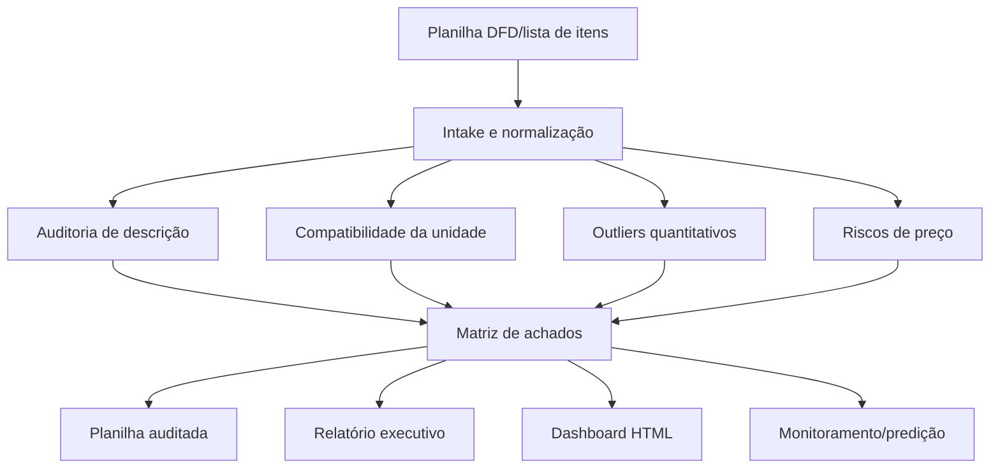

<div align="center">

# 🧭 Farol Contratos & Licitações IFFar

### Auditoria inteligente de planilhas DFD, listas de itens, quantitativos e riscos para compras públicas multicampi.

<p>
  
  
  
  
</p>

</div>

---

## ✨ Ideia central

O **Farol Contratos & Licitações IFFar** transforma uma planilha de levantamento de demanda em um pacote de decisão: planilha auditada, achados estruturados, relatório executivo e painel HTML.

Ele foi desenhado para a área de **Licitações e Contratos do Instituto Federal Farroupilha**, especialmente quando diferentes campi informam quantitativos para uma mesma contratação e há risco de erro por descrição ambígua, unidade incompatível, preço incoerente ou consumo fora do padrão.

Nas próximas solicitações, o usuário pode enviar apenas a nova planilha. O squad identifica a estrutura, audita item a item e produz uma devolutiva institucional pronta para revisão humana.

## 🎯 Para que serve

<table>
<tr>
<td><b>Auditar itens</b><br/>Revisa descrição, especificação, unidade de fornecimento e possíveis ambiguidades editalícias.</td>
<td><b>Detectar distorções</b><br/>Aponta outliers quantitativos por campus/unidade, divergências internas e riscos de preenchimento.</td>
<td><b>Apoiar decisão</b><br/>Gera priorização de riscos, recomendações e insumos para saneamento antes da licitação.</td>
</tr>
</table>

## 🧭 Como o squad trabalha



## 🧩 Estrutura dos agentes

<table>
<tr><td><b>Intake Normalizer</b></td><td>Identifica cabeçalhos, campi, colunas amarelas, preços, códigos e descrições.</td><td>Base tabular normalizada e mapa de colunas.</td></tr>
<tr><td><b>Edital Description Auditor</b></td><td>Revisa clareza, suficiência, ambiguidade, vícios de especificação e indícios de direcionamento.</td><td>Alertas de descrição e sugestões textuais.</td></tr>
<tr><td><b>Unit Measure Checker</b></td><td>Confere compatibilidade entre unidade de fornecimento e conteúdo da descrição.</td><td>Alertas de UM e recomendações de padronização.</td></tr>
<tr><td><b>Quantitative Outlier Analyst</b></td><td>Aplica mediana, IQR, MAD e comparação multicampi para detectar distorções.</td><td>Lista de campi com quantitativos atípicos e justificativa.</td></tr>
<tr><td><b>Price Risk Analyst</b></td><td>Procura preço ausente, zero, divergente ou fora de padrões internos por grupos de itens.</td><td>Alertas de precificação e necessidade de pesquisa externa.</td></tr>
<tr><td><b>Decision Intelligence Lead</b></td><td>Prioriza achados e recomenda ações: aprovar, revisar, confirmar campus ou pesquisar mercado.</td><td>Matriz de risco e plano de saneamento.</td></tr>
<tr><td><b>Report & Dashboard Builder</b></td><td>Consolida planilha auditada, CSV de achados, relatório e painel visual.</td><td>Pacote final para tomada de decisão.</td></tr>
</table>

## 📦 O que o squad entrega no final

- **Planilha auditada `.xlsx`** com novas colunas: `Ações Necessárias`, `Nível de Risco`, `Tipos de Achado`, `Outliers Quantitativos`, `Sugestão de Decisão`.
- **Relatório executivo `.md`** com síntese, riscos, itens críticos, estatísticas e próximos passos.
- **Achados `.csv`** com evidência linha a linha para filtragem e controle.
- **Dashboard `.html`** com cartões, ranking de riscos e distribuição de achados.
- **Estrutura de monitoramento** para comparar novas planilhas por ciclo, campus, item e natureza de risco.

## 🚀 Uso rápido

```bash
python scripts/analisar_dfd.py caminho/planilha.xlsx --out output/auditoria
```

Exemplo com entrega institucional:

```bash
python scripts/analisar_dfd.py "DFD.xlsx" --out "/storage/emulated/0/Download/Material herme/auditoria-dfd"
```

## ✅ Em uma frase

> O squad funciona como um farol técnico: ilumina inconsistências antes da licitação, reduz retrabalho e melhora a qualidade da decisão multicampi.

<div align="center">

**Licença:** MIT<br>
**Criado por:** Marcio Bisognin<br>
**Instagram:** [@marciobisognin](https://instagram.com/marciobisognin)

</div>
