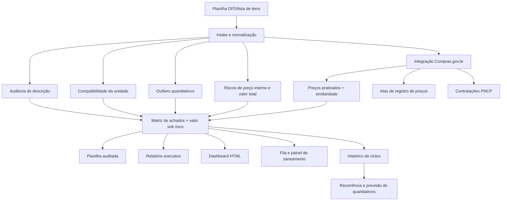

<div align="center">

# 🧭 Farol Contratos & Licitações IFFar

### Auditoria inteligente de planilhas DFD, quantitativos, preços externos, atas e riscos para compras públicas multicampi — com histórico de ciclos, painel de saneamento e base de conhecimento.

<p>
  
  
  
  
  
  
  
</p>

</div>

---

## ✨ Ideia central

O **Farol Contratos & Licitações IFFar** transforma uma planilha de levantamento de demanda em um pacote de decisão: planilha auditada com **valor financeiro sob risco**, achados estruturados, relatório executivo, painel HTML, **evidência externa de preços do Compras.gov.br com validação de equivalência de descrição**, fila de saneamento com status e **histórico de ciclos com detecção de recorrência**.

Ele foi desenhado para a área de **Licitações e Contratos do Instituto Federal Farroupilha**, especialmente quando diferentes campi informam quantitativos para uma mesma contratação e há risco de erro por descrição ambígua, unidade incompatível, preço incoerente, consumo fora do padrão ou ausência de comparação com preços públicos recentes.

A cada novo ciclo, o usuário envia apenas a nova planilha. O squad identifica a estrutura, audita item a item, consulta dados públicos, compara com ciclos anteriores e produz uma devolutiva institucional pronta para revisão humana.

## 🎯 Para que serve

<table>
<tr>
<td><b>Auditar itens</b><br/>Revisa descrição, especificação, unidade de fornecimento e possíveis ambiguidades editalícias.</td>
<td><b>Detectar distorções</b><br/>Aponta outliers quantitativos por campus, divergência entre valor total declarado e calculado e riscos de preenchimento.</td>
<td><b>Comparar preços externos</b><br/>Consulta preços praticados, atas e contratações na API Compras.gov.br, com similaridade de descrição para evitar comparações enganosas.</td>
</tr>
<tr>
<td><b>Priorizar por valor</b><br/>Calcula o valor financeiro sob risco por item (preço × quantidade multicampi) e ranqueia os achados de maior impacto.</td>
<td><b>Monitorar ciclos</b><br/>Registra cada execução como snapshot, compara ciclos, detecta recorrência de erros e prevê quantitativos por campus.</td>
<td><b>Acompanhar saneamento</b><br/>Gera fila de saneamento com status por achado e painel HTML de progresso, além de base de descrições aprovadas.</td>
</tr>
</table>

## 🧭 Como o squad trabalha



## 🧩 Estrutura dos agentes

<table>
<tr><td><b>Intake Normalizer</b></td><td>Identifica cabeçalhos, campi, colunas amarelas, preços, códigos e descrições; aceita perfis de coluna customizados.</td><td>Base tabular normalizada e mapa de colunas.</td></tr>
<tr><td><b>Edital Description Auditor</b></td><td>Revisa clareza, suficiência, ambiguidade, vícios de redação e indícios de direcionamento; confere a base de conhecimento.</td><td>Alertas de descrição e sugestões textuais.</td></tr>
<tr><td><b>Unit Measure Checker</b></td><td>Confere compatibilidade entre unidade de fornecimento e conteúdo da descrição.</td><td>Alertas de UM e recomendações de padronização.</td></tr>
<tr><td><b>Quantitative Outlier Analyst</b></td><td>Aplica mediana, IQR, MAD e comparação multicampi para detectar distorções; compara com a referência histórica.</td><td>Lista de campi com quantitativos atípicos e justificativa.</td></tr>
<tr><td><b>Price Risk Analyst</b></td><td>Procura preço ausente, zero, divergente do valor total declarado ou distante da mediana de preços externos.</td><td>Alertas de precificação interna e externa.</td></tr>
<tr><td><b>Decision Intelligence Lead</b></td><td>Prioriza achados por severidade e valor financeiro sob risco; mantém a fila de saneamento e o histórico de ciclos.</td><td>Matriz de risco e plano de saneamento.</td></tr>
<tr><td><b>Report & Dashboard Builder</b></td><td>Consolida planilha auditada, CSV de achados, relatório, dashboard com gráfico e painel de saneamento.</td><td>Pacote final para tomada de decisão.</td></tr>
</table>

## 🔌 Integração Compras.gov.br

O squad inclui o CLI `scripts/compras_gov.py`, baseado na API oficial de Dados Abertos do Compras.gov.br:

- Swagger: https://dadosabertos.compras.gov.br/swagger-ui/index.html
- OpenAPI JSON: https://dadosabertos.compras.gov.br/v3/api-docs
- Manual: https://www.gov.br/compras/pt-br/acesso-a-informacao/manuais/manual-dados-abertos/manual-api-compras.pdf

A integração permite consultar:

- preços praticados por código CATMAT (e CATSER com `--tipo servico`);
- estatística rápida de preços: mínimo, máximo, média, mediana, quartis;
- atas de registro de preços;
- contratações PNCP / Lei 14.133, itens e resultados homologados;
- **sugestão de código CATMAT por descrição livre** (`sugerir-codigo`), com ranking por similaridade;
- resumo de preços para códigos extraídos diretamente da planilha DFD.

Todas as chamadas têm **retry com backoff exponencial** e **cache local** (`--cache`), para que reanalisar a mesma planilha não repita consultas idênticas.

## 📦 O que o squad entrega no final

- **Planilha auditada `.xlsx`** com colunas: `Ações Necessárias`, `Nível de Risco`, `Tipos de Achado`, `Outliers Quantitativos`, `Sugestão de Decisão`, `Valor Total Estimado (R$)`.
- Quando ativado, colunas de **Compras.gov**: registros, mediana, média, faixa mín/máx, descrição amostra, **similaridade de descrição** e avaliação do preço.
- **Relatório executivo `.md`** com síntese, riscos, **valor financeiro sob risco por nível**, itens críticos ranqueados por valor e próximos passos.
- **Achados `.csv`** com evidência linha a linha, incluindo valor estimado do item.
- **Dashboard `.html`** com cartões, gráfico SVG de distribuição de risco e ranking de achados.
- **Fila de saneamento `.csv` + painel `.html`** com status por achado e barra de progresso.
- **Histórico por ciclo** (`historico/`) com relatório de recorrência de achados entre ciclos.
- **Previsão de quantitativos** por item/campus contra a referência histórica.

## 🚀 Como usar

### Instalação

```bash
pip install -r requirements.txt        # uso
pip install -r requirements-dev.txt    # uso + testes
```

### Experimente sem dados reais

O repositório inclui uma planilha DFD fictícia com problemas plantados (descrição curta, termo restritivo, unidade incompatível, preço ausente/zero, outlier e valor total divergente):

```bash
python examples/gerar_dfd_exemplo.py            # (re)gera examples/dfd_exemplo.xlsx
python scripts/analisar_dfd.py examples/dfd_exemplo.xlsx --out output/demo
```

### Camada 2 — comando único recomendado

O comando unificado `farol_iffar.py` executa auditoria, Compras.gov, mapa comparativo, fila de saneamento e, opcionalmente, busca PNCP por termo e registro no histórico:

```bash
python scripts/farol_iffar.py analisar "DFD.xlsx" \
  --paginas 2 \
  --termo-pncp "materiais de copa e cozinha" \
  --ciclo 2026-1 \
  --out output/farol-iffar
```

As datas da pesquisa externa são relativas por padrão (últimos 24 meses); use `--inicio/--fim` para customizar.

Saídas principais:

- planilha `*_AUDITADA_COMPRAS_GOV.xlsx`;
- `relatorio_compras_gov.md` e `summary_compras_gov.json`;
- `mapa_comparativo_compras_gov.html`;
- `04_saneamento/saneamento.csv` + `painel_saneamento.html`;
- snapshot do ciclo em `historico/<ciclo>/` quando `--ciclo` é usado;
- se `--termo-pncp` for usado: CSV/JSON de contratações PNCP filtradas por termo.

### Auditoria básica, sem pesquisa externa

```bash
python scripts/analisar_dfd.py caminho/planilha.xlsx --out output/auditoria
```

Para planilhas fora do formato padrão IFFar, informe um perfil de colunas:

```bash
python scripts/analisar_dfd.py planilha.xlsx --perfil meu_perfil.json --out output/auditoria
```

### Auditoria com integração Compras.gov.br

```bash
python scripts/enriquecer_dfd_compras_gov.py "DFD.xlsx" --paginas 2 --out output/farol-compras-gov
# teste rápido em poucos itens:
python scripts/enriquecer_dfd_compras_gov.py "DFD.xlsx" --paginas 1 --max-itens 5 --out output/teste
```

### Camada 3 — monitoramento recorrente

```bash
# registrar um ciclo e comparar ciclos (recorrência de achados)
python scripts/historico_farol.py registrar output/farol-iffar --ciclo 2026-1
python scripts/historico_farol.py comparar --historico historico --out historico/relatorio_historico.md

# fila e painel de saneamento
python scripts/painel_saneamento.py gerar output/auditoria/achados_auditoria.csv --out output/saneamento
python scripts/painel_saneamento.py atualizar output/saneamento/saneamento.csv --id 3 --status CORRIGIDO --obs "Descrição revisada"
python scripts/painel_saneamento.py painel output/saneamento/saneamento.csv --out output/saneamento/painel_saneamento.html

# base de conhecimento de descrições aprovadas
python scripts/base_conhecimento.py adicionar --codigo 437939 --descricao "CANETA ESFEROGRÁFICA..." --unidade UNIDADE
python scripts/base_conhecimento.py verificar "DFD.xlsx" --out output/verificacao_kb.csv

# previsão de quantitativos: histórico... + ciclo atual (a última planilha é a atual)
python scripts/previsao_quantitativos.py dfd_2024.xlsx dfd_2025.xlsx dfd_2026.xlsx --out output/previsao
```

### Consultas diretas ao Compras.gov

```bash
# estatística de preços por código CATMAT
python scripts/compras_gov.py preco-resumo --codigo-item 437939 --paginas 3

# atas por item
python scripts/compras_gov.py atas --codigo-item 437939 --inicio 2025-01-01 --fim 2025-12-31

# sugerir código CATMAT a partir de descrição livre
python scripts/compras_gov.py sugerir-codigo --descricao "caneta esferográfica azul escrita média"

# resumo externo para todos os códigos da planilha (com cache)
python scripts/compras_gov.py --cache output/.cache planilha-precos "DFD.xlsx" --out output/precos
```

## ✅ Qualidade e testes

```bash
python scripts/smoke_test.py   # estrutura + compilação + auditoria offline na planilha de exemplo
python -m pytest tests -q     # regras de auditoria, detecção de estrutura e pipeline ponta a ponta
```

O CI do repositório (`.github/workflows/farol-iffar-ci.yml`) roda smoke test e pytest a cada push que toque o squad. Todos os testes são offline — a planilha de exemplo garante reprodutibilidade sem depender da API.

## 🤖 Como usar com Codex, Claude Code e Google Antigravity

A lógica é a mesma nos três ambientes: abrir o repositório do squad, dar ao agente a planilha DFD e pedir que ele execute os scripts, valide os arquivos gerados e explique os achados.

### OpenAI Codex CLI

```text
Você está no repositório do squad Farol Contratos & Licitações IFFar.
Instale as dependências de requirements.txt.
Use a planilha em caminho local como entrada e execute scripts/farol_iffar.py analisar com --ciclo <ano-ciclo>.
Valide que planilha auditada, relatório, mapa comparativo, fila de saneamento e snapshot do histórico existem.
Leia summary_compras_gov.json e entregue uma síntese executiva em português institucional.
Não altere a planilha original.
```

### Claude Code

```text
Atue como operador do squad Farol Contratos & Licitações IFFar.
Primeiro inspecione README.md e squad.yaml e rode python scripts/smoke_test.py.
Em seguida rode a auditoria da planilha com integração Compras.gov.br via scripts/farol_iffar.py analisar.
Use os outputs para apontar itens críticos por valor financeiro sob risco, riscos de preço, outliers e recomendações de saneamento.
Preserve evidências: caminhos dos arquivos gerados, contagem de itens, riscos e limitações.
```

### Google Antigravity

```text
Abra este projeto como workspace.
Trate o squad como ferramenta institucional de auditoria de DFD para licitações do IFFar.
Rode uma execução completa com pesquisa externa (scripts/farol_iffar.py analisar) e gere uma explicação para gestor público:
o que foi auditado, o que exige revisão, quais itens concentram valor sob risco e quais evidências externas foram usadas.
```

### Regras para qualquer agente

- Não sobrescrever a planilha original.
- Salvar saídas em `output/...` ou em pasta informada pelo usuário.
- Validar se a planilha auditada, o CSV, o relatório, o dashboard e a fila de saneamento foram gerados.
- Informar limitações: a análise é apoio técnico e deve ser validada pela equipe de licitações/contratos.
- Quando houver pesquisa externa, citar período usado, número de registros e similaridade de descrição das comparações.

## ✅ Em uma frase

> O squad funciona como um farol técnico: ilumina inconsistências internas, compara preços públicos, acompanha o saneamento e aprende com cada ciclo antes da contratação.

<div align="center">

**Licença:** MIT<br>
**Criado por:** Marcio Bisognin<br>
**Instagram:** [@marciobisognin](https://instagram.com/marciobisognin)

</div>


## Farol 3.0 — evolução para plataforma de inteligência

A atualização **3.0.0** reposiciona o Farol como **Farol Public Procurement Intelligence Platform**: um sistema auditável de inteligência para planejamento, pesquisa de preços, qualidade das especificações, previsão de demanda e governança das contratações públicas.

### Novas capacidades estruturais

- contratos YAML tipados para 12 agentes especializados;
- workflow institucional com estados, retries, timeouts, gates humanos, evidências, caminhos de falha e idempotência;
- base normativa versionada em `references/normative_rules.yaml`;
- schemas formais para achados, evidências e casos de saneamento;
- motor determinístico `scripts/farol_30_contracts.py` para validação de contratos, avaliação contextual de especificações, memória de preço com hash e forecasting baseline;
- testes automatizados adicionais para os contratos e motores Farol 3.0.

### Princípios obrigatórios

1. Nenhuma decisão administrativa é automática.
2. Citação normativa crítica deve vir da base versionada, nunca de texto livre do modelo.
3. Preço externo só pode fundamentar decisão quando houver equivalência, fonte, parâmetros, data e hash da evidência.
4. Achados críticos exigem revisão humana.
5. Dados pessoais e informações institucionais seguem minimização, retenção configurável e trilha de auditoria.

### Comandos Farol 3.0

```bash
python scripts/farol_30_contracts.py validate-contracts --root .
python scripts/farol_30_contracts.py evaluate-spec --descricao "PANELA MARCA X 7 LITROS EM ALUMÍNIO" --unidade UNIDADE
```

Licença: MIT. Criado por Marcio Bisognin. Instagram: @marciobisognin.
