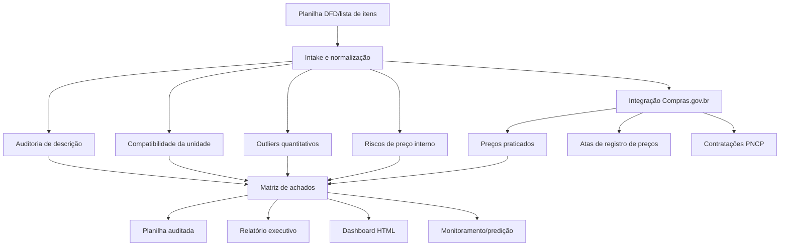

<div align="center">

# 🧭 Farol Contratos & Licitações IFFar

### Auditoria inteligente de planilhas DFD, listas de itens, quantitativos, preços externos, atas e riscos para compras públicas multicampi.

<p>
  
  
  
  
  
</p>

</div>

---

## ✨ Ideia central

O **Farol Contratos & Licitações IFFar** transforma uma planilha de levantamento de demanda em um pacote de decisão: planilha auditada, achados estruturados, relatório executivo, painel HTML e, agora, **evidência externa de preços praticados na API oficial de Dados Abertos do Compras.gov.br**.

Ele foi desenhado para a área de **Licitações e Contratos do Instituto Federal Farroupilha**, especialmente quando diferentes campi informam quantitativos para uma mesma contratação e há risco de erro por descrição ambígua, unidade incompatível, preço incoerente, consumo fora do padrão ou ausência de comparação com preços públicos recentes.

Nas próximas solicitações, o usuário pode enviar apenas a nova planilha. O squad identifica a estrutura, audita item a item, consulta dados públicos quando solicitado e produz uma devolutiva institucional pronta para revisão humana.

## 🎯 Para que serve

<table>
<tr>
<td><b>Auditar itens</b><br/>Revisa descrição, especificação, unidade de fornecimento e possíveis ambiguidades editalícias.</td>
<td><b>Detectar distorções</b><br/>Aponta outliers quantitativos por campus/unidade, divergências internas e riscos de preenchimento.</td>
<td><b>Comparar preços externos</b><br/>Consulta preços praticados, atas e contratações na API Compras.gov.br para apoiar estimativas.</td>
</tr>
<tr>
<td><b>Apoiar decisão</b><br/>Gera priorização de riscos, recomendações e insumos para saneamento antes da licitação.</td>
<td><b>Gerar evidência</b><br/>Produz planilha auditada, CSV, relatório e dashboard com rastreabilidade dos achados.</td>
<td><b>Rodar em agentes</b><br/>Pode ser operado por Codex, Claude Code ou Google Antigravity como ferramenta de linha de comando.</td>
</tr>
</table>

## 🧭 Como o squad trabalha



## 🧩 Estrutura dos agentes

<table>
<tr><td><b>Intake Normalizer</b></td><td>Identifica cabeçalhos, campi, colunas amarelas, preços, códigos e descrições.</td><td>Base tabular normalizada e mapa de colunas.</td></tr>
<tr><td><b>Edital Description Auditor</b></td><td>Revisa clareza, suficiência, ambiguidade, vícios de redação e indícios de direcionamento.</td><td>Alertas de descrição e sugestões textuais.</td></tr>
<tr><td><b>Unit Measure Checker</b></td><td>Confere compatibilidade entre unidade de fornecimento e conteúdo da descrição.</td><td>Alertas de UM e recomendações de padronização.</td></tr>
<tr><td><b>Quantitative Outlier Analyst</b></td><td>Aplica mediana, IQR, MAD e comparação multicampi para detectar distorções.</td><td>Lista de campi com quantitativos atípicos e justificativa.</td></tr>
<tr><td><b>Price Risk Analyst</b></td><td>Procura preço ausente, zero, divergente ou distante da mediana de preços externos.</td><td>Alertas de precificação interna e externa.</td></tr>
<tr><td><b>Decision Intelligence Lead</b></td><td>Prioriza achados e recomenda ações: aprovar, revisar, confirmar campus ou pesquisar mercado.</td><td>Matriz de risco e plano de saneamento.</td></tr>
<tr><td><b>Report & Dashboard Builder</b></td><td>Consolida planilha auditada, CSV de achados, relatório e painel visual.</td><td>Pacote final para tomada de decisão.</td></tr>
</table>

## 🔌 Integração Compras.gov.br

O squad inclui o CLI `scripts/compras_gov.py`, baseado na API oficial de Dados Abertos do Compras.gov.br:

- Swagger: https://dadosabertos.compras.gov.br/swagger-ui/index.html
- OpenAPI JSON: https://dadosabertos.compras.gov.br/v3/api-docs
- Manual: https://www.gov.br/compras/pt-br/acesso-a-informacao/manuais/manual-dados-abertos/manual-api-compras.pdf

A integração permite consultar:

- preços praticados por código CATMAT;
- estatística rápida de preços: mínimo, máximo, média, mediana, quartis;
- atas de registro de preços;
- contratações PNCP / Lei 14.133;
- itens de contratações PNCP;
- resultados homologados;
- resumo de preços para códigos extraídos diretamente da planilha DFD.

## 📦 O que o squad entrega no final

- **Planilha auditada `.xlsx`** com novas colunas: `Ações Necessárias`, `Nível de Risco`, `Tipos de Achado`, `Outliers Quantitativos`, `Sugestão de Decisão`.
- Quando ativado, adiciona também colunas de **Compras.gov**: registros encontrados, mediana, média e faixa mínimo/máximo.
- **Relatório executivo `.md`** com síntese, riscos, itens críticos, estatísticas e próximos passos.
- **Achados `.csv`** com evidência linha a linha para filtragem e controle.
- **Dashboard `.html`** com cartões, ranking de riscos e distribuição de achados.
- **CSV/JSON de preços externos** quando o CLI `compras_gov.py planilha-precos` for usado.
- **Estrutura de monitoramento** para comparar novas planilhas por ciclo, campus, item, preço e natureza de risco.

## 🚀 Uso rápido

### Auditoria básica, sem pesquisa externa

```bash
python scripts/analisar_dfd.py caminho/planilha.xlsx --out output/auditoria
```

### Auditoria com integração Compras.gov.br

Use o orquestrador de enriquecimento. Ele roda a auditoria normal, pesquisa preços oficiais e gera uma planilha final com colunas de benchmark externo.

```bash
python scripts/enriquecer_dfd_compras_gov.py "DFD.xlsx" \
  --inicio 2024-01-01 \
  --fim 2026-12-31 \
  --paginas 2 \
  --out output/farol-compras-gov
```

Para teste rápido em poucos itens:

```bash
python scripts/enriquecer_dfd_compras_gov.py "DFD.xlsx" \
  --inicio 2026-01-01 \
  --fim 2026-12-31 \
  --paginas 1 \
  --max-itens 5 \
  --out output/teste-compras-gov
```

### Consultar preços por item diretamente

```bash
python scripts/compras_gov.py preco-resumo \
  --codigo-item 437939 \
  --inicio 2024-01-01 \
  --fim 2026-12-31 \
  --paginas 3
```

### Consultar atas por item

```bash
python scripts/compras_gov.py atas \
  --codigo-item 437939 \
  --inicio 2025-01-01 \
  --fim 2025-12-31
```

### Gerar resumo externo para todos os códigos da planilha

```bash
python scripts/compras_gov.py planilha-precos "DFD.xlsx" \
  --inicio 2024-01-01 \
  --fim 2026-12-31 \
  --out output/precos-compras-gov
```

## 🤖 Como usar com Codex, Claude Code e Google Antigravity

A lógica é a mesma nos três ambientes: abrir o repositório do squad, dar ao agente a planilha DFD e pedir que ele execute os scripts, valide os arquivos gerados e explique os achados.

### OpenAI Codex CLI

Prompt sugerido:

```text
Você está no repositório do squad Farol Contratos & Licitações IFFar.
Use a planilha anexada/em caminho local como entrada.
Execute `scripts/enriquecer_dfd_compras_gov.py`, gere planilha auditada com benchmark Compras.gov, relatório complementar, CSV/JSON de preços e dashboard.
Depois execute scripts/compras_gov.py planilha-precos para gerar o resumo externo de preços por código CATMAT.
Valide que os arquivos existem, leia summary.json e entregue uma síntese executiva em português institucional.
Não altere a planilha original.
```

Comando esperado pelo agente:

```bash
python scripts/enriquecer_dfd_compras_gov.py "$PLANILHA" --inicio 2024-01-01 --fim 2026-12-31 --paginas 2 --out output/farol-compras-gov
python scripts/compras_gov.py planilha-precos "$PLANILHA" --inicio 2024-01-01 --fim 2026-12-31 --out output/precos-compras-gov
```

### Claude Code

Prompt sugerido:

```text
Atue como operador do squad Farol Contratos & Licitações IFFar.
Primeiro inspecione README.md e squad.yaml.
Em seguida rode a auditoria da planilha com integração Compras.gov.br.
Use os outputs para apontar itens críticos, riscos de preço, outliers quantitativos e recomendações de saneamento.
Preserve evidências: caminhos dos arquivos gerados, contagem de itens, riscos e limitações.
```

Comando esperado pelo agente:

```bash
python scripts/enriquecer_dfd_compras_gov.py "$PLANILHA" --inicio 2024-01-01 --fim 2026-12-31 --paginas 1 --out output/auditoria-claude
```

### Google Antigravity

Prompt sugerido:

```text
Abra este projeto como workspace.
Trate o squad como uma ferramenta institucional de auditoria de DFD para licitações do IFFar.
Identifique os scripts principais e rode uma execução completa com pesquisa externa no Compras.gov.br.
Depois gere uma explicação para gestor público: o que foi auditado, o que exige revisão, quais itens têm risco de preço e quais evidências externas foram usadas.
```

Comando esperado pelo agente:

```bash
python scripts/enriquecer_dfd_compras_gov.py "$PLANILHA" --inicio 2024-01-01 --fim 2026-12-31 --paginas 2 --out output/auditoria-antigravity
python scripts/compras_gov.py preco-resumo --codigo-item 437939 --inicio 2024-01-01 --fim 2026-12-31 --paginas 2
```

### Regras para qualquer agente

- Não sobrescrever a planilha original.
- Salvar saídas em `output/...` ou em pasta informada pelo usuário.
- Validar se a planilha auditada, o CSV, o relatório e o dashboard foram gerados.
- Informar limitações: a análise é apoio técnico e deve ser validada pela equipe de licitações/contratos.
- Quando houver pesquisa externa, citar período usado e número de registros retornados.

## ✅ Em uma frase

> O squad funciona como um farol técnico: ilumina inconsistências internas, compara preços públicos e reduz risco antes da contratação.

<div align="center">

**Licença:** MIT<br>
**Criado por:** Marcio Bisognin<br>
**Instagram:** [@marciobisognin](https://instagram.com/marciobisognin)

</div>
