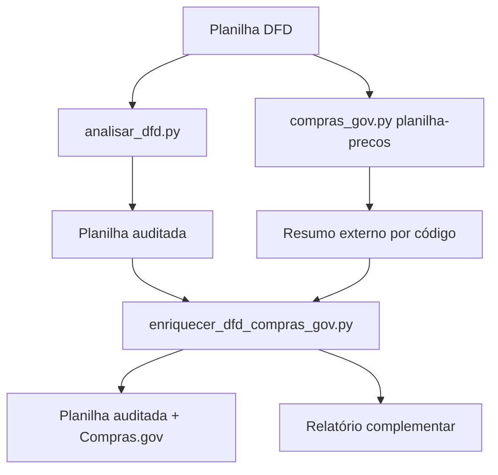

# Integração Compras.gov no Farol Contratos & Licitações IFFar

## Objetivo

A camada Compras.gov conecta a auditoria interna da planilha DFD com evidências externas oficiais de compras públicas brasileiras.

Ela permite:

- pesquisar preços praticados por código CATMAT/CATSER;
- gerar média, mediana, mínimo e máximo de preços praticados;
- consultar atas de registro de preços vigentes por item;
- consultar contratações PNCP/Lei 14.133;
- enriquecer a planilha auditada com colunas de benchmark externo;
- produzir relatório complementar de preço e cobertura.

## Componentes

- `scripts/compras_gov.py`: CLI local da API Dados Abertos Compras.gov.br.
- `scripts/enriquecer_dfd_compras_gov.py`: orquestrador que executa a auditoria DFD e depois consulta o Compras.gov.
- `references/uso-com-codex-claude-antigravity.md`: instruções para usar o squad com agentes de codificação.

## Fluxo operacional



## Comando principal

```bash
python scripts/enriquecer_dfd_compras_gov.py "DFD.xlsx" \
  --inicio 2024-01-01 \
  --fim 2026-12-31 \
  --paginas 2 \
  --out output/farol-compras-gov
```

## Saídas geradas

- `01_auditoria_dfd/`: auditoria original do Farol.
- `02_compras_gov/resumo_precos_por_codigo.csv`: resumo externo por código.
- `02_compras_gov/resumo_precos_por_codigo.json`: dados estruturados para agentes.
- `*_AUDITADA_COMPRAS_GOV.xlsx`: planilha enriquecida.
- `relatorio_compras_gov.md`: relatório complementar.
- `summary_compras_gov.json`: sumário técnico completo.

## Critérios de alerta de preço

O script compara o preço estimado da planilha com a mediana dos preços praticados retornados pelo Compras.gov:

- acima de 1,5x da mediana: revisar estimativa;
- abaixo de 0,55x da mediana: verificar subestimativa ou especificação diferente;
- entre esses limites: referência inicial compatível.

A comparação é indicativa. A equipe deve verificar se a descrição externa é suficientemente equivalente ao item do DFD.

## Limitações

- A API exige datas e paginação mínima de 10 registros.
- A pesquisa por descrição no catálogo pode ser limitada; quando possível, usar código CATMAT/CATSER.
- Atas e contratações recentes devem priorizar endpoints PNCP.
- O módulo legado de licitações pode retornar erro genérico da API para alguns filtros.

Licença: MIT. Criado por Marcio Bisognin. Instagram: @marciobisognin.
