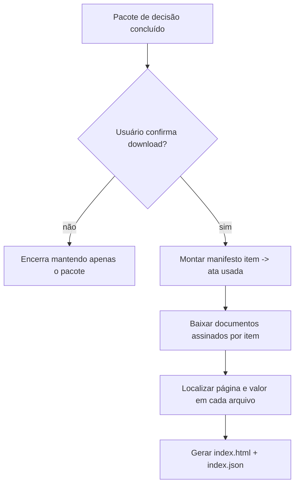

# Download das atas assinadas usadas na planilha

## Objetivo

Ao final do pacote de decisão, o squad pode oferecer ao usuário o download das
**atas de registro de preços assinadas** cujos preços foram efetivamente usados na
planilha entregue. Quando o usuário confirma, um grupo de agentes baixa os
documentos, organiza tudo em **uma pasta por item** e gera um **índice HTML** que
aponta, para cada item, a pasta correspondente, os arquivos baixados e **em que
página de cada documento o item e o seu valor aparecem**.

Isso fecha a rastreabilidade exigida pela política de evidência do squad
(`evidence_integrity: hash obrigatório`) ligando o preço da planilha ao documento
assinado de origem.

## Gate humano (a pergunta ao usuário)

A oferta é uma etapa com `human_approval: true` no workflow principal
(`farol-30-procurement-intelligence`, passo `signed_minutes_offer`):

> "Deseja baixar as atas assinadas com os preços usados na planilha entregue,
> organizadas por item e com índice HTML (pasta, arquivo, página e valor)?"

Só com a confirmação explícita o workflow `baixar-atas-assinadas` é acionado.
Nada é baixado sem o "sim" do usuário.

## Grupo de agentes

| Agente | Papel |
| --- | --- |
| `signed-minutes-download-orchestrator` | Oferta, confirmação e consolidação do índice |
| `minutes-evidence-fetcher` | Baixa/copia os arquivos das atas por item, com `sha256` |
| `minutes-page-locator` | Localiza a página e o valor do item dentro de cada documento |
| `minutes-index-builder` | Gera o `index.html` e o `index.json` com hashes |

## Fluxo



## Manifesto (entrada)

O download é dirigido por um manifesto que liga cada item à(s) ata(s) adotada(s).
Pode-se gerar um esqueleto a partir do resumo de preços por código:

```bash
python scripts/baixar_atas_assinadas.py montar-manifesto \
  --resumo output/02_compras_gov/resumo_precos_por_codigo.json \
  --out output/atas-assinadas/manifesto.json \
  --case-id CASO-2026-001
```

O agente de pesquisa de preços preenche, por item, a lista `atas` com o número da
ata, o número de controle PNCP e/ou a URL do documento assinado:

```json
{
  "case_id": "CASO-2026-001",
  "itens": [
    {
      "codigo": "150240",
      "descricao": "Caneca de alumínio 300ml",
      "valor_usado": 12.5,
      "atas": [
        {
          "numeroAtaRegistroPreco": "12/2025",
          "numeroControlePncpAta": "00394452000103-1-000123/2025",
          "valorUnitario": 12.5,
          "url_documento": "https://pncp.gov.br/.../ata.pdf"
        }
      ]
    }
  ]
}
```

Quando o documento já foi coletado localmente (modo offline), use `arquivo_local`
no lugar de `url_documento`.

## Execução do download

```bash
python scripts/baixar_atas_assinadas.py baixar \
  --manifest output/atas-assinadas/manifesto.json \
  --out output/atas-assinadas
```

Saídas em `output/atas-assinadas/`:

- `<codigo>-<slug>/` — uma pasta por item com os arquivos das atas baixadas;
- `index.html` — índice navegável: para cada item, link da pasta, lista de
  arquivos e tabela com página, valor e trecho de contexto;
- `index.json` — manifesto de resultado com `sha256` por arquivo e, em pendências,
  a referência pública no PNCP para conferência humana.

Use `--no-download` para rodar sem rede (apenas `arquivo_local`), útil em testes e
em ambientes sem acesso externo.

## Localização de página e valor

A extração de texto usa `pypdf` (ou `pdfminer.six`) quando disponível. Sem a
biblioteca, ou quando o item/valor não é encontrado no texto, isso é **declarado**
no índice — o squad nunca inventa página ou valor. A conferência final é humana.

## Limitações

- O PDF assinado precisa de texto pesquisável; documentos digitalizados sem OCR
  podem não permitir localizar a página automaticamente (registrado como pendência).
- O endpoint genérico de arquivos do PNCP pode retornar uma listagem em vez do PDF
  direto; nesse caso informe `url_documento` específica da ata no manifesto.
- O download exige confirmação humana e respeita a política LGPD do squad.

Licença: MIT. Criado por Marcio Bisognin. Instagram: @marciobisognin.
