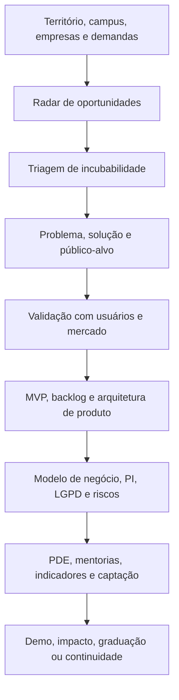
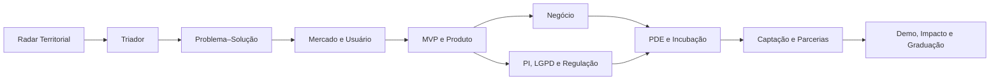

<div align="center">

# 🌱 Germina360 Squad

### Da oportunidade territorial ao produto incubado: um squad para mapear, qualificar e transformar ideias em empreendimentos prontos para evolução.

<p>
  
  
  
</p>

</div>

---

## ✨ O que é

O **Germina360 Squad** é um squad premium de agentes especializados para apoiar incubadoras, núcleos de inovação, instituições de ensino e ecossistemas locais no processo de **descobrir, selecionar e desenvolver projetos incubáveis**.

Ele funciona como uma esteira inteligente de incubação: começa pelo mapeamento de empresas, ideias, demandas e projetos com potencial; passa pela triagem de incubabilidade; estrutura problema, solução, mercado, MVP, modelo de negócio, propriedade intelectual, captação e PDE; e termina com uma entrega organizada para demo, impacto, graduação ou continuidade da incubação.

---

## 🎯 Para que serve

<table>
  <tr>
    <td width="33%" valign="top">
      <h3>🔎 Mapear oportunidades</h3>
      <p>Identifica empresas, pesquisas, demandas regionais, ideias de estudantes, projetos de servidores, cooperativas e soluções com potencial de incubação.</p>
    </td>
    <td width="33%" valign="top">
      <h3>🧪 Qualificar projetos</h3>
      <p>Avalia aderência institucional, maturidade, impacto, viabilidade, riscos, prontidão técnica e potencial de mercado.</p>
    </td>
    <td width="33%" valign="top">
      <h3>🚀 Levar da ideia ao produto</h3>
      <p>Conduz a oportunidade por validação, MVP, modelo de negócio, PDE, captação, demonstração e critérios de graduação.</p>
    </td>
  </tr>
</table>

---

## 🧭 Como o squad trabalha



---

## 🧩 Estrutura dos agentes

<table>
  <tr>
    <td width="50%" valign="top">
      <h3>📡 Radar Territorial de Oportunidades</h3>
      <p>Mapeia empresas, pesquisas, demandas locais, ideias acadêmicas e projetos com potencial de incubação.</p>
      <strong>Produz:</strong> banco de oportunidades e mapa de atores.
    </td>
    <td width="50%" valign="top">
      <h3>✅ Triador de Incubabilidade</h3>
      <p>Classifica cada oportunidade por aderência, maturidade, impacto, viabilidade e prontidão para entrar em trilhas de incubação.</p>
      <strong>Produz:</strong> score de incubabilidade e recomendação de trilha.
    </td>
  </tr>
  <tr>
    <td width="50%" valign="top">
      <h3>🧠 Arquiteto Problema–Solução</h3>
      <p>Transforma uma ideia inicial em problema real, público-alvo, hipótese de solução e proposta de valor.</p>
      <strong>Produz:</strong> canvas problema–solução.
    </td>
    <td width="50%" valign="top">
      <h3>🔬 Pesquisador de Mercado e Usuário</h3>
      <p>Organiza entrevistas, análise de concorrentes, validação de demanda e testes com usuários.</p>
      <strong>Produz:</strong> relatório de validação e decisão de avanço, ajuste ou pivô.
    </td>
  </tr>
  <tr>
    <td width="50%" valign="top">
      <h3>🛠️ Engenheiro de MVP e Produto</h3>
      <p>Converte a solução em funcionalidades, protótipo, backlog, roadmap e critérios de teste.</p>
      <strong>Produz:</strong> plano de MVP e arquitetura inicial do produto.
    </td>
    <td width="50%" valign="top">
      <h3>💼 Mentor de Negócio e Modelo Econômico</h3>
      <p>Define receita, custos, canais, parcerias, precificação e sustentabilidade do empreendimento.</p>
      <strong>Produz:</strong> modelo de negócio e estratégia de entrada no mercado.
    </td>
  </tr>
  <tr>
    <td width="50%" valign="top">
      <h3>🛡️ Guardião de PI, LGPD e Regulação</h3>
      <p>Analisa propriedade intelectual, dados pessoais, sigilo, contratos, riscos regulatórios e cuidados institucionais.</p>
      <strong>Produz:</strong> matriz de riscos e recomendações de conformidade.</p>
    </td>
    <td width="50%" valign="top">
      <h3>🧭 Orquestrador PDE e Incubação</h3>
      <p>Organiza o Plano de Desenvolvimento do Empreendimento, metas, mentorias, evidências e indicadores.</p>
      <strong>Produz:</strong> PDE operacional do projeto incubado.
    </td>
  </tr>
  <tr>
    <td width="50%" valign="top">
      <h3>🤝 Captador de Recursos e Parcerias</h3>
      <p>Mapeia editais, bolsas, investidores, laboratórios, mentores, clientes-piloto e parceiros estratégicos.</p>
      <strong>Produz:</strong> radar de fomento e plano de parcerias.
    </td>
    <td width="50%" valign="top">
      <h3>🏁 Validador de Demo, Impacto e Graduação</h3>
      <p>Verifica evidências, métricas, prontidão de produto, impacto e critérios para demo day, graduação ou nova rodada.</p>
      <strong>Produz:</strong> dossiê de demo, impacto e graduação.
    </td>
  </tr>
</table>

---

## 🗺️ Fluxo operacional dos agentes



---

## 📦 O que o squad entrega no final

<table>
  <tr>
    <td width="50%" valign="top">
      <h3>📍 Diagnóstico e seleção</h3>
      <ul>
        <li>Banco de oportunidades incubáveis.</li>
        <li>Matriz de incubabilidade.</li>
        <li>Mapa de atores, demandas e potenciais parceiros.</li>
      </ul>
    </td>
    <td width="50%" valign="top">
      <h3>🧪 Validação e produto</h3>
      <ul>
        <li>Canvas problema–solução.</li>
        <li>Plano de validação de usuário e mercado.</li>
        <li>Backlog, roadmap e plano de MVP.</li>
      </ul>
    </td>
  </tr>
  <tr>
    <td width="50%" valign="top">
      <h3>🏢 Incubação e negócio</h3>
      <ul>
        <li>Modelo de negócio.</li>
        <li>PDE do empreendimento incubado.</li>
        <li>Radar de fomento, editais e parcerias.</li>
      </ul>
    </td>
    <td width="50%" valign="top">
      <h3>📊 Evidências finais</h3>
      <ul>
        <li>Matriz de PI, LGPD e riscos.</li>
        <li>Dossiê de demo day.</li>
        <li>Relatório de impacto, graduação ou continuidade.</li>
      </ul>
    </td>
  </tr>
</table>

---

## ✅ Em uma frase

> O **Germina360 Squad** ajuda uma incubadora a sair do mapeamento de oportunidades e chegar a projetos incubados com problema validado, MVP planejado, modelo de negócio estruturado, PDE organizado e evidências para crescimento.

<div align="center">

**Licença:** MIT<br>
**Criado por:** Marcio Bisognin<br>
**Instagram:** [@marciobisognin](https://instagram.com/marciobisognin)

</div>

---

## 🤝 Como usar nos principais LLMs de codificação

> [!NOTE]
> **O padrão de ativação é o mesmo em qualquer ferramenta:**
> 1. **Dê contexto** ao assistente apontando os arquivos do squad (especialmente `IFFar-Squads/squads/germina360-squad/squad.yaml` e `IFFar-Squads/squads/germina360-squad/workflows/pipeline-ideia-ao-produto.yaml`).
> 2. **Peça que ele assuma a persona do orquestrador** definido em `IFFar-Squads/squads/germina360-squad/agents/orquestrador-pde-incubacao.md`.
> 3. **Conduza o fluxo** respeitando os checkpoints humanos e validando cada handoff/contrato.
>
> **Prompt de ativação** (copie, cole e ajuste o briefing):
> ```text
> Assuma a persona do orquestrador do squad definido em `IFFar-Squads/squads/germina360-squad/agents/orquestrador-pde-incubacao.md`
> e conduza o fluxo definido em `IFFar-Squads/squads/germina360-squad/`. Siga `IFFar-Squads/squads/germina360-squad/workflows/pipeline-ideia-ao-produto.yaml`.
> Valide cada handoff/contrato e respeite os checkpoints humanos.
> Meu briefing é: <descreva seu objetivo, materiais e formato de saída>.
> ```

<details open>
<summary><b>🟣 Claude Code (CLI / Web / IDE) — recomendado</b></summary>

<br>

```bash
# No terminal, dentro do repositório
claude

> Leia @IFFar-Squads/squads/germina360-squad/squad.yaml e assuma a persona do orquestrador do squad.
  Siga @IFFar-Squads/squads/germina360-squad/workflows/pipeline-ideia-ao-produto.yaml. Conduza o fluxo para o briefing: <...>
```
- Use **`@caminho/arquivo`** para dar contexto preciso (autocompleta no prompt).
- Disponível em **CLI, app desktop/web (claude.ai/code) e extensões VS Code / JetBrains**.

</details>

<details>
<summary><b>🟦 Cursor</b></summary>

<br>

1. Abra a pasta do repositório no Cursor.
2. No **Chat / Composer (⌘/Ctrl + I)**, referencie os arquivos com `@`:
   ```text
   @IFFar-Squads/squads/germina360-squad/squad.yaml @IFFar-Squads/squads/germina360-squad/workflows/pipeline-ideia-ao-produto.yaml
   Assuma a persona do orquestrador e conduza o fluxo para o briefing: <...>
   ```
3. **Persistente:** crie um `.cursorrules` na raiz apontando para `IFFar-Squads/squads/germina360-squad/` como squad ativo.

</details>

<details>
<summary><b>⬛ GitHub Copilot (VS Code Chat)</b></summary>

<br>

```text
@workspace #file:IFFar-Squads/squads/germina360-squad/squad.yaml #file:IFFar-Squads/squads/germina360-squad/workflows/pipeline-ideia-ao-produto.yaml
Assuma a persona do orquestrador deste squad e conduza o fluxo para: <...>
```
Para regras persistentes, crie **`.github/copilot-instructions.md`** com o prompt de ativação.

</details>

<details>
<summary><b>🟩 Windsurf (Cascade)</b></summary>

<br>

```text
@IFFar-Squads/squads/germina360-squad/squad.yaml @IFFar-Squads/squads/germina360-squad/workflows/pipeline-ideia-ao-produto.yaml
Atue como o orquestrador deste squad e execute o fluxo para: <briefing>.
```
Fixe as regras em **`.windsurfrules`** (raiz do projeto).

</details>

<details>
<summary><b>🟧 Cline / Roo Code (VS Code)</b></summary>

<br>

```text
Leia IFFar-Squads/squads/germina360-squad/squad.yaml e assuma a persona do orquestrador.
Conduza o fluxo do squad e execute os scripts em IFFar-Squads/squads/germina360-squad/scripts/ quando o passo pedir.
Briefing: <...>
```
O Cline/Roo pode **executar os scripts** do squad e ler a saída — aprove a execução quando solicitado.

</details>

<details>
<summary><b>🟨 Continue.dev / Aider / Zed AI / chats web</b></summary>

<br>

- **Continue.dev:** use `@file` para `IFFar-Squads/squads/germina360-squad/squad.yaml`; cole o prompt de ativação.
- **Aider:** `aider IFFar-Squads/squads/germina360-squad/squad.yaml` e instrua o orquestrador.
- **ChatGPT / Gemini (sem acesso a arquivos):** copie o conteúdo de `IFFar-Squads/squads/germina360-squad/squad.yaml` e `IFFar-Squads/squads/germina360-squad/workflows/pipeline-ideia-ao-produto.yaml` para o chat, cole o prompt de ativação e rode eventuais scripts localmente, colando a saída de volta.

</details>


---

Licença: MIT. Criado por Marcio Bisognin. Instagram: @marciobisognin.
