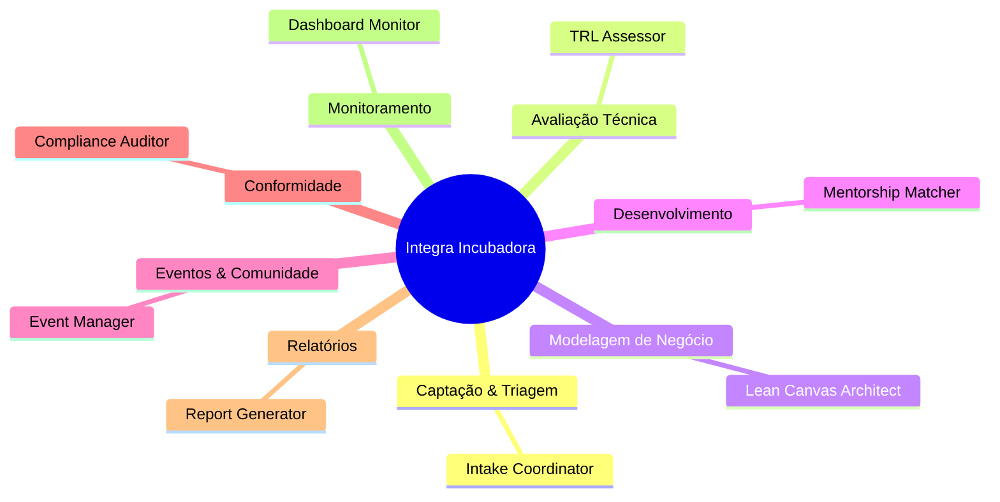
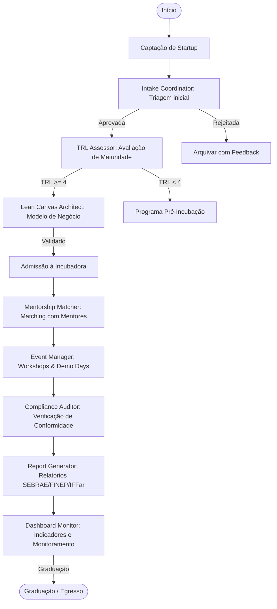

<div align="center">

# Integra Incubadora Operations Squad

**Squad Multi-Agente para Gestão Operacional de Incubadoras de Empresas**


</div>

---

## O que é

O **Integra Incubadora Operations Squad** é um sistema multi-agente de inteligência artificial desenvolvido para operacionalizar o ciclo completo de uma incubadora de empresas, com foco especial no contexto dos Institutos Federais de Educação (IFFar — Campus Frederico Westphalen).

Ele transforma processos manuais e fragmentados da gestão de incubadoras em um fluxo **orquestrado, rastreável e automatizado**, garantindo conformidade com as exigências do SEBRAE, FINEP e normativos institucionais.

## Para que serve

- **Gestão de Pipeline de Startups:** Captação, triagem, admissão e graduação de startups residentes.
- **Avaliação TRL:** Aplicação do Technology Readiness Level (TRL) para avaliar maturidade tecnológica das startups.
- **Lean Canvas Automatizado:** Geração de modelos de negócio Lean Canvas validados e rastreáveis.
- **Gestão de Mentoria:** Matching inteligente entre startups e mentores, acompanhamento de sessões e evolução.
- **Gestão de Eventos:** Planejamento, execução e avaliação de eventos, workshops e demo days.
- **Relatórios Institucionais:** Geração automática de relatórios para SEBRAE, FINEP e Reitoria do IFFar.
- **Monitoramento e Dashboard:** Visualização em tempo real do status da incubadora, startups e indicadores chave.

---

## Arquitetura do Squad

O sistema é composto por 8 agentes especializados, orquestrados para cobrir o ciclo de vida completo da incubadora.



---

## Fluxo de Trabalho

O fluxo principal cobre o ciclo completo de uma startup na incubadora, desde a captura até a graduação.



---

## Os 8 Agentes

| Agente | Função | Entrada | Saída |
| :--- | :--- | :--- | :--- |
| **Intake Coordinator** | Triagem e classificação inicial de startups | Formulário de inscrição, pitch deck, CV dos fundadores | `StartupProfile` (JSON) com score de admissão |
| **TRL Assessor** | Avaliação de maturidade tecnológica (TRL 1-9) | Documentação técnica, protótipos, evidências de testes | `TRLReport` (JSON) com nível TRL e recomendações |
| **Lean Canvas Architect** | Construção e validação de modelo de negócio | Dados da startup, entrevistas, pesquisa de mercado | `LeanCanvas` (JSON/Markdown) validado |
| **Mentorship Matcher** | Matching inteligente e gestão de mentorias | Perfil da startup, nível TRL, necessidades, base de mentores | `MentorshipPlan` (JSON) com matches e cronograma |
| **Event Manager** | Planejamento e execução de eventos | Tipo de evento, objetivos, público-alvo, orçamento | `EventPlan` (JSON) + checklists operacionais |
| **Compliance Auditor** | Verificação de conformidade institucional | Documentação da startup, regulamentações SEBRAE/FINEP/IFFar | `ComplianceReport` (JSON) com achados e recomendações |
| **Report Generator** | Geração de relatórios institucionais | Dados agregados da incubadora, métricas individuais | Relatórios SEBRAE, FINEP, Reitoria (DOCX/PDF) |
| **Dashboard Monitor** | Monitoramento e visualização de KPIs | Dados em tempo real da incubadora | Dashboard interativo (HTML/React) |

---

## Entregas Finais

O squad gera, ao final de cada ciclo:

- **Startup Profile:** Ficha técnica da startup com avaliação de admissão.
- **TRL Report:** Documento de maturidade tecnológica com evidências e recomendações.
- **Lean Canvas:** Modelo de negócio validado em formato visual e textual.
- **Mentorship Plan:** Plano de mentorias com matches, cronograma e métricas de sucesso.
- **Event Plan:** Checklists, cronogramas e relatórios de eventos (workshops, demo days).
- **Compliance Report:** Parecer de conformidade com achados e plano de ação.
- **Institutional Reports:** Relatórios trimestrais/ anuais para SEBRAE, FINEP e Reitoria do IFFar.
- **Dashboard:** Painel de controle com KPIs em tempo real da incubadora.

---

## Como Executar

### Pré-requisitos

- Python 3.10+
- Node.js 18+
- Docker & Docker Compose
- Poetry (gerenciamento de dependências Python)

### Instalação

```bash
# Clone o repositório
git clone https://github.com/marciobisognin/Squads-Genius.git
cd Squads-Genius/IFFar-Squads/squads/integra-incubadora-ops-squad

# Instale as dependências
poetry install

# Configure as variáveis de ambiente
cp .env.example .env
# Edite .env com suas credenciais (APIs, DB, Notion)

# Inicie os serviços
poetry run python scripts/setup.py
```

### Execução do Pipeline Principal

```bash
# Ative o ambiente virtual
poetry shell

# Execute o pipeline de admissão de uma nova startup
python scripts/run_pipeline.py --startup-id <ID_DA_STARTUP> --stage intake

# Execute a avaliação TRL
python scripts/assess_trl.py --startup-id <ID_DA_STARTUP>

# Gere o Lean Canvas
python scripts/generate_canvas.py --startup-id <ID_DA_STARTUP>

# Execute o matching de mentores
python scripts/match_mentors.py --startup-id <ID_DA_STARTUP>

# Gere relatórios institucionais
python scripts/generate_reports.py --quarter Q1 --year 2026
```

---

## Como Executar em AI Code Assistants

O projeto é otimizado para ser desenvolvido e orquestrado com assistentes de IA.

### OpenAI Codex
- Carregue o `PRD.md` e os schemas na janela de contexto.
- Solicite a geração de módulos específicos (ex: `TRL Assessor`).
- Use para iterar em boilerplate, testes e refatoração.

### Claude Code (Anthropic)
- Use "Projects" para manter PRD, schemas e documentação em memória.
- Solicite a implementação de agentes com LangGraph.
- Simule os Gates HITL usando `interrupts` do StateGraph.

### Antigravity (ou outro agente genérico)
- Forneça o repositório completo como contexto.
- Use para revisão arquitetural e geração de testes.

---

## Stack Técnico

| Camada | Tecnologia |
| :--- | :--- |
| **Orquestração** | LangGraph |
| **LLM** | Claude (Anthropic) |
| **Engine de Regras** | Python Puro + Pydantic |
| **Banco de Dados** | PostgreSQL + pgvector |
| **Frontend** | Next.js + React + Tailwind CSS |
| **Relatórios** | python-docx, openpyxl |
| **Dashboard** | React + Recharts + Tremor |

---

## Estrutura do Repositório

```
integra-incubadora-ops-squad/
├── agents/                     # Definição dos 8 agentes
├── tasks/                       # Tarefas individuais (intake, TRL, canvas, etc.)
├── workflows/                   # Fluxos de trabalho orquestrados
├── scripts/                    # Scripts utilitários (CLI, CI/CD)
├── templates/                  # Templates Lean Canvas, TRL, relatórios
├── schemas/                   # Schemas Pydantic (StartupProfile, TRLReport, etc.)
├── tests/                     # Testes unitários e de integração
├── frontend/                  # Aplicação web (Next.js)
├── PRD.md                     # Product Requirements Document
├── README.md                  # Este arquivo
├── squad.yaml                # Manifesto do squad
├── AUTHORS.md               # Autoria
├── LICENSE                  # Licença MIT
└── CHANGELOG.md             # Registro de alterações
```

---

## Licença

Este projeto está sob a licença **MIT**.

**Criado por:** Marcio Bisognin / Maeve  
**Repositório:** [marciobisognin/Squads-Genius](https://github.com/marciobisognin/Squads-Genius)
