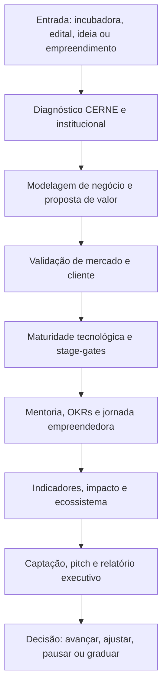

<div align="center">

# 🛰️ Órbita Incubadora Squad

### Um sistema premium para transformar incubadoras em operações maduras, mensuráveis e orientadas por evidências.

<p>
  
  
  
</p>

</div>

---

## ✨ Ideia central

O **Órbita Incubadora Squad** é um conjunto de agentes, fluxos, templates e scripts criado para apoiar incubadoras de empresas, ambientes de inovação, NITs, programas de pré-incubação, habitats institucionais e projetos de empreendedorismo tecnológico.

Ele usa o **CERNE** como eixo de maturidade institucional e o combina com metodologias complementares: **Lean Startup, Customer Development, Business Model Canvas, Value Proposition Canvas, Jobs To Be Done, TRL, Stage-Gate, OKR, Balanced Scorecard, ISO 56002, Hélice Tríplice/Quádrupla, Open Innovation, Living Labs, mentoria estruturada, Investment Readiness e gestão de impacto**.

O resultado é um squad que não apenas descreve uma incubadora: ele ajuda a **diagnosticar, organizar, operar, acompanhar e melhorar** a jornada dos empreendimentos apoiados.

---

## 🎯 Para que serve

<table>
<tr>
<td><strong>Diagnosticar maturidade</strong><br/>Mapeia processos, lacunas, evidências e riscos institucionais da incubadora.</td>
<td><strong>Estruturar a jornada</strong><br/>Organiza pré-incubação, incubação, aceleração, graduação e pós-incubação.</td>
<td><strong>Validar empreendimentos</strong><br/>Converte ideias em hipóteses, experimentos, entrevistas, MVPs e decisões baseadas em evidências.</td>
</tr>
<tr>
<td><strong>Medir impacto</strong><br/>Cria indicadores de desempenho, aprendizagem, sustentabilidade e impacto territorial.</td>
<td><strong>Gerar documentos</strong><br/>Produz minutas de edital, matriz de avaliação, PDE, relatórios e checklists.</td>
<td><strong>Preparar captação</strong><br/>Apoia pitch, tese de negócio, investimento, editais e parcerias estratégicas.</td>
</tr>
</table>

---

## 🧭 Como o squad trabalha



---

## 🧩 Estrutura dos agentes

<table>
<tr><th>Agente</th><th>Função</th><th>Produz</th></tr>
<tr><td><strong>Diagnóstico CERNE</strong></td><td>Avalia processos, maturidade e evidências da incubadora.</td><td>Mapa de lacunas, plano de melhoria e trilha de maturidade.</td></tr>
<tr><td><strong>Modelagem de Negócios</strong></td><td>Desenha Canvas, proposta de valor e lógica econômica.</td><td>Business Model Canvas, Value Proposition Canvas e riscos do modelo.</td></tr>
<tr><td><strong>Validação de Mercado</strong></td><td>Transforma suposições em hipóteses e experimentos.</td><td>Roteiro de entrevistas, cartões de experimento e matriz de evidências.</td></tr>
<tr><td><strong>Maturidade Tecnológica</strong></td><td>Avalia TRL, protótipo, prontidão técnica e stage-gates.</td><td>Classificação TRL, próximos testes e critérios de avanço.</td></tr>
<tr><td><strong>Mentoria e Jornada</strong></td><td>Organiza trilha de mentoria, OKRs e cadência de acompanhamento.</td><td>Plano de mentoria, pauta de reunião e PDE.</td></tr>
<tr><td><strong>Indicadores e Impacto</strong></td><td>Mede desempenho institucional, evolução dos incubados e impacto.</td><td>Painel de indicadores, BSC, teoria da mudança e evidências.</td></tr>
<tr><td><strong>Ecossistema e Parcerias</strong></td><td>Mapeia atores, hélices, living labs e inovação aberta.</td><td>Mapa de parceiros, chamadas de desafio e plano de conexão regional.</td></tr>
<tr><td><strong>Captação e Pitch</strong></td><td>Prepara investimento, editais, pitch e narrativa estratégica.</td><td>Pitch deck textual, matriz de prontidão e plano de captação.</td></tr>
</table>

---

## 🗺️ Fluxo operacional dos agentes


---

## 📦 O que o squad entrega no final

- **Diagnóstico de maturidade da incubadora:** leitura dos processos, lacunas e prioridades.
- **Plano de Desenvolvimento do Empreendimento:** roteiro de evolução para cada incubado.
- **Mapa de validação de mercado:** hipóteses, entrevistas, experimentos e evidências.
- **Avaliação de maturidade tecnológica:** TRL, riscos técnicos e próximos marcos.
- **Painel de indicadores:** desempenho da incubadora, evolução dos empreendimentos e impacto territorial.
- **Biblioteca documental:** edital, matriz de avaliação, relatório periódico, checklist de graduação e modelos operacionais.
- **Relatório executivo consolidado:** síntese para gestores, comitês, mentores e parceiros.

---

## ⚠️ Uso responsável

O squad produz diagnósticos, minutas e artefatos de apoio. Ele **não substitui** decisão institucional, revisão jurídica, avaliação técnica especializada, certificação CERNE, parecer de investimento ou aprovação formal de órgãos competentes.

---

## ✅ Em uma frase

> O Órbita Incubadora Squad transforma princípios de maturidade, validação, tecnologia, ecossistema e impacto em uma operação prática para incubadoras que precisam gerar empreendimentos inovadores de forma mais sistemática.

<div align="center">

**Licença:** MIT<br>
**Criado por:** Marcio Bisognin<br>
**Instagram:** [@marciobisognin](https://instagram.com/marciobisognin)

</div>

---

## 🤝 Como usar nos principais LLMs de codificação

> [!NOTE]
> **O padrão de ativação é o mesmo em qualquer ferramenta:**
> 1. **Dê contexto** ao assistente apontando os arquivos do squad (especialmente `IFFar-Squads/squads/orbita-incubadora-squad/squad.yaml` e `IFFar-Squads/squads/orbita-incubadora-squad/workflows/incubacao-premium.yaml`).
> 2. **Peça que ele assuma a persona do orquestrador** (veja os agentes em `IFFar-Squads/squads/orbita-incubadora-squad/agents/`).
> 3. **Conduza o fluxo** respeitando os checkpoints humanos e validando cada handoff/contrato.
>
> **Prompt de ativação** (copie, cole e ajuste o briefing):
> ```text
> Assuma a persona do orquestrador do squad (veja os agentes em `IFFar-Squads/squads/orbita-incubadora-squad/agents/`)
> e conduza o fluxo definido em `IFFar-Squads/squads/orbita-incubadora-squad/`. Siga `IFFar-Squads/squads/orbita-incubadora-squad/workflows/incubacao-premium.yaml`.
> Valide cada handoff/contrato e respeite os checkpoints humanos.
> Meu briefing é: <descreva seu objetivo, materiais e formato de saída>.
> ```

<details open>
<summary><b>🟣 Claude Code (CLI / Web / IDE) — recomendado</b></summary>

<br>

```bash
# No terminal, dentro do repositório
claude

> Leia @IFFar-Squads/squads/orbita-incubadora-squad/squad.yaml e assuma a persona do orquestrador do squad.
  Siga @IFFar-Squads/squads/orbita-incubadora-squad/workflows/incubacao-premium.yaml. Conduza o fluxo para o briefing: <...>
```
- Use **`@caminho/arquivo`** para dar contexto preciso (autocompleta no prompt).
- Disponível em **CLI, app desktop/web (claude.ai/code) e extensões VS Code / JetBrains**.

</details>

<details>
<summary><b>🟦 Cursor</b></summary>

<br>

1. Abra a pasta do repositório no Cursor.
2. No **Chat / Composer (⌘/Ctrl + I)**, referencie os arquivos com `@`:
   ```text
   @IFFar-Squads/squads/orbita-incubadora-squad/squad.yaml @IFFar-Squads/squads/orbita-incubadora-squad/workflows/incubacao-premium.yaml
   Assuma a persona do orquestrador e conduza o fluxo para o briefing: <...>
   ```
3. **Persistente:** crie um `.cursorrules` na raiz apontando para `IFFar-Squads/squads/orbita-incubadora-squad/` como squad ativo.

</details>

<details>
<summary><b>⬛ GitHub Copilot (VS Code Chat)</b></summary>

<br>

```text
@workspace #file:IFFar-Squads/squads/orbita-incubadora-squad/squad.yaml #file:IFFar-Squads/squads/orbita-incubadora-squad/workflows/incubacao-premium.yaml
Assuma a persona do orquestrador deste squad e conduza o fluxo para: <...>
```
Para regras persistentes, crie **`.github/copilot-instructions.md`** com o prompt de ativação.

</details>

<details>
<summary><b>🟩 Windsurf (Cascade)</b></summary>

<br>

```text
@IFFar-Squads/squads/orbita-incubadora-squad/squad.yaml @IFFar-Squads/squads/orbita-incubadora-squad/workflows/incubacao-premium.yaml
Atue como o orquestrador deste squad e execute o fluxo para: <briefing>.
```
Fixe as regras em **`.windsurfrules`** (raiz do projeto).

</details>

<details>
<summary><b>🟧 Cline / Roo Code (VS Code)</b></summary>

<br>

```text
Leia IFFar-Squads/squads/orbita-incubadora-squad/squad.yaml e assuma a persona do orquestrador.
Conduza o fluxo do squad e execute os scripts em IFFar-Squads/squads/orbita-incubadora-squad/scripts/ quando o passo pedir.
Briefing: <...>
```
O Cline/Roo pode **executar os scripts** do squad e ler a saída — aprove a execução quando solicitado.

</details>

<details>
<summary><b>🟨 Continue.dev / Aider / Zed AI / chats web</b></summary>

<br>

- **Continue.dev:** use `@file` para `IFFar-Squads/squads/orbita-incubadora-squad/squad.yaml`; cole o prompt de ativação.
- **Aider:** `aider IFFar-Squads/squads/orbita-incubadora-squad/squad.yaml` e instrua o orquestrador.
- **ChatGPT / Gemini (sem acesso a arquivos):** copie o conteúdo de `IFFar-Squads/squads/orbita-incubadora-squad/squad.yaml` e `IFFar-Squads/squads/orbita-incubadora-squad/workflows/incubacao-premium.yaml` para o chat, cole o prompt de ativação e rode eventuais scripts localmente, colando a saída de volta.

</details>


---

Licença: MIT. Criado por Marcio Bisognin. Instagram: @marciobisognin.
