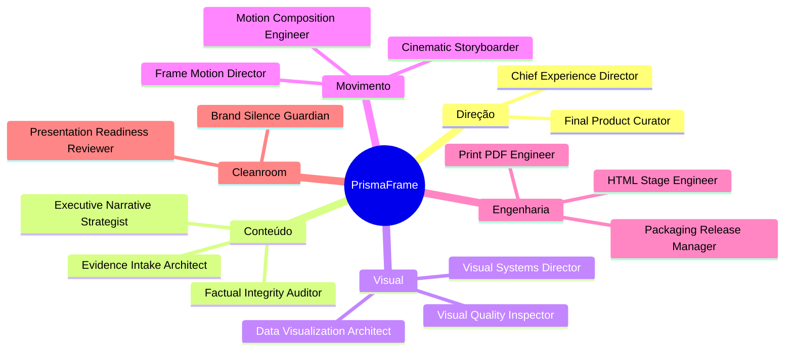

<div align="center">

# PrismaFrame Executive Cinema Suite

### Relatórios visuais, apresentações executivas e composições animadas HTML-native em um único fluxo premium.


</div>

---

## O que é

O **PrismaFrame Executive Cinema Suite** é um sistema operacional de produção premium para transformar documentos densos, diagnósticos, relatórios técnicos e narrativas institucionais em materiais finais de alto impacto visual.

Ele combina dois mundos:

- estrutura executiva, auditável e visual-first de relatórios premium;
- composição em frames, cenas e movimento, com HTML como fonte de verdade.

O resultado é uma esteira capaz de entregar material pronto para apresentação, leitura executiva, reunião de diretoria, defesa institucional, lançamento, aula, pitch ou briefing audiovisual.

---

## Princípio central

O produto final deve parecer uma peça editorial/profissional pronta, não um artefato de bastidor.


---

## Política de produto final limpo

Todo material destinado ao público final passa por uma etapa de limpeza editorial.

O material final não deve explicitar:

- bastidores de criação;
- nomes de papéis internos;
- instruções de produção;
- estrutura operacional;
- prompts;
- metadados editoriais desnecessários;
- qualquer marca de processo.

A documentação interna do pacote explica a operação; a entrega final mostra apenas o produto acabado.

---

## Para que serve

- Relatórios executivos premium.
- Decks para apresentação institucional.
- Briefings visuais para reuniões estratégicas.
- Materiais com narrativa, evidências, gráficos e roadmap.
- Peças animadas HTML-native para vídeo, social, lançamento ou explicação.
- Conversão de documentos técnicos em material visual pronto para decisão.

---

## Arquitetura do squad



---

## Entregas finais possíveis

| Entrega | Finalidade |
|---|---|
| `index.html` | Relatório/site premium pronto para apresentação |
| `deck.html` | Deck executivo navegável |
| `motion-composition.html` | Composição em frames para renderização/preview |
| `print-ready.html` | Versão otimizada para PDF |
| `final-manifest.json` | Manifesto técnico limpo do pacote final |
| `qa-cleanroom-report.json` | Evidência de que a entrega final não mostra bastidores |

---

## Workflows

1. **Clean Premium Material** — documento para material visual limpo.
2. **Executive Motion Briefing** — narrativa executiva em composição animada.
3. **Full Presentation Suite** — relatório, deck, composição e pacote final.

---

## Como executar o demo

```bash
python3 scripts/smoke_test.py
```

Saída esperada:

```text
generated/demo/final/index.html
generated/demo/final/deck.html
generated/demo/final/motion-composition.html
generated/demo/final/final-manifest.json
```

---

## Validar o pacote

```bash
python3 scripts/validate_squad.py
```

---

## Estrutura

```text
agents/       papéis especializados
tasks/        etapas operacionais
workflows/    fluxos completos
templates/    templates HTML/CSS limpos
components/   componentes reutilizáveis
contracts/    schemas de entrada/saída
scripts/      build, smoke test e validação
examples/     briefing de exemplo
generated/    saídas de demonstração
validation/   relatórios de validação
```

---

## Licença

MIT. Criado por Marcio Bisognin. Instagram: [@marciobisognin](https://instagram.com/marciobisognin).

---

## 🤝 Como usar nos principais LLMs de codificação

> [!NOTE]
> **O padrão de ativação é o mesmo em qualquer ferramenta:**
> 1. **Dê contexto** ao assistente apontando os arquivos do squad (especialmente `IFFar-Squads/squads/prismaframe-executive-cinema-suite/squad.yaml` e `IFFar-Squads/squads/prismaframe-executive-cinema-suite/workflows/01_clean_premium_material.yaml`).
> 2. **Peça que ele assuma a persona do orquestrador** (veja os agentes em `IFFar-Squads/squads/prismaframe-executive-cinema-suite/agents/`).
> 3. **Conduza o fluxo** respeitando os checkpoints humanos e validando cada handoff/contrato.
>
> **Prompt de ativação** (copie, cole e ajuste o briefing):
> ```text
> Assuma a persona do orquestrador do squad (veja os agentes em `IFFar-Squads/squads/prismaframe-executive-cinema-suite/agents/`)
> e conduza o fluxo definido em `IFFar-Squads/squads/prismaframe-executive-cinema-suite/`. Siga `IFFar-Squads/squads/prismaframe-executive-cinema-suite/workflows/01_clean_premium_material.yaml`.
> Valide cada handoff/contrato e respeite os checkpoints humanos.
> Meu briefing é: <descreva seu objetivo, materiais e formato de saída>.
> ```

<details open>
<summary><b>🟣 Claude Code (CLI / Web / IDE) — recomendado</b></summary>

<br>

```bash
# No terminal, dentro do repositório
claude

> Leia @IFFar-Squads/squads/prismaframe-executive-cinema-suite/squad.yaml e assuma a persona do orquestrador do squad.
  Siga @IFFar-Squads/squads/prismaframe-executive-cinema-suite/workflows/01_clean_premium_material.yaml. Conduza o fluxo para o briefing: <...>
```
- Use **`@caminho/arquivo`** para dar contexto preciso (autocompleta no prompt).
- Disponível em **CLI, app desktop/web (claude.ai/code) e extensões VS Code / JetBrains**.

</details>

<details>
<summary><b>🟦 Cursor</b></summary>

<br>

1. Abra a pasta do repositório no Cursor.
2. No **Chat / Composer (⌘/Ctrl + I)**, referencie os arquivos com `@`:
   ```text
   @IFFar-Squads/squads/prismaframe-executive-cinema-suite/squad.yaml @IFFar-Squads/squads/prismaframe-executive-cinema-suite/workflows/01_clean_premium_material.yaml
   Assuma a persona do orquestrador e conduza o fluxo para o briefing: <...>
   ```
3. **Persistente:** crie um `.cursorrules` na raiz apontando para `IFFar-Squads/squads/prismaframe-executive-cinema-suite/` como squad ativo.

</details>

<details>
<summary><b>⬛ GitHub Copilot (VS Code Chat)</b></summary>

<br>

```text
@workspace #file:IFFar-Squads/squads/prismaframe-executive-cinema-suite/squad.yaml #file:IFFar-Squads/squads/prismaframe-executive-cinema-suite/workflows/01_clean_premium_material.yaml
Assuma a persona do orquestrador deste squad e conduza o fluxo para: <...>
```
Para regras persistentes, crie **`.github/copilot-instructions.md`** com o prompt de ativação.

</details>

<details>
<summary><b>🟩 Windsurf (Cascade)</b></summary>

<br>

```text
@IFFar-Squads/squads/prismaframe-executive-cinema-suite/squad.yaml @IFFar-Squads/squads/prismaframe-executive-cinema-suite/workflows/01_clean_premium_material.yaml
Atue como o orquestrador deste squad e execute o fluxo para: <briefing>.
```
Fixe as regras em **`.windsurfrules`** (raiz do projeto).

</details>

<details>
<summary><b>🟧 Cline / Roo Code (VS Code)</b></summary>

<br>

```text
Leia IFFar-Squads/squads/prismaframe-executive-cinema-suite/squad.yaml e assuma a persona do orquestrador.
Conduza o fluxo do squad e execute os scripts em IFFar-Squads/squads/prismaframe-executive-cinema-suite/scripts/ quando o passo pedir.
Briefing: <...>
```
O Cline/Roo pode **executar os scripts** do squad e ler a saída — aprove a execução quando solicitado.

</details>

<details>
<summary><b>🟨 Continue.dev / Aider / Zed AI / chats web</b></summary>

<br>

- **Continue.dev:** use `@file` para `IFFar-Squads/squads/prismaframe-executive-cinema-suite/squad.yaml`; cole o prompt de ativação.
- **Aider:** `aider IFFar-Squads/squads/prismaframe-executive-cinema-suite/squad.yaml` e instrua o orquestrador.
- **ChatGPT / Gemini (sem acesso a arquivos):** copie o conteúdo de `IFFar-Squads/squads/prismaframe-executive-cinema-suite/squad.yaml` e `IFFar-Squads/squads/prismaframe-executive-cinema-suite/workflows/01_clean_premium_material.yaml` para o chat, cole o prompt de ativação e rode eventuais scripts localmente, colando a saída de volta.

</details>


---

Licença: MIT. Criado por Marcio Bisognin. Instagram: @marciobisognin.
