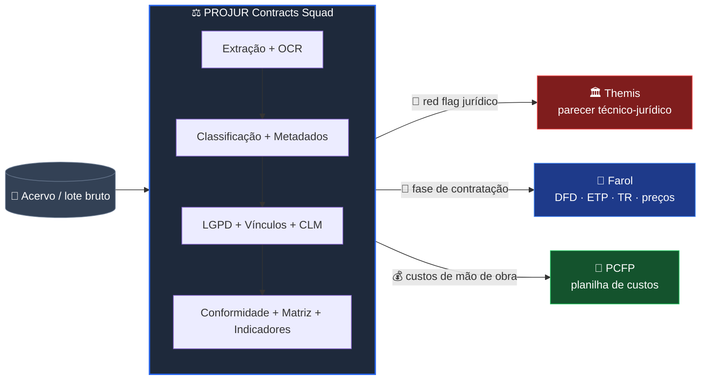
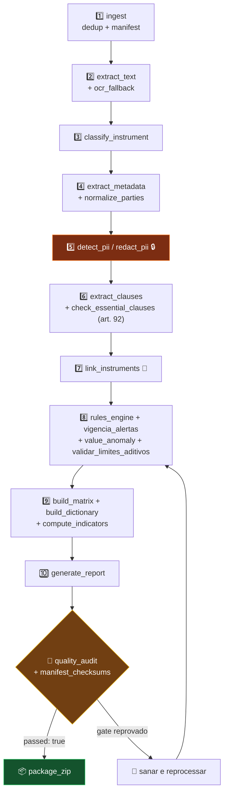
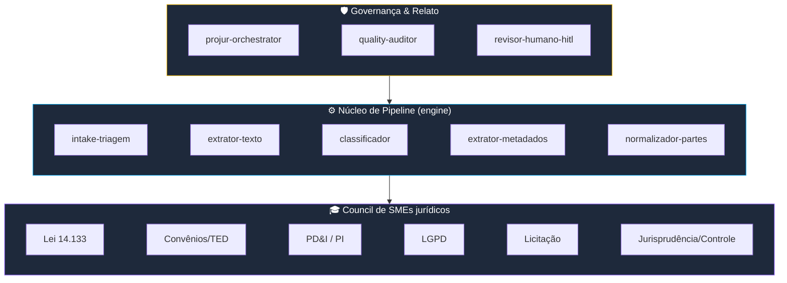

<div align="center">

# ⚖️ PROJUR Contracts Squad

### 🤖 Inteligência documental em lote + ciclo de vida (CLM) de contratos públicos

*Transforme um acervo de contratos, convênios e TEDs em uma matriz consolidada, governada e auditável — sem alucinação, com humano no loop.*

<br>


</div>

---

> [!IMPORTANT]
> **Apoio técnico automatizado — não substitui parecer jurídico.** Toda saída exige revisão
> humana qualificada (art. 53 da Lei 14.133/2021). Os dispositivos legais citados são
> **referenciais** e exigem verificação de vigência antes do uso em produção.

---

## 📑 Sumário

| | Seção | | Seção |
|---|---|---|---|
| 🎯 | [O que é](#-o-que-é) | 🧩 | [Agentes & council SME](#-agentes--council-sme) |
| 🗺️ | [Onde se encaixa](#️-onde-se-encaixa-no-ecossistema) | ⚙️ | [Scripts determinísticos](#️-scripts-determinísticos) |
| 🔄 | [Como funciona (pipeline)](#-como-funciona-o-pipeline) | 📦 | [Saídas](#-saídas-geradas) |
| 🚀 | [Início rápido](#-início-rápido-3-minutos) | 🤖 | [**Uso nos LLMs de codificação**](#-como-usar-nos-principais-llms-de-codificação) |
| 🧠 | [Princípios](#-princípios-de-engenharia) | 📚 | [PRD & estrutura](#-prd--estrutura-de-pastas) |

---

## 🎯 O que é

O **PROJUR Contracts Squad** é uma equipe multiagente que processa um **lote inteiro** de
instrumentos jurídicos do **Instituto Federal Farroupilha (IFFar)** e devolve dados prontos
para gestão e controle.

```
   📥 ENTRADA                          🧠 PROCESSAMENTO                    📊 SAÍDA
┌────────────────┐              ┌───────────────────────────┐      ┌────────────────────┐
│  PDF (nativo)  │              │  extrair · classificar     │      │  Matriz consolidada│
│  PDF (imagem)  │  ─────────►  │  normalizar · mascarar PII │ ───► │  Indicadores (KPIs)│
│  DOCX · MD     │              │  vincular · monitorar      │      │  Alertas de vigência│
│  (em lote)     │              │  validar conformidade      │      │  Relatório + ZIP   │
└────────────────┘              └───────────────────────────┘      └────────────────────┘
```

<table>
<tr><td>📄</td><td><b>Extração fiel</b><br>PDF nativo, DOCX, MD — com <b>OCR de fallback</b> para escaneados</td>
<td>🏷️</td><td><b>Classificação</b><br>contrato · ata RP · aditivo · convênio · TED · fomento · fundação de apoio</td></tr>
<tr><td>🪪</td><td><b>Partes normalizadas</b><br>validação de <b>CNPJ/CPF</b> por dígito verificador</td>
<td>🔒</td><td><b>LGPD by design</b><br>detecção e <b>mascaramento de PII</b></td></tr>
<tr><td>🔗</td><td><b>Vínculos</b><br>aditivo↔contrato · convênio↔TED · ata↔contratos</td>
<td>⏰</td><td><b>Ciclo de vida (CLM)</b><br>alertas de vencimento, renovação e limites de aditivo (25%/50%)</td></tr>
<tr><td>✅</td><td><b>Conformidade</b><br>rules engine versionada e <b>fundamentada</b></td>
<td>📈</td><td><b>Indicadores</b><br>valor total · distribuição · taxa de renovação · % fora do padrão</td></tr>
</table>

---

## 🗺️ Onde se encaixa no ecossistema

O PROJUR **não emite parecer de mérito**. Ele processa o acervo em escala e **encaminha**
os casos para os squads especializados do IFFar.



---

## 🔄 Como funciona (o pipeline)



---

## 🚀 Início rápido (3 minutos)

> **Pré-requisito:** Python 3.11+ (somente biblioteca padrão — sem `pip install`).

```bash
# 1. Entre na pasta do squad
cd IFFar-Squads/squads/projur-contracts-squad

# 2. Rode os testes (deve mostrar "9 passed")
python -m pytest tests/ -q

# 3. Execute o pipeline no lote de exemplo
python scripts/ingest.py          --input ./examples/lote --output ./saida
python scripts/extract_text.py    --manifest ./saida/manifest.json --output ./saida
python scripts/classify_instrument.py --in ./saida/evidencias/textos --output ./saida

# 4. Veja o pipeline COMPLETO (10 etapas) em:
#    examples/exemplo_uso.md
```

<details>
<summary>📋 <b>Pipeline completo — clique para expandir os 10 passos</b></summary>

```bash
cd IFFar-Squads/squads/projur-contracts-squad

# 1. Ingestão (dedup + manifest)
python scripts/ingest.py --input ./examples/lote --output ./saida

# 2. Extração de texto (+ marcação para OCR quando imagem)
python scripts/extract_text.py --manifest ./saida/manifest.json --output ./saida

# 3. Classificação do tipo de instrumento
python scripts/classify_instrument.py --in ./saida/evidencias/textos --output ./saida

# 4. Metadados + partes (CNPJ/CPF)
python scripts/extract_metadata.py --in ./saida/evidencias/textos --classificacao ./saida/classificacao.json --output ./saida
python scripts/normalize_parties.py --in ./saida/metadados.json --output ./saida

# 5. LGPD (detecção/mascaramento de PII)
python scripts/detect_pii.py --in ./saida/evidencias/textos --output ./saida --redact

# 6. Cláusulas + checklist art. 92
python scripts/extract_clauses.py --in ./saida/evidencias/textos --output ./saida
python scripts/check_essential_clauses.py --clausulas ./saida/clausulas.json --output ./saida

# 7. Vínculos + conformidade + ciclo de vida
python scripts/link_instruments.py --metadados ./saida/metadados.json --output ./saida
python scripts/rules_engine.py --regras ./templates/regras.yaml --metadados ./saida/metadados.json --clausulas-essenciais ./saida/clausulas_essenciais.json --partes ./saida/partes.json --output ./saida
python scripts/vigencia_alertas.py --metadados ./saida/metadados.json --hoje 2026-06-17 --output ./saida
python scripts/value_anomaly.py --metadados ./saida/metadados.json --output ./saida

# 8. Matriz + dicionário + indicadores
python scripts/build_matrix.py --metadados ./saida/metadados.json --partes ./saida/partes.json --alertas ./saida/alertas.json --out ./saida/matriz_contratos.csv
python scripts/build_dictionary.py --clausulas ./saida/clausulas.json --out ./saida/dicionario_clausulas.json
python scripts/compute_indicators.py --metadados ./saida/metadados.json --clausulas-essenciais ./saida/clausulas_essenciais.json --alertas ./saida/alertas.json --out ./saida/indicadores.json

# 9. Relatório + checksums + quality + pacote
python scripts/generate_report.py --indicadores ./saida/indicadores.json --alertas ./saida/alertas.json --validacoes ./saida/validacoes.json --out ./saida/relatorio_executivo.md
python scripts/manifest_checksums.py --input ./saida --out ./saida/checksums.json
python scripts/quality_audit.py --input ./saida --out ./saida/quality_report.json
python scripts/package_zip.py --input ./saida --out ./saida/projur_contracts_squad_pacote.zip

# 10. Avaliação de métricas (gold set)
python scripts/gold_eval.py --gold ./examples/gold/gold.json --textos ./saida/evidencias/textos --classificacao ./saida/classificacao.json --out ./saida/gold_eval.json
```

> A pasta `./saida/` **não é versionada** (gerada em execução).

</details>

---

## 🧠 Princípios de engenharia

| Princípio | O que significa na prática |
|---|---|
| 🔢 **Zero valor por LLM** | Nenhum número ou veredito de conformidade vem do modelo — **só dos scripts determinísticos**. O LLM decide *quais* regras aplicar; o Python *calcula*. |
| 🔬 **Separação epistêmica** | Todo apontamento marca: observado · inferido · hipótese · recomendação · risco. |
| 📜 **Fundamentação** | Cada apontamento jurídico cita norma e indica vigência e grau de confiança. |
| 🔒 **LGPD by design** | PII é detectado e mascarado; minimização e trilha de auditoria. |
| 🧾 **Schema-first** | Handoffs entre agentes via JSON validado (11 schemas). |
| 🔁 **Reprodutibilidade** | Cada artefato com origem, timestamp e **checksum**. |
| 🧑‍⚖️ **Humano no loop** | Red flags e entrega final passam por revisão humana. **Zero decisão administrativa automática.** |

---

## 🧩 Agentes & council SME

**22 agentes** organizados em três camadas:



<details>
<summary>🎓 <b>Council de SMEs jurídicos — clique para detalhes e base normativa</b></summary>

| Agente SME | Especialidade | Base normativa referencial *(verificar vigência)* |
|---|---|---|
| `sme-lei14133-conformidade` | Cláusulas necessárias e legalidade contratual | Lei 14.133/2021 (arts. 89–104, 124–136); Lei 8.666/93 (legado) |
| `sme-convenios-ted-transferencias` | Convênios, TED, fomento/colaboração, fundações de apoio | Lei 8.958/94; Dec. 11.531/23; Dec. 10.426/20; Lei 13.019/14 |
| `sme-pdi-propriedade-intelectual` | PD&I, sigilo, titularidade de PI | Lei 10.973/04; Dec. 9.283/18 (Marco Legal CT&I) |
| `sme-lgpd-privacidade` | Dados pessoais, base legal e minimização | Lei 13.709/18 (LGPD) |
| `sme-licitacao-enquadramento` | Modalidade, dispensa e inexigibilidade | Lei 14.133/2021 (arts. 74–75) |
| `sme-jurisprudencia-controle` | Confronto com TCU/TCE e CGU; handoff ao Themis | Súmulas/acórdãos TCU; Lei 12.846/13 |

</details>

---

## ⚙️ Scripts determinísticos

> 🐍 **Python 3.11+, somente stdlib.** OCR e XLSX são opcionais, com **degradação graciosa**.

<details>
<summary>📜 <b>Os 22 scripts + helper — clique para ver propósito e flags</b></summary>

| Script | Propósito | Flags principais |
|---|---|---|
| `ingest.py` | Lote → dedup por hash + manifest | `--input --output` |
| `ocr_fallback.py` | Detecta PDF imagem e aplica OCR | `--manifest` |
| `extract_text.py` | PDF/DOCX/MD → texto | `--manifest --output` |
| `normalize_text.py` | Normaliza acentos/espaços | (helper) |
| `classify_instrument.py` | Tipo do instrumento | `--in --output` |
| `extract_metadata.py` | Nº, partes, objeto, valor, vigência | `--in --classificacao --output` |
| `normalize_parties.py` | Valida CNPJ/CPF + razão social | `--in --output` |
| `parse_money_dates.py` | Valores BR e datas ISO | (helper) |
| `extract_clauses.py` | Segmenta cláusulas | `--in --output` |
| `check_essential_clauses.py` | Checklist art. 92 | `--clausulas --output` |
| `detect_pii.py` | Detecta CPF/CNPJ/e-mail/telefone | `--in --output --redact` |
| `redact_pii.py` | Mascara PII | `--in --pii` |
| `rules_engine.py` | Aplica `regras.yaml` | `--regras --metadados ...` |
| `validate_conformity.py` | Orquestra regras | `--metadados` |
| `validar_limites_aditivos.py` | % de aditivo vs. 25%/50% | `--valor-original --acrescimo --reforma` |
| `vigencia_alertas.py` | Vencimentos e renovação (CLM) | `--metadados --hoje` |
| `value_anomaly.py` | Anomalias de valor (mediana/IQR) | `--metadados` |
| `link_instruments.py` | Vínculos entre instrumentos | `--metadados --output` |
| `build_matrix.py` | Matriz CSV/JSON | `--metadados --partes --alertas --out` |
| `build_dictionary.py` | Dicionário de cláusulas | `--clausulas --out` |
| `compute_indicators.py` | KPIs | `--metadados --alertas --out` |
| `generate_report.py` | Relatório executivo (MD) | `--indicadores --alertas --out` |
| `manifest_checksums.py` | Checksums | `--input --out` |
| `package_zip.py` | Empacota artefatos | `--input --out` |
| `quality_audit.py` | Quality report + gates | `--input --out` |
| `gold_eval.py` | Métricas vs. gold set | `--gold --textos --out` |

</details>

---

## 📦 Saídas geradas

| Artefato | Formato | Para quem |
|---|---|---|
| 🗂️ `matriz_contratos` | CSV / JSON | Gestão e painéis de controle |
| 📖 `dicionario_clausulas` | JSON | Padronização e reúso |
| 🔗 `vinculos_instrumentos` | JSON | Aditivos, TEDs, atas |
| ⏰ `alertas_vigencia` | JSON | Gestão de vencimentos (CLM) |
| 🔒 `relatorio_pii` | JSON | Encarregado de dados (LGPD) |
| 📈 `indicadores` | JSON | Direção / gabinete |
| 📑 `relatorio_executivo` | Markdown | PROJUR e gestão |
| 🚦 `quality_report` | JSON | Auditoria e evidência |
| 📦 `projur_contracts_squad_pacote` | ZIP | Entrega completa reprodutível |

---

## 🤖 Como usar nos principais LLMs de codificação

Este squad é **agnóstico de ferramenta**: os agentes são arquivos Markdown (`agents/*.md`) e os
scripts são Python puro. Você pode operá-lo de duas formas:

- **Modo agente (raciocínio):** carregue o `squad.yaml` + a persona de um agente e converse.
- **Modo engine (determinístico):** rode os scripts pelo terminal (resultado idêntico, sempre).

> 💡 **Regra de ouro:** peça ao LLM para **orquestrar e interpretar**, mas deixe os **números e
> vereditos para os scripts**. O modelo nunca deve "inventar" valor de conformidade.

<details open>
<summary>🟣 <b>Claude Code</b> (Anthropic — CLI / web / IDE)</summary>

<br>

**1. Aponte o Claude para o squad e ative o orquestrador:**

```text
Leia IFFar-Squads/squads/projur-contracts-squad/squad.yaml e assuma a persona do agente
projur-orchestrator (agents/projur-orchestrator.md). Vamos processar o lote em ./entrada.
```

**2. Peça a execução determinística (o Claude roda os scripts via Bash):**

```text
Execute o pipeline completo de examples/exemplo_uso.md sobre ./entrada, parando no
quality_audit. Não gere nenhum valor você mesmo — use apenas a saída dos scripts e me
mostre o quality_report.json e os red flags para revisão humana.
```

**3. Dica:** o repositório já tem o comando `/criar-squad`. Para *operar* o PROJUR, prefira
o modo acima (orquestrador + scripts). O Claude Code consegue ler/escrever arquivos e rodar
`python scripts/...` diretamente.

</details>

<details>
<summary>🔵 <b>Cursor</b> (cursor.com)</summary>

<br>

1. Abra a pasta do repositório no Cursor.
2. **(Opcional)** crie `.cursor/rules/projur.mdc` com o conteúdo de
   `agents/projur-orchestrator.md` para fixar a persona em todo o chat.
3. No chat (modo **Agent**), com `@`-mention dos arquivos:

```text
@squad.yaml @agents/projur-orchestrator.md
Aja como o projur-orchestrator. Rode o pipeline de @examples/exemplo_uso.md no lote ./entrada
e me devolva a matriz e os alertas de vigência. Use só os scripts — sem inventar valores.
```

4. Aprove a execução dos comandos de terminal quando o Cursor solicitar.

</details>

<details>
<summary>🟢 <b>GitHub Copilot</b> (VS Code — Chat / Agent Mode)</summary>

<br>

1. Abra o repositório no VS Code com o **Copilot Chat**.
2. Anexe o contexto com `#file`:

```text
#file:squad.yaml #file:agents/projur-orchestrator.md #file:examples/exemplo_uso.md
Assuma o papel do projur-orchestrator e execute o pipeline no lote ./entrada.
Não gere números — chame os scripts Python e me mostre o quality_report.json.
```

3. No **Agent Mode**, o Copilot executa os comandos do terminal; revise antes de aprovar.

</details>

<details>
<summary>🟦 <b>Windsurf</b> (Codeium — Cascade)</summary>

<br>

1. Abra o repositório; no painel **Cascade**, fixe as regras em `.windsurfrules` (cole a
   persona do `projur-orchestrator`).
2. Prompt:

```text
Contexto: squad.yaml + agents/projur-orchestrator.md.
Tarefa: orquestrar o pipeline de examples/exemplo_uso.md no lote ./entrada, em modo determinístico.
Saídas esperadas: matriz_contratos.csv, indicadores.json, alertas.json, quality_report.json.
```

</details>

<details>
<summary>⚪ <b>Gemini CLI / outros agentes de terminal</b></summary>

<br>

```text
Leia squad.yaml e agents/projur-orchestrator.md desta pasta. Execute, na ordem,
os comandos de examples/exemplo_uso.md sobre ./entrada. Para cada etapa, mostre o comando
e o resumo do JSON gerado. Ao final, valide com quality_audit.py e liste os red flags.
```

> Funciona em qualquer agente capaz de ler arquivos e executar shell (Aider, Cline, Continue, etc.).

</details>

<details>
<summary>🧱 <b>Sem agente — execução manual (qualquer ambiente)</b></summary>

<br>

Você **não precisa de LLM** para rodar o squad. Basta Python 3.11+:

```bash
cd IFFar-Squads/squads/projur-contracts-squad
python -m pytest tests/ -q          # valida
# depois siga examples/exemplo_uso.md
```

O LLM agrega valor na **triagem dos red flags** e na **redação do encaminhamento** ao
Themis/Farol/PCFP — não no cálculo.

</details>

### ✅ Checklist de bom uso com qualquer LLM

- [ ] Carreguei `squad.yaml` **e** a persona do agente.
- [ ] Pedi execução **determinística** (scripts), não "estimativas".
- [ ] Conferi que o `quality_report.json` tem `passed: true`.
- [ ] **Revisei os red flags manualmente** antes de qualquer uso oficial.
- [ ] Não publiquei artefatos com PII sem mascaramento.

---

## 📚 PRD & estrutura de pastas

O detalhamento completo (análise crítica do PRD original, agentes, scripts, schemas, base de
regras, métricas e roadmap) está em **[`PRD.md`](PRD.md)**.

```text
projur-contracts-squad/
├── 📄 PRD.md            ← análise + requisitos completos
├── 📄 squad.yaml        ← manifesto (agentes, tasks, workflows, scripts, gates)
├── 📁 agents/           ← 22 personas (núcleo + 6 SMEs + governança)
├── 📁 tasks/            ← 13 tarefas
├── 📁 workflows/        ← 4 fluxos (lote_completo, triagem_rapida_red_flags, …)
├── 📁 scripts/          ← 22 scripts determinísticos + projur_common.py
├── 📁 schemas/          ← 11 schemas JSON (handoffs)
├── 📁 templates/        ← regras.yaml (base de regras versionada)
├── 📁 docs/             ← base normativa + evidência do forge
├── 📁 tests/            ← pytest
└── 📁 examples/         ← lote de exemplo + gold set + exemplo_uso.md
```

<div align="center">

---

### 🚦 Status: validado (`go`) · 9 testes verdes · pronto para uso com revisão humana

**Licença: MIT. Criado por Marcio Bisognin. Instagram: [@marciobisognin](https://instagram.com/marciobisognin).**

</div>
