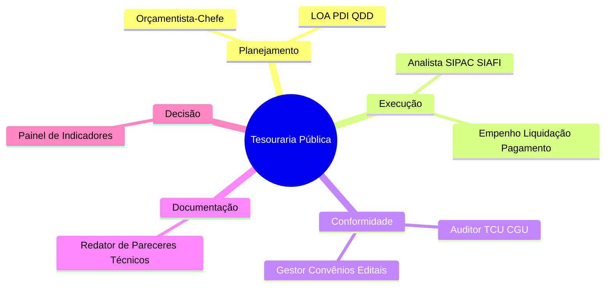
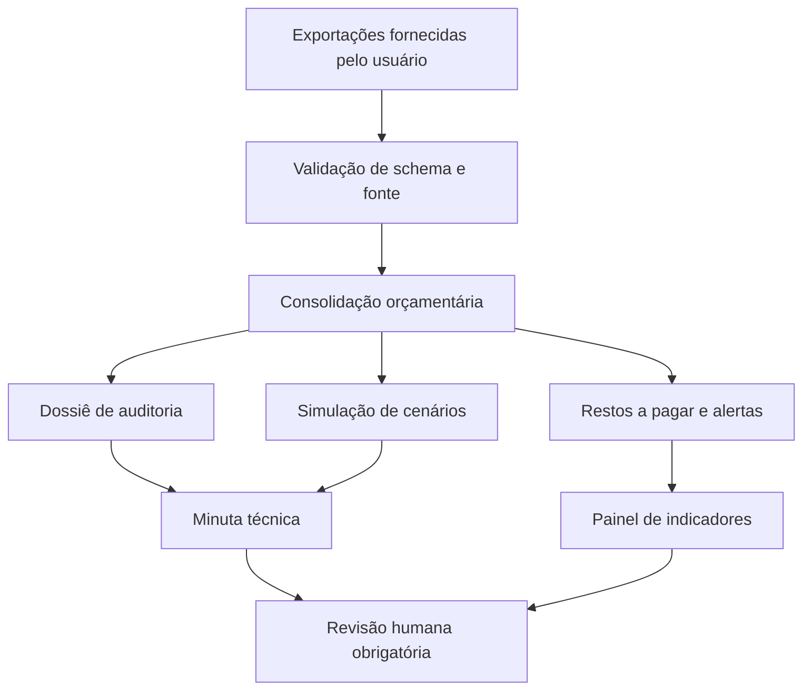

<div align="center">
  <h1>SQU Tesouraria & Conformidade Pública</h1>
  <p>Squad de inteligência orçamentária, financeira e de conformidade para Instituições Federais de Ensino.</p>


</div>

## O que é

O **SQU Tesouraria & Conformidade Pública** é um squad multiagente para apoiar equipes de planejamento, orçamento, execução financeira, prestação de contas e auditoria interna em Institutos Federais, Universidades Federais e órgãos da administração pública federal.

Ele transforma exportações fornecidas pelo usuário — LOA/QDD, PDI, SIPAC/SIAFI, achados TCU/CGU, convênios, TED e editais — em relatórios auditáveis, checklists, minutas técnicas e simulações de impacto orçamentário.

> **Limite institucional:** o squad é apoio analítico e documental. Não acessa sistemas oficiais diretamente, não realiza empenho, liquidação, pagamento, lançamento contábil, assinatura ou decisão administrativa final.

## Para que serve

- Consolidar execução orçamentária por unidade, ação, natureza de despesa e fonte.
- Classificar restos a pagar e alertas de inconsistência.
- Montar dossiês de prestação de contas e respostas a achados TCU/CGU.
- Aplicar checklists de conformidade para editais, convênios e TED.
- Redigir minutas de pareceres técnicos e notas técnicas para revisão humana.
- Simular cenários de corte, contingenciamento e remanejamento entre campi.
- Gerar leitura executiva de indicadores PDI/TCU.

## Arquitetura do Squad



## Fluxo de Trabalho



## Os 6 Agentes

| Agente | Função | Entrada | Saída |
|---|---|---|---|
| Orçamentista-Chefe | Roteamento, LOA/PDI e simulações | LOA, QDD, PDI, pedido | Premissas, roteamento e cenários |
| Analista de Execução SIPAC/SIAFI | Consolidação de execução | CSV/JSON exportado | Relatório por unidade, ação e natureza |
| Auditor TCU/CGU | Achados, evidências e planos de ação | Ofícios, achados, evidências | Matriz de achados e resposta |
| Gestor de Convênios e Editais | Checklists Lei 14.133, TED e convênios | Minutas e documentos | Pendências priorizadas |
| Redator de Pareceres Técnicos | Minutas institucionais | Outputs do squad | Parecer/nota técnica revisável |
| Painel de Indicadores | Leitura PDI/TCU | Execução e metas | Painel e leitura executiva |

## Entregas Finais

| Entrega | Finalidade |
|---|---|
| Relatório de Execução Orçamentária | Empenhado, liquidado, pago, saldo e percentuais por chave |
| Dossiê de Prestação de Contas | Achados, evidências, plano de ação e minutas |
| Simulação de Impacto Orçamentário | Cenários A/B/C com premissas e impactos |
| Parecer ou Nota Técnica | Minuta padronizada para processo SIPAC |
| Checklist de Conformidade | Pendências de edital, convênio ou TED |
| Painel de Indicadores | Leitura executiva de execução versus PDI/TCU |

## Como executar

```bash
cd IFFar-Squads/squads/squ-tesouraria-publica-squad
python scripts/tesouraria_publica.py run-demo --output output/demo
python scripts/validate_squad.py --root .
python -m pytest -q
```

Com dados próprios:

```bash
python scripts/tesouraria_publica.py consolidate \
  --input examples/execution_sample.csv \
  --output output/execucao

python scripts/tesouraria_publica.py checklist-edital \
  --input examples/edital_sample.json \
  --output output/edital

python scripts/tesouraria_publica.py simulate \
  --execution output/execucao/consolidated_execution.json \
  --scenario examples/scenario_cut_10.json \
  --output output/simulacao
```

## Estrutura do Repositório

```text
squ-tesouraria-publica-squad/
├── README.md
├── PRD.md
├── squad.yaml
├── guardrails.md
├── agents/
├── tasks/
├── workflows/
├── scripts/
├── tests/
├── examples/
├── docs/
├── schemas/
├── templates/
├── quality_report.json
├── LICENSE
├── NOTICE.md
└── AUTHORS.md
```

## Stack Técnico

| Componente | Uso |
|---|---|
| Python stdlib | Protótipo determinístico sem dependência externa obrigatória |
| CSV/JSON | Entrada de exportações e saída auditável |
| Markdown | Relatórios, minutas e runbooks |
| PyYAML | Validação de contratos YAML nos testes/validadores |
| pytest | Testes automatizados |

## Licença

MIT. Criado por Marcio Bisognin. Instagram: @marciobisognin.

---

## 🤝 Como usar nos principais LLMs de codificação

> [!NOTE]
> **O padrão de ativação é o mesmo em qualquer ferramenta:**
> 1. **Dê contexto** ao assistente apontando os arquivos do squad (especialmente `IFFar-Squads/squads/squ-tesouraria-publica-squad/squad.yaml` e `IFFar-Squads/squads/squ-tesouraria-publica-squad/workflows/execucao-orcamentaria-mensal.yaml`).
> 2. **Peça que ele assuma a persona do orquestrador** (veja os agentes em `IFFar-Squads/squads/squ-tesouraria-publica-squad/agents/`).
> 3. **Conduza o fluxo** respeitando os checkpoints humanos e validando cada handoff/contrato.
>
> **Prompt de ativação** (copie, cole e ajuste o briefing):
> ```text
> Assuma a persona do orquestrador do squad (veja os agentes em `IFFar-Squads/squads/squ-tesouraria-publica-squad/agents/`)
> e conduza o fluxo definido em `IFFar-Squads/squads/squ-tesouraria-publica-squad/`. Siga `IFFar-Squads/squads/squ-tesouraria-publica-squad/workflows/execucao-orcamentaria-mensal.yaml`.
> Valide cada handoff/contrato e respeite os checkpoints humanos.
> Meu briefing é: <descreva seu objetivo, materiais e formato de saída>.
> ```

<details open>
<summary><b>🟣 Claude Code (CLI / Web / IDE) — recomendado</b></summary>

<br>

```bash
# No terminal, dentro do repositório
claude

> Leia @IFFar-Squads/squads/squ-tesouraria-publica-squad/squad.yaml e assuma a persona do orquestrador do squad.
  Siga @IFFar-Squads/squads/squ-tesouraria-publica-squad/workflows/execucao-orcamentaria-mensal.yaml. Conduza o fluxo para o briefing: <...>
```
- Use **`@caminho/arquivo`** para dar contexto preciso (autocompleta no prompt).
- Disponível em **CLI, app desktop/web (claude.ai/code) e extensões VS Code / JetBrains**.

</details>

<details>
<summary><b>🟦 Cursor</b></summary>

<br>

1. Abra a pasta do repositório no Cursor.
2. No **Chat / Composer (⌘/Ctrl + I)**, referencie os arquivos com `@`:
   ```text
   @IFFar-Squads/squads/squ-tesouraria-publica-squad/squad.yaml @IFFar-Squads/squads/squ-tesouraria-publica-squad/workflows/execucao-orcamentaria-mensal.yaml
   Assuma a persona do orquestrador e conduza o fluxo para o briefing: <...>
   ```
3. **Persistente:** crie um `.cursorrules` na raiz apontando para `IFFar-Squads/squads/squ-tesouraria-publica-squad/` como squad ativo.

</details>

<details>
<summary><b>⬛ GitHub Copilot (VS Code Chat)</b></summary>

<br>

```text
@workspace #file:IFFar-Squads/squads/squ-tesouraria-publica-squad/squad.yaml #file:IFFar-Squads/squads/squ-tesouraria-publica-squad/workflows/execucao-orcamentaria-mensal.yaml
Assuma a persona do orquestrador deste squad e conduza o fluxo para: <...>
```
Para regras persistentes, crie **`.github/copilot-instructions.md`** com o prompt de ativação.

</details>

<details>
<summary><b>🟩 Windsurf (Cascade)</b></summary>

<br>

```text
@IFFar-Squads/squads/squ-tesouraria-publica-squad/squad.yaml @IFFar-Squads/squads/squ-tesouraria-publica-squad/workflows/execucao-orcamentaria-mensal.yaml
Atue como o orquestrador deste squad e execute o fluxo para: <briefing>.
```
Fixe as regras em **`.windsurfrules`** (raiz do projeto).

</details>

<details>
<summary><b>🟧 Cline / Roo Code (VS Code)</b></summary>

<br>

```text
Leia IFFar-Squads/squads/squ-tesouraria-publica-squad/squad.yaml e assuma a persona do orquestrador.
Conduza o fluxo do squad e execute os scripts em IFFar-Squads/squads/squ-tesouraria-publica-squad/scripts/ quando o passo pedir.
Briefing: <...>
```
O Cline/Roo pode **executar os scripts** do squad e ler a saída — aprove a execução quando solicitado.

</details>

<details>
<summary><b>🟨 Continue.dev / Aider / Zed AI / chats web</b></summary>

<br>

- **Continue.dev:** use `@file` para `IFFar-Squads/squads/squ-tesouraria-publica-squad/squad.yaml`; cole o prompt de ativação.
- **Aider:** `aider IFFar-Squads/squads/squ-tesouraria-publica-squad/squad.yaml` e instrua o orquestrador.
- **ChatGPT / Gemini (sem acesso a arquivos):** copie o conteúdo de `IFFar-Squads/squads/squ-tesouraria-publica-squad/squad.yaml` e `IFFar-Squads/squads/squ-tesouraria-publica-squad/workflows/execucao-orcamentaria-mensal.yaml` para o chat, cole o prompt de ativação e rode eventuais scripts localmente, colando a saída de volta.

</details>


---

Licença: MIT. Criado por Marcio Bisognin. Instagram: @marciobisognin.
