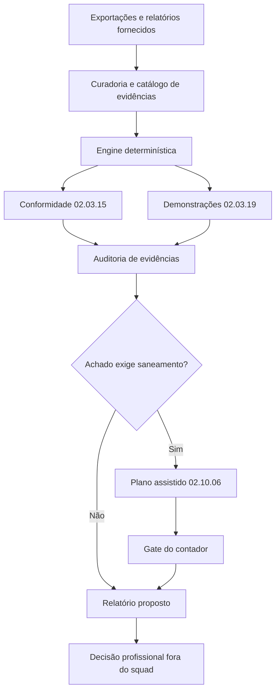

<div align="center">

# 🏛️ Squad Contábil Adm Pública

### Evidência contábil dispersa entra. Achados rastreáveis, plano assistido e relatório para o contador saem.

<p>
  
  
  
  
</p>

</div>

---

## ✨ Ideia central

O **Squad Contábil Adm Pública** organiza a análise mensal de exportações contábeis da Administração Pública Federal. Ele transforma balancetes, razões, demonstrativos e relatórios fornecidos pelo usuário em uma trilha auditável: validação dos dados, detecção determinística de inconsistências, matriz de achados, plano assistido de regularização e relatório para o contador.

O núcleo foi desenhado em torno das Macrofunções **02.03.15 — Conformidade Contábil**, **02.03.19 — Demonstrações Contábeis** e **02.10.06 — Manual de Regularizações Contábeis**.

> [!IMPORTANT]
> O squad **não acessa nem altera o SIAFI**, não gera lançamento contábil executável, não registra conformidade e não substitui contador habilitado.

## 🎯 Para que serve

<table>
<tr>
<td width="33%"><strong>Conformidade mensal</strong><br/>Organiza evidências, equações, saldos e restrições para revisão do contador.</td>
<td width="33%"><strong>Demonstrações</strong><br/>Confere relações patrimoniais declaradas e correlaciona demonstrativos com o balancete.</td>
<td width="33%"><strong>Regularização assistida</strong><br/>Converte achados em plano de saneamento pendente de fonte vigente e aprovação humana.</td>
</tr>
</table>

## 🧭 Como o squad trabalha



## 🧩 Estrutura dos agentes

| Agente | Função | Entrega |
|---|---|---|
| Orquestrador Contábil | Classifica a demanda e controla os gates | WorkflowPlan |
| Curador de Dados SIAFI | Normaliza arquivos e vincula evidências | CaseInput + EvidenceCatalog |
| Analista de Conformidade | Aplica a lente da 02.03.15 | ConformityAssessment |
| Analista de Demonstrações | Examina relações da 02.03.19 | StatementReview |
| Regularizador Contábil | Propõe saneamento sob a 02.10.06 | RegularizationPlan |
| Auditor de Evidências | Bloqueia achados sem prova ou coerência | EvidenceAudit |
| Relator para o Contador | Consolida o dossiê final | JSON, CSV e Markdown |

## 🔐 Gates de segurança

1. **Entrada válida:** UG, competência e fontes identificadas.
2. **Evidência rastreável:** todo achado aponta para objeto e fonte.
3. **Sem transação:** nenhum comando ou lançamento SIAFI é produzido.
4. **Regularização aprovada:** o contador valida a orientação.
5. **Conclusão aprovada:** somente o contador decide e registra.

## 📦 O que o squad entrega no final

| Artefato | Uso |
|---|---|
| `analysis.json` | Estado estruturado, hash, achados e contagens |
| `matriz_achados.csv` | Triagem e acompanhamento por severidade |
| `plano_regularizacao.md` | Proposta assistida, nunca marcada como executada |
| `relatorio_conformidade.md` | Documento para revisão e decisão do contador |

## 🚀 Início rápido

```bash
python3 scripts/contabil_core.py \
  --input examples/caso_com_inconsistencias.json \
  --output-dir generated/demo
```

Depois, valide:

```bash
python3 -m pytest -q tests
python3 scripts/validate_squad.py --root .
```

## 💬 Prompt de ativação

```text
Leia o squad.yaml do Squad Contábil Adm Pública e assuma a persona do agente a1-orquestrador-contabil. Classifique a demanda, use apenas os dados e relatórios que eu fornecer, siga o workflow adequado, execute os scripts determinísticos quando aplicável e preserve todos os gates do contador. Nunca invente lançamento, código de transação ou evidência ausente.
```

<details>
<summary><strong>Como usar em Claude Code, Codex, Cursor ou outro assistente</strong></summary>

1. Abra a pasta do squad no ambiente escolhido.
2. Referencie `squad.yaml`, o workflow aplicável e o JSON do caso.
3. Execute a engine localmente.
4. Submeta achados e plano ao contador.
5. Registre a decisão humana fora do squad.

</details>

## ⚖️ Limites reais

- Exportações precisam ser fornecidas por usuário autorizado.
- As regras aritméticas são determinísticas; o enquadramento profissional não é automatizado.
- O catálogo normativo deve ser conferido contra a redação oficial vigente.
- Exemplos usam dados sintéticos e não devem ser confundidos com uma UG real.

## 🎨 Estilo visual do README

Preset `dark-neon-layered-architecture`: azul institucional, verde de validação, camadas operacionais e leitura orientada por gates.

## ✅ Em uma frase

> Um copiloto auditável para o contador público — forte em evidência e cálculo, deliberadamente impedido de tomar a decisão profissional.

<div align="center">

**Licença:** MIT<br/>
**Criado por:** Marcio Bisognin<br/>
**Instagram:** [@marciobisognin](https://instagram.com/marciobisognin)

</div>
