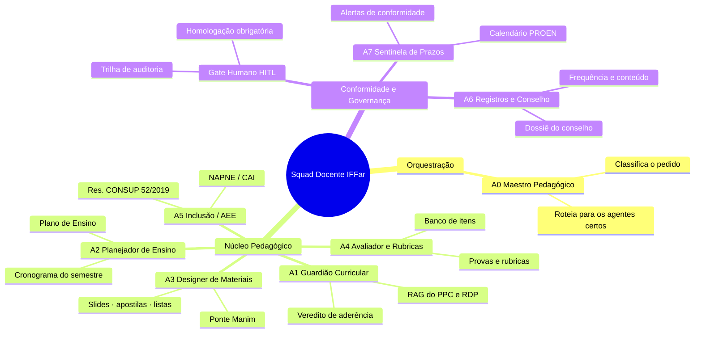
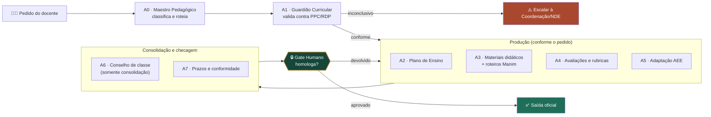

<div align="center">

# 🎓 Squad Docente IFFar

### Sistema multiagente que assiste o docente do **planejamento à avaliação** — plano de ensino, materiais didáticos, avaliações, inclusão/AEE e conselho de classe — sempre validado contra o PPC e o RDP, com **homologação humana obrigatória** antes de qualquer saída oficial.

<p>
  
  
  
  
  
  
  
</p>

</div>

---

## ✨ Ideia central

O **Squad Docente IFFar** transforma o trabalho repetitivo do ciclo docente —
montar o Plano de Ensino, produzir material, criar avaliações, adaptar para
AEE e preparar o conselho de classe — em uma esteira assistida por agentes,
**sempre ancorada no PPC e no RDP do curso**.

Os agentes preparam, verificam e consolidam. **A decisão e o lançamento
oficial seguem sempre humanos** — docente, Coordenação de Curso ou NDE. Essa é
a única regra que nunca se quebra neste squad.

> 🧭 *"Os agentes assistem. A homologação é humana."*

## 🎯 Para que serve

<table>
<tr>
<td width="33%"><b>📘 Planejar o semestre</b><br/>Monta o Plano de Ensino (ementa → objetivos → metodologia → conteúdo → avaliação → referências) cruzado com o calendário acadêmico.</td>
<td width="33%"><b>🧩 Produzir material</b><br/>Gera sequências didáticas, slides, apostilas e listas — com ponte direta para roteiros de animação Manim em conceitos visuais.</td>
<td width="33%"><b>📝 Avaliar com critério</b><br/>Constrói avaliações e rubricas mapeadas às competências, alimentando um banco de itens reutilizável por curso.</td>
</tr>
<tr>
<td width="33%"><b>♿ Incluir de verdade</b><br/>Adapta material e avaliação conforme a Res. CONSUP 52/2019, articulando com NAPNE/CAI — o diferencial de um squad pensado para o IFFar.</td>
<td width="33%"><b>🗂️ Preparar o conselho</b><br/>Consolida conteúdos lançados e frequência em dossiê — sem nunca decidir ou lançar nada oficialmente.</td>
<td width="33%"><b>⏰ Não perder prazo</b><br/>Monitora prazos da PROEN e aderência ao RDP, alertando antes do vencimento.</td>
</tr>
</table>

## 🧩 Por que isso importa para o IFFar

O ciclo docente do IFFar gira em torno de poucos documentos centrais — PPC,
RDP, Plano de Ensino, Diário de Classe e normativas da PROEN — e muito tempo
se perde montando cada um do zero, com risco real de desalinhamento com o
curso. Este squad ataca exatamente essa dor, sem tocar nas decisões que são
(e continuam sendo) humanas.

---

## 🗺️ Mapa do squad (mind map)



## 🔁 Fluxo ponta a ponta (flowchart)



> Nenhuma seta pula o Gate Humano: o único caminho para **"saída oficial"**
> passa pela homologação.

---

## 🤖 9 agentes do squad

| Código | Agente | Grupo | Papel |
|---|---|---|---|
| **A0** | [Maestro Pedagógico](agents/maestro-pedagogico.yaml) | 🟡 Orquestração | Classifica o pedido e roteia entre os agentes |
| **A1** | [Guardião Curricular](agents/guardiao-curricular.yaml) | 🟢 Núcleo pedagógico | RAG do PPC/RDP/resoluções; verifica aderência |
| **A2** | [Planejador de Ensino](agents/planejador-de-ensino.yaml) | 🟢 Núcleo pedagógico | Monta o Plano de Ensino + cronograma |
| **A3** | [Designer de Materiais Didáticos](agents/designer-materiais-didaticos.yaml) | 🟢 Núcleo pedagógico | Sequências, slides, apostilas, listas + ponte Manim |
| **A4** | [Avaliador & Rubricas](agents/avaliador-rubricas.yaml) | 🟢 Núcleo pedagógico | Provas, rubricas e banco de itens |
| **A5** | [Agente de Inclusão / AEE](agents/agente-inclusao-aee.yaml) | 🟢 Núcleo pedagógico | Adaptação conforme Res. CONSUP 52/2019 |
| **A6** | [Registros & Conselho de Classe](agents/registros-conselho-classe.yaml) | 🔵 Conformidade & governança | Consolida frequência e conteúdo (sem decidir) |
| **A7** | [Sentinela de Conformidade & Prazos](agents/sentinela-conformidade-prazos.yaml) | 🔵 Conformidade & governança | Monitora prazos PROEN e aderência ao RDP |
| **HG** | [Gate Humano](agents/gate-humano.yaml) | 🔵 Conformidade & governança | Checkpoint obrigatório de homologação |

🔒 **HITL** (revisão humana obrigatória): A2, A3, A4, A5, A6, HG
⚠️ **Dado sensível (LGPD)**: A5, A6 — tratados apenas em ambiente controlado

## 🔁 Workflows

| Workflow | Descrição |
|---|---|
| [`pipeline-completo-docente`](workflows/pipeline-completo-docente.yaml) | Fluxo ponta a ponta — do pedido à homologação |
| [`workflow-plano-de-ensino`](workflows/workflow-plano-de-ensino.yaml) | Elaboração do Plano de Ensino cruzado com o calendário |
| [`workflow-material-e-avaliacao`](workflows/workflow-material-e-avaliacao.yaml) | Material didático + avaliação/rubrica |
| [`workflow-inclusao-aee`](workflows/workflow-inclusao-aee.yaml) | Adaptação AEE com articulação NAPNE/CAI |
| [`workflow-conselho-de-classe`](workflows/workflow-conselho-de-classe.yaml) | Consolidação do dossiê de conselho de classe |

## 🛠️ Como usar

### 1. Ative o squad
Leia `squad.yaml` e assuma a persona do agente solicitado em `agents/`, ou
siga o `pipeline-completo-docente` para o fluxo ponta a ponta.

### 2. Rode os scripts determinísticos
Apenas biblioteca padrão do Python 3.11+ — sem dependências externas.

```bash
# 1) Distribuir o conteúdo programático nas aulas do semestre
python3 scripts/build_cronograma.py --topicos topicos.json \
  --inicio 2026-08-03 --fim 2026-12-18 --output cronograma.json

# 2) Validar o Plano de Ensino antes da homologação
python3 scripts/validate_plano_ensino.py --input plano.json \
  --report quality_report.json

# 3) Verificar prazos da PROEN/RDP e emitir alertas
python3 scripts/check_prazos.py --agenda agenda_prazos.json \
  --hoje 2026-06-18 --output alertas.json
```

### 3. Valide o pipeline offline
```bash
python3 scripts/smoke_test.py        # pipeline offline ponta a ponta
python3 -m pytest tests/ -q          # testes de unidade
```

### 4. Use os templates
`templates/plano_de_ensino.md`, `templates/rubrica_avaliacao.md` e
`templates/dossie_conselho_classe.md` trazem a estrutura pronta para
preenchimento e homologação.

## 📂 Estrutura

```
squad-docente-iffar/
├── README.md · PRD.md · squad.yaml · CHANGELOG.md
├── LICENSE · NOTICE.md · AUTHORS.md · requirements.txt
├── agents/        # 9 agentes (A0–A7 + Gate Humano)
├── tasks/         # 6 tarefas operacionais
├── workflows/     # 5 workflows
├── scripts/       # 5 scripts determinísticos + smoke test
├── schemas/       # handoff SACP · plano de ensino · avaliação · adaptação AEE
├── templates/     # plano de ensino · rubrica · dossiê de conselho
├── docs/          # metodologia · roadmap
├── examples/       # briefings e saídas de exemplo
└── tests/         # pytest
```

## 🔒 Governança, LGPD e Gate Humano

- **LGPD**: dado de estudante (frequência, notas, perfil AEE) só circula em
  ambiente controlado, a partir da Fase 3 do roadmap — nunca enviado a modelo
  externo sem autorização.
- **Rastreabilidade normativa**: toda citação de PPC/RDP/resolução vem com
  fonte; sem fonte, o agente sinaliza "inconclusivo" em vez de inventar.
- **Human-in-the-loop**: nenhum plano, material, avaliação, adaptação ou
  dossiê se torna oficial sem decisão humana registrada e auditável.
- **Inclusão real**: toda adaptação cita o dispositivo da Res. CONSUP
  52/2019 aplicado e articula com NAPNE/CAI quando a norma exige.

## 🗺️ Roadmap (resumo)

| Fase | Foco | Dado sensível? |
|---|---|---|
| 0 — Fundação | RAG de PPC/RDP/resoluções/calendário | Não |
| 1 — MVP ⭐ | Plano de Ensino + materiais (A1·A2·A3) | Não |
| 2 — Avaliação & Inclusão | Avaliações, rubricas, AEE (A4·A5) | Parcial |
| 3 — Registros & Conselho | Consolidação para conselho (A6) | Sim (ambiente controlado) |
| 4 — Conformidade & Escala | Prazos, observabilidade, multi-campus (A7) | Não |

Detalhes em [`docs/roadmap.md`](docs/roadmap.md) e no [`PRD.md`](PRD.md).

## 📜 Conformidade

LDB (Lei 9.394/1996) · Lei 11.892/2008 · Res. CONSUP 52/2019 (AEE) ·
Lei 13.146/2015 (Estatuto da Pessoa com Deficiência) · LGPD (Lei 13.709/2018) ·
RDP e PPC institucionais do IFFar.

---

Licença: MIT. Criado por Marcio Bisognin. Instagram: [@marciobisognin](https://instagram.com/marciobisognin).
