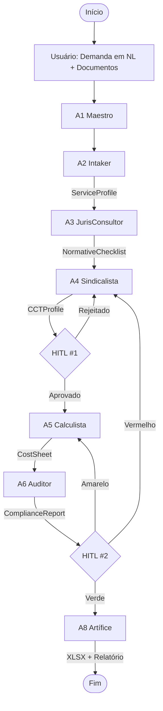

# PRD — SQUAD PCFP v2.0
## Compliance & Pricing Engine para Contratação Pública Federal

**Autor:** Marcio Bisognin / Maeve  
**Data:** Junho/2026  
**Status:** Aprovado para Desenvolvimento  
**Versão:** 2.0  
**Licença:** MIT  

---

## 1. Visão Geral

O **SQUAD PCFP v2.0** é um sistema multi-agente de inteligência artificial especializado na elaboração, validação e auditoria de Planilhas de Custos e Formação de Preços (PCFP) para a Administração Pública Federal. Ele transforma um processo manual, fragmentado e de alto risco jurídico em um fluxo orquestrado, determinístico e auditável, garantindo conformidade total com a legislação vigente e rastreabilidade de cada célula de cálculo.

### 1.1 Problema Central

A elaboração da PCFP para contratos de dedicação exclusiva de mão de obra é um dos gargalos mais críticos da contratação pública federal. O processo exige domínio simultâneo de:

*   **Legislação de Licitações:** Lei 14.133/2021 e suas alterações.
*   **Normativos Infralegais:** IN SEGES 05/2017, IN 98/2022, IN 176/2024, IN 147/2026, em constante mutação.
*   **Direito Trabalhista e CCTs:** Convenções Coletivas de Trabalho por categoria e território, pisos salariais, benefícios e data-base.
*   **Tributação em Transição:** Reforma Tributária (CBS/IBS, reoneração da folha).
*   **Jurisprudência do TCU:** Acórdãos sobre reserva técnica, enquadramento sindical, exequibilidade e repactuação.

**Erros comuns geram:**
*   Dano ao erário recorrente (contratos de até 10 anos).
*   Apontamentos de CGU/TCU.
*   Repactuações mal instruídas.
*   Insegurança jurídica para gestores e fiscais.

### 1.2 A Solução

Um **squad de 8 agentes de IA** que opera o ciclo de vida completo da PCFP:


Cada agente é responsável por uma etapa específica, com **Human-in-the-Loop (HITL)** nos pontos de decisão jurídica crítica. A rastreabilidade é total: cada célula da planilha carrega metadados de valor, fórmula, fundamento legal e fonte.

---

## 2. Arquitetura do Squad (8 Agentes)

| Agente | Nome | Função Principal | Stack Técnico |
| :--- | :--- | :--- | :--- |
| **A1** | **Maestro** | Orquestrador de Demandas | LangGraph (StateGraph) |
| **A2** | **Intaker** | Intake & Classificação | Claude (Anthropic) + Pydantic |
| **A3** | **JurisConsultor** | Base Normativa RAG | Embeddings + Reranker + pgvector |
| **A4** | **Sindicalista** | Análise CCT & Enquadramento | Claude + Parser de PDF/HTML |
| **A5** | **Calculista** | Engine de Cálculo Determinístico | Python Puro + Pydantic + pytest |
| **A6** | **Auditor** | Verificação de Conformidade e Exequibilidade | Python + Rules Engine |
| **A7** | **Gestor** | Gestão Contratual (Repactuação/Reajuste) | Python + Regras de IN 05/2017 |
| **A8** | **Artífice** | Geração de Artefatos (XLSX, Relatórios) | openpyxl + python-docx |

### 2.1 A1 — Maestro (Orquestrador)

*   **Entrada:** Solicitação em linguagem natural (ex: "Elaborar PCFP para 5 vigilantes em Porto Alegre, 12x36, 12 meses") + documentos (TR, ETP, CCT).
*   **Função:** Classifica a demanda (elaboração nova, análise de proposta, repactuação, auditoria), monta o grafo de execução, gerencia o estado do workflow e define os Gates HITL.
*   **Saída:** `WorkflowPlan` (JSON com agentes ativados, ordem e pontos de decisão humana).

### 2.2 A2 — Intaker (Intake & Classificação)

*   **Função:** Extrai parâmetros estruturados da demanda.
*   **Validações:**
    *   CBO existe e é válido? (Obrigatório pela IN 176/2024)
    *   Escala é compatível com a CLT? (44h, 12x36, etc.)
    *   Posto exige cobertura ininterrupta? (Justifica reposição/intrajornada)
    *   Quantidade de postos e vigência são coherentes?
*   **Saída:** `ServiceProfile` (JSON estruturado).

### 2.3 A3 — JurisConsultor (Base Normativa RAG)

*   **Função:** Consulta a base de conhecimento normativo (seção 4) para responder "qual norma rege X?".
*   **Diferencial:** Índice temporal. Sabe qual redação da norma vigia em cada data (crítico para repactuações retroativas).
*   **Funcionalidades:**
    *   Detecta normas revogadas ou alteradas.
    *   Monta o checklist de conformidade aplicável ao caso.
    *   Gera rastreabilidade normativa para cada rubrica.
*   **Saída:** `NormativeChecklist` (JSON com normas, artigos e redações vigentes).

### 2.4 A4 — Sindicalista (Análise CCT & Enquadramento)

*   **Função:** Localiza a CCT aplicável (categoria preponderante × território).
*   **Regras embarcadas:**
    *   Princípio da territorialidade.
    *   Acórdão TCU 614/2008 (categoria preponderante/CNAE).
    *   Art. 6º da IN 05/2017 (Administração não se vincula a cláusulas de PLR e direitos não previstos em lei).
*   **Tarefas:**
    *   Extrai piso salarial, adicionais e benefícios obrigatórios.
    *   Versiona a CCT e sua data-base.
*   **HITL Gate #1:** Confirmação humana do enquadramento sindical antes de prosseguir.
*   **Saída:** `CCTProfile` (JSON com cada benefício citado por cláusula).

### 2.5 A5 — Calculista (Engine de Cálculo)

*   **Função:** Núcleo determinístico do sistema. Preenche os módulos do Anexo VII-D da IN 05/2017.
*   **Módulos:**
    *   **M1:** Composição da Remuneração (salário-base, adicionais, DSR).
    *   **M2:** Encargos e Benefícios (13º, férias, GPS, FGTS, RAT x FAP, terceiros, benéficos CCT).
    *   **M3:** Provisão para Rescisão (aviso prévio, multa FGTS).
    *   **M4:** Custo de Reposição do Profissional Ausente (férias, licenças, afastamentos).
    *   **M5:** Insumos Diversos (uniformes, materiais, equipamentos).
    *   **M6:** Custos Indiretoslowing, Tributos e Lucro (CIT&L) com motor tributário plugável (Lucro Real/Presumido/Simples + transição CBS/IBS).
*   **Implementação:** Biblioteca Python pura (`pcfp-core`), 100% coberta por testes unitários com casos dos Cadernos Técnicos SEGES como golden tests.
*   **Saída:** `CostSheet` (JSON com cada célula, memória de cálculo e fundamento).

### 2.6 A6 — Auditor (Verificação de Conformidade)

*   **Função:** Roda o checklist do A3 contra a planilha do A5.
*   **Verificações Típicas:**
    *   Reserva técnica sem indicação de custos? (Flag TCU 1442/2010)
    *   Custos mínimos da IN 176/2024 respeitados (inclusive reembolso-creche IN 147/2026)?
    *   Percentuais de encargos dentro das faixas de referência?
    *   Rubricas não renováveis marcadas para prorrogação (IN 07/2018)?
    *   Itens da conta vinculada (Anexo XII) destacados correntemente?
*   **Análise de Exequibilidade:** Compara com valores limites SEGES e planilhas homologadas no PNCP, classificando o risco (verde/amarelo/vermelho).
*   **Saída:** `ComplianceReport` (JSON com severidade, fundamento e recomendação por achado).

### 2.7 A7 — Gestor (Gestão Contratual)

*   **Função:** Dado um contrato vigente + nova CCT ou índice, calcula repactuação e reajuste.
*   **Regras:**
    *   Distinção repactuação × reajuste × reequilíbrio.
    *   Arts. 54–60 da IN 05/2017.
    *   Custos não renováveis.
    *   Efeitos na conta vinculada.
*   **HITL Gate #2:** Parecer humano antes de gerar minuta de apostilamento/aditivo.

### 2.8 A8 — Artífice (Geração de Artefatos)

*   **Função:** Materializa as saídas finais.
*   **Entregas:**
    *   **XLSX:** No layout do Anexo VII-D, com fórmulas vivas e aba de memória de cálculo.
    *   **Relatório Técnico:** DOCX/PDF com fundamentação rubrica a rubrica, pronto para instruir o processo no SIPAC.
    *   **Checklist de Conformidade:** Assinável pelo gestor.
    *   **Dashboard Comparativo:** Proposta × Referência × Limites SEGES.

---

## 3. Base Normativa (Knowledge Base)

### 3.1 Camada Legal

| Norma | Papel no Sistema |
| :--- | :--- |
| Lei 14.133/2021 | Regime geral de licitações e contratos |
| Decreto 12.174/2024 | Direitos trabalhistas mínimos na terceirização |
| LC 123/2006 | Simples Nacional — vedações/permissões em cessão de mão de obra |
| EC 132/2023 + LC 214/2025 | Reforma Tributária — IVA dual (CBS/IBS), transição no Módulo 6 |
| Lei 14.973/2024 | Reoneração gradual da folha de pagamento |

### 3.2 Camada Infralegal (SEGES/MGI)

| Norma | Papel no Sistema |
| :--- | :--- |
| IN SEGES 05/2017 + Anexo VII-D | Modelo oficial da PCFP (estrutura de módulos) |
| IN 07/2018 | Alterações no Anexo VII-D (ex: rubrica férias como custo não renovável na prorrogação) |
| IN SEGES/ME 98/2022 | Compatibilização da IN 05/2017 com a Lei 14.133 |
| IN SEGES/MGI 176/2024 | Custos mínimos relevantes (CBO, salário-base, benefícios) — anexos próprios |
| IN SEGES/MGI 147/2026 | Reembolso-creche como custo mínimo relevante |
| Anexo XII da IN 05/2017 | Conta-depósito vinculada (retenção de provisões) |
| Cadernos Técnicos SEGES | Parâmetros de referência para vigilância e limpeza, valores limites anuais |

### 3.3 Camada de Controle (CGU/TCU/CNJ)

| Fonte | Papel no Sistema |
| :--- | :--- |
| Manuais de auditoria CGU | Procedimentos de verificação de planilhas |
| IN Conjunta MP/CGU 01/2016 | Controles internos e gestão de riscos |
| Acórdão TCU 1207/2024-Plenário | Custos mínimos / garantias trabalhistas |
| Acórdãos TCU 1442/2010, 593/2010 | Vedação à reserva técnica sem indicação de custos |
| Acórdão TCU 614/2008 | Enquadramento sindical — categoria preponderante / CNAE |
| Decisão TCU 457/1995 + arts. 54-60 IN 05/2017 | Regras站式 de repactuação / conta vinculada |
| Resolução CNJ 651/2025 | Conta vinculada no Judiciário (revoga a 169/2013) (benchmark) |

### 3.4 Fontes Dinâmicas (Atualização Contínua)

*   **CCTs/ACTs:** Via Mediador (MTE) — pisos, benefícios, data-base por sindicato/território.
*   **Valores Limites Anuais:** SEGES (vigilância/limpeza).
*   **Alíquot stitch:** RAT/FAP, terceiros, ISS municipal, transição CBS/IBS.
*   **PNCP:** Planilhas homologadas de contratações similares (benchmark de preços).

---

## 4. Fluxos de Trabalho

### 4.1 Fluxo Principal (Elaboração de PCFP Nova)



### 4.2 Fluxo Secundário (Análise de Proposta de Licitante)

1.  **A2** extrai a planilha da proposta (parser XLSX/PDF).
2.  **A5** recalcula os valores com base na CCT e normas vigentes.
3.  **A6** produz diff célula a célula + parecer de exequibilidade.
4.  **A8** gera relatório para o pregoeiro.

---

## 5. Modelos de Dados (Schemas Principais)

```python
from pydantic import BaseModel, Field
from typing import Literal, List, Optional, Annotated
from decimal import Decimal

class Citacao(BaseModel):
    norma: str
    artigo: str
    redacao_vigente: str
    data_vigencia: str

class ServiceProfile(BaseModel):
    tipo_servico: str = Field(..., examples=["vigilancia", "limpeza", "recepcao"])
    cbo: str = Field(..., description="Obrigatório conforme IN 176/2024")
    municipio: str
    uf: str
    escala: Literal["44h", "12x36_diurno", "12x36_noturno"]
    qtd_postos: int
    adicionais: List[str]  # e.g., ["insalubridade", "periculosidade"]
    vigencia_meses: int
    cobertura_ininterrupta: bool

class Rubrica(BaseModel):
    modulo: str = Field(..., examples=["1", "2.1", "2.2"])
    nome: str = Field(..., examples=["Salário Base", "FGTS"])
    valor: Decimal
    formula: str = Field(..., examples=["0.08 * (M1 + S2.1)"])
    fundamento: List[Citacao]
    renovavel: bool = True  # IN 07/2018
    conta_vinculada: bool = False  # Anexo XII

class ComplianceFinding(BaseModel):
    severidade: Literal["info", "alerta", "critico"]
    rubrica: Optional[str]
    descricao: str
    fundamento: Citacao
    recomendacao: str
```

---

## 6. Stack Técnico

| Camada | Tecnologia | Justificativa |
| :--- | :--- | :--- |
| **Orquestração** | LangGraph (StateGraph + Checkpoints) | HITL nativo, retomada de estado, controle de fluxo complexo. |
| **LLM (Raciocínio Jurídico)** | Claude (Anthropic) — modelo top | Extração e análise normativa de alta complexidade. |
| **LLM (Extração de Dados)** | Claude (Anthropic) — modelo rápido | Parsing de documentos e extracao de parâmetros. |
| **Engine de Cálculo** | Python Puro + Pydantic + pytest | Determinismo total e auditabilidade. Nenhum valor é gerado por LLM. |
| **RAG** | pgvector (Postgres) + Reranker | Corpus normativo versionado; busca semântica e reranking. |
| **Parsing de Docs** | openpyxl, pdfplumber, docling | Suporte a propostas em formatos heterogêneos. |
| **Geração XLSX** | openpyxl com template do Anexo VII-D | Fórmulas vivas para conferência humana. |
| **Observabilidade** | LangSmith ou Langfuse | Trace por rubrica, custo por execução. |
| **Frontend HITL** | Next.js + tabela editável estilo planilha | Revisão célula a célula com rastreabilidade. |
| **Persistência** | Postgres (TimescaleDB opcional) | Histórico de CCTs, índices e versões de planilhas. |

---

## 7. Roadmap

| Fase | Escopo | Duração |
| :--- | :--- | :--- |
| **F0 — Fundação** | Corpus normativo versionado + `pcfp-core` (Módulos 1-3) com golden tests dos Cadernos Técnicos. | 3 semanas |
| **F1 — MVP** | Fluxo completo p/ 1 tipo de serviço (limpeza, escala 44h): A1, A2, A5, A8 + XLSX. | 4 semanas |
| **F2 — Conformidade** | A3 (RAG) + A6 (auditor) + checklist TCU/CGU + HITL gates. | 4 semanas |
| **F3 — Multi-serviço** | A4 + vigilância 12x36 + insalubridade/periculosidade + Simples Nacional. | 4 semanas |
| **F4 — Ciclo de Vida** | A7 (repactuação/reajuste) + parser de propostas + diff de exequibilidade. | 4 semanas |
| **F5 — Reforma Tributária** | Motor CBS/IBS com cronograma de transição parametrizado. | 3 semanas |

---

## 8. Riscos e Mitigações

| Risco | Impacto | Mitigação |
| :--- | :--- | :--- |
| LLM "alucinar" norma ou percentual | **Crítico** | Engine determinística; LLM nunca produz números. Toda citação validada contra corpus de frontmatter de vigência. |
| Norma alterada sem atualização do corpus | **Alto** | Job semanal de verificação no DOU/Portal de Compras + alerta de divergência. |
| Enquadramento sindical incorreto | **Alto** | HITL Gate #1 obrigatório. A4 apresenta alternativas com prós/contras, nunca decide sozinho. |
| Transição tributária (CBS/IBS) com regras ainda instáveis | **Médio** | Motor tributário plugável, alíquotas em tabela de configuração versionada. |
| Excesso de confiança do usuário (automação ≠ parecer jurídico) | **Médio** | Disclaimers nos relatórios. Campos de "responsável pela validação" obrigatórios. |
| Parsing de propostas em formatos caóticos | **Médio** | Fluxo de fallback: revisão manual assistida com mapeamento de colunas. |

---

## 9. Instruções de Execução em AI Code Assistants

O SQUAD PCFP v2.0 foi projetado para ser desenvolvido e orquestrado com auxílio de assistentes de IA. Abaixo, instruções para os principais ambientes.

### 9.1 OpenAI Codex

1.  **Contexto:** Carregue o `PRD.md` e os schemas (`schemas/`) na janela de contexto.
2.  **Prompt Inicial:**
    ```text
    Desenvolva o módulo [NOME_DO_MODULO] (ex: pcfp-core/engine.py) com base no PRD v2.0. 
    Use Pydantic para validação de dados e pytest para golden tests. 
    Siga a estrutura de módulos do Anexo VII-D da IN 05/2017.
    ```
3.  **Iteração:** Use o Codex para gerar boilerplate, testes e lógica de cálculo. Solicite que o Codex refatore com base nos feedbacks do `Auditor` (A6).

### 9.2 Claude Code (Anthropic)

1.  **Contexto:** Use o `PRD.md` como documento raiz. Utilize a funcionalidade de "Projects" para manter a base normativa (RAG) e os schemas em memória.
2.  **Prompt Típico:**
    ```text
    Com base no PRD do SQUAD PCFP v2.0, implemente o agente A3 (JurisConsultor). 
    Use LangGraph para o StateGraph. A base de dados normativa deve ser carregada de um JSON versionado.
    ```
3.  **HITL Simulation:** Simule os Gates HITL usando `interrupts` do LangGraph, pausando a execução para input do usuário antes de prosseguir.

### 9.3 Antigravity (ou outro Agente Genérico)

1.  **Contexto:** Forneça o repositório completo (ou um `zip` do escopo do projeto) como contexto.
2.  **Prompt:**
    ```text
    Você é o arquiteto de software do SQUAD PCFP v2.0. 
    Revise o PRD.md e proponha uma refatoração da engine de cálculo (A5) para melhorar a performance e a testabilidade. 
    Foque na separação entre regras de negócio (pure Python) e adaptadores de infraestrutura.
    ```
3.  **Execução:** Antigravity (ou outro agente) pode ser usado para tarefas de revisão de código, geração de testes e análise de complexidade ciclomática.

---

**Criado por:** Marcio Bisognin / Maeve  
**Repositório:** [marciobisognin/Squads-Genius](https://github.com/marciobisognin/Squads-Genius)  
**Licença:** MIT
