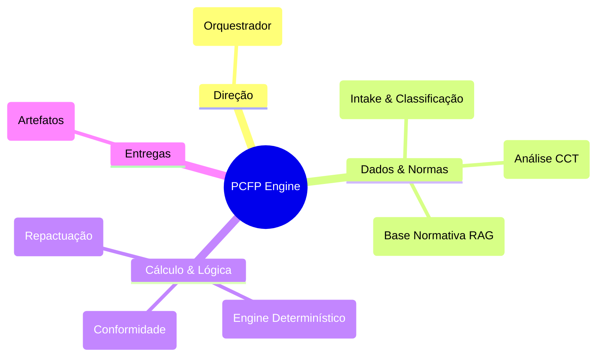
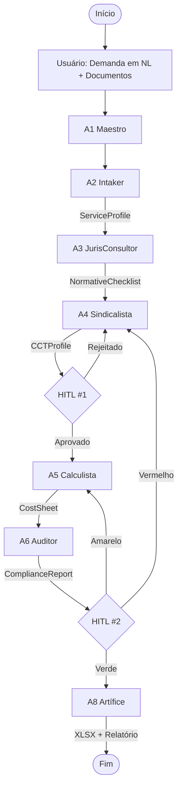

<div align="center">

# PCFP — Compliance & Pricing Engine

**Squad Multi-Agente para Elaboração, Validação e Auditoria de Planilhas de Custos e Formação de Preços**


</div>

---

## O que é

O **PCFP — Compliance & Pricing Engine** é um sistema multi-agente de inteligência artificial que automatiza o ciclo de vida completo da **Planilha de Custos e Formação de Preços (PCFP)** para a Administração Pública Federal.

Ele transforma um processo manual, fragmentado e de alto risco jurídico em um fluxo **orquestrado, determinístico e auditável**, garantindo conformidade total com a legislação vigente e rastreabilidade de cada célula de cálculo.

## Para que serve

- **Elaboração de PCFPs:** Gera planilhas conforme a IN 05/2017 e suas alterações, com cálculos determinísticos e rastreáveis.
- **Validação de Propostas:** Analisa planilhas de licitantes, comparando com valores de referência e limites SEGES.
- **Auditoria de Conformidade:** Verifica a planilha contra a base normativa e jurisprudência do TCU, gerando relatórios de não-conformidade.
- **Gestão Contratual:** Calcula repactuações e reajustes com base em nova CCT ou índice, conforme arts. 54–60 da IN 05/2017.

---

## Arquitetura do Squad

O sistema é composto por 8 agentes especializados, orquestrados por um grafo de execução inteligente.



---

## Fluxo de Trabalho

O fluxo principal cobre a elaboração de uma PCFP do zero, com validação humana (HITL) nos pontos críticos.



---

## Os 8 Agentes

| Agente | Função | Entrada | Saída |
| :--- | :--- | :--- | :--- |
| **A1 — Maestro** | Orquestrador de Demandas | Solicitação em NL + TR/ETP + CCT | `WorkflowPlan` (JSON) |
| **A2 — Intaker** | Intake & Classificação | Documentos da demanda | `ServiceProfile` (JSON) |
| **A3 — JurisConsultor** | Base Normativa RAG | Perfil do serviço | `NormativeChecklist` (JSON) |
| **A4 — Sindicalista** | Análise CCT & Enquadramento | CCT + Perfil | `CCTProfile` (JSON) |
| **A5 — Calculista** | Engine de Cálculo Determinístico | Perfil + CCT + Normas | `CostSheet` (JSON) |
| **A6 — Auditor** | Verificação de Conformidade | `CostSheet` + Checklist | `ComplianceReport` (JSON) |
| **A7 — Gestor** | Gestão Contratual (Repactuação) | Contrato + Nova CCT/Índice | Minuta de Aditivo |
| **A8 — Artífice** | Geração de Artefatos | Planilha Valida + Relatório | XLSX, DOCX, PDF, Dashboard |

---

## Entregas Finais

Ao final do fluxo, o sistema gera:

- **Planilha XLSX:** No layout do Anexo VII-D, com fórmulas vivas e aba de memória de cálculo.
- **Relatório Técnico (DOCX/PDF):** Com fundamentação jurídica rubrica a rubrica.
- **Checklist de Conformidade:** Assinável pelo gestor.
- **Dashboard Comparativo:** Visualização da proposta vs. referência vs. limites SEGES.

---

## Como Executar

### Pré-requisitos

- Python 3.10+
- Docker & Docker Compose
- Poetry (gerenciamento de dependências)

### Instalação

```bash
# Clone o repositório
git clone https://github.com/marciobisognin/Squads-Genius.git
cd Squads-Genius/IFFar-Squads/squads/squad-pcfp

# Instale as dependências
poetry install

# Configure as variáveis de ambiente
cp .env.example .env
# Edite .env com suas credenciais (APIs, DB)

# Inicie a base de dados e os serviços
docker-compose up -d
```

### Execução do Fluxo Principal

```bash
# Ative o ambiente virtual
poetry shell

# Execute o fluxo de elaboração de PCFP
python -m pcfp_engine run --demanda "Elaborar PCFP para 5 vigilantes em Porto Alegre, 12x36, 12 meses" --docs ./docs_exemplo/

# O resultado será gerado em ./output/
```

---

## Como Executar em AI Code Assistants

O projeto é otimizado para ser desenvolvido e orquestrado com assistentes de IA. Abaixo, instruções para os principais ambientes.

### OpenAI Codex

1. **Contexto:** Carregue o `PRD.md` e os schemas (`schemas/`) na janela de contexto.
2. **Prompt Inicial:**
   ```text
   Desenvolva o módulo Calculista (A5) com base no PRD v2.0.
   Use Pydantic para validação de dados e pytest para golden tests.
   Siga a estrutura de módulos do Anexo VII-D da IN 05/2017.
   ```
3. **Iteração:** Use o Codex para gerar boilerplate, testes e lógica de cálculo. Solicite refatoração com base nos feedbacks do `Auditor` (A6).

### Claude Code (Anthropic)

1. **Contexto:** Use o `PRD.md` como documento raiz. Utilize a funcionalidade de "Projects" para manter a base normativa (RAG) e os schemas em memória.
2. **Prompt Típico:**
   ```text
   Com base no PRD do SQUAD PCFP v2.0, implemente o agente A3 (JurisConsultor).
   Use LangGraph para o StateGraph. A base de dados normativa deve ser carregada de um JSON versionado.
   ```
3. **HITL Simulation:** Simule os Gates HITL usando `interrupts` do LangGraph, pausando a execução para input do usuário antes de prosseguir.

### Antigravity (ou outro Agente Genérico)

1. **Contexto:** Forneça o repositório completo (ou um `zip` do escopo do projeto) como contexto.
2. **Prompt:**
   ```text
   Você é o arquiteto de software do SQUAD PCFP v2.0.
   Revise o PRD.md e proponha uma refatoração da engine de cálculo (A5) para melhorar a performance e a testabilidade.
   Foque na separação entre regras de negócio (pure Python) e adaptadores de infraestrutura.
   ```
3. **Execução:** Use para tarefas de revisão de código, geração de testes e análise de complexidade ciclomática.

---

## Stack Técnico

| Camada | Tecnologia |
| :--- | :--- |
| **Orquestração** | LangGraph |
| **LLM** | Claude (Anthropic) |
| **Engine de Cálculo** | Python Puro + Pydantic |
| **RAG** | pgvector + Reranker |
| **Parsing de Docs** | openpyxl, pdfplumber, docling |
| **Geração XLSX** | openpyxl |
| **Frontend** | Next.js |
| **DB** | PostgreSQL (TimescaleDB) |
| **Observabilidade** | LangSmith / Langfuse |

---

## Estrutura do Repositório

```text
squad-pcfp/
├── agents/          # Implementação de cada agente (A1-A8)
├── core/            # Engine de cálculo determinístico (pcfp-core)
├── schemas/         # Schemas Pydantic (ServiceProfile, CostSheet, etc.)
├── knowledge_base/  # Base normativa versionada (JSON/Markdown)
├── templates/       # Templates XLSX (Anexo VII-D) e DOCX
├── tests/           # Testes unitários, integração e golden tests
├── frontend/        # Interface Next.js para HITL e revisão
├── scripts/         # Scripts utilitários (parsing, CI/CD)
├── docs/            # Documentação adicional e guias
├── PRD.md           # Product Requirements Document
└── README.md        # Este arquivo
```

---

## Licença

Este projeto está sob a licença **MIT**.

**Criado por:** Marcio Bisognin / Maeve  
**Repositório:** [marciobisognin/Squads-Genius](https://github.com/marciobisognin/Squads-Genius)
