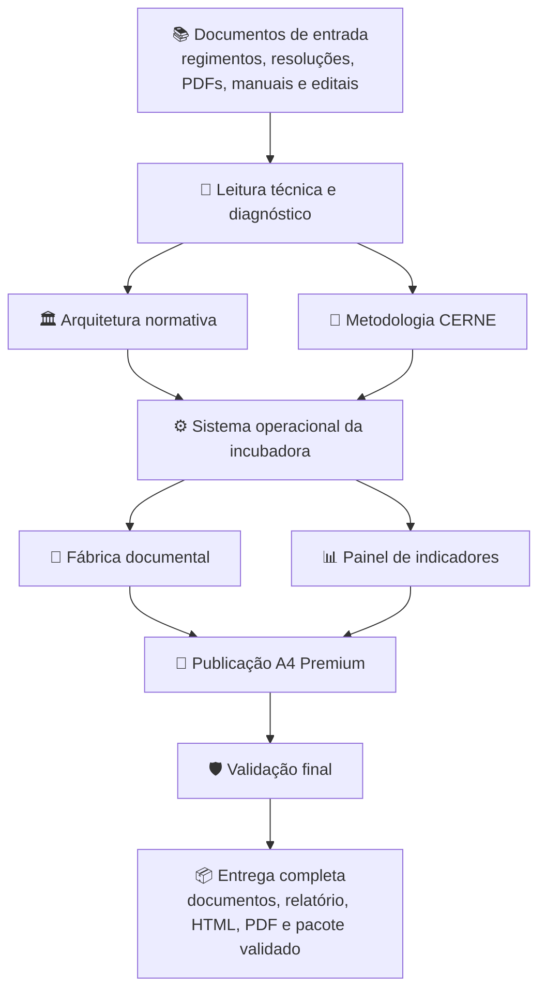
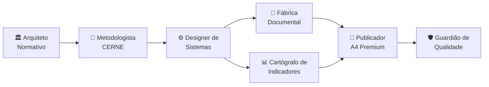
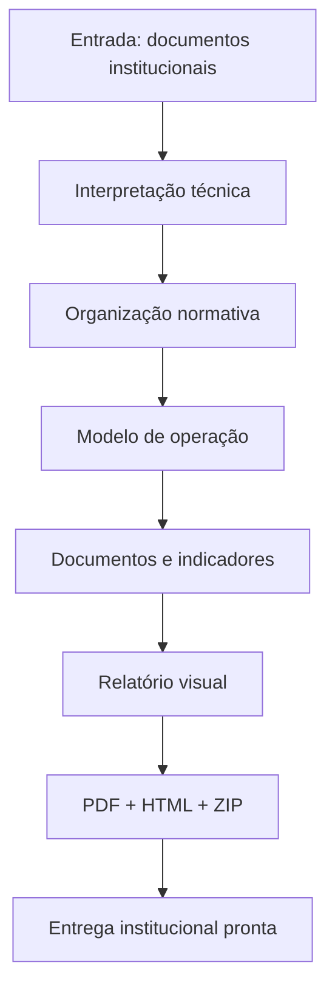

# 🌱 VetorViveiro Squad

### Um squad premium para transformar documentos institucionais de incubadoras em um sistema operacional completo de inovação.

  
  
  

---

## ✨ Ideia central

O **VetorViveiro Squad** é uma equipe multiagente criada para apoiar a estruturação, revisão e operacionalização de **incubadoras tecnológicas, habitats de inovação e programas institucionais de empreendedorismo**.

Ele parte de documentos como regimentos, resoluções, manuais, relatórios, editais e diretrizes institucionais; interpreta esse material; identifica lacunas; reorganiza os fluxos; e transforma tudo em um pacote final pronto para uso técnico, administrativo e institucional.

> Em termos simples: o squad pega a documentação dispersa de uma incubadora e converte em **governança, metodologia, documentos, indicadores, site A4, PDF e validação final**.

---

## 🎯 Para que serve

<table>
<tr>
<td width="33%" valign="top">

### 🏛️ Governança

Organiza normas, papéis, responsabilidades, fluxos decisórios e pontos de conformidade institucional.

</td>
<td width="33%" valign="top">

### 🚀 Incubação

Estrutura trilhas de pré-incubação, incubação, graduação e acompanhamento pós-incubação.

</td>
<td width="33%" valign="top">

### 📊 Gestão

Cria indicadores, instrumentos de avaliação, relatórios, editais e documentos operacionais.

</td>
</tr>
</table>

O squad é especialmente útil para:

- Núcleos de inovação tecnológica.
- Comitês gestores de incubadoras.
- Instituições públicas e educacionais.
- Equipes que precisam transformar normas em operação real.
- Projetos que exigem documentação clara, rastreável e pronta para decisão institucional.

---

## 🧭 Como o squad trabalha

---

## 🧩 Estrutura dos agentes

### 7 agentes especializados trabalhando em sequência lógica

<table>
<tr>
<td width="50%" valign="top">

### 1. 🏛️ Arquiteto Normativo

Analisa regimentos, resoluções, portarias e documentos institucionais. Identifica lacunas, riscos, inconsistências e oportunidades de melhoria normativa.

**O que produz:** parecer técnico, matriz de conformidade, recomendações e textos substitutivos.

</td>
<td width="50%" valign="top">

### 2. 🧬 Metodologista CERNE

Traduz a lógica CERNE em etapas, evidências, processos, critérios e rotinas de melhoria contínua para a incubadora.

**O que produz:** trilhas de incubação, critérios de maturidade, evidências e rotinas metodológicas.

</td>
</tr>
<tr>
<td width="50%" valign="top">

### 3. ⚙️ Designer de Sistemas Operacionais

Desenha a operação cotidiana da incubadora: papéis, ritos, calendário, fluxos, governança, comitês e jornadas dos empreendimentos.

**O que produz:** modelo operacional, fluxos decisórios, rotinas de acompanhamento e arquitetura de gestão.

</td>
<td width="50%" valign="top">

### 4. 📄 Fábrica Documental

Transforma as decisões técnicas em documentos prontos para uso: editais, formulários, termos, PDEs, relatórios, anexos e checklists.

**O que produz:** biblioteca documental institucional e modelos reutilizáveis.

</td>
</tr>
<tr>
<td width="50%" valign="top">

### 5. 📊 Cartógrafo de Indicadores

Cria indicadores de entrada, processo, resultado e impacto. Define formas de coleta, periodicidade, evidências e relatórios.

**O que produz:** painel de indicadores, métricas de acompanhamento e base para prestação de contas.

</td>
<td width="50%" valign="top">

### 6. 🎨 Publicador A4 Premium

Converte o conteúdo técnico em material final com apresentação profissional, incluindo HTML em formato A4 e PDF validado.

**O que produz:** relatório visual, versão HTML editável e PDF final preservando o design.

</td>
</tr>
<tr>
<td width="50%" valign="top">

### 7. 🛡️ Guardião de Qualidade

Verifica completude, consistência, links, arquivos, licença, estrutura, sigilo, PDF, ZIP e prontidão para entrega.

**O que produz:** validação final, checklist de qualidade e pacote pronto para publicação ou envio.

</td>
<td width="50%" valign="top">

### 🔁 Coordenação do fluxo

Os agentes não atuam como peças soltas. Eles funcionam como uma linha de produção: diagnóstico → método → operação → documentos → indicadores → publicação → validação.

**Resultado:** uma entrega integrada, coerente e auditável.

</td>
</tr>
</table>

---

## 🗺️ Fluxo operacional dos agentes

---

## 📦 O que o squad entrega no final

### Um pacote institucional completo, pronto para análise, implantação e apresentação.

| Entrega | Descrição |
|---|---|
| **Diagnóstico normativo** | Leitura crítica dos documentos de base, lacunas, riscos e recomendações. |
| **Modelo de governança** | Papéis, instâncias, fluxos decisórios e lógica de funcionamento da incubadora. |
| **Desenho metodológico CERNE** | Etapas, evidências, critérios, processos e trilhas de acompanhamento. |
| **Biblioteca documental** | Editais, formulários, termos, PDE, relatórios e checklists. |
| **Painel de indicadores** | Métricas de entrada, processo, resultado e impacto. |
| **Relatório premium** | Material explicativo com linguagem técnica e visual profissional. |
| **HTML A4 editável** | Versão em HTML preparada para revisão, publicação ou conversão. |
| **PDF validado** | Documento final em PDF com design preservado. |
| **Pacote ZIP** | Estrutura final organizada para entrega, arquivamento ou publicação. |

---

## 🧪 Visão didática do resultado

---

## ✅ Em uma frase

> O **VetorViveiro Squad** transforma documentação institucional de incubadoras em um sistema completo de governança, metodologia, documentos, indicadores e publicação final, com validação técnica e apresentação premium.

---

**Licença:** MIT 
**Criado por:** Marcio Bisognin 
**Instagram:** [@marciobisognin](https://instagram.com/marciobisognin)

