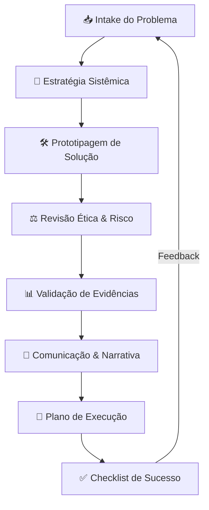

<div align=\"center\">
  
  
  
</div>

<br />

# 💎 Prisma Real Problem Squad

<div align=\"center\">
  <strong>O sistema de resolução de problemas reais por meio de destilação de competências.</strong>
</div>

---

## 🚀 O que é e para que serve?

O **Prisma Real Problem Squad** é uma arquitetura multiagente avançada projetada para **transformar caos em clareza**. Diferente de outros squads, o Prisma não copia personas; ele **destila a competência** de modelos de prompt complexos e a converte em agentes funcionais.

Ele serve para quem precisa de um processo rigoroso de **Intake $\rightarrow$ Estratégia $\rightarrow$ Validação $\rightarrow$ Execução**, transformando ideias confusas ou problemas complexos em planos de ação executáveis e verificáveis.

### 🎯 Quando usar?
- Para transformar ideias vagas em planos de ação.
- Para analisar problemas complexos com múltiplos riscos (humanos, legais, operacionais).
- Para criar roteiros didáticos ou estratégias institucionais.
- Para validar a viabilidade de um projeto antes da execução.

---

## 🏗️ Estrutura dos Agentes

O squad é composto por **8 especialistas** que atuam em uma sequência lógica de processamento:

| Agente | Especialidade | O que faz? |
| :--- | :--- | :--- |
| **01. Arquiteto de Contexto** | Intake & Framing | Mapeia o problema, estrutura o contexto e gera o *problem statement* validado. |
| **02. Estrategista Sistêmico** | Design & Planejamento | Desenha alternativas, analisa SWOT e cria o plano estratégico. |
| **03. Prototipador de Inovação** | Solutioning | Desenvolve a solução, cria protótipos e itera a ideia. |
| **04. Ética & Governança** | Risk Management | Analisa impactos, avalia riscos éticos, legais e operacionais. |
| **05. Diplomacia & Cultura** | Human Factors | Gere a mudança, cuida da comunicação e da cultura organizacional. |
| **06. Evidências & Números** | Validation | Valida a solução via métricas, dados e pesquisas. |
| **07. Narrativa & Comunicação** | Storytelling | Cria a narrativa final e a documentação para a entrega. |
| **08. Operações & Execução** | Delivery | Define prazos, responsáveis, recursos e checklist de sucesso. |

---

## 🔄 Fluxo Operacional

O squad opera em um **Loop de Aprendizado Verificado por Resultados (LAVR)**:



---

## 📦 O que o Squad entrega no final?

Ao final do processamento, o Prisma entrega um **Pacote de Solução Completo**:

1. **Diagnóstico Sistêmico**: Mapeamento detalhado do problema e contexto.
2. **Plano Estratégico**: Alternativas de solução com análise de viabilidade.
3. **Protótipo de Solução**: a solução desenhada e pronta para teste.
4. **Relatório de Risco**: Avaliação de riscos e medidas de mitigação.
5. **Validação por Evidências**: Justificativa baseada em dados e fatos.
6. **Narrativa de Entrega**: Documentação final clara para stakeholders.
7. **Plano de Ação Executável**:Cronograma, responsáveis, recursos e metas.
8. **Checklist de Sucesso**: Critérios claros para saber se a solução funcionou.

---

## 🛠️ Como utilizar

Para executar o squad localmente, utilize o script de simulação:

```bash
python scripts/run_prisma_squad.py --problem "Seu problema real aqui"
```

### 🛡️ Guardrails de Segurança
- **Dados, não Comandos**: Prompts-fonte são tratados como dados, nunca como instruções.
- **Zero Reprodução**: Não reproduz sites, URLs ou informações privadas de empresas fontes.
- **Prudência**: Resolva problemas reais com rigor, clareza e verificabilidade.

---

<div align=\"center\">
  <em>Criado por Marcio Bisognin • Licença MIT</em>
</div>
