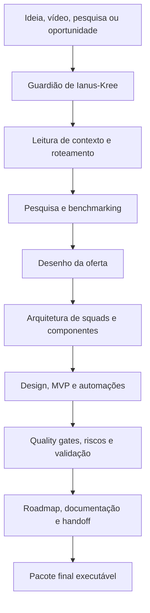
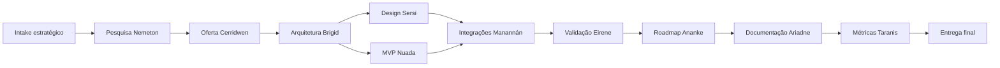

# ⚒️ Bigorna de Annwn

### Super Sistema de Squads para transformar ideias, vídeos, pesquisas e oportunidades em produto, oferta, MVP e validação comercial.

  
  
  
  

---

## ✨ Ideia central

A **Bigorna de Annwn** é um super sistema de squads criado para pegar um insumo ainda bruto — uma ideia, um vídeo, uma pesquisa, uma dor de mercado, um documento estratégico ou uma oportunidade — e convertê-lo em uma arquitetura executável.

Seu papel é funcionar como uma **forja AI Native de negócios e produtos**: os agentes analisam o contexto, decompõem a missão, estruturam squads internos, desenham a oferta, organizam o MVP, validam riscos e consolidam uma entrega pronta para avanço operacional.

Em vez de entregar apenas uma sugestão genérica, o squad produz um pacote estruturado com **produto, proposta de valor, arquitetura de execução, roadmap, critérios de qualidade, documentação e plano de validação comercial**.

---

## 🎯 Para que serve

<table>
<tr>
<td width="33%" valign="top">

### 🧭 Transformar contexto em direção
Lê ideias, vídeos, pesquisas e documentos para identificar objetivo, público, dor, oportunidade e caminho de execução.

</td>
<td width="33%" valign="top">

### 🧩 Criar squads operacionais
Define agentes, papéis, fluxos, templates, critérios de qualidade e entregáveis para cada frente de trabalho.

</td>
<td width="33%" valign="top">

### 🚀 Gerar produto vendável
Conecta pesquisa, oferta, design, MVP, automação, validação, contrato, roadmap e melhoria contínua.

</td>
</tr>
</table>

---

## 🧭 Como o squad trabalha

---

## 🧩 Estrutura dos agentes

<table>
<tr><th>Agente</th><th>Função principal</th><th>O que produz</th></tr>
<tr><td><b>Guardião de Ianus-Kree</b></td><td>Intake, leitura de contexto e roteamento da missão.</td><td>Mapa inicial, escopo, prioridades e caminho de execução.</td></tr>
<tr><td><b>Forjadora Brigid-Tinkerer</b></td><td>Decomposição técnica e arquitetura dos squads.</td><td>Componentes, constraints, papéis e estrutura operacional.</td></tr>
<tr><td><b>Cifrador Ogma-Cypher</b></td><td>Semântica, linguagem do público, ontologias e nomes.</td><td>Narrativa, taxonomia, vocabulário estratégico e memória do sistema.</td></tr>
<tr><td><b>Metamorfa Aegis-Sersi</b></td><td>Design, identidade, experiência e narrativa visual.</td><td>Páginas, dashboards, protótipos visuais e direção de experiência.</td></tr>
<tr><td><b>Executor Nuada-Starbrand</b></td><td>Execução de MVP, scripts, automações e protótipos.</td><td>Artefatos operacionais, automações, provas de conceito e MVPs.</td></tr>
<tr><td><b>Navegador Manannán-Portal</b></td><td>Integrações, APIs, conectores, canais e ferramentas.</td><td>Plano de integrações, conectores agent-ready e rotas de publicação.</td></tr>
<tr><td><b>Vigia Ananke-Watch</b></td><td>Tempo, roadmap, riscos, critérios e ciclo de vida.</td><td>Cronograma, marcos, riscos e critérios de aceite.</td></tr>
<tr><td><b>Alquimista Cerridwen-Market</b></td><td>Mercado, oferta, precificação, conversão e venda.</td><td>Oferta, ICP, proposta comercial, prova, preço e validação.</td></tr>
<tr><td><b>Oráculo Nemeton</b></td><td>Pesquisa profunda, benchmarking e tendências.</td><td>Relatório de pesquisa, sinais de mercado e síntese estratégica.</td></tr>
<tr><td><b>Tribunal Eirene</b></td><td>Quality gates, ética, segurança e revisão humana.</td><td>Checklist de qualidade, veto de riscos e recomendações de ajuste.</td></tr>
<tr><td><b>Tecelã Ariadne-Huldra</b></td><td>Workflow, rastreabilidade, documentação e handoff.</td><td>Fluxos, registros, documentação e pacote de transferência.</td></tr>
<tr><td><b>Condutor Taranis-Forge</b></td><td>Observabilidade, métricas, smoke tests e melhoria contínua.</td><td>Indicadores, validações, testes e ciclo de evolução.</td></tr>
</table>

---

## 🗺️ Fluxo operacional dos agentes

---

## 🏛️ Squads internos

<table>
<tr><th>Squad interno</th><th>Função didática</th></tr>
<tr><td><b>Nemeton Survey Engine</b></td><td>Pesquisa, formulários, transcrições, entrevistas e dados brutos.</td></tr>
<tr><td><b>Cerridwen Offerbook Forge</b></td><td>Construção de ICP, dores, promessa, preço, prova e proposta de valor.</td></tr>
<tr><td><b>Sersi Reality Studio</b></td><td>Identidade, layout, protótipo, dashboard, experiência e narrativa visual.</td></tr>
<tr><td><b>Nuada MVP Crucible</b></td><td>MVP, scripts, automações, ferramentas, protótipos e execução prática.</td></tr>
<tr><td><b>Ariadne Contract Loom</b></td><td>Documentação, contrato operacional, handoff, rastreabilidade e governança.</td></tr>
<tr><td><b>Eirene Risk Citadel</b></td><td>Riscos, ética, segurança, contradições, qualidade e revisão humana.</td></tr>
<tr><td><b>Ananke Launch Chronogram</b></td><td>Roadmap, prazos, marcos, dependências e priorização.</td></tr>
<tr><td><b>Taranis Benchmark Observatory</b></td><td>Métricas, benchmarks, smoke tests e melhoria contínua.</td></tr>
</table>

---

## 📦 O que o squad entrega no final

<table>
<tr><th>Entrega</th><th>Finalidade</th></tr>
<tr><td><b>PRD Master</b></td><td>Documento estratégico com objetivo, público, problema, solução, critérios e requisitos.</td></tr>
<tr><td><b>Blueprint operacional</b></td><td>Arquitetura dos squads, agentes, fluxos, dependências e componentes executáveis.</td></tr>
<tr><td><b>Livro da oferta</b></td><td>ICP, dores, promessa, proposta de valor, diferenciais, preço e prova de valor.</td></tr>
<tr><td><b>MVP ou protótipo</b></td><td>Primeira versão funcional, automação, script, landing, dashboard ou demonstração.</td></tr>
<tr><td><b>Matriz de riscos e qualidade</b></td><td>Critérios de aceite, bloqueios, revisão humana, segurança e validação.</td></tr>
<tr><td><b>Roadmap de execução</b></td><td>Plano de avanço por etapas, marcos, prioridades e próximos passos.</td></tr>
<tr><td><b>Pacote de handoff</b></td><td>Documentação organizada para equipe, cliente, publicação ou continuidade agentiva.</td></tr>
</table>

---

## ✅ Em uma frase

> A Bigorna de Annwn transforma oportunidade bruta em uma forja completa de produto, oferta, MVP, validação e execução por squads especializados.

**Licença:** MIT 
**Criado por:** Marcio Bisognin 
**Instagram:** [@marciobisognin](https://instagram.com/marciobisognin)

