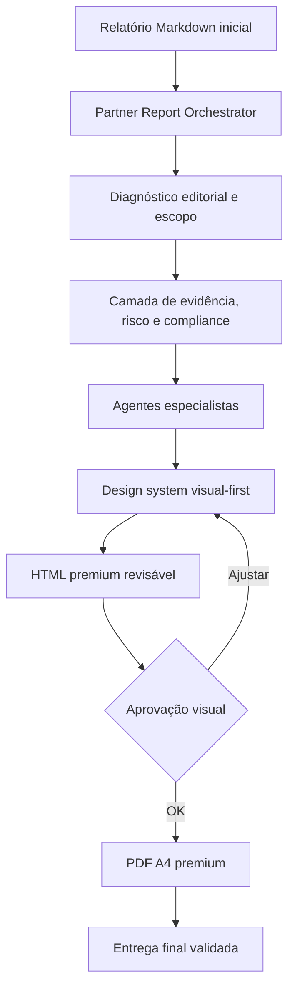
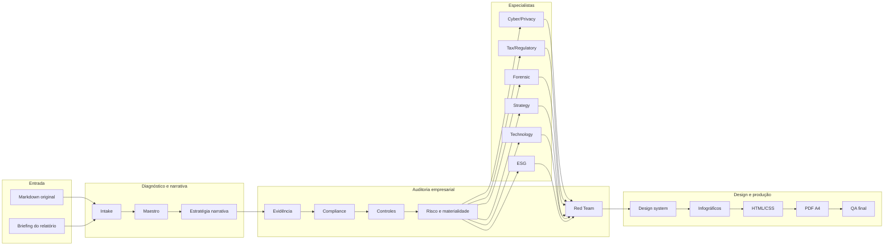

# 🧭 Atlas Visual Reports Squad v1.1.0

### Um squad para transformar relatórios densos em entregas executivas premium: HTML revisável, PDF A4, infográficos, auditoria de evidência, risco, compliance e controles.

  
  
  
  

---

## ✨ Ideia central

O **Atlas Visual Reports Squad** é um conjunto de agentes especializados para pegar um relatório pré-preenchido em Markdown, reorganizar sua narrativa e convertê-lo em uma entrega executiva de alto impacto visual.

Ele combina duas camadas:

- **Design premium visual-first:** capa, dashboard executivo, paleta, tipografia, infográficos, mapas mentais, cards, HTML responsivo e PDF A4.
- **Disciplina de auditoria empresarial:** evidência, materialidade, risco, compliance, controles internos, trilha de auditoria e revisão crítica.

O resultado é um relatório que não apenas “parece bonito”, mas também fica mais claro, rastreável, defensável e pronto para tomada de decisão.

---

## 🎯 Para que serve

<table>
<tr>
<td width="33%" valign="top">

### 📊 Relatórios executivos premium

Transforma textos longos em apresentações executivas com dashboard, KPIs, cards, destaques e hierarquia visual.

</td>
<td width="33%" valign="top">

### 🧾 Auditoria e compliance

Organiza achados por evidência, severidade, materialidade, risco, controle, owner, prazo e trilha de auditoria.

</td>
<td width="33%" valign="top">

### 🌐 HTML e PDF final

Cria primeiro um HTML revisável para aprovação visual e depois um PDF A4 premium para entrega final.

</td>
</tr>
</table>

---

## 🧭 Como o squad trabalha

---

## 🧩 Estrutura dos agentes

O squad é organizado em quatro blocos principais.

### 1. Orquestração e narrativa

<table>
<tr>
<td width="33%" valign="top"><b>Partner Report Orchestrator</b> Coordena o relatório com postura de sócio sênior: escopo, critérios, evidências, limitações e decisão executiva.</td>
<td width="33%" valign="top"><b>Maestro de Relatório Premium</b> Conduz a transformação geral do documento em uma experiência editorial premium.</td>
<td width="33%" valign="top"><b>Estratégia Narrativa</b> Organiza a tese, os blocos de leitura e a sequência lógica do relatório.</td>
</tr>
<tr>
<td width="33%" valign="top"><b>Intake e Diagnóstico</b> Interpreta o documento de entrada, identifica público, objetivo, tom e tipo de entrega.</td>
<td width="33%" valign="top"><b>Pesquisa e Benchmark Visual</b> Busca repertório de design, padrões empresariais e referências de apresentação.</td>
<td width="33%" valign="top"><b>Dados e Evidências</b> Organiza informações, fontes, achados e pontos que exigem validação.</td>
</tr>
</table>

### 2. Auditoria, risco, compliance e controles

<table>
<tr>
<td width="33%" valign="top"><b>Audit Evidence Quality Auditor</b> Verifica se cada achado tem evidência suficiente, rótulo de confiança e rastreabilidade.</td>
<td width="33%" valign="top"><b>Compliance Report Architect</b> Transforma obrigações e requisitos em scorecards, lacunas e plano de remediação.</td>
<td width="33%" valign="top"><b>Internal Controls Matrix Builder</b> Constrói matriz processo → risco → controle → evidência → status.</td>
</tr>
<tr>
<td width="33%" valign="top"><b>Risk Heatmap & Materiality Designer</b> Classifica severidade, impacto, probabilidade, tendência e materialidade visual.</td>
<td width="33%" valign="top"><b>Forensic Red Flag Reviewer</b> Procura red flags de fraude, concentração, terceiros, reputação e controles frágeis.</td>
<td width="33%" valign="top"><b>Devil’s Advocate / Red Team Reviewer</b> Aplica pre-mortem, falsificação, vieses cognitivos, conflito cruzado e black swans.</td>
</tr>
</table>

### 3. Especialistas temáticos

<table>
<tr>
<td width="25%" valign="top"><b>Cyber & Privacy Assurance Reviewer</b> Revisa riscos digitais, privacidade, LGPD/GDPR, NIST, CIS e governança de IA.</td>
<td width="25%" valign="top"><b>Tax & Regulatory Report Reviewer</b> Avalia riscos fiscais, regulatórios, obrigações e pontos que exigem parecer externo.</td>
<td width="25%" valign="top"><b>Strategy Coherence Reviewer</b> Testa se estratégia, capacidades, custos, mercado e execução estão coerentes.</td>
<td width="25%" valign="top"><b>Technology & Digital Controls Reviewer</b> Mapeia sistemas, dados, automação, integrações, source of truth e controles digitais.</td>
</tr>
<tr>
<td width="25%" valign="top"><b>ESG / Sustainability Assurance Designer</b> Organiza readiness ESG, dados não financeiros, maturidade e trilha de asseguração.</td>
<td width="25%" valign="top"><b>Tax-Regulatory</b> Aprofunda obrigações legais, fiscais e regulatórias conforme país, setor e escopo.</td>
<td width="25%" valign="top"><b>Risk-Forensic</b> Avalia risco corporativo, controles, fraude potencial, reputação e resiliência.</td>
<td width="25%" valign="top"><b>Strategist</b> Analisa posicionamento competitivo, escolhas estratégicas e vantagem defensável.</td>
</tr>
</table>

### 4. Design, HTML, PDF e QA

<table>
<tr>
<td width="25%" valign="top"><b>Paleta e Identidade Visual</b> Define cores, atmosfera visual, coerência estética e estilo premium.</td>
<td width="25%" valign="top"><b>Tipografia e Hierarquia Editorial</b> Cria ritmo de leitura, títulos, subtítulos, notas, chamadas e densidade textual.</td>
<td width="25%" valign="top"><b>Design System</b> Padroniza componentes visuais: cards, dashboards, callouts, tabelas e seções.</td>
<td width="25%" valign="top"><b>Infográficos</b> Converte conceitos e processos em fluxos, mapas mentais, diagramas e painéis.</td>
</tr>
<tr>
<td width="25%" valign="top"><b>Visualização de Dados</b> Transforma números em gráficos, scorecards, matrizes e indicadores compreensíveis.</td>
<td width="25%" valign="top"><b>UX HTML</b> Organiza navegação, legibilidade, responsividade e experiência de revisão.</td>
<td width="25%" valign="top"><b>Frontend HTML/CSS/JS</b> Constrói o HTML final com layout visual, CSS e interações leves.</td>
<td width="25%" valign="top"><b>PDF Print Engineering</b> Ajusta o HTML para impressão A4, paginação, margens e consistência do PDF.</td>
</tr>
<tr>
<td width="33%" valign="top"><b>QA Visual</b> Revisa estética, equilíbrio, contraste, responsividade e problemas de layout.</td>
<td width="33%" valign="top"><b>QA Factual e Editorial</b> Confere consistência do texto, fatos, rótulos, clareza e coerência final.</td>
<td width="33%" valign="top"><b>Empacotamento e Entrega</b> Organiza HTML, PDF, fontes, anexos e arquivos finais para distribuição.</td>
</tr>
</table>

---

## 🗺️ Fluxo operacional dos agentes

---

## 📦 O que o squad entrega no final

<table>
<tr>
<td width="50%" valign="top">

### Entregas visuais

- HTML premium revisável;
- PDF A4 final;
- capa executiva;
- dashboard de resumo;
- cards de achados;
- mapas mentais;
- fluxogramas;
- visualizações de dados;
- roadmap visual.

</td>
<td width="50%" valign="top">

### Entregas de auditoria e decisão

- mapa de evidências;
- matriz de riscos;
- heatmap de materialidade;
- scorecard de compliance;
- matriz de controles internos;
- working papers por especialidade;
- revisão Red Team;
- apêndice técnico com trilha de auditoria.

</td>
</tr>
</table>

---

## ✅ Em uma frase

> O Atlas Visual Reports Squad transforma relatórios densos em entregas executivas premium, unindo design visual-first com rigor de auditoria, compliance, risco, controles e evidência.

**Licença:** MIT 
**Criado por:** Marcio Bisognin 
**Instagram:** [@marciobisognin](https://instagram.com/marciobisognin)

