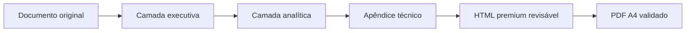
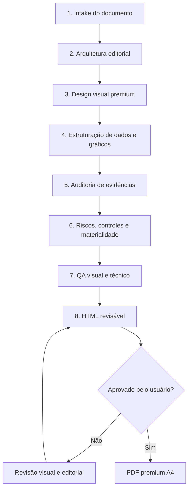
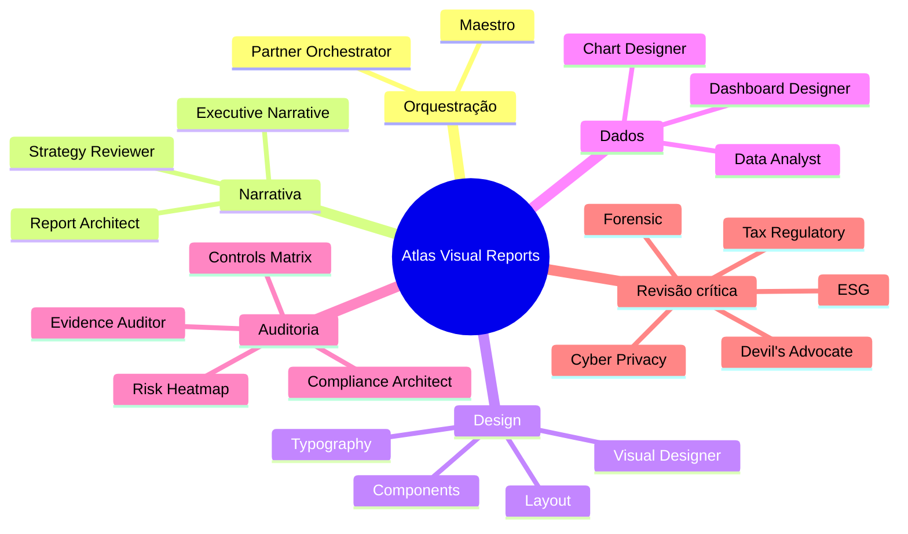
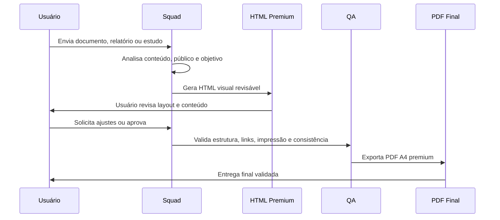

# 🧭 Atlas Visual Reports Squad v1.2.0

### Um squad para transformar documentos densos em relatórios executivos premium, visuais, auditáveis e prontos para revisão em HTML antes do PDF.

  
  
  

---

## O que é este squad

O **Atlas Visual Reports Squad v1.2.0** é uma equipe de agentes especializada em converter relatórios, diagnósticos, pareceres, planos, estudos e documentos técnicos em uma entrega visual de padrão executivo.

Ele organiza o conteúdo em três camadas:

A lógica central é simples: **primeiro o HTML para revisão visual; depois o PDF premium somente após aprovação.**

---

## Para que serve

Este squad serve para produzir relatórios de alto impacto visual para:

<table>
<tr>
<td align="center"><b>Diretoria</b> Sínteses executivas e decisões estratégicas.</td>
<td align="center"><b>Consultoria</b> Diagnósticos, planos de ação e recomendações.</td>
<td align="center"><b>Auditoria</b> Evidências, controles, materialidade e achados.</td>
</tr>
<tr>
<td align="center"><b>Compliance</b> Matrizes de risco, controles e governança.</td>
<td align="center"><b>Projetos</b> Roadmaps, gates, cronogramas e dependências.</td>
<td align="center"><b>Institucional</b> Relatórios premium para apresentação pública.</td>
</tr>
</table>

Ele é especialmente útil quando o documento original é bom em conteúdo, mas precisa ser transformado em uma apresentação visual clara, hierárquica e profissional.

---

## Como o squad trabalha

O processo é dividido em camadas sucessivas de análise, design, auditoria e finalização.

---

## Estrutura dos agentes

O squad é composto por agentes com funções complementares. Cada grupo atua sobre uma parte da entrega.

### 1. Orquestração

<b>Maestro / Partner Report Orchestrator</b> 
Coordena o fluxo, define prioridades, preserva o objetivo do relatório e garante que a entrega final tenha coerência executiva.

### 2. Arquitetura editorial e estratégia

<b>Report Architect, Executive Narrative Designer e Strategy Coherence Reviewer</b> 
Transformam o documento original em uma narrativa executiva: tese central, sumário, blocos decisórios, riscos, oportunidades, roadmap e recomendações.

### 3. Design visual premium

<b>Visual Designer, Layout Designer, Typography Specialist e Component Designer</b> 
Definem paleta, tipografia, hierarquia visual, cards, painéis, grids, tabelas, callouts e componentes reutilizáveis para leitura executiva.

### 4. Dados, gráficos e dashboards

<b>Data Analyst, Chart Designer, Dashboard Designer e Evidence Mapper</b> 
Organizam indicadores, riscos, matrizes, comparações, linhas do tempo, scorecards e visualizações orientadas à tomada de decisão.

### 5. Auditoria, compliance e controles

<b>Audit Evidence Quality Auditor, Compliance Report Architect, Internal Controls Matrix Builder e Risk Heatmap Materiality Designer</b> 
Revisam evidências, materialidade, controles, riscos, aderência, consistência e lacunas críticas do relatório.

### 6. Revisores especializados

<b>Forensic, Tax/Regulatory, Cyber/Privacy, ESG, Technology Controls e Devil’s Advocate</b> 
Aplicam revisão crítica por especialidade, procurando inconsistências, riscos ocultos, fragilidades de narrativa e pontos que exigem cautela antes da entrega final.

---

## Mapa funcional dos agentes

---

## O que cada camada produz

### Camada executiva

Entrega a visão de decisão:

- tese central;
- indicadores-chave;
- veredito ou recomendação;
- riscos críticos;
- próximos passos;
- mapa decisório.

### Camada analítica

Entrega a leitura estruturada:

- gráficos e comparações;
- matrizes de risco;
- scorecards;
- roadmap;
- gates e dependências;
- explicação das evidências.

### Apêndice técnico

Entrega a rastreabilidade:

- conteúdo-fonte preservado;
- dados e premissas;
- evidências;
- metodologia;
- notas de validação;
- base para auditoria e revisão.

---

## Fluxo de entrega

---

## O que o squad entrega no final

<table>
<tr>
<td align="center"><h3>🌐 HTML premium</h3>
Relatório visual revisável, com navegação, cards, painéis e hierarquia editorial.
</td>
<td align="center"><h3>📄 PDF A4</h3>
Versão final para envio, apresentação, arquivo institucional ou uso executivo.
</td>
</tr>
<tr>
<td align="center"><h3>📊 Componentes analíticos</h3>
KPIs, matrizes, scorecards, riscos, roadmaps e visualizações orientadas à decisão.
</td>
<td align="center"><h3>🧾 Apêndice auditável</h3>
Conteúdo técnico preservado para rastreabilidade, validação e revisão.
</td>
</tr>
</table>

---

## Resultado esperado

Ao final, o usuário recebe um relatório com aparência de entrega premium de consultoria, mas com estrutura técnica suficiente para sustentar auditoria, revisão e tomada de decisão.

O objetivo não é apenas “embelezar” um documento. O objetivo é **transformar informação densa em uma peça executiva clara, visual, confiável e pronta para decisão.**

---

<b>Licença:</b> MIT 
<b>Criado por:</b> Marcio Bisognin 
<b>Instagram:</b> @marciobisognin

