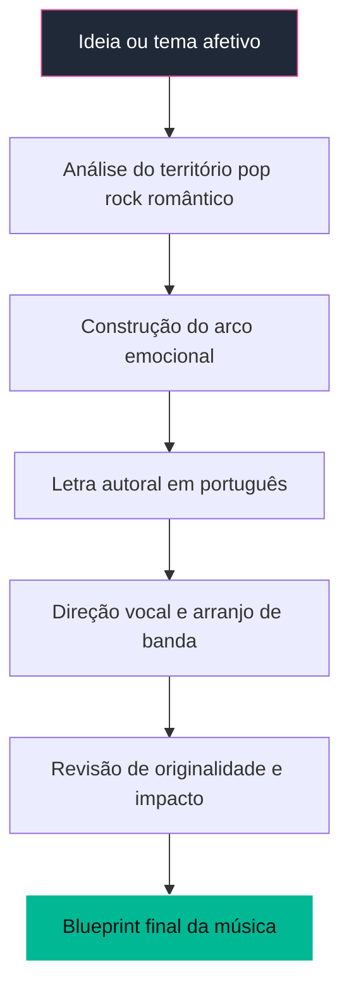
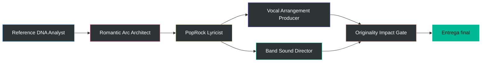
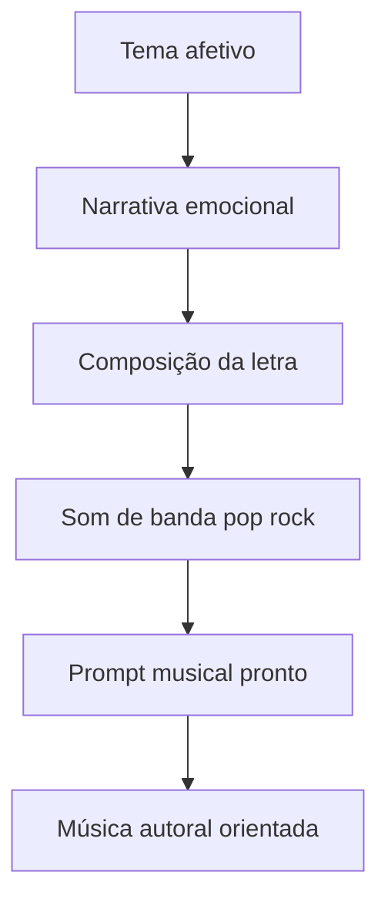

# 🌅 Aurora PopRock Ballads

### Um squad para transformar ideias afetivas em canções autorais de pop rock romântico, com letra, arranjo, voz e prompt musical prontos.

  
  
  
  

---

## ✨ Ideia central

O **Aurora PopRock Ballads** é um squad criativo especializado em criar músicas autorais em português no território do **pop rock romântico**, **rock balada** e **baladas emocionais com atmosfera anos 80/90**.

Ele foi desenhado para capturar o DNA seguro desse tipo de canção — versos íntimos, refrão amplo, voz masculina quente, piano emocional, guitarras limpas, baixo redondo, bateria lenta e pads nostálgicos — sem copiar letra, melodia, progressão reconhecível, timbre específico ou interpretação de artistas existentes.

O resultado é uma direção completa para gerar músicas com impacto emocional popular, prontas para criação em plataformas de IA musical ou para orientar compositores, produtores e arranjadores.

---

## 🎯 Para que serve

<table>
  <tr>
    <td width="33%" valign="top">
      <h3>🎼 Criar canções autorais</h3>
      
Transforma temas como amor, saudade, reencontro, família, memória e segunda chance em letras cantáveis de pop rock romântico.

    </td>
    <td width="33%" valign="top">
      <h3>🎸 Direcionar arranjos</h3>
      
Define voz, instrumentação, dinâmica, clímax, backing vocals e atmosfera sonora de rock balada emocional.

    </td>
    <td width="33%" valign="top">
      <h3>🤖 Preparar prompts musicais</h3>
      
Entrega tags e prompts estruturados para IA musical, preservando originalidade e clareza estética.

    </td>
  </tr>
</table>

---

## 🧭 Como o squad trabalha

---

## 🧩 Estrutura dos agentes

<table>
  <tr>
    <td width="50%" valign="top">
      <h3>🧬 Reference DNA Analyst</h3>
      
<strong>Função:</strong> extrai princípios gerais e seguros de referências de pop rock romântico.

      
<strong>Produz:</strong> DNA estético: atmosfera, voz, instrumentos, dinâmica e cuidados de originalidade.

    </td>
    <td width="50%" valign="top">
      <h3>💞 Romantic Arc Architect</h3>
      
<strong>Função:</strong> desenha o arco emocional da canção.

      
<strong>Produz:</strong> narrativa de verso, pré-refrão, refrão, ponte, clímax e encerramento.

    </td>
  </tr>
  <tr>
    <td width="50%" valign="top">
      <h3>✍️ PopRock Lyricist</h3>
      
<strong>Função:</strong> escreve letras em português com linguagem cantável e refrão memorável.

      
<strong>Produz:</strong> letra completa estruturada em intro, versos, pré-refrões, refrões, ponte e outro.

    </td>
    <td width="50%" valign="top">
      <h3>🎙️ Vocal Arrangement Producer</h3>
      
<strong>Função:</strong> define a interpretação vocal da música.

      
<strong>Produz:</strong> direção para voz masculina quente, backing vocals e clímax vocal final.

    </td>
  </tr>
  <tr>
    <td width="50%" valign="top">
      <h3>🎹 Band Sound Director</h3>
      
<strong>Função:</strong> constrói a paisagem instrumental de balada rock/pop.

      
<strong>Produz:</strong> arranjo com piano, guitarras limpas, baixo, bateria, pads e camadas de clímax.

    </td>
    <td width="50%" valign="top">
      <h3>🛡️ Originality Impact Gate</h3>
      
<strong>Função:</strong> valida se a música tem impacto sem risco de cópia.

      
<strong>Produz:</strong> checklist de originalidade, aderência estética e força emocional.

    </td>
  </tr>
</table>

---

## 🗺️ Fluxo operacional dos agentes

---

## 📦 O que o squad entrega no final

<table>
  <tr>
    <td valign="top"><strong>🎵 Música autoral completa</strong></td>
    <td valign="top">Letra em português com estrutura de canção: versos, pré-refrão, refrão, ponte e final.</td>
  </tr>
  <tr>
    <td valign="top"><strong>🎙️ Direção vocal</strong></td>
    <td valign="top">Orientação de voz masculina quente, intensidade interpretativa, backing vocals e clímax final.</td>
  </tr>
  <tr>
    <td valign="top"><strong>🎸 Arranjo instrumental</strong></td>
    <td valign="top">Piano/teclado emocional, guitarras limpas, baixo redondo, bateria lenta e pads nostálgicos.</td>
  </tr>
  <tr>
    <td valign="top"><strong>🤖 Prompt para IA musical</strong></td>
    <td valign="top">Prompt detalhado e tags para orientar geração musical com estética pop rock romântica.</td>
  </tr>
  <tr>
    <td valign="top"><strong>✅ Checklist de originalidade</strong></td>
    <td valign="top">Validação para evitar cópia de letra, melodia, progressão reconhecível, timbre ou interpretação específica.</td>
  </tr>
</table>

---

## 🧪 Síntese do processo

---

## ✅ Em uma frase

> **Aurora PopRock Ballads transforma emoções afetivas em canções autorais de pop rock romântico, entregando letra, voz, arranjo, tags e prompt musical com estética de balada emocional.**

**Licença:** MIT 
**Criado por:** Marcio Bisognin 
**Instagram:** <a href="https://instagram.com/marciobisognin">@marciobisognin</a>

