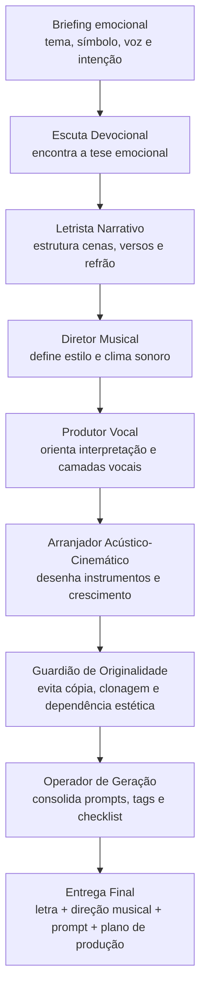
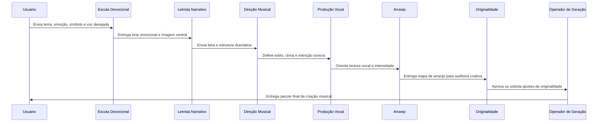
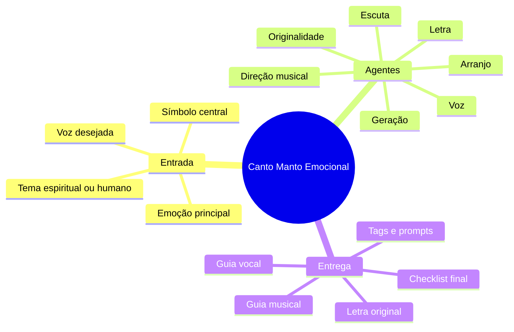

# 🎙️ Canto Manto Emocional

### Um squad para transformar temas de fé, consolo e experiência humana em músicas originais, narrativas e emocionalmente memoráveis.

  
  
  

---

## ✨ O que é este Squad

O **Canto Manto Emocional** é um squad de criação musical assistida por agentes. Ele organiza um processo completo para transformar um tema espiritual ou humano — dor, fé, maternidade, conversão, consolo, estrada, cruz, acolhimento — em uma proposta de música original.

O squad não foi criado para copiar obras existentes. Ele trabalha com **princípios de composição**: narrativa emocional, símbolo central forte, progressão dramática, direção vocal, arranjo acústico-cinemático e critérios de originalidade.

> Em vez de entregar apenas uma letra, o squad entrega uma arquitetura completa de música: intenção, letra, voz, arranjo, tags, prompt e validação criativa.

---

## 🎯 Para que serve

<table>
<tr>
<td width="33%" valign="top">

### 🕯️ Criar músicas devocionais
Transforma temas de fé, oração, consolo e testemunho em letras com narrativa clara, refrão memorável e emoção crescente.

</td>
<td width="33%" valign="top">

### 🎼 Dirigir a produção musical
Define estilo, instrumentos, clima, dinâmica, voz principal, apoio vocal e curva de intensidade da canção.

</td>
<td width="33%" valign="top">

### 🤖 Preparar geração por IA musical
Produz tags e prompts para ferramentas como HeartMuLa, Suno, Udio ou outros fluxos de composição assistida.

</td>
</tr>
</table>

---

## 🧭 Como o Squad trabalha

---

## 🧩 Estrutura dos agentes

<table>
<tr>
<td width="50%" valign="top">

### 1. Escuta Devocional
**Função:** interpreta o tema enviado e encontra a emoção central da música.
**Produz:** tese emocional, símbolo dominante e eixo espiritual/humano.

</td>
<td width="50%" valign="top">

### 2. Letrista Narrativo
**Função:** transforma a tese emocional em cenas, versos, pré-refrão, refrão e ponte.
**Produz:** letra original com narrativa progressiva e refrão de memória.

</td>
</tr>
<tr>
<td width="50%" valign="top">

### 3. Diretor Musical
**Função:** define o território sonoro da canção.
**Produz:** estilo musical, andamento, clima, referências genéricas e direção de produção.

</td>
<td width="50%" valign="top">

### 4. Produtor Vocal
**Função:** orienta como a voz deve conduzir a emoção.
**Produz:** guia de interpretação, intensidade, textura vocal e possíveis backing vocals.

</td>
</tr>
<tr>
<td width="50%" valign="top">

### 5. Arranjador Acústico-Cinemático
**Função:** desenha a evolução instrumental da música.
**Produz:** mapa de arranjo com violão, piano, pads, percussão, cordas e clímax.

</td>
<td width="50%" valign="top">

### 6. Guardião de Originalidade
**Função:** verifica riscos de cópia, clonagem de artista, melodia protegida ou reprodução indevida.
**Produz:** parecer de originalidade e ajustes de segurança criativa.

</td>
</tr>
<tr>
<td colspan="2" valign="top">

### 7. Operador de Geração
**Função:** consolida tudo em um pacote pronto para ferramentas musicais e produção humana.
**Produz:** tags HeartMuLa, prompt Suno/Udio, checklist final e plano de geração.

</td>
</tr>
</table>

---

## 🗺️ Fluxo operacional dos agentes

---

## 📦 O que o Squad entrega no final

<table>
<tr>
<td width="50%" valign="top">

### 📝 Letra original estruturada
Versos, pré-refrão, refrão, ponte e fechamento, com progressão emocional e símbolo central.

</td>
<td width="50%" valign="top">

### 🎚️ Direção musical
Estilo, atmosfera, andamento, instrumentação, curva de intensidade e intenção sonora.

</td>
</tr>
<tr>
<td width="50%" valign="top">

### 🎤 Guia vocal
Orientação de interpretação, textura da voz, entrada de backing vocals e clímax expressivo.

</td>
<td width="50%" valign="top">

### 🎛️ Prompts e tags
Tags para HeartMuLa e prompts para Suno/Udio, com linguagem segura e sem pedido de clonagem.

</td>
</tr>
<tr>
<td colspan="2" valign="top">

### ✅ Checklist de originalidade
Validação para evitar cópia literal, dependência excessiva de obra de referência, imitação vocal ou reprodução indevida de arranjos protegidos.

</td>
</tr>
</table>

---

## 🧠 Visão didática do resultado

---

## ✅ Em uma frase

> **O Canto Manto Emocional transforma uma intenção espiritual em um pacote completo de criação musical original: letra, voz, arranjo, prompts e validação de originalidade.**

**Licença:** MIT
**Criado por:** Marcio Bisognin
**Instagram:** [@marciobisognin](https://instagram.com/marciobisognin)

