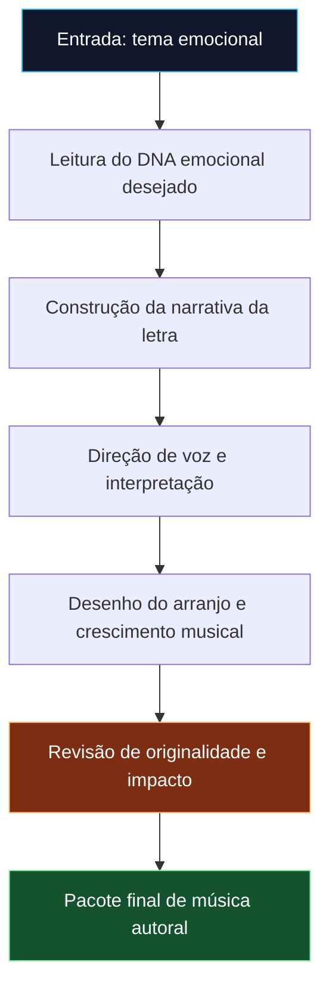
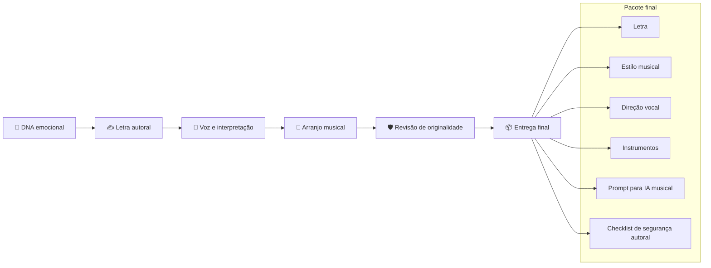

<div align="center">

# 🎼 Canto Memória Viva

### Um squad musical para transformar emoção, memória e recomeço em canções originais prontas para IA musical.

<p>
  
  
  
  
</p>

</div>

---

## ✨ Ideia central

O **Canto Memória Viva** é um squad de criação musical autoral. Ele organiza agentes especializados para transformar uma intenção emocional — perda, saudade, fé, recomeço, gratidão ou superação — em um pacote completo de canção.

A proposta não é copiar músicas existentes. O squad trabalha com **DNA emocional abstrato**: identifica clima, arco narrativo, intensidade vocal e dinâmica instrumental para gerar uma obra nova, com letra própria, direção de voz, arranjo e prompt final para ferramentas de IA musical.

> Em vez de pedir apenas “faça uma música triste”, o squad estrutura a emoção em narrativa, refrão, voz, instrumentos, crescimento dramático e verificação de originalidade.

---

## 🎯 Para que serve

<table>
  <tr>
    <td width="33%" valign="top">
      <h3>🎙️ Compor letras emocionais</h3>
      <p>Cria letras em português com arco narrativo claro: início íntimo, tensão emocional, refrão forte e fechamento memorável.</p>
    </td>
    <td width="33%" valign="top">
      <h3>🎧 Gerar prompts musicais</h3>
      <p>Entrega instruções prontas para IA musical, com estilo, voz, instrumentos, andamento, dinâmica e atmosfera.</p>
    </td>
    <td width="33%" valign="top">
      <h3>🛡️ Proteger originalidade</h3>
      <p>Inclui uma etapa específica para evitar cópia de letras, melodias, artistas, arranjos ou assinaturas reconhecíveis.</p>
    </td>
  </tr>
</table>

---

## 🧭 Como o squad trabalha



---

## 🧩 Estrutura dos agentes

<table>
  <tr>
    <td width="20%" valign="top">
      <h3>🧬 Emotional DNA Analyst</h3>
      <p><strong>Função:</strong> interpreta o clima emocional desejado.</p>
      <p><strong>Produz:</strong> mapa de emoção, tensão, catarse e sensação final.</p>
    </td>
    <td width="20%" valign="top">
      <h3>✍️ Lyric Arc Composer</h3>
      <p><strong>Função:</strong> transforma emoção em letra cantável.</p>
      <p><strong>Produz:</strong> versos, pré-refrão, refrão, ponte e fechamento.</p>
    </td>
    <td width="20%" valign="top">
      <h3>🎤 Vocal Performance Director</h3>
      <p><strong>Função:</strong> define como a voz deve interpretar a música.</p>
      <p><strong>Produz:</strong> timbre, intensidade, dinâmica, respiração e clímax vocal.</p>
    </td>
    <td width="20%" valign="top">
      <h3>🎹 Arrangement Impact Producer</h3>
      <p><strong>Função:</strong> desenha o crescimento instrumental.</p>
      <p><strong>Produz:</strong> piano, guitarras, bateria, baixo, ambiência e viradas emocionais.</p>
    </td>
    <td width="20%" valign="top">
      <h3>🛡️ Originality Safety Gate</h3>
      <p><strong>Função:</strong> revisa riscos de imitação indevida.</p>
      <p><strong>Produz:</strong> checklist de originalidade e prompt final seguro.</p>
    </td>
  </tr>
</table>

---

## 🗺️ Fluxo operacional dos agentes



---

## 📦 O que o squad entrega no final

<table>
  <tr>
    <td width="50%" valign="top">
      <h3>🎼 Pacote criativo da canção</h3>
      <ul>
        <li>conceito emocional da música;</li>
        <li>letra original em português;</li>
        <li>estrutura de partes: verso, pré-refrão, refrão, ponte e final;</li>
        <li>gancho central para memorização.</li>
      </ul>
    </td>
    <td width="50%" valign="top">
      <h3>🎛️ Direção para produção musical</h3>
      <ul>
        <li>estilo e atmosfera musical;</li>
        <li>orientação de voz e interpretação;</li>
        <li>instrumentação e dinâmica;</li>
        <li>prompt final para IA musical;</li>
        <li>checklist de originalidade.</li>
      </ul>
    </td>
  </tr>
</table>

---

## ✅ Em uma frase

> O **Canto Memória Viva** transforma uma intenção emocional em uma canção autoral completa, pronta para ser produzida por IA musical com impacto, clareza e segurança criativa.

<div align="center">

**Licença:** MIT<br>
**Criado por:** Marcio Bisognin<br>
**Instagram:** <a href="https://instagram.com/marciobisognin">@marciobisognin</a>

</div>

---

## 🤝 Como usar nos principais LLMs de codificação

> [!NOTE]
> **O padrão de ativação é o mesmo em qualquer ferramenta:**
> 1. **Dê contexto** ao assistente apontando os arquivos do squad (especialmente `squads/canto-memoria-viva/squad.yaml` e `squads/canto-memoria-viva/workflows/create-emotional-ballad.yaml`).
> 2. **Peça que ele assuma a persona do orquestrador** (veja os agentes em `squads/canto-memoria-viva/agents/`).
> 3. **Conduza o fluxo** respeitando os checkpoints humanos e validando cada handoff/contrato.
>
> **Prompt de ativação** (copie, cole e ajuste o briefing):
> ```text
> Assuma a persona do orquestrador do squad (veja os agentes em `squads/canto-memoria-viva/agents/`)
> e conduza o fluxo definido em `squads/canto-memoria-viva/`. Siga `squads/canto-memoria-viva/workflows/create-emotional-ballad.yaml`.
> Valide cada handoff/contrato e respeite os checkpoints humanos.
> Meu briefing é: <descreva seu objetivo, materiais e formato de saída>.
> ```

<details open>
<summary><b>🟣 Claude Code (CLI / Web / IDE) — recomendado</b></summary>

<br>

```bash
# No terminal, dentro do repositório
claude

> Leia @squads/canto-memoria-viva/squad.yaml e assuma a persona do orquestrador do squad.
  Siga @squads/canto-memoria-viva/workflows/create-emotional-ballad.yaml. Conduza o fluxo para o briefing: <...>
```
- Use **`@caminho/arquivo`** para dar contexto preciso (autocompleta no prompt).
- Disponível em **CLI, app desktop/web (claude.ai/code) e extensões VS Code / JetBrains**.

</details>

<details>
<summary><b>🟦 Cursor</b></summary>

<br>

1. Abra a pasta do repositório no Cursor.
2. No **Chat / Composer (⌘/Ctrl + I)**, referencie os arquivos com `@`:
   ```text
   @squads/canto-memoria-viva/squad.yaml @squads/canto-memoria-viva/workflows/create-emotional-ballad.yaml
   Assuma a persona do orquestrador e conduza o fluxo para o briefing: <...>
   ```
3. **Persistente:** crie um `.cursorrules` na raiz apontando para `squads/canto-memoria-viva/` como squad ativo.

</details>

<details>
<summary><b>⬛ GitHub Copilot (VS Code Chat)</b></summary>

<br>

```text
@workspace #file:squads/canto-memoria-viva/squad.yaml #file:squads/canto-memoria-viva/workflows/create-emotional-ballad.yaml
Assuma a persona do orquestrador deste squad e conduza o fluxo para: <...>
```
Para regras persistentes, crie **`.github/copilot-instructions.md`** com o prompt de ativação.

</details>

<details>
<summary><b>🟩 Windsurf (Cascade)</b></summary>

<br>

```text
@squads/canto-memoria-viva/squad.yaml @squads/canto-memoria-viva/workflows/create-emotional-ballad.yaml
Atue como o orquestrador deste squad e execute o fluxo para: <briefing>.
```
Fixe as regras em **`.windsurfrules`** (raiz do projeto).

</details>

<details>
<summary><b>🟧 Cline / Roo Code (VS Code)</b></summary>

<br>

```text
Leia squads/canto-memoria-viva/squad.yaml e assuma a persona do orquestrador.
Conduza o fluxo do squad e execute os scripts em squads/canto-memoria-viva/scripts/ quando o passo pedir.
Briefing: <...>
```
O Cline/Roo pode **executar os scripts** do squad e ler a saída — aprove a execução quando solicitado.

</details>

<details>
<summary><b>🟨 Continue.dev / Aider / Zed AI / chats web</b></summary>

<br>

- **Continue.dev:** use `@file` para `squads/canto-memoria-viva/squad.yaml`; cole o prompt de ativação.
- **Aider:** `aider squads/canto-memoria-viva/squad.yaml` e instrua o orquestrador.
- **ChatGPT / Gemini (sem acesso a arquivos):** copie o conteúdo de `squads/canto-memoria-viva/squad.yaml` e `squads/canto-memoria-viva/workflows/create-emotional-ballad.yaml` para o chat, cole o prompt de ativação e rode eventuais scripts localmente, colando a saída de volta.

</details>


---

Licença: MIT. Criado por Marcio Bisognin. Instagram: @marciobisognin.
