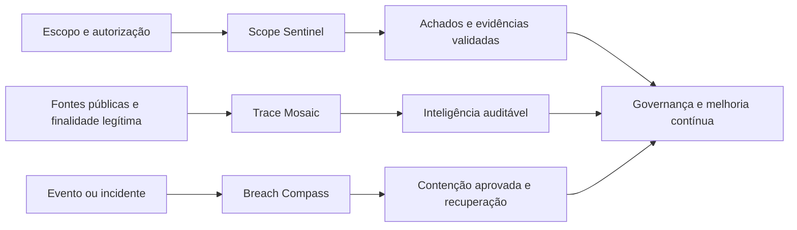

# Cibersegurança

### Trilha integrada de operações autorizadas, OSINT ético e resposta defensiva

## Visão geral

Esta categoria reúne três squads complementares para o ciclo defensivo de cibersegurança. A arquitetura separa avaliação autorizada, inteligência de fontes públicas e resposta a incidentes, mantendo autorização, proporcionalidade, privacidade, evidência e aprovação humana como controles obrigatórios.

> [!IMPORTANT]
> Os roteadores locais catalogam capacidades e retornam `GATED_HANDOFF`, `PLAN_ONLY` ou `DENY`. Eles não executam exploits, payloads, malware, captura de credenciais, persistência, exfiltração ou negação de serviço.

## Squads da categoria

| Squad | Especialidade | Agentes | Entregas centrais |
|---|---|---:|---|
| [Scope Sentinel](scope-sentinel/README.md) | Pentest autorizado e garantia de superfície de ataque | 8 | Evidências sanitizadas, achados, remediação e reteste |
| [Trace Mosaic](trace-mosaic/README.md) | OSINT ético, proveniência, correlação e privacidade | 8 | Registros normalizados, grafo, matriz de evidências e relatório |
| [Breach Compass](breach-compass/README.md) | Resposta a incidentes, hunting e recuperação | 10 | Triagem, timeline, IOCs, contenção e relatório de incidente |

## Arquitetura integrada

## Controles permanentes

- uso apenas autorizado, defensivo, lícito ou em laboratório;
- nenhuma autorização é inferida a partir de uma URL, trilha ou write-up;
- mudanças de estado e contenções exigem aprovação humana;
- dados pessoais são minimizados e a proveniência é preservada;
- técnicas de maior risco permanecem `PLAN_ONLY` ou dependem de ambiente isolado e ROE exato;
- resultados automatizados são tratados como pistas até validação por evidência.

## Validação desta versão

- **Scope Sentinel:** 3 testes automatizados;
- **Trace Mosaic:** 4 testes automatizados;
- **Breach Compass:** 3 testes automatizados;
- **Total:** 10 testes executados nesta publicação, além de compilação Python, validação estrutural e varredura de segredos.

## Licença

MIT. Criado por Marcio Bisognin. Instagram: [@marciobisognin](https://www.instagram.com/marciobisognin/).
