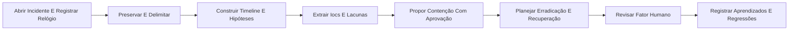

<div align="center">

# Breach Compass

### Resposta a incidentes, threat hunting e defesa humana


</div>

> **Navegação:** [Categoria Cibersegurança](../README.md) · [PRD](PRD.md) · [Limites operacionais](docs/operational-boundaries.md) · [Manifesto](squad.yaml)

## O que é

Breach Compass é um squad multiagente que guia triagem, preservação, contenção aprovada, investigação, recuperação e aprendizagem sem executar malware ou alterar produção automaticamente.

## Para quem é

Destinado a SOC, infraestrutura, administradores, resposta a incidentes, gestores, DPO e equipes de conscientização.

## Objetivo

Guiar triagem, preservação, contenção aprovada, investigação, recuperação e aprendizagem sem executar malware ou alterar produção automaticamente.

## Agentes

| Agente | Função |
|---|---|
| **Comandante de Incidente** | Define prioridade, coordena decisões, aprova escalonamentos e comunicação. |
| **Custódio de Evidência** | Preserva origem, tempo, hash, cadeia de custódia e redação. |
| **Caçador de Detecção** | Constrói hipóteses, timelines, queries e lacunas de telemetria. |
| **Especialista em Malware Estático** | Faz triagem estática e só propõe dinâmica em laboratório isolado. |
| **Planejador de Contenção** | Propõe ações reversíveis, impacto, aprovação e rollback. |
| **Coordenador de Recuperação** | Define erradicação, restauração, validação e monitoramento. |
| **Defensor de Risco Humano** | Converte vetores sociais em verificação, tabletop e treinamento consentido. |
| **Revisor de Aprendizados** | Produz causa raiz, controles, backlog e testes de regressão. |
| **Analista de Engenharia Reversa** | Estrutura análise estática e encaminha dinâmica apenas para laboratório isolado. |
| **Mapeador de Detecções** | Converte comportamentos observados em hipóteses de detecção e cobertura defensiva. |

## Fluxo



## Entradas
- incident.json
- events.json ou logs sintéticos/sanitizados
- hashes/IOCs e contexto de negócio

## Entregas
- triage.json
- timeline.csv
- iocs.json
- incident_report.md
- containment_plan.md

## Uso rápido

```bash
python scripts/breachcompass.py --help
python scripts/breachcompass.py validate --path .
```

## Limites éticos

- Uso apenas autorizado, defensivo, lícito ou em laboratório.
- Sem força bruta, captura de credenciais, phishing real, malware, persistência, exfiltração ou DoS.
- Mudanças de estado e contenções exigem aprovação humana.
- Scanner/IA gera leads; evidência validada sustenta conclusões.

## Estilo visual do README

Preset `dark-neon-layered-architecture`, adequado a operação, tecnologia e governança.

## Licença

MIT. Criado por Marcio Bisognin. Instagram: @marciobisognin.

## Integração da trilha de cibersegurança — v2

Este squad incorpora a trilha fornecida por Marcio como um sistema auditável de aprendizagem e operação. Contém 27 recursos/ferramentas e 6 técnicas do seu domínio. O roteador local apenas cataloga, audita disponibilidade e decide `GATED_HANDOFF`, `PLAN_ONLY` ou `DENY`; ele não lança scanners, exploits, payloads ou malware.

```bash
python scripts/capability_router.py catalog
python scripts/capability_router.py audit
python scripts/capability_router.py route --technique malware-dynamic-analysis --context isolated-external-lab --band 3
```
