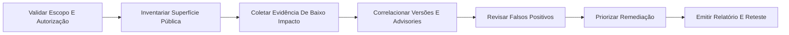

<div align="center">

# Scope Sentinel

### Pentest autorizado e garantia de superfície de ataque


</div>

> **Navegação:** [Categoria Cibersegurança](../README.md) · [PRD](PRD.md) · [Limites operacionais](docs/operational-boundaries.md) · [Manifesto](squad.yaml)

## O que é

Scope Sentinel é um squad multiagente que transforma escopo autorizado em coleta de baixo impacto, achados validados, priorização e reteste sem exploração destrutiva.

## Para quem é

Destinado a proprietários de sites, equipes de infraestrutura, DevSecOps, consultores de segurança e gestores de risco.

## Objetivo

Transformar escopo autorizado em coleta de baixo impacto, achados validados, priorização e reteste sem exploração destrutiva.

## Agentes

| Agente | Função |
|---|---|
| **Governador de Engajamento** | Valida autorização, escopo, bandas, exclusões e critérios de parada. |
| **Cartógrafo de Superfície** | Mapeia DNS, CT, hosts, URLs, tecnologias, terceiros e origens. |
| **Avaliador Web e Rede** | Executa e interpreta checagens públicas de baixo impacto. |
| **Analista de Advisories** | Correlaciona versões exatas, faixas afetadas e pré-requisitos. |
| **Revisor de Evidências** | Elimina soft-404, scanner noise, edge/origin confusion e falsas severidades. |
| **Arquiteto de Remediação** | Converte achados em ações priorizadas e critérios de reteste. |
| **Metodologista de Laboratório** | Desenha progressão, ambientes seguros, gates de competência e evidências. |
| **Analista de Caminhos Empresariais** | Mapeia técnicas de laboratório para controles e detecções defensivas. |

## Fluxo



## Entradas
- engagement.json com autorização e ativos
- evidências públicas ou resultados de ferramentas
- limites de taxa, tempo e exclusões

## Entregas
- evidence.json sanitizado
- findings.json/CSV
- relatório Markdown
- plano de remediação e reteste

## Uso rápido

```bash
python scripts/scopesentinel.py --help
python scripts/scopesentinel.py validate --path .
```

## Limites éticos

- Uso apenas autorizado, defensivo, lícito ou em laboratório.
- Sem força bruta, captura de credenciais, phishing real, malware, persistência, exfiltração ou DoS.
- Mudanças de estado e contenções exigem aprovação humana.
- Scanner/IA gera leads; evidência validada sustenta conclusões.

## Estilo visual do README

Preset `dark-neon-layered-architecture`, adequado a operação, tecnologia e governança.

## Licença

MIT. Criado por Marcio Bisognin. Instagram: @marciobisognin.

## Integração da trilha de cibersegurança — v2

Este squad incorpora a trilha fornecida por Marcio como um sistema auditável de aprendizagem e operação. Contém 53 recursos/ferramentas e 14 técnicas do seu domínio. O roteador local apenas cataloga, audita disponibilidade e decide `GATED_HANDOFF`, `PLAN_ONLY` ou `DENY`; ele não lança scanners, exploits, payloads ou malware.

```bash
python scripts/capability_router.py catalog
python scripts/capability_router.py audit
python scripts/capability_router.py route --technique controlled-exploit-validation --context lab --band 3
```
