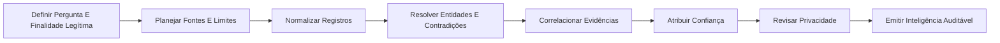

<div align="center">

# Trace Mosaic

### OSINT ético com proveniência e correlação auditável


</div>

> **Navegação:** [Categoria Cibersegurança](../README.md) · [PRD](PRD.md) · [Limites operacionais](docs/operational-boundaries.md) · [Manifesto](squad.yaml)

## O que é

Trace Mosaic é um squad multiagente que converte fontes públicas em inteligência verificável, proporcional e transparente, preservando proveniência, confiança, contradições e privacidade.

## Para quem é

Destinado a analistas de inteligência, due diligence, fraude, cyber threat intelligence, jornalismo investigativo e autoauditoria organizacional.

## Objetivo

Converter fontes públicas em inteligência verificável, proporcional e transparente, preservando proveniência, confiança, contradições e privacidade.

## Agentes

| Agente | Função |
|---|---|
| **Planejador de Coleta** | Define pergunta de inteligência, fontes, dados proibidos e limites. |
| **Bibliotecário de Fontes** | Registra URL, timestamp, tipo, autoria, arquivo e proveniência. |
| **Resolvedor de Entidades** | Normaliza entidades sem fundir homônimos automaticamente. |
| **Analista de Correlação** | Conecta evidências, cronologias e indicadores com hipóteses alternativas. |
| **Analista de Confiança** | Avalia qualidade, independência, atualidade e contradições. |
| **Revisor de Privacidade** | Minimiza PII e bloqueia doxxing, stalking, impersonação e uso indevido. |
| **Redator de Inteligência** | Produz BLUF, matriz de evidência, grafo e próximos passos lícitos. |
| **Governador de Ferramentas OSINT** | Classifica fontes, ambientes e técnicas por finalidade, risco e autorização. |

## Fluxo



## Entradas
- case.json com objetivo legítimo
- records.json com fontes públicas
- política de retenção e dados proibidos

## Entregas
- normalized_records.json
- entity_graph.json
- evidence_matrix.csv
- intelligence_report.md

## Uso rápido

```bash
python scripts/tracemosaic.py --help
python scripts/tracemosaic.py validate --path .
```

## Limites éticos

- Uso apenas autorizado, defensivo, lícito ou em laboratório.
- Sem força bruta, captura de credenciais, phishing real, malware, persistência, exfiltração ou DoS.
- Mudanças de estado e contenções exigem aprovação humana.
- Scanner/IA gera leads; evidência validada sustenta conclusões.

## Estilo visual do README

Preset `dark-neon-layered-architecture`, adequado a operação, tecnologia e governança.

## Licença

MIT. Criado por Marcio Bisognin. Instagram: @marciobisognin.

## Integração da trilha de cibersegurança — v2

Este squad incorpora a trilha fornecida por Marcio como um sistema auditável de aprendizagem e operação. Contém 19 recursos/ferramentas e 5 técnicas do seu domínio. O roteador local apenas cataloga, audita disponibilidade e decide `GATED_HANDOFF`, `PLAN_ONLY` ou `DENY`; ele não lança scanners, exploits, payloads ou malware.

```bash
python scripts/capability_router.py catalog
python scripts/capability_router.py audit
python scripts/capability_router.py route --technique osint-source-planning --context public --band 0
```
