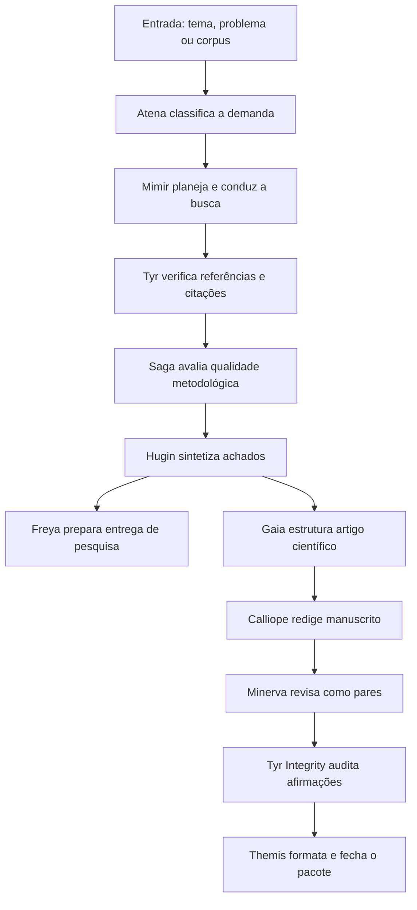
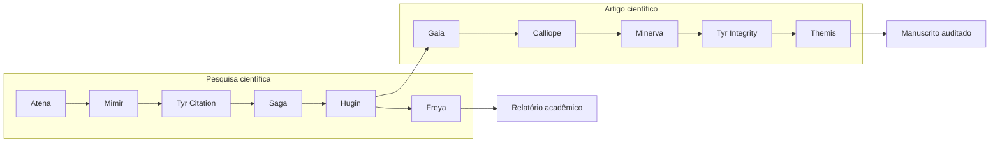

<div align="center">

# 🧠🔬 Maeve Atena Mimir

### Um squad de pesquisa científica que transforma perguntas complexas em evidências verificadas, sínteses críticas e artigos acadêmicos auditáveis.

<p>
  
  
  
  
</p>

</div>

---

## ✨ Ideia central

O **Maeve Atena Mimir** é um squad acadêmico multiagente para conduzir pesquisa científica com rigor metodológico, rastreabilidade de fontes e controle de integridade. Ele foi desenhado para apoiar revisões bibliográficas, relatórios técnicos, sínteses críticas e construção de artigos científicos em linguagem formal-técnica.

O squad organiza o trabalho em etapas: primeiro delimita a pergunta, depois planeja a busca, coleta evidências, verifica citações, avalia método, sintetiza achados, redige o material e realiza auditoria final. A proposta é evitar conclusões frágeis, referências inventadas e textos acadêmicos sem lastro verificável.

---

## 🎯 Para que serve

<table>
  <tr>
    <td width="33%" valign="top">
      <h3>📚 Revisão bibliográfica</h3>
      <p>Planeja buscas, organiza fontes, separa evidências fortes de lacunas e monta uma matriz verificável.</p>
    </td>
    <td width="33%" valign="top">
      <h3>🧾 Relatórios acadêmicos</h3>
      <p>Transforma pesquisa em síntese crítica, relatório técnico, agenda de lacunas e recomendações fundamentadas.</p>
    </td>
    <td width="33%" valign="top">
      <h3>📝 Artigos científicos</h3>
      <p>Estrutura manuscritos IMRaD ou equivalentes, simula revisão por pares e audita integridade antes da entrega.</p>
    </td>
  </tr>
</table>

---

## 🧭 Como o squad trabalha



---

## 🧩 Estrutura dos agentes

### Núcleo de pesquisa científica

<table>
  <tr>
    <td width="50%" valign="top">
      <h3>🦉 Atena Orchestrator</h3>
      <p><strong>Função:</strong> coordena o pipeline, classifica a demanda e impede conclusão prematura.</p>
      <p><strong>Produz:</strong> escopo, rota de trabalho, gates de qualidade e reflexão pós-tarefa.</p>
    </td>
    <td width="50%" valign="top">
      <h3>🧠 Mimir Literature Scout</h3>
      <p><strong>Função:</strong> desenha estratégias de busca e organiza a descoberta bibliográfica.</p>
      <p><strong>Produz:</strong> strings de busca, matriz de evidências e seleção inicial de fontes.</p>
    </td>
  </tr>
  <tr>
    <td width="50%" valign="top">
      <h3>🛡️ Tyr Citation Gatekeeper</h3>
      <p><strong>Função:</strong> bloqueia alucinações bibliográficas e referências não rastreáveis.</p>
      <p><strong>Produz:</strong> referências verificadas, alertas de risco e marcações de incerteza.</p>
    </td>
    <td width="50%" valign="top">
      <h3>⚖️ Saga Method Reviewer</h3>
      <p><strong>Função:</strong> avalia desenho metodológico, critérios de inclusão e qualidade da evidência.</p>
      <p><strong>Produz:</strong> revisão metodológica, limites e recomendações de robustez.</p>
    </td>
  </tr>
  <tr>
    <td width="50%" valign="top">
      <h3>📝 Hugin Synthesis Writer</h3>
      <p><strong>Função:</strong> transforma evidências verificadas em síntese crítica coerente.</p>
      <p><strong>Produz:</strong> relatório de pesquisa, achados, lacunas e agenda futura.</p>
    </td>
    <td width="50%" valign="top">
      <h3>🎨 Freya Delivery Editor</h3>
      <p><strong>Função:</strong> edita a entrega final para clareza, densidade e apresentação acadêmica.</p>
      <p><strong>Produz:</strong> pacote final de pesquisa em português técnico.</p>
    </td>
  </tr>
</table>

### Núcleo de artigo científico

<table>
  <tr>
    <td width="50%" valign="top">
      <h3>🏛️ Gaia Article Architect</h3>
      <p><strong>Função:</strong> transforma a pesquisa em arquitetura de artigo, objetivos e contribuição.</p>
      <p><strong>Produz:</strong> plano IMRaD, passaporte do material e mapa argumentativo.</p>
    </td>
    <td width="50%" valign="top">
      <h3>✍️ Calliope Academic Writer</h3>
      <p><strong>Função:</strong> redige seções acadêmicas em estilo formal-técnico, com rastreabilidade.</p>
      <p><strong>Produz:</strong> manuscrito, marcações de lacunas e versão estruturada do artigo.</p>
    </td>
  </tr>
  <tr>
    <td width="50%" valign="top">
      <h3>🔍 Minerva Peer Reviewer</h3>
      <p><strong>Função:</strong> simula revisão por pares e identifica fragilidades antes da entrega.</p>
      <p><strong>Produz:</strong> parecer crítico e matriz de resposta aos revisores.</p>
    </td>
    <td width="50%" valign="top">
      <h3>🧬 Tyr Integrity Auditor</h3>
      <p><strong>Função:</strong> cruza afirmações, evidências e referências para impedir extrapolações.</p>
      <p><strong>Produz:</strong> auditoria de integridade, alertas e decisão de liberação.</p>
    </td>
  </tr>
  <tr>
    <td colspan="2" valign="top">
      <h3>📐 Themis Format & Disclosure Editor</h3>
      <p><strong>Função:</strong> prepara a versão final, formatação, transparência e pacote de entrega.</p>
      <p><strong>Produz:</strong> artigo final, declaração de uso de IA quando aplicável e manifest de entrega.</p>
    </td>
  </tr>
</table>

---

## 🗺️ Fluxo operacional dos agentes



---

## 📦 O que o squad entrega no final

<table>
  <tr>
    <td width="50%" valign="top">
      <h3>🔬 Entregas de pesquisa</h3>
      <ul>
        <li><code>metodologia_busca.md</code> — estratégia de busca documentada.</li>
        <li><code>matriz_evidencias.csv</code> — evidências, fontes, status e observações.</li>
        <li><code>referencias_verificadas.md</code> — referências rastreadas e classificadas.</li>
        <li><code>relatorio_pesquisa.md</code> — síntese crítica em português técnico.</li>
        <li><code>lacunas_e_agenda.md</code> — limites, lacunas e agenda de investigação.</li>
      </ul>
    </td>
    <td width="50%" valign="top">
      <h3>📝 Entregas de artigo</h3>
      <ul>
        <li><code>artigo_imrad.md</code> — manuscrito estruturado.</li>
        <li><code>parecer_revisao_pares.md</code> — revisão por pares simulada.</li>
        <li><code>resposta_revisores.md</code> — matriz de resposta crítica.</li>
        <li><code>auditoria_integridade.md</code> — auditoria de afirmações e referências.</li>
        <li><code>passaporte_material.yaml</code> — rastreabilidade do corpus, decisões e limites.</li>
      </ul>
    </td>
  </tr>
</table>

---

## ✅ Em uma frase

> O Maeve Atena Mimir é um squad para transformar pesquisa acadêmica em entregas verificáveis, metodologicamente controladas e prontas para relatório ou artigo científico.

---

<div align="center">

**Licença:** MIT<br>
**Criado por:** Marcio Bisognin<br>
**Instagram:** <a href="https://instagram.com/marciobisognin">@marciobisognin</a>

</div>

---

## 🤝 Como usar nos principais LLMs de codificação

> [!NOTE]
> **O padrão de ativação é o mesmo em qualquer ferramenta:**
> 1. **Dê contexto** ao assistente apontando os arquivos do squad (especialmente `squads/maeve-atena-mimir-scienceclaw-research/squad.yaml`).
> 2. **Peça que ele assuma a persona do orquestrador** (veja os agentes em `squads/maeve-atena-mimir-scienceclaw-research/agents/`).
> 3. **Conduza o fluxo** respeitando os checkpoints humanos e validando cada handoff/contrato.
>
> **Prompt de ativação** (copie, cole e ajuste o briefing):
> ```text
> Assuma a persona do orquestrador do squad (veja os agentes em `squads/maeve-atena-mimir-scienceclaw-research/agents/`)
> e conduza o fluxo definido em `squads/maeve-atena-mimir-scienceclaw-research/`.
> Valide cada handoff/contrato e respeite os checkpoints humanos.
> Meu briefing é: <descreva seu objetivo, materiais e formato de saída>.
> ```

<details open>
<summary><b>🟣 Claude Code (CLI / Web / IDE) — recomendado</b></summary>

<br>

```bash
# No terminal, dentro do repositório
claude

> Leia @squads/maeve-atena-mimir-scienceclaw-research/squad.yaml e assuma a persona do orquestrador do squad.
  Conduza o fluxo para o briefing: <...>
```
- Use **`@caminho/arquivo`** para dar contexto preciso (autocompleta no prompt).
- Disponível em **CLI, app desktop/web (claude.ai/code) e extensões VS Code / JetBrains**.

</details>

<details>
<summary><b>🟦 Cursor</b></summary>

<br>

1. Abra a pasta do repositório no Cursor.
2. No **Chat / Composer (⌘/Ctrl + I)**, referencie os arquivos com `@`:
   ```text
   @squads/maeve-atena-mimir-scienceclaw-research/squad.yaml
   Assuma a persona do orquestrador e conduza o fluxo para o briefing: <...>
   ```
3. **Persistente:** crie um `.cursorrules` na raiz apontando para `squads/maeve-atena-mimir-scienceclaw-research/` como squad ativo.

</details>

<details>
<summary><b>⬛ GitHub Copilot (VS Code Chat)</b></summary>

<br>

```text
@workspace #file:squads/maeve-atena-mimir-scienceclaw-research/squad.yaml
Assuma a persona do orquestrador deste squad e conduza o fluxo para: <...>
```
Para regras persistentes, crie **`.github/copilot-instructions.md`** com o prompt de ativação.

</details>

<details>
<summary><b>🟩 Windsurf (Cascade)</b></summary>

<br>

```text
@squads/maeve-atena-mimir-scienceclaw-research/squad.yaml
Atue como o orquestrador deste squad e execute o fluxo para: <briefing>.
```
Fixe as regras em **`.windsurfrules`** (raiz do projeto).

</details>

<details>
<summary><b>🟧 Cline / Roo Code (VS Code)</b></summary>

<br>

```text
Leia squads/maeve-atena-mimir-scienceclaw-research/squad.yaml e assuma a persona do orquestrador.
Conduza o fluxo do squad e execute os scripts em squads/maeve-atena-mimir-scienceclaw-research/scripts/ quando o passo pedir.
Briefing: <...>
```
O Cline/Roo pode **executar os scripts** do squad e ler a saída — aprove a execução quando solicitado.

</details>

<details>
<summary><b>🟨 Continue.dev / Aider / Zed AI / chats web</b></summary>

<br>

- **Continue.dev:** use `@file` para `squads/maeve-atena-mimir-scienceclaw-research/squad.yaml`; cole o prompt de ativação.
- **Aider:** `aider squads/maeve-atena-mimir-scienceclaw-research/squad.yaml` e instrua o orquestrador.
- **ChatGPT / Gemini (sem acesso a arquivos):** copie o conteúdo de `squads/maeve-atena-mimir-scienceclaw-research/squad.yaml` para o chat, cole o prompt de ativação e rode eventuais scripts localmente, colando a saída de volta.

</details>


---

Licença: MIT. Criado por Marcio Bisognin. Instagram: @marciobisognin.
