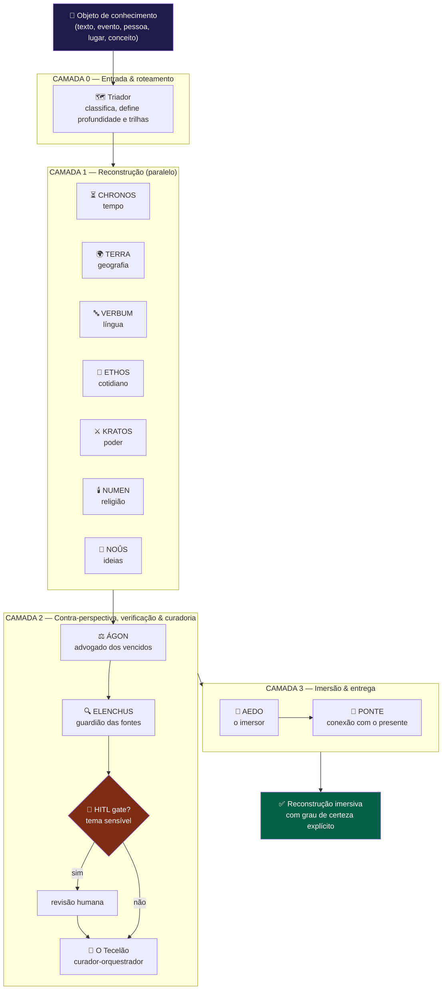
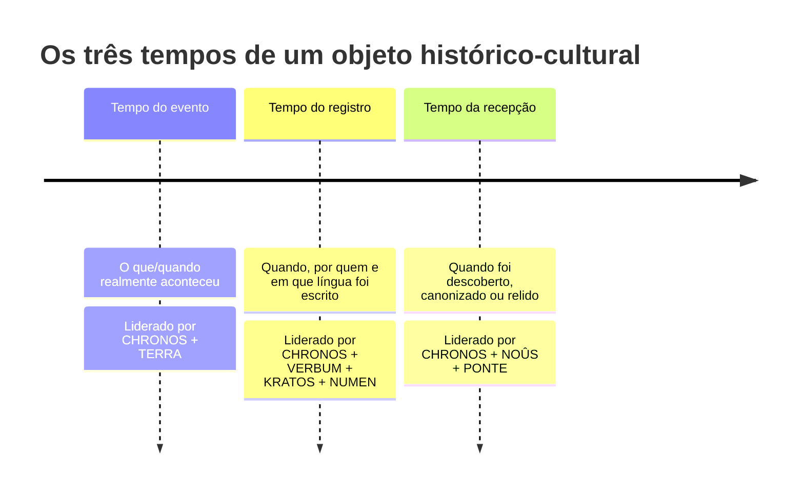
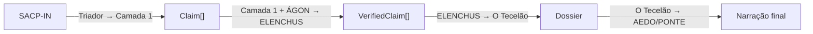

<div align="center">

# 🏛️ PALIMPSESTO Squad

### Sistema multiagente de reconstrução contextual imersiva
**Filosofia × História × Geografia × Política**

<p>
  
  
  
  
  
</p>

</div>

---

> *Palimpsesto* (gr. *palímpsēstos*, "raspado de novo"): pergaminho reaproveitado em que, sob a escrita nova, as camadas antigas ainda transparecem. Todo fato, texto ou personagem é um palimpsesto — um empilhamento de camadas linguísticas, geográficas, religiosas, políticas e filosóficas. Este squad existe para **raspar e revelar essas camadas**, uma a uma, e então recompô-las numa experiência de imersão total.

## ✨ Ideia central

PALIMPSESTO recebe **qualquer objeto de conhecimento histórico-cultural** — um trecho da Bíblia, um evento, uma personalidade, um conceito, um lugar — e devolve não uma explicação, mas uma **reconstrução verificada do mundo ao redor do objeto**: datado, situado geograficamente, traduzido na semântica original da língua falada, encharcado da política, da religião e das ideias da época, e finalmente **narrado em segunda pessoa, no presente histórico**.

A diferença frente a uma resposta comum não é de quantidade, é de **eixo**: a explicação comum responde *"o que isto diz"*; PALIMPSESTO responde *"o que era estar vivo no mundo em que isto foi dito, e o que estas palavras faziam com quem as ouvia"*.

<table>
<tr>
<td width="50%" valign="top">

### 🌊 Imersão máxima
A saída precisa **transportar**, não listar. Segunda pessoa, presente histórico, densidade sensorial, ritmo cinematográfico.

</td>
<td width="50%" valign="top">

### 🛡️ Rigor epistemológico máximo
Nada de anacronismo, nada de detalhe inventado disfarçado de fato. Cada afirmação carrega um **grau de certeza** explícito.

</td>
</tr>
</table>

> Imersão sem rigor vira ficção; o squad recusa esse atalho.

---

## 🧭 Arquitetura em 4 camadas



**Princípio de fluxo:** Camada 1 reconstrói → ÁGON pluraliza (injeta a voz ausente) → ELENCHUS verifica e poda → Camada 3 só então narra. **A imersão jamais ocorre sobre material não verificado**, e a reconstrução **nunca repousa numa única perspectiva**.

---

## 🕰️ A regra dos três tempos (núcleo conceitual)

O que separa PALIMPSESTO de uma explicação comum: **nunca confundir** o tempo do evento com o tempo da escrita.



---

## 🧑‍🤝‍🧑 Os 13 agentes

| # | Agente | Camada | Papel |
|---|---|---|---|
| 0 | 🗺️ `triador` | 0 | Classifica o objeto e monta o plano de escavação (`SACP-IN`) |
| 1 | ⏳ `chronos` | 1 | Estratígrafo do tempo — separa evento / registro / recepção |
| 2 | 🌍 `terra` | 1 | Cartógrafo — geografia física e humana como vetor de causalidade |
| 3 | 🔤 `verbum` | 1 | Filólogo — língua original, campo semântico, o que a tradução apaga |
| 4 | 🍞 `ethos` | 1 | Etnógrafo do cotidiano — mentalidades e vida material |
| 5 | ⚔️ `kratos` | 1 | Analista de poder — instituições, economia, interesses |
| 6 | 🕯️ `numen` | 1 | Historiador das religiões — crença, ritual, sagrado |
| 7 | 💭 `nous` | 1 | Historiador das ideias — episteme e cosmovisão da época |
| 8 | ⚖️ `agon` | 2 | Advogado dos vencidos — contra-perspectiva, contrafactuais, viés de fonte |
| 9 | 🔍 `elenchus` | 2 | Guardião das fontes — atribui certeza, poda anacronismo e alucinação |
| 10 | 🧵 `tecelao` | 2 | Curador-editor/orquestrador — monta o dossiê verificado |
| 11 | 📜 `aedo` | 3 | Imersor — narra em 2ª pessoa, presente histórico, só com material verificado |
| 12 | 🌉 `ponte` | 3 | Conexão com o presente — ressonâncias sem anacronismo retroativo |

<details>
<summary>📖 Por que <code>ÁGON</code> existe (clique para expandir)</summary>

A maioria esmagadora dos registros que chegam até nós foi escrita por quem venceu e sabia escrever. Sem um agente dedicado, o squad herdaria esse viés silenciosamente, com fluência e autoridade. ÁGON injeta sistematicamente: **a perspectiva dos silenciados**, **os contrafactuais reconstruíveis** e **o viés da fonte sobrevivente** — sempre como reconstrução verificável, nunca como compensação ficcional. Quando a fonte da margem não existe, dizer que não existe é a resposta.

</details>

---

## 🎚️ Níveis de profundidade

| Nível | Nome | O que entrega |
|---|---|---|
| **1** | 🌤️ Vislumbre | 3 camadas-chave (CHRONOS + TERRA + VERBUM) + abertura imersiva curta (Reels/Manim) |
| **2** | 🌊 Imersão *(default)* | Todas as trilhas pertinentes + narração completa + ponte com o presente |
| **3** | ⛏️ Escavação | Todas as camadas + divergências de escolas + aparato de fontes + notas filológicas extensas |

## 📋 Formato da entrega (Nível 2)

```
1. A Travessia        (AEDO)            → abertura em 2ª pessoa, presente histórico
2. Os Três Tempos      (CHRONOS)         → evento, escrita, recepção
3. A Terra             (TERRA)           → o espaço como força viva
4. As Palavras         (VERBUM)          → língua original, o que a tradução apaga
5. A Vida              (ETHOS)           → cotidiano e mentalidade de quem estava lá
6. O Poder e o Sagrado (KRATOS+NUMEN+ÁGON) → campo político-religioso + vozes silenciadas
7. O Pensável          (NOÛS)            → as ideias que davam sentido a tudo
8. A Ponte             (PONTE)           → por que ainda nos toca
9. Aparato (opcional, Nível 3)           → fontes, divergências, graus de certeza
```

🏷️ Marcadores de certeza inline acompanham toda afirmação de risco:

`[consenso]` · `[majoritário]` · `[disputado]` · `[hipótese]` · `[reconstrução plausível]` · `[recriação atmosférica]`

Ver `templates/formato-entrega.md` para o detalhamento completo.

---

## 🔗 Contratos de dados (handoffs)



| Contrato | Schema | De → Para |
|---|---|---|
| `SACP-IN` | `templates/sacp-in.schema.json` | Triador → Camada 1 |
| `Claim` | `templates/claim.schema.json` | Camada 1 / ÁGON → ELENCHUS |
| `VerifiedClaim` | `templates/verified-claim.schema.json` | ELENCHUS → O Tecelão |
| `Dossier` | `templates/dossier.schema.json` | O Tecelão → AEDO/PONTE |

Grau de certeza → rótulo: `≥0.9 consenso` · `0.7–0.9 majoritário` · `0.4–0.7 disputado/hipótese` · `<0.4 reconstrução plausível` · `null desconhecido`.

---

## 🛡️ Guardrails

| Guardrail | Garantia |
|---|---|
| 🚫 Anti-alucinação | AEDO só usa material verificado por ELENCHUS; sem ancoragem → `[recriação atmosférica]` |
| ⏰ Anti-anacronismo | Todo termo/conceito moderno passa pelo filtro de ELENCHUS |
| 🤷 Honestidade sobre lacunas | "não se sabe" é saída válida e visível |
| 🕊️ Temas sensíveis | HITL gate para religião viva, genocídios, disputas identitárias, política contemporânea |
| 🗣️ Multiperspectiva | ÁGON garante o olhar do governado/marginal como etapa estrutural |
| ⚖️ Disputa preservada | Divergência de escolas nunca é achatada em falso consenso |

---

## 🚀 Como usar nos principais LLMs de codificação

Este squad é **prompt-nativo**: não precisa de instalação nem de dependências para funcionar — qualquer LLM com boa janela de contexto pode assumir as personas dos 13 agentes lendo os arquivos Markdown/YAML/JSON do squad. Abaixo, o passo a passo para os ambientes mais comuns.

### 🟣 Claude Code (CLI / VS Code / JetBrains)

1. Abra o repositório `Squads-Genius` na raiz do seu projeto Claude Code.
2. Peça diretamente em linguagem natural, citando o squad:
   ```
   Leia squads/palimpsesto-squad/squad.yaml e assuma a persona do agente
   agents/triador.md. Em seguida, siga o workflow
   workflows/palimpsesto-pipeline.yaml para reconstruir o seguinte objeto:
   "<seu texto, evento, personalidade ou lugar aqui>"
   ```
3. Claude Code lerá os arquivos reais do squad (Read/Grep) e executará o pipeline camada por camada, assumindo cada agente em sequência.
4. Para repetir o fluxo com frequência, crie um slash command próprio em `.claude/commands/palimpsesto.md` que aponte para `squads/palimpsesto-squad/docs/guia-de-uso.md`.

### 🔵 Cursor

1. Adicione a pasta `squads/palimpsesto-squad/` ao contexto do chat (`@squads/palimpsesto-squad`) ou abra o repositório inteiro no workspace.
2. No Chat/Composer, em modo *Agent*, escreva:
   ```
   @squads/palimpsesto-squad Use este squad para reconstruir o objeto X.
   Comece pelo agents/triador.md e siga o pipeline descrito em
   workflows/palimpsesto-pipeline.yaml, camada por camada.
   ```
3. Use `@templates/formato-entrega.md` para forçar o Cursor a respeitar a estrutura de saída em 9 seções.

### 🟢 GitHub Copilot Chat (VS Code / Visual Studio / JetBrains)

1. No editor, abra `squads/palimpsesto-squad/squad.yaml` e os agentes relevantes para que entrem no contexto ativo.
2. No painel de Chat, use `#file` para referenciar os arquivos (ex.: `#file:agents/triador.md`) e peça:
   ```
   Usando #file:squad.yaml e #file:workflows/palimpsesto-pipeline.yaml,
   reconstrua o objeto "<objeto>" seguindo a sequência de agentes do squad
   PALIMPSESTO, camada por camada, sem pular ELENCHUS.
   ```
3. Copilot Chat funciona melhor em sessões curtas — execute camada por camada (Triador → Camada 1 → ÁGON → ELENCHUS → Tecelão → AEDO/PONTE) em vez de pedir tudo de uma vez.

### 🟠 Windsurf (Codeium)

1. Use o **Cascade** em modo *Write*/*Chat* com o repositório aberto.
2. Referencie o squad com `@squads/palimpsesto-squad` e peça para o Cascade seguir o `workflows/palimpsesto-pipeline.yaml` como roteiro de execução, persona por persona.
3. Aproveite os *Memories* do Windsurf para fixar a regra de ouro de cada agente entre turnos longos.

### 🟡 ChatGPT (Projects / Custom GPT) e OpenAI Codex CLI

- **ChatGPT com Projects/Code Interpreter:** faça upload dos arquivos de `squads/palimpsesto-squad/` (ou cole o conteúdo de `squad.yaml` + agentes) e peça para o modelo "operar como o squad PALIMPSESTO", seguindo o pipeline descrito.
- **Codex CLI/IDE:** rode no diretório do repositório e peça explicitamente para ler `squads/palimpsesto-squad/squad.yaml`, `workflows/palimpsesto-pipeline.yaml` e os `agents/*.md` antes de responder — Codex tem acesso real ao sistema de arquivos, então a citação de caminho garante fidelidade ao PRD.

### 🔴 Google Gemini (Gemini Code Assist / Gemini CLI)

1. Abra o repositório no Gemini Code Assist (VS Code) ou rode `gemini` na raiz do projeto.
2. Peça para o modelo ler o `squad.yaml` e os agentes da camada solicitada antes de gerar a resposta, por exemplo:
   ```
   Leia squads/palimpsesto-squad/squad.yaml, agents/chronos.md,
   agents/terra.md e agents/verbum.md. Assuma essas três personas e
   produza os claims de Nível 1 (Vislumbre) para o objeto "<objeto>".
   ```
3. Para escavações completas (Nível 3), peça explicitamente para incluir ÁGON e ELENCHUS antes da narração final — Gemini tende a pular a verificação se não for instruído.

### 💡 Dica geral (vale para qualquer LLM)

> Sempre **force a leitura dos arquivos reais** do squad (`squad.yaml`, `workflows/palimpsesto-pipeline.yaml`, os `agents/*.md` da camada em uso) antes de pedir a execução. Modelos que respondem "de memória" sem ler os arquivos tendem a pular ÁGON e ELENCHUS — exatamente os dois agentes que garantem multiperspectiva e rigor. Execute o pipeline **camada por camada** em conversas longas; isso reduz erro e facilita auditar onde um claim foi rebaixado ou removido.

Para validar os contratos de dados de forma 100% determinística (sem LLM), use o script incluso:

```bash
cd squads/palimpsesto-squad
python3 scripts/validate_contracts.py
```

---

## 📂 Estrutura de pastas

```
palimpsesto-squad/
├── squad.yaml                    # manifesto do squad
├── agents/                       # 13 agentes (papel, entradas, saídas, semente de prompt)
├── tasks/                        # 8 tasks atômicas do pipeline
├── workflows/                    # palimpsesto-pipeline.yaml (grafo de dependências + gates)
├── templates/                    # 4 schemas JSON dos contratos + formato de entrega
├── examples/                     # exemplo trabalhado (Mt 5,5) + fixtures de validação
├── scripts/                      # validate_contracts.py (determinístico, sem LLM)
├── docs/                         # guia de uso passo a passo
└── references/                   # PRD original completo
```

---

## 📊 Métricas de sucesso (v1)

| Objetivo | Métrica | Meta |
|---|---|---|
| 🌊 Imersão | avaliação humana "senti-me transportado" | ≥ 4,3 |
| 🛡️ Rigor | % de afirmações com certeza explícita | 100% |
| ⏰ Anti-anacronismo | anacronismos detectados por amostragem | < 1 a cada 20 respostas |
| 🧩 Cobertura multidisciplinar | camadas ativadas em objetos ricos | ≥ 4/5 |
| 🔗 Rastreabilidade | afirmações de alto risco com fonte apontada | ≥ 90% |

## 🗺️ Roadmap

- [x] **Fase 0 — PoC:** Triador + 4 trilhas (CHRONOS, VERBUM, KRATOS, NUMEN) + ELENCHUS + AEDO, sem RAG.
- [x] **Fase 1 — Completo sem RAG:** 7 trilhas + Tecelão + PONTE + 3 níveis de profundidade + observabilidade.
- [ ] **Fase 2 — RAG ancorado:** base de fontes curada para ELENCHUS consultar antes de atribuir certeza.
- [ ] **Fase 3 — HITL + variantes de saída:** export roteiro Manim/RPG (*Ecos da Singularidade*).
- [ ] **Fase 4 — Auto-avaliação:** loop de auditoria de anacronismo e calibração de certeza.

---

<div align="center">

Licença: MIT. Criado por Marcio Bisognin. Instagram: [@marciobisognin](https://instagram.com/marciobisognin).

</div>
