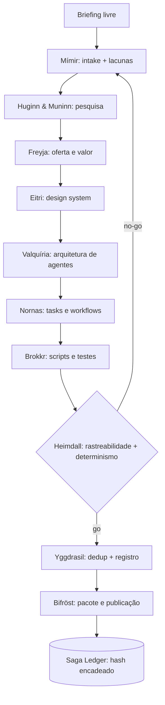

<div align="center">

# ⚡ Bifröst Forge Engine

### O engine que atravessa os nove reinos — da ideia ao squad completo, com auditoria encadeada, registro vivo e determinismo provado.

[](./CHANGELOG.md)
[](./docs/quality_gates.md)
[](./LICENSE)
[](./squad.yaml)
[](#-o-conselho-de-asgard-11-agentes)
[](#-diferenciais)
[](#-saga-ledger)

</div>

> [!IMPORTANT]
> **Propriedade intelectual:** toda a nomenclatura vem da **mitologia nórdica de domínio
> público** (Eddas). Este projeto **não** usa marcas, personagens exclusivos, roteiros,
> logotipos ou artes de qualquer estúdio/editora. Detalhes em
> [`docs/ip_and_mythology_notice.md`](./docs/ip_and_mythology_notice.md).

---

## 🧭 Navegação
- [Metáfora do nome](#-a-metáfora)
- [O que faz](#-o-que-faz)
- [Diferenciais](#-diferenciais)
- [O Conselho de Asgard (11 agentes)](#-o-conselho-de-asgard-11-agentes)
- [Pipeline](#-pipeline)
- [Saga Ledger](#-saga-ledger)
- [Design system](#-design-system)
- [Início rápido](#-início-rápido)
- [Como usar nos principais LLMs de codificação](#-como-usar-nos-principais-llms-de-codificação)
- [Stack e contratos](#-stack-e-contratos)

---

## 🌉 A metáfora
A **Bifröst** é a ponte de arco-íris que liga Asgard aos demais reinos. Aqui ela liga uma
**ideia** a um **squad completo**: o **Allfather** (Odin) orquestra, **Mímir** lê o briefing,
os corvos **Huginn & Muninn** pesquisam, **Eitri** e **Brokkr** forjam, as **Nornas** tecem os
fluxos, a **Valquíria** escolhe o roster, **Heimdall** vigia a qualidade, **Yggdrasil** registra
e a **Bifröst** publica. Cada passo fica gravado numa **saga** auditável.

## 🎯 O que faz
Transforma um **briefing livre** (YAML/JSON) em um **squad completo e validável**: pesquisa,
oferta, design system, agentes, tasks, workflows, scripts determinísticos, testes,
documentação e pacote — **sem chamadas LLM externas** (`--no-llm` é o modo implementado) e com
**reprodutibilidade provada por hash**.

## 🏆 Diferenciais
| # | Diferencial | Como |
|---|---|---|
| 1 | **Auditoria encadeada** | Saga Ledger em JSONL com **hash SHA256 encadeado** e verificação de integridade |
| 2 | **Determinismo provado** | `--verify-determinism` forja 2× e compara o hash da árvore |
| 3 | **Rastreabilidade** | Heimdall cruza cada *output esperado* com o artefato produzido |
| 4 | **Registro vivo** | Yggdrasil indexa, roteia (TF·IDF) e **detecta duplicatas** antes de forjar |
| 5 | **Multi-squad** | `campaign_dispatch`: DAG que coordena vários squads (não só forja um) |
| 6 | **Orquestrador real** | Máquina de estados resumível — não uma persona estática |
| 7 | **DNA com salvaguardas** | Mímir extrai estilo em 5 camadas sem reproduzir texto |

Comparativo completo em [`docs/comparison_with_maeve_forge.md`](./docs/comparison_with_maeve_forge.md).

## ⚔️ O Conselho de Asgard (11 agentes)
| Agente | Étimo nórdico | Papel |
|---|---|---|
| `allfather-orchestrator` | Odin, o Pai-de-Tudo | Maestro/máquina de estados, gates, checkpoints |
| `mimir-briefing-oracle` | Mímir, poço da sabedoria | Intake + auto-clarificação (lacunas por severidade) |
| `huginn-muninn-research-ravens` | Corvos Pensamento & Memória | Pesquisa profunda rastreável |
| `freyja-value-architect` | Freyja | Oferta, valor, precificação, monetização |
| `eitri-design-forge` | Eitri, ferreiro anão | Design system original + tokens |
| `norn-workflow-weaver` | Nornas | Tasks e workflows com gates e rollback |
| `valkyrie-agent-marshal` | Valquíria | Roster não-redundante + matriz de capacidade |
| `brokkr-script-smith` | Brokkr, ferreiro anão | Scripts determinísticos + testes |
| `heimdall-quality-sentinel` | Heimdall | Validação, rastreabilidade e determinismo |
| `bifrost-release-herald` | A ponte Bifröst | Empacotamento e publicação |
| `yggdrasil-registrar` | Yggdrasil, a árvore-mundo | Registro vivo, roteamento e dedup |

## 🗺️ Pipeline


## 📜 Saga Ledger
Cada fase grava uma linha JSON com o hash do próprio conteúdo encadeado ao anterior.
Adulterar qualquer linha quebra a cadeia — auditoria à prova de manipulação.
```bash
python3 scripts/saga_ledger.py --verify /tmp/out/.saga/saga_ledger.jsonl
```

## 🎨 Design system
Identidade **original e determinística**: as cores saem de um hash do nome do projeto, nunca
de uma marca. Tokens em [`eitri_design.py`](./scripts/eitri_design.py).

| Token | Papel |
|---|---|
| primary / secondary / accent | derivados por hash estável |
| neutral_ink / neutral_paper | leitura e contraste |
| success / warning / danger | estados |

## 🚀 Início rápido
```bash
cd squads/construção-de-squads-e-sistemas-de-ia/bifrost-forge-engine-squad
pip install -r requirements.txt   # PyYAML + pytest (opcionais)

# planejar
python3 scripts/bifrost_forge.py --briefing examples/briefing_valhalla_knowledge.yaml --output /tmp/out --dry-run

# forjar provando determinismo
python3 scripts/bifrost_forge.py --briefing examples/briefing_valhalla_knowledge.yaml --output /tmp/out --overwrite --verify-determinism

# validar com Heimdall
python3 scripts/heimdall_validate.py --root /tmp/out --briefing examples/briefing_valhalla_knowledge.yaml --format md
```

## 🤝 Como usar nos principais LLMs de codificação

**Prompt de ativação (copiável):**
```text
Assuma o papel do "Allfather Orchestrator" do Bifröst Forge Engine.
Leia squad.yaml e agents/allfather-orchestrator.md e siga o workflow
workflows/full_bifrost_pipeline.yaml. Regras: separar observado/inferido/
hipótese/risco; priorizar scripts determinísticos; nunca copiar marca ou
ativo de terceiros; registrar tudo no Saga Ledger; validar com Heimdall e
verificar determinismo antes de publicar. Objetivo: forjar um squad a partir
do briefing que eu fornecer.
```

<details><summary><b>Claude Code</b></summary>

```bash
python3 scripts/bifrost_forge.py --briefing meu_briefing.yaml --output ./meu-squad --overwrite --verify-determinism
```
Cole o prompt de ativação e forneça seu briefing YAML.
</details>

<details><summary><b>Cursor</b></summary>

Abra a pasta do squad, cole o prompt de ativação no chat e aponte para
`workflows/full_bifrost_pipeline.yaml`.
</details>

<details><summary><b>GitHub Copilot</b></summary>

Use o Copilot Chat com `@workspace`, cole o prompt de ativação e peça para rodar
`scripts/bifrost_forge.py` com seu briefing.
</details>

<details><summary><b>Windsurf</b></summary>

Adicione a pasta ao workspace, cole o prompt de ativação e execute o pipeline.
</details>

<details><summary><b>Cline / Roo</b></summary>

Cole o prompt de ativação; autorize a execução dos scripts em `scripts/`.
</details>

<details><summary><b>Continue.dev / Aider / Zed</b></summary>

Aponte o contexto para `squad.yaml` + `agents/` e cole o prompt de ativação.
</details>

<details><summary><b>ChatGPT / Gemini (sem terminal)</b></summary>

Cole `squad.yaml`, o agente `allfather-orchestrator.md` e o briefing; peça o plano
de forja fase a fase. A execução determinística real acontece via Python local.
</details>

## 🧱 Stack e contratos
- **Linguagem:** Python 3.11+ (stdlib; PyYAML/pytest opcionais).
- **Contratos:** todo agente tem schema de entrada/saída; todo script compila e tem `__main__`.
- **Segurança:** scan de segredos, sem persistência de credenciais, design derivado por hash.

---

> [!NOTE]
> Este engine é **aditivo** ao repositório — não substitui nenhum squad existente. Ele reconstrói
> a proposta de um forjador de squads em um patamar superior de orquestração e auditoria.

<div align="center">

**Licença: MIT. Criado por Marcio Bisognin. Instagram: @marciobisognin.**

</div>
