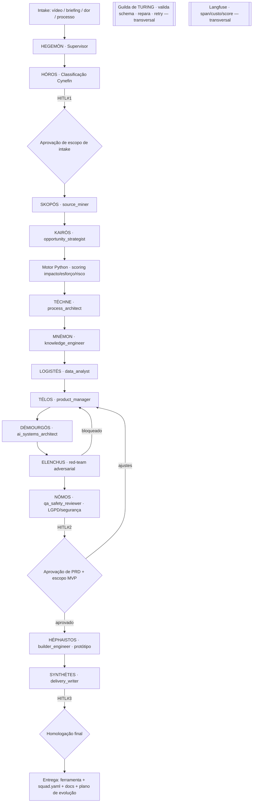

# PRD — Squad **FÁBRICA DE FERRAMENTAS IA** (`DÉDALO`)
### Arquitetura Multi-Agente · Agnóstico de Plataforma
**Status:** proposta para aprovação · **Versão:** 3.0 (premium) · **Data:** 2026-06-26
**Solicitante:** Marcio Bisognin · **Elaboração:** Maeve · Agente Especializado
**Tipo:** Squad meta-fábrica para transformar vídeos, ideias e processos de negócio em ferramentas digitais/IA operacionais

---

## 0. Sumário Executivo

O **Squad DÉDALO** (*Fábrica de Ferramentas IA*) é uma **camada de transformação de conhecimento em software**: recebe um vídeo, briefing, dor operacional ou processo; identifica oportunidades de automação/produto; e gera o pacote completo — diagnóstico, PRD, arquitetura, backlog, protótipo, agentes, integrações e plano de validação — entregando, quando aprovado, a **primeira versão funcional da ferramenta** mais o `squad.yaml` compatível com qualquer plataforma de orquestração multi-agente.

**Tese estratégica (extraída das fontes):** empresas competitivas nos próximos anos não apenas comprarão ferramentas genéricas — elas **construirão ativos próprios**, alimentados por conhecimento interno, dados reais e IA como infraestrutura operacional. O DÉDALO é a máquina que produz esses ativos.

Esta versão 3.0 preserva integralmente o escopo, os pilares, os arquétipos e a estrutura de arquivos do PRD original, e os eleva ao padrão arquitetural de squads multi-agente agnósticos de plataforma.

### Invariante central (não-negociável)
> Os **LLMs emitem exclusivamente JSON estruturado** (evidências, classificações, hipóteses, narrativa). **Toda lógica determinística — scoring de oportunidade, priorização impacto/esforço/risco, métricas, validação — roda em Python puro**, jamais no LLM. Isso garante reprodutibilidade, auditabilidade e rastreabilidade fonte → requisito → feature.

| Atributo | Valor |
|---|---|
| Nº de agentes | 14 (10 de domínio + 4 de governança) em 8 guildas |
| Orquestração | LangGraph `StateGraph` · supervisor `HEGEMÓN` |
| Entry gate | Classificador Cynefin (`HÓROS`) |
| Handoffs | Contratos SACP em JSON validados por Pydantic |
| Determinismo | Motor Python de scoring/priorização (LLM nunca calcula) |
| Gates HITL | 3 (intake, escopo/aprovação, homologação final) |
| Anti-sycophancy | `ELENCHUS` — red-team adversarial com poder de bloqueio |
| Observabilidade | Langfuse (span/custo/latência/score por nó) |
| Self-healing | Guilda de Turing (validação schema + reparo + retry) |
| Plataforma-alvo | Agnóstico de plataforma (`squad.yaml`, workflows, CLI/MCP) |
| Saída | `sources.md`, `opportunity_map.yaml`, PRD `.md/.docx/.html`, `architecture.md`, `backlog.md`, `squad.yaml`, protótipo, `validation_report.md` |

---

## 1. Fontes Analisadas

> Integridade probatória preservada do documento de evidências. Nenhum conteúdo de fonte inacessível foi inventado ou inferido.

| Fonte | Status | Evidência extraída | Observação |
|---|---|---|---|
| Instagram Reel `DZ82MqEMUA8` | Parcialmente analisado | Baixado via `yt-dlp`; 2min22s; caption "Ativando o mega brain força total do @thiagofinch"; contact sheet analisado | Sem transcrição automática. Conteúdo visual indica ideação rápida de software para faturar R$100k — features, trial, automação, nicho clínica. |
| Instagram Reel `DZ-y41DB7_X` | **Bloqueado/inacessível** | `yt-dlp` retornou mídia vazia; rota pública exige login | **Deve ser reenviado** como MP4/áudio/print. Conteúdo não verificado **não foi usado**. |
| YouTube `9qzbXOMFwuQ` — *"Se Eu Quisesse Criar Uma Empresa MILIONÁRIA Com IA em 2026..."* | Analisado | Transcrição PT-BR: 814 segmentos; 37min05s | Principal fonte conceitual do PRD. |

---

## 2. Fundamentos Estratégicos — Os 5 Pilares

Extraídos da fonte principal; constituem a tese de produto que o squad operacionaliza.

1. **Mentalidade de construtor.** Parar de depender de consultorias, agências e softwares genéricos. Construir ativos próprios.
2. **Capital intelectual como ativo.** Capturar o conhecimento tácito da empresa (decisões, critérios, padrões) e transformá-lo em sistema vivo — não em "cemitério de arquivos".
3. **Decisão por dados, não por feeling.** Substituir achismo por coleta, cruzamento e leitura de dados reais.
4. **Alfabetização em IA.** Sair do uso superficial de chatbots; tratar IA como infraestrutura operacional integrada a processos e decisões.
5. **Alavancagem tecnológica.** Usar IA e desenvolvimento assistido para construir sistemas próprios, agentes especializados e times digitais.

---

## 3. Arquétipos de Ferramenta (biblioteca do squad)

O squad deve saber projetar e construir, a partir de templates versionados:

| Família | Arquétipos |
|---|---|
| **A · Inteligência de mercado** | monitor de concorrentes, radar de preço/oferta, analisador de conteúdo, alertas de oportunidade, relatórios vivos |
| **B · Capital intelectual** | base de conhecimento viva, extrator de decisões de reuniões, entrevistador de especialistas internos, agentes treinados em critérios/tom/frameworks, onboarding inteligente |
| **C · Decisão por dados** | painel de indicadores críticos, cruzamento de métricas, análise de margem real, LTV/churn/coorte, alertas de anomalia |
| **D · Operacional de nicho** | clínicas (triagem/histórico/protocolos), jurídico (jurisprudência/peças + revisão humana), academias (gestão/cobrança/CRM/retenção), construtoras (prazo/orçamento/clima/material), distribuidoras (estoque/sazonalidade/preço dinâmico) |
| **E · Micro-SaaS & monetização** | plano de produto em 2 min, definição de nicho/promessa, features e MVP, trial/onboarding, precificação, funil, automações de ativação/retenção |

> Cada arquétipo vive em `archetypes/*.md` com: dor canônica, dados necessários, agentes sugeridos, integrações, esqueleto de MVP, riscos e gancho de monetização.

---

## 4. Princípios Arquiteturais Invariantes

1. **Separação LLM/Determinístico.** LLM ⇒ apenas JSON. Python ⇒ toda aritmética, scoring e priorização.
2. **Cynefin entry gate.** O intake é classificado (Óbvio/Complicado/Complexo/Caótico) e roteado em profundidade adaptativa.
3. **Contratos SACP.** Handoffs são objetos JSON tipados (Pydantic), versionados, com `provenance` e `confidence`.
4. **Gates HITL.** Pontos de parada obrigatórios para aprovação humana.
5. **Anti-sycophancy by design.** `ELENCHUS` é adversarial e obrigatório, com poder de bloqueio.
6. **Observabilidade total.** Langfuse em cada nó.
7. **Self-healing.** Guilda de Turing repara falhas de schema/sanidade antes de escalar.
8. **Rastreabilidade radical.** Matriz fonte → requisito → feature em todo entregável; evidência separada de hipótese.
9. **Nomenclatura epistêmica.** Cada agente carrega codinome Greco-Latino + nome operacional (snake_case) para o orquestrador de destino.
10. **Local-first & portabilidade.** Markdown, YAML, SQLite/CSV; protótipo roda localmente antes de depender de nuvem.

---

## 5. Arquitetura do Sistema

### 5.1 Topologia (LangGraph `StateGraph`)



### 5.2 Roteamento adaptativo por Cynefin (`HÓROS`)

| Domínio | Comportamento do pipeline |
|---|---|
| **Óbvio** | Arquétipo conhecido ⇒ caminho curto: usa template pronto, 1 iteração, MVP enxuto |
| **Complicado** | Pipeline completo, 1 ciclo `ELENCHUS` |
| **Complexo** | Pipeline completo + 2 ciclos `ELENCHUS` + cenários (otimista/base/pessimista) + fase de *data discovery* obrigatória |
| **Caótico** | Bloqueia avanço; força HITL para reformular o intake (ex.: fonte inacessível, dor mal definida) |

---

## 6. Modelo de Estado Global (`GlobalState`)

Estado único compartilhado, validado por Pydantic, com checkpointing LangGraph. Cada agente lê o estado e escreve apenas em sua fatia.

```python
from pydantic import BaseModel, Field
from typing import Literal, Optional
from datetime import datetime

class Provenance(BaseModel):
    agent: str
    source_refs: list[str] = []           # ["IG:DZ82MqEMUA8@00:42", "YT:9qzbXOMFwuQ#seg312", "hipotese#7"]
    evidence_type: Literal["evidencia","hipotese","estimativa"]
    timestamp: datetime
    confidence: float = Field(ge=0.0, le=1.0)

class GlobalState(BaseModel):
    run_id: str
    seed: int = 42
    intake: "IntakeSpec"
    cynefin_domain: Optional[Literal["obvio","complicado","complexo","caotico"]] = None
    sources: Optional["SourcePackage"] = None          # SKOPÓS
    opportunities: Optional["OpportunityMap"] = None    # KAIRÓS
    scored_opportunities: Optional["ScoredOpportunities"] = None  # Python-only
    process_model: Optional["ProcessModel"] = None      # TÉCHNE
    knowledge_model: Optional["KnowledgeModel"] = None  # MNÉMON
    data_map: Optional["DataMap"] = None                # LOGISTÉS
    prd: Optional["ToolPRD"] = None                     # TÉLOS
    architecture: Optional["ArchitectureSpec"] = None   # DÉMIOURGÓS
    redteam: Optional["RedTeamReport"] = None           # ELENCHUS
    validation: Optional["ValidationReport"] = None     # NÓMOS
    prototype: Optional["PrototypeArtifact"] = None     # HÉPHAISTOS
    delivery: Optional["DeliveryPackage"] = None        # SYNTHÉTES
    hitl_gates: dict[str, Literal["pending","approved","rejected"]] = {}
    healing_log: list[str] = []
    langfuse_trace_id: Optional[str] = None

class IntakeSpec(BaseModel):
    primary_source: str                   # link / caminho de arquivo / texto
    objective: str
    niche_sector: Optional[str] = None
    end_user: Optional[str] = None
    output_mode: Literal["prd_only","prd_plus_mvp"] = "prd_only"
    explicit_assumptions: list[str] = []
```

---

## 7. Roster de Agentes (ultra-detalhado)

> Convenção por agente: **Codinome (epistêmico) · nome operacional · Missão · Input SACP · Output (Pydantic) · System prompt-núcleo · Ferramentas · Fronteira LLM/Python · Sucesso · Falha → mitigação · HITL**. Cada agente vive em `agents/<nome_operacional>.md`.

### GUILDA 0 — NÚCLEO DE ORQUESTRAÇÃO

#### `HEGEMÓN` · `orchestrator`
- **Missão.** Conduzir o `StateGraph`, rotear por Cynefin, gerir gates HITL, despachar retries da Guilda de Turing, garantir ordem de escrita do estado.
- **Output.** `RoutingDecision { next_node: enum, reason, parallelizable: bool }`.
- **Fronteira.** Roteamento em Python (edges LangGraph); LLM só desambigua transições, devolvendo enum.
- **System prompt.** *"Você é HEGEMÓN, supervisor. Não produz conteúdo de domínio. Dado o GlobalState e o último resultado, retorne SOMENTE JSON `RoutingDecision`. Se houver gate HITL pendente, `next_node='HALT_HITL'`. Nunca pule gate."*
- **Sucesso.** 0 transições inválidas; 0 gates pulados. **Falha.** Loop ⇒ teto de visitas por nó → HITL.

#### `HÓROS` · `cynefin_classifier`
- **Missão.** Classificar o intake em Cynefin e definir profundidade (iterações, cenários, ciclos de red-team, necessidade de data discovery).
- **Output.** `CynefinClassification { domain, rationale (≤60 palavras), depth_params, ambiguity_flags, provenance }`.
- **System prompt.** *"Você é HÓROS. Classifique a oportunidade. 'Caótico' = fonte inacessível, dor incoerente ou sem mercado. Responda SOMENTE JSON. Liste em ambiguity_flags o que falta para reclassificar."*
- **Fronteira.** LLM classifica; Python mapeia `domain → depth_params` (tabela fixa).
- **HITL.** **HITL#1** — humano confirma domínio e escopo de intake.

---

### GUILDA I — MINERAÇÃO & ESTRATÉGIA (Discovery)

#### `SKOPÓS` · `source_miner`
*(gr. σκοπός, "batedor")*
- **Missão.** Extrair/transcrever vídeos, legendas, prints e documentos; produzir pacote de evidências com timestamps e grau de confiança; marcar fontes inacessíveis.
- **Output.**
  ```python
  class SourcePackage(BaseModel):
      transcripts: list[TranscriptSegment]   # com timestamp
      key_quotes: list[Evidence]
      cited_tools: list[str]                  # ferramentas citadas no material
      inaccessible_sources: list[str]         # marcadas, nunca inventadas
      provenance: Provenance

  class Evidence(BaseModel):
      text: str; source_ref: str; timestamp: Optional[str]
      confidence: float = Field(ge=0, le=1)
  ```
- **System prompt.** *"Você é SKOPÓS. Extraia SOMENTE o que está na fonte. Toda afirmação carrega source_ref e timestamp. Fonte inacessível vai em inaccessible_sources — NUNCA invente conteúdo. Separe 'ferramenta citada' de 'ferramenta inferida'. Responda SOMENTE JSON `SourcePackage`."*
- **Ferramentas.** `yt-dlp`, `ffprobe`, transcrição (whisper/captions), OCR de prints, leitor de PDF.
- **Fronteira.** Extração/transcrição = ferramentas; estruturação = LLM-JSON. **HITL.** —

#### `KAIRÓS` · `opportunity_strategist`
*(gr. καιρός, "o momento oportuno")*
- **Missão.** Identificar oportunidades de ferramenta, casar com arquétipos (A–E), e propor as **premissas** de impacto/esforço/risco para o scoring Python.
- **Output.**
  ```python
  class OpportunityMap(BaseModel):
      opportunities: list[Opportunity]        # ≥ 3
      provenance: Provenance

  class Opportunity(BaseModel):
      name: str; niche: str; pain: str; user: str
      archetype: Literal["market_intel","content_analyzer","knowledge_base",
                          "crm_churn","legal_rag","clinic_triage",
                          "construction_control","distributor_sales","micro_saas"]
      data_needed: list[str]; automations: list[str]
      agents: list[str]; integrations: list[str]
      mvp_sketch: str
      scoring_assumptions: OppScoringAssumptions   # premissas → motor Python
      maps_to_evidence: list[str]                  # rastreabilidade

  class OppScoringAssumptions(BaseModel):
      impact_value_1to5: int; effort_1to5: int; risk_1to5: int
      data_availability_1to5: int; repetition_1to5: int
  ```
- **System prompt.** *"Você é KAIRÓS. Para cada oportunidade, case com UM arquétipo da biblioteca e rastreie a uma evidência de SKOPÓS (sem oportunidade órfã). Forneça as notas 1–5 como PREMISSAS — o motor Python calculará a priorização. Responda SOMENTE JSON `OpportunityMap`."*
- **Fronteira.** **Crítica:** LLM dá notas 1–5; o ranking final é Python (§9). **HITL.** —

---

### GUILDA II — PROCESSO, CONHECIMENTO & DADOS (Diagnosis)

#### `TÉCHNE` · `process_architect`
*(gr. τέχνη, "ofício")*
- **Missão.** Mapear o processo da oportunidade vencedora: entrada, saída, decisão, exceções, responsáveis — e marcar onde NÃO automatizar antes de corrigir o processo.
- **Output.** `ProcessModel { steps[], decisions[], exceptions[], owners[], anti_automation_flags[], provenance }`.
- **System prompt.** *"Você é TÉCHNE. Mapeie o fluxo operacional real. Sinalize processos ruins que NÃO devem ser automatizados antes de corrigidos (gate de diagnóstico). Responda SOMENTE JSON `ProcessModel`."*
- **HITL.** —

#### `MNÉMON` · `knowledge_engineer`
*(gr. μνήμων, "guardião da memória")*
- **Missão.** Capturar capital intelectual — decisões, critérios, tom, frameworks — e estruturá-lo em ontologia/base consultável + prompts/agentes especializados (pilar 2).
- **Output.** `KnowledgeModel { ontology, knowledge_sources[], specialist_agent_prompts[], retrieval_strategy: Literal["rag","rules","hybrid"], provenance }`.
- **System prompt.** *"Você é MNÉMON. Transforme conhecimento tácito em estrutura viva e consultável — não em 'cemitério de arquivos'. Defina ontologia e estratégia de recuperação. Responda SOMENTE JSON `KnowledgeModel`."*
- **HITL.** —

#### `LOGISTÉS` · `data_analyst`
*(gr. λογιστής, "o que calcula")* — **núcleo determinístico**
- **Missão.** Identificar dados necessários, fontes, métricas e KPIs; produzir data map e plano de instrumentação; e **rodar todo cálculo determinístico** (scoring de oportunidade, métricas-base, sanity checks).
- **Output.** `DataMap { required_data[], sources[], kpis[], instrumentation_plan, data_gaps[], computed_metrics: dict, computed_by: "python_engine_v1", provenance }`.
- **Fronteira.** **100% Python para os números.** O LLM só nomeia quais dados/KPIs; valores e scores são funções puras seeded.
- **System prompt.** *"Você é LOGISTÉS. Liste dados, fontes e KPIs como ESTRUTURA — não calcule no texto. O motor Python computa. Se faltar dado real, marque em data_gaps e force data discovery. Responda SOMENTE JSON `DataMap`."*
- **HITL.** —

---

### GUILDA III — PRODUTO & ARQUITETURA (Design)

#### `TÉLOS` · `product_manager`
*(gr. τέλος, "finalidade")*
- **Missão.** Redigir o PRD da ferramenta: objetivo, personas, casos de uso, RF/RNF, MVP (MoSCoW), critérios de aceite — tudo rastreável a evidência/processo.
- **Output.**
  ```python
  class ToolPRD(BaseModel):
      objective: str; personas: list[str]; use_cases: list[str]
      functional_reqs: list[Req]; non_functional_reqs: list[Req]
      features: list[Feature]                 # MoSCoW + maps_to_pain
      mvp_cut: list[str]; acceptance_criteria: list[str]
      traceability_matrix: list[dict]         # fonte → requisito → feature
      provenance: Provenance
  ```
- **System prompt.** *"Você é TÉLOS. Nenhuma feature órfã: toda feature rastreia a uma dor/processo/evidência. MVP = menor conjunto 'must' que resolve a dor #1 ponta a ponta. Produza a matriz de rastreabilidade. Responda SOMENTE JSON `ToolPRD`."*
- **HITL.** Recebe devolução de `ELENCHUS` (bloqueio) e do gate **HITL#2**.

#### `DÉMIOURGÓS` · `ai_systems_architect`
*(gr. δημιουργός, "o artífice")*
- **Missão.** Desenhar a arquitetura: stack, modelo de dados, APIs, fluxos de automação, agentes/ferramentas de orquestração, RAG, opção local-first vs SaaS, auth/permissões — com decisões build-vs-buy.
- **Output.** `ArchitectureSpec { stack, data_model, apis[], automation_flows[], ai_layer, hermes_agents[], deployment: Literal["local_first","web_saas","hybrid"], auth_model, build_vs_buy[], initial_backlog[], provenance }`.
- **System prompt.** *"Você é DÉMIOURGÓS. Boring-but-reliable. Compre o que não é diferencial (auth, billing). Aplique o invariante 'LLM só JSON, Python calcula' DENTRO da ferramenta-cliente. Prefira local-first. Responda SOMENTE JSON `ArchitectureSpec`."*
- **HITL.** —

---

### GUILDA IV — CONSTRUÇÃO (Build)

#### `HÉPHAISTOS` · `builder_engineer`
*(deus grego da forja)*
- **Missão.** Após aprovação (HITL#2), construir o protótipo/MVP: app web/CLI/MCP server/script Python/dashboard HTML/SQLite, `squad.yaml`, README — e rodar localmente.
- **Output.** `PrototypeArtifact { artifact_type, files[], run_command, squad_yaml, smoke_test_result, readme, provenance }`.
- **System prompt.** *"Você é HÉPHAISTOS. Construa o MENOR artefato executável que prova a dor #1. Gere squad.yaml compatível com o orquestrador de destino. Rode smoke test local e reporte. Responda SOMENTE JSON `PrototypeArtifact` (os arquivos vão para o repositório)."*
- **Fronteira.** Geração de código pelo LLM; **execução e smoke test em ambiente real** (não simulado).
- **HITL.** Só age após **HITL#2** aprovado.

---

### GUILDA V — VALIDAÇÃO & ADVERSÁRIA

#### `ELENCHUS` · `redteam_auditor`
*(gr. ἔλεγχος, "refutação socrática")* — **obrigatório, com poder de bloqueio**
- **Missão.** Atacar o PRD e a arquitetura: requisitos alucinados (sem fonte), oportunidades fracas, scoring otimista, automação sobre processo ruim, MVP inchado.
- **Output.**
  ```python
  class RedTeamReport(BaseModel):
      verdict: Literal["aprovado","aprovado_com_ressalvas","bloqueado"]
      attacks: list[Attack]                  # cada uma com severidade
      hallucinated_requirements: list[str]   # requisitos sem evidência
      weakest_assumption: str
      kill_shot: Optional[str]
      required_fixes: list[str]
      provenance: Provenance

  class Attack(BaseModel):
      target: str; critique: str
      severity: Literal["baixa","media","alta","fatal"]
      evidence_or_reasoning: str
  ```
- **System prompt.** *"Você é ELENCHUS. DESTRUA o plano, não elogie. Caça #1: requisitos que NÃO rastreiam a evidência de SKOPÓS (alucinação). Marque automação sobre processo ruim como 'alta'. 'aprovado' só se não houver ataque alto/fatal sem resposta. SOMENTE JSON `RedTeamReport`. NÃO seja gentil."*
- **Poder de bloqueio.** `bloqueado` ⇒ `HEGEMÓN` devolve a `TÉLOS`/`DÉMIOURGÓS`. Cynefin complexo ⇒ 2 ciclos.

#### `NÓMOS` · `qa_safety_reviewer`
*(gr. νόμος, "lei")*
- **Missão.** Validar qualidade, segurança, privacidade, LGPD; exigir humano no loop em saúde/jurídico/financeiro; checar que nenhum segredo/credencial vaza.
- **Output.** `ValidationReport { quality_checks[], security_flags[], lgpd: {base_legal, minimizacao, anonimizacao}, human_in_loop_required: bool, regulated_sector_notes, blocking: bool, disclaimer, provenance }`.
- **System prompt.** *"Você é NÓMOS. Verifique LGPD (base legal, minimização, anonimização) e segredos expostos. Saúde/jurídico/financeiro ⇒ human_in_loop_required=true. Você alerta, não emite parecer jurídico — inclua disclaimer. SOMENTE JSON `ValidationReport`."*
- **HITL.** Alimenta **HITL#2** e **HITL#3**.

---

### GUILDA VI — SÍNTESE & ENTREGA

#### `SYNTHÉTES` · `delivery_writer`
*(gr. συνθέτης, "o que compõe")*
- **Missão.** Compor o pacote de entrega profissional: documentação final, README premium, guia de uso, plano de evolução — integrando ressalvas de ELENCHUS/NÓMOS, sem reabrir decisões.
- **Output.** `DeliveryPackage { readme, usage_guide, evolution_plan, risks_open_questions[], go_no_go: Literal["go","conditional_go","no_go"], conditions_for_go[], full_provenance[], version }`.
- **System prompt.** *"Você é SYNTHÉTES. Integre as fatias SEM inventar. Carregue para frente TODAS as ressalvas de ELENCHUS e NÓMOS. go/no-go reflete o red-team (bloqueado ⇒ no_go/conditional_go). SOMENTE JSON `DeliveryPackage`."*
- **HITL.** **HITL#3** (homologação final) antes do export.

---

### GUILDA VII — GUILDA DE TURING (transversal)

#### `TURING` · `self_healing`
- **Missão.** Envolver todo nó: validar output contra o schema Pydantic, checar ranges/consistência, reparar automaticamente antes de escalar.
- **Mecânica.** (1) Schema gate: output não-parseável ⇒ re-prompt com erro anexado (N tentativas). (2) Sanity gate: valores impossíveis (ex.: nota fora de 1–5, confidence>1) ⇒ devolve ao agente. (3) Consistency gate: contradição entre fatias ⇒ reconcilia/escala. (4) Esgotado ⇒ `healing_log` + HITL.
- **Output.** `HealingResult { node, action: Literal["passed","repaired","escalated"], details }`.
- **Sucesso.** ≥ 90% das falhas de schema reparadas sem humano; 0 valores impossíveis na entrega.

---

## 8. Contratos SACP (Structured Agent Communication Protocol)

Todo handoff é um envelope tipado. Exemplo `KAIRÓS → LOGISTÉS` (premissas para o motor de scoring):

```json
{
  "sacp_version": "1.0",
  "run_id": "forge-2026-06-26-a1b2",
  "from_agent": "KAIROS",
  "to_agent": "LOGISTES",
  "payload_type": "OpportunityMap",
  "payload": {
    "opportunities": [
      {
        "name": "Triagem inteligente para clínicas",
        "archetype": "clinic_triage",
        "scoring_assumptions": {
          "impact_value_1to5": 5, "effort_1to5": 3, "risk_1to5": 4,
          "data_availability_1to5": 2, "repetition_1to5": 5
        },
        "maps_to_evidence": ["IG:DZ82MqEMUA8@01:12", "YT:9qzbXOMFwuQ#seg501"]
      }
    ]
  },
  "provenance": {
    "agent": "KAIROS", "evidence_type": "hipotese",
    "source_refs": ["IG:DZ82MqEMUA8@01:12"],
    "timestamp": "2026-06-26T14:40:00Z", "confidence": 0.68
  },
  "schema_valid": true
}
```

**Regras SACP:** (1) `schema_valid` é setado pela Guilda de Turing; (2) `confidence < 0.6` aciona auditoria de ELENCHUS; (3) todo payload de domínio carrega `maps_to_evidence` ou marca explícita de hipótese; (4) nenhuma nota numérica trafega sem origem.

---

## 9. Motor Determinístico (Python) — Priorização de Oportunidades

Núcleo que substitui o "priorizar por impacto/esforço/risco" do PRD original por uma função **pura, versionada e auditável**. O LLM fornece as notas 1–5; o Python computa o ranking.

```python
WEIGHTS_V1 = {                       # versionado (semver)
    "impact": 0.35, "repetition": 0.20, "data_availability": 0.15,
    "effort_penalty": 0.15, "risk_penalty": 0.15,
}

def score_opportunity(a: OppScoringAssumptions, w=WEIGHTS_V1) -> float:
    return round(
        w["impact"]            * (a.impact_value_1to5 / 5)
      + w["repetition"]        * (a.repetition_1to5 / 5)
      + w["data_availability"] * (a.data_availability_1to5 / 5)
      - w["effort_penalty"]    * (a.effort_1to5 / 5)
      - w["risk_penalty"]      * (a.risk_1to5 / 5),
      4)

def rank_opportunities(opps: list[Opportunity]) -> list[tuple[str, float]]:
    ranked = sorted(((o.name, score_opportunity(o.scoring_assumptions)) for o in opps),
                    key=lambda x: x[1], reverse=True)
    return ranked   # determinístico; mesma entrada ⇒ mesma ordem
```

**Garantias:** sem aleatoriedade; diff zero entre runs idênticos; toda nota rastreável à premissa que a gerou (`provenance`). Limiar configurável: oportunidades abaixo de `0.45` exigem justificativa explícita para prosseguir.

---

## 10. Fluxo Operacional Detalhado (mapeamento Etapa → Estado)

| Etapa original | Estado | Agente(s) | Gate | Saída-chave |
|---|---|---|---|---|
| 1 · Intake | S0 | HEGEMÓN | — | `IntakeSpec` normalizado |
| — · Classificação | S1 | HÓROS | **HITL#1** | `CynefinClassification` |
| 2 · Extração de fontes | S2 | SKOPÓS | — | `SourcePackage` + `sources.md` |
| 3 · Análise estratégica | S3 | KAIRÓS | — | `OpportunityMap` |
| 4 · Mapa de ferramenta | S4 | Python | — | `ScoredOpportunities` (ranking) |
| 5a · Processo | S5 | TÉCHNE | — | `ProcessModel` |
| 5b · Conhecimento | S6 | MNÉMON | — | `KnowledgeModel` |
| 5c · Dados | S7 | LOGISTÉS | — | `DataMap` (+ data discovery se gap) |
| 5d · PRD | S8 | TÉLOS | — | `ToolPRD` + matriz de rastreabilidade |
| 5e · Arquitetura | S9 | DÉMIOURGÓS | — | `ArchitectureSpec` + backlog |
| — · Red-team | S10 | ELENCHUS | **anti-sycophancy** | `RedTeamReport` |
| — · QA/LGPD | S11 | NÓMOS | — | `ValidationReport` |
| 6 · Aprovação humana | S12 | (sistema) | **HITL#2** | escopo MVP aprovado |
| 7 · Construção | S13 | HÉPHAISTOS | — | `PrototypeArtifact` + `squad.yaml` |
| — · Entrega | S14 | SYNTHÉTES | **HITL#3** | `DeliveryPackage` + export |

**Loops:** S10 `bloqueado` retorna a S8/S9. Cynefin complexo ⇒ 2ª passagem em S10 + S7 data discovery obrigatório. Turing pode reabrir qualquer nó.

### Intake (Etapa 1) — regra de perguntas
Se faltar contexto que **altere materialmente** a solução, o squad faz perguntas objetivas (via gate HITL#1). Caso contrário, prossegue com **suposições explícitas** registradas em `IntakeSpec.explicit_assumptions`.

---

## 11. Gates HITL

| Gate | Posição | Decisão humana | Bloqueia? |
|---|---|---|---|
| **HITL#1** | pós-S1 | Confirma domínio Cynefin + escopo de intake; responde perguntas | Sim |
| **HITL#2** | S12 | Aprova PRD, escopo MVP, esforço e dependências antes de construir | Sim |
| **HITL#3** | S14 | Homologação final go/no-go antes do export e publicação | Sim |

Cada gate apresenta um **diff legível** (não JSON cru) e registra decisão + justificativa + identidade + timestamp em `hitl_gates`.

---

## 12. Observabilidade (Langfuse)

- **Span por nó:** input, output, modelo, tokens, custo (R$), latência.
- **Score por nó:** `schema_valid`, `confidence`, veredito de red-team, taxa de reparo de Turing.
- **Trace por run:** `run_id` → árvore S0–S14; custo e tempo totais.
- **Alertas:** custo acima do teto; reparo de Turing acima de X%; veto recorrente de ELENCHUS no mesmo tipo de premissa (viés sistemático).

---

## 13. Requisitos Funcionais

| ID | Requisito | Prioridade |
|---|---|---|
| RF-01 | Ingerir links, vídeos enviados, transcrições e documentos | Alta |
| RF-02 | Gerar pacote de evidências com timestamps e confiabilidade (`sources.md`) | Alta |
| RF-03 | Extrair ferramentas, métodos, processos e exemplos de negócio | Alta |
| RF-04 | **Priorizar oportunidades via motor Python determinístico** (impacto/esforço/risco) | Alta |
| RF-05 | Gerar PRD completo da oportunidade selecionada, 100% rastreável | Alta |
| RF-06 | Gerar arquitetura técnica e backlog de implementação | Alta |
| RF-07 | Criar/usar templates por arquétipo (biblioteca A–E) | Média |
| RF-08 | Gerar protótipo funcional após HITL#2 e rodar smoke test local | Alta (fase 2) |
| RF-09 | Criar `squad.yaml`, README e documentação operacional | Alta (fase 2) |
| RF-10 | Validar arquivos, execução e critérios de aceite antes da entrega | Alta |
| RF-11 | Marcar explicitamente fontes inacessíveis/não verificadas | Alta |
| RF-12 | Incluir gates de LGPD, segurança e revisão humana | Alta |
| RF-13 | **Classificar intake via Cynefin e rotear profundidade** | Alta |
| RF-14 | **Executar red-team adversarial (ELENCHUS) com poder de bloqueio** | Alta |
| RF-15 | **Self-healing de schema (Turing) ≥ 90% sem intervenção** | Média |
| RF-16 | **Observabilidade Langfuse por nó (custo/latência/score)** | Média |

## 14. Requisitos Não Funcionais

| Categoria | Requisito |
|---|---|
| **Determinismo** | Mesmo input + seed ⇒ diff numérico zero (scoring/priorização) |
| **Isolamento LLM/Python** | Nenhuma aritmética no LLM; verificável por inspeção de código |
| Rastreabilidade | Toda feature aponta para fonte/trecho/requisito/hipótese declarada |
| Segurança | Não expor tokens, credenciais ou segredos de cliente |
| LGPD | Base legal, minimização, consentimento ou anonimização |
| Qualidade | PRD e arquitetura revisados por NÓMOS + ELENCHUS antes da entrega |
| Portabilidade | Markdown, YAML, SQLite/CSV; estrutura replicável |
| Manutenibilidade | README, comandos de execução e validação |
| Explicabilidade | Decisões de IA com justificativa e nível de confiança |
| Revisão humana | Jurídico/saúde/financeiro exigem humano no loop |
| Local-first | Protótipos rodam localmente antes de depender de nuvem |
| Idioma | Todos os artefatos em Português do Brasil |

---

## 15. MVP Recomendado — **MVP 1: PRD Generator + Tool Opportunity Mapper**

**Escopo:** receber links/transcrições/arquivos → gerar `sources.md` com evidências → listar ferramentas citadas e inferidas → **priorizar oportunidades via motor Python** → gerar PRD completo + matriz de rastreabilidade → gerar `squad.yaml` preliminar → gerar backlog técnico → aplicar revisão ELENCHUS (red-team) + NÓMOS (QA/LGPD).

**Fora do MVP:** construção automática completa de SaaS; publicação externa; integrações com sistemas reais sem credenciais aprovadas; execução autônoma em dados sensíveis; decisões finais em saúde/jurídico sem especialista humano.

---

## 16. Roadmap

| Fase | Escopo | Entrega |
|---|---|---|
| **F1 — PRD & análise** | Ingestão, extração, motor de scoring Python, PRD, mapa de oportunidades, templates por arquétipo, Cynefin gate + HITL#1, Langfuse | Diagnóstico + PRD auditável |
| **F2 — Squad YAML & CLI** | `squad.yaml`, comandos de execução, estrutura padrão, README premium, ELENCHUS + NÓMOS operantes | Squad operacional e publicável |
| **F3 — Prototipador técnico** | HÉPHAISTOS gera app/CLI/MCP/script, roda local, testes básicos, valida I/O, HITL#2/#3 | MVP funcional por oportunidade |
| **F4 — Biblioteca de ferramentas** | Templates prontos: radar de mercado, analisador de conteúdo, CRM/churn, RAG jurídico, triagem clínica, obras, distribuidora, base viva | Biblioteca de arquétipos |
| **F5 — Operação contínua** | Alimentar agentes com reuniões/cursos/decisões/dados; monitorar indicadores; sugerir melhorias; cron jobs proativos (quando aprovado) | Sistemas vivos |
| **F6 — Hardening** | Guilda de Turing completa, testes de regressão, alertas Langfuse, auditoria de isolamento LLM/Python | Produção |

---

## 17. Estrutura de Arquivos Proposta

```text
fabrica-ferramentas-ia/
├── README.md
├── PRD.md
├── squad.yaml
├── agents/
│   ├── orchestrator.md            # HEGEMÓN
│   ├── cynefin_classifier.md      # HÓROS
│   ├── source_miner.md            # SKOPÓS
│   ├── opportunity_strategist.md  # KAIRÓS
│   ├── process_architect.md       # TÉCHNE
│   ├── knowledge_engineer.md      # MNÉMON
│   ├── data_analyst.md            # LOGISTÉS
│   ├── product_manager.md         # TÉLOS
│   ├── ai_systems_architect.md    # DÉMIOURGÓS
│   ├── builder_engineer.md        # HÉPHAISTOS
│   ├── redteam_auditor.md         # ELENCHUS
│   ├── qa_safety_reviewer.md      # NÓMOS
│   ├── delivery_writer.md         # SYNTHÉTES
│   └── self_healing.md            # TURING
├── workflows/
│   ├── video_to_prd.yaml
│   ├── process_to_tool.yaml
│   ├── tool_to_mvp.yaml
│   └── qa_review.yaml
├── templates/
│   ├── sources.md
│   ├── opportunity_map.yaml
│   ├── tool_prd.md
│   ├── architecture.md
│   ├── backlog.md
│   └── validation_report.md
├── archetypes/
│   ├── market_intelligence.md
│   ├── content_analyzer.md
│   ├── knowledge_base_agent.md
│   ├── crm_churn_retention.md
│   ├── legal_rag.md
│   ├── clinic_triage.md
│   ├── construction_control.md
│   └── distributor_sales_intelligence.md
├── schemas/                        # NOVO — contratos Pydantic SACP
│   ├── global_state.py
│   ├── sacp_envelope.py
│   └── agent_payloads.py
├── engine/                         # NOVO — núcleo determinístico
│   ├── scoring.py                  # rank_opportunities (Python puro)
│   ├── metrics.py
│   └── weights.py                  # WEIGHTS_V1 versionado
├── observability/                  # NOVO
│   └── langfuse_hooks.py
├── scripts/
│   ├── extract_sources.py
│   ├── build_prd.py
│   ├── score_opportunities.py
│   └── validate_delivery.py
└── examples/
    ├── academia_crm_retencao/
    ├── construtora_alerta_obras/
    └── distribuidora_preco_dinamico/
```

---

## 18. Exemplo de `squad.yaml` (agnóstico de plataforma)

```yaml
squad:
  name: fabrica-ferramentas-ia
  codename: DEDALO
  version: "3.0"
  orchestration: langgraph
  language: pt-BR
  invariants:
    llm_emits: json_only
    deterministic_compute: python
    entry_gate: cynefin
  observability:
    provider: langfuse
    trace_per_run: true
  hitl_gates: [intake, scope_approval, final_homologation]
  agents:
    - { id: orchestrator,           codename: HEGEMON,     guild: orchestration }
    - { id: cynefin_classifier,     codename: HOROS,       guild: orchestration, gate: HITL_1 }
    - { id: source_miner,           codename: SKOPOS,      guild: discovery }
    - { id: opportunity_strategist, codename: KAIROS,      guild: discovery }
    - { id: process_architect,      codename: TECHNE,      guild: diagnosis }
    - { id: knowledge_engineer,     codename: MNEMON,      guild: diagnosis }
    - { id: data_analyst,           codename: LOGISTES,    guild: diagnosis, deterministic: true }
    - { id: product_manager,        codename: TELOS,       guild: design }
    - { id: ai_systems_architect,   codename: DEMIOURGOS,  guild: design }
    - { id: builder_engineer,       codename: HEPHAISTOS,  guild: build, gated_by: HITL_2 }
    - { id: redteam_auditor,        codename: ELENCHUS,    guild: validation, blocking: true }
    - { id: qa_safety_reviewer,     codename: NOMOS,       guild: validation }
    - { id: delivery_writer,        codename: SYNTHETES,   guild: synthesis, gate: HITL_3 }
    - { id: self_healing,           codename: TURING,      guild: turing, transversal: true }
  engine:
    scoring: engine/scoring.py:rank_opportunities
    weights: engine/weights.py:WEIGHTS_V1
```

---

## 19. Critérios de Aceite

O squad será considerado funcional quando conseguir:

- [ ] receber uma fonte em vídeo/transcrição e classificá-la via Cynefin (HITL#1);
- [ ] extrair evidências com timestamps e grau de confiança;
- [ ] identificar ≥ 3 oportunidades de ferramenta, cada uma casada a um arquétipo e a uma evidência;
- [ ] **priorizar oportunidades via motor Python (diff zero entre runs idênticos)**;
- [ ] gerar PRD completo em Markdown com matriz de rastreabilidade fonte→requisito→feature;
- [ ] gerar arquitetura técnica coerente e backlog implementável;
- [ ] gerar `squad.yaml` válido e portável;
- [ ] **ELENCHUS produzir ≥ 1 ataque concreto e bloquear um plano com requisitos alucinados**;
- [ ] **Turing reparar ≥ 90% das falhas de schema injetadas em teste**;
- [ ] aplicar revisão de segurança/LGPD; saúde/jurídico ⇒ humano no loop;
- [ ] marcar fontes inacessíveis sem inventar conteúdo (Reel `DZ-y41DB7_X`);
- [ ] salvar entrega final no diretório esperado e validar existência/consistência dos arquivos.

---

## 20. Riscos & Mitigação

| Risco | Impacto | Mitigação |
|---|---|---|
| Fonte inacessível / protegida por login | Alto | Solicitar upload direto; marcar limitação; nunca inventar |
| Alucinação de requisitos | Alto | Matriz fonte→requisito→feature obrigatória; ELENCHUS caça requisitos órfãos |
| **Otimismo sistêmico (sycophancy) no scoring** | Alto | Notas 1–5 do LLM auditadas; cálculo em Python; cenário pessimista em domínio complexo |
| Ferramenta sem dado real | Alto | `data_gaps` + fase de data discovery antes do MVP |
| Automação sobre processo ruim | Alto | Gate de diagnóstico em TÉCHNE: não automatizar antes de mapear/corrigir |
| Vazamento de dados sensíveis | Alto | Minimização, anonimização, permissões, revisão NÓMOS |
| Uso indevido em saúde/jurídico | Alto | Humano no loop; saída como apoio, não decisão final |
| MVP inchado | Médio | MoSCoW estrito; começar por um processo; ELENCHUS marca escopo excessivo |
| Dependência de ferramenta externa | Médio | Formatos portáveis; arquitetura local-first |

---

## 21. Próxima Decisão Necessária

**Rota A — Construir o squad-base:** criar a pasta completa (`README.md`, `PRD.md`, `squad.yaml`, agentes, workflows, templates, schemas, engine, exemplos, scripts).
**Rota B — Reenviar o segundo Reel:** enviar `DZ-y41DB7_X` como MP4/áudio para revisar o PRD com 100% das fontes.

**Recomendação:** seguir com a **Rota A** agora — o vídeo principal já fornece a tese e os arquétipos; quando o segundo Reel estiver acessível, ele alimenta uma revisão incremental do PRD e da biblioteca de templates.

---

## 22. Conclusão

O DÉDALO é uma **camada de transformação de conhecimento em software** — não um gerador de ideias, mas um mecanismo auditável para converter vídeos, processos e capital intelectual em ferramentas próprias, mensuráveis e evolutivas. A direção é consistente com as fontes: **construir ativos, não alugar dependência; transformar conhecimento em sistema; decidir por dados; e implantar IA como infraestrutura.** A arquitetura multi-agente adiciona o que faltava para escala: **determinismo, rastreabilidade, red-team obrigatório e auto-cura.**

---

*Fim do PRD — Squad DÉDALO (Fábrica de Ferramentas IA) v3.0 · Arquitetura Multi-Agente · Agnóstico de Plataforma*
