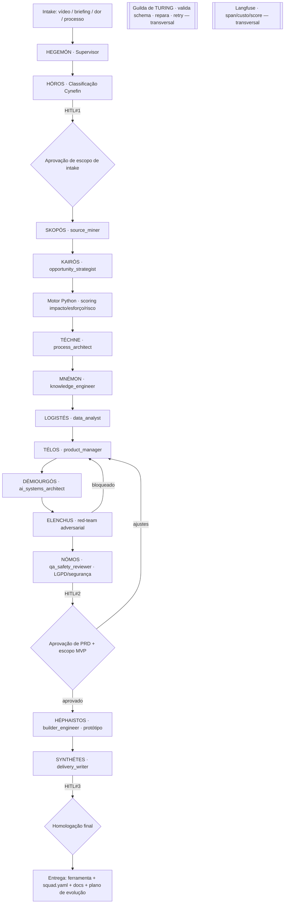

<div align="center">

# 🏛️ DÉDALO — Fábrica de Ferramentas IA

### Camada de transformação de conhecimento em software · Arquitetura multi-agente · Agnóstico de plataforma

[](./squad.yaml)
[](./PRD.md)
[](./LICENSE)
[](./squad.yaml)


*"De um vídeo, uma dor ou um processo — a uma ferramenta própria, auditável e evolutiva."*

</div>

---

## 🧭 Navegação

- [O nome](#-o-nome-dédalo) · [O que é](#-o-que-é) · [Invariante central](#-invariante-central-não-negociável)
- [Arquitetura](#-arquitetura-do-pipeline) · [Roster de agentes](#-roster-de-agentes-14-em-8-guildas)
- [Motor determinístico](#-motor-determinístico-python) · [Gates HITL](#-gates-hitl)
- [Início rápido](#-início-rápido) · [Estrutura](#-estrutura-de-arquivos)
- [Como usar nos principais LLMs de codificação](#-como-usar-nos-principais-llms-de-codificação)
- [Contratos & métricas](#-contratos--métricas-de-sucesso) · [Propriedade intelectual](#-propriedade-intelectual)

---

## 🏷️ O nome (DÉDALO)

**Dédalo** é o arquiteto-artífice do mito grego: aquele que **constrói** o que ninguém mais sabe
construir — do Labirinto às asas de cera. O squad herda a metáfora: é a **fábrica** que transforma
conhecimento bruto (vídeo, briefing, processo) em **ativos de software próprios**. O fio de Ariadne
aqui é a **rastreabilidade radical**: nenhuma feature se perde no labirinto sem um caminho de volta
à evidência que a originou.

> [!IMPORTANT]
> O DÉDALO **não é um gerador de ideias**. É um mecanismo **auditável** para converter vídeos,
> processos e capital intelectual em ferramentas mensuráveis — com determinismo, red-team
> obrigatório e auto-cura.

## 🎯 O que é

Uma **meta-fábrica multi-agente** (LangGraph `StateGraph`) que recebe uma fonte e devolve o pacote
completo: diagnóstico, **PRD rastreável**, arquitetura, backlog, **protótipo** e `squad.yaml`
compatível com qualquer plataforma de orquestração. **14 agentes** (10 de domínio + 4 de
governança) em **8 guildas**, supervisionados por `HEGEMÓN` e guardados por `ELENCHUS` (red-team)
e a `Guilda de Turing` (self-healing).

**Tese estratégica:** empresas competitivas não apenas compram ferramentas genéricas — elas
**constroem ativos próprios**, alimentados por conhecimento interno, dados reais e IA como
infraestrutura. O DÉDALO é a máquina que produz esses ativos.

## ⚖️ Invariante central (não-negociável)

> [!NOTE]
> Os **LLMs emitem exclusivamente JSON estruturado** (evidências, classificações, hipóteses).
> **Toda lógica determinística — scoring de oportunidade, priorização impacto/esforço/risco,
> métricas, validação — roda em Python puro** (`engine/`), jamais no LLM. Isso garante
> **reprodutibilidade, auditabilidade e rastreabilidade fonte → requisito → feature**.

| Atributo | Valor |
|---|---|
| Nº de agentes | 14 (10 de domínio + 4 de governança) em 8 guildas |
| Orquestração | LangGraph `StateGraph` · supervisor `HEGEMÓN` |
| Entry gate | Classificador Cynefin (`HÓROS`) |
| Handoffs | Contratos SACP em JSON validados por Pydantic |
| Determinismo | Motor Python de scoring/priorização (LLM nunca calcula) |
| Gates HITL | 3 (intake, escopo/aprovação, homologação final) |
| Anti-sycophancy | `ELENCHUS` — red-team adversarial com poder de bloqueio |
| Observabilidade | Langfuse (span/custo/latência/score por nó) |
| Self-healing | Guilda de Turing (validação schema + reparo + retry) |
| Saída | `sources.md`, `opportunity_map.yaml`, PRD, `architecture.md`, `backlog.md`, `squad.yaml`, protótipo, `validation_report.md` |

## 🗺️ Arquitetura do pipeline



### Roteamento adaptativo por Cynefin (`HÓROS`)
| Domínio | Comportamento do pipeline |
|---|---|
| **Óbvio** | Arquétipo conhecido ⇒ caminho curto: template pronto, 1 iteração, MVP enxuto |
| **Complicado** | Pipeline completo, 1 ciclo `ELENCHUS` |
| **Complexo** | Pipeline completo + 2 ciclos `ELENCHUS` + cenários + *data discovery* obrigatório |
| **Caótico** | Bloqueia avanço; força HITL para reformular o intake |

## 👥 Roster de agentes (14 em 8 guildas)

| Guilda | Codinome | Operacional | Papel |
|---|---|---|---|
| 0 · Orquestração | **HEGEMÓN** | `orchestrator` | Conduz o StateGraph, roteia, gere gates e retries |
| 0 · Orquestração | **HÓROS** | `cynefin_classifier` | Classifica Cynefin; entry gate (HITL#1) |
| I · Discovery | **SKOPÓS** | `source_miner` | Extrai/transcreve fontes; marca inacessíveis |
| I · Discovery | **KAIRÓS** | `opportunity_strategist` | Oportunidades + arquétipos + premissas de scoring |
| II · Diagnóstico | **TÉCHNE** | `process_architect` | Mapeia processo; sinaliza o que não automatizar |
| II · Diagnóstico | **MNÉMON** | `knowledge_engineer` | Capital intelectual em ontologia consultável |
| II · Diagnóstico | **LOGISTÉS** | `data_analyst` | Data map + KPIs; **roda todo cálculo (Python)** |
| III · Design | **TÉLOS** | `product_manager` | PRD + matriz de rastreabilidade |
| III · Design | **DÉMIOURGÓS** | `ai_systems_architect` | Arquitetura, build-vs-buy, backlog |
| IV · Build | **HÉPHAISTOS** | `builder_engineer` | Protótipo/MVP + smoke test (pós-HITL#2) |
| V · Validação | **ELENCHUS** | `redteam_auditor` | Red-team adversarial · **poder de bloqueio** |
| V · Validação | **NÓMOS** | `qa_safety_reviewer` | QA, segurança, LGPD, humano no loop |
| VI · Síntese | **SYNTHÉTES** | `delivery_writer` | Pacote de entrega + go/no-go (HITL#3) |
| VII · Turing | **TURING** | `self_healing` | Valida schema, repara, retry (transversal) |

## 🧮 Motor determinístico (Python)

A priorização "impacto/esforço/risco" é uma **função pura, versionada e auditável**. O LLM fornece
as notas 1–5; o Python computa o ranking (`engine/scoring.py`, pesos em `engine/weights.py`).

```python
WEIGHTS_V1 = {
    "impact": 0.35, "repetition": 0.20, "data_availability": 0.15,
    "effort_penalty": 0.15, "risk_penalty": 0.15,
}
# score = impact + repetition + data_availability − effort_penalty − risk_penalty
# sem aleatoriedade; mesma entrada ⇒ mesma ordem; limiar 0.45 exige justificativa.
```

> [!TIP]
> Rode você mesmo: `python3 scripts/score_opportunities.py --input examples/opportunity_map.json`
> — duas execuções produzem **exatamente** o mesmo ranking (determinismo verificável).

## 🚦 Gates HITL

| Gate | Posição | Decisão humana | Bloqueia? |
|---|---|---|---|
| **HITL#1** | pós-Cynefin | Confirma domínio + escopo de intake | Sim |
| **HITL#2** | pré-construção | Aprova PRD, escopo MVP, esforço e dependências | Sim |
| **HITL#3** | pré-export | Homologação final go/no-go | Sim |

Cada gate apresenta um **diff legível** (não JSON cru) e registra decisão + justificativa +
identidade + timestamp.

## ⚡ Início rápido

```bash
# 1) Priorização determinística de oportunidades (Python puro)
python3 scripts/score_opportunities.py --input examples/opportunity_map.json

# 2) Esboço de pacote de fontes (marca inacessíveis, nunca inventa)
python3 scripts/extract_sources.py --sources video.mp4 https://exemplo/reel print.png

# 3) Render do PRD com matriz de rastreabilidade (detecta features órfãs)
python3 scripts/build_prd.py --input <tool_prd.json> --output output/prd.md

# 4) Validação de entrega (go/no-go por presença/consistência)
python3 scripts/validate_delivery.py --root output

# 5) Demonstração do motor de scoring
python3 engine/scoring.py
```

## 📁 Estrutura de arquivos

```text
dedalo-fabrica-ferramentas-ia-squad/
├── squad.yaml                # manifesto (14 agentes, 16 tasks, 5 workflows)
├── PRD.md                    # PRD v3.0 (fonte da verdade)
├── agents/                   # 14 personas (HEGEMÓN … TURING)
├── tasks/                    # 16 tasks (S0–S14 + self-healing)
├── workflows/                # full_dedalo_pipeline + 4 trilhos
├── engine/                   # núcleo determinístico (scoring, metrics, weights)
├── schemas/                  # contratos Pydantic SACP (global_state, envelope, payloads)
├── observability/            # langfuse_hooks (fallback local)
├── scripts/                  # extract_sources, build_prd, score_opportunities, validate_delivery
├── archetypes/               # biblioteca A–E (8 arquétipos de ferramenta)
├── templates/                # sources, opportunity_map, tool_prd, architecture, backlog, validation
├── examples/                 # opportunity_map.json + 3 cenários
└── docs/                     # manual, design system, SACP, limitações, PRD
```

## 🤝 Como usar nos principais LLMs de codificação

**Prompt de ativação (copiável):**

```text
Assuma o squad DÉDALO (Fábrica de Ferramentas IA). Leia squad.yaml e a persona
agents/orchestrator.md (HEGEMÓN). Siga workflows/full_dedalo_pipeline.yaml (S0–S14).
Invariante: você (LLM) emite SOMENTE JSON estruturado; todo cálculo de scoring/priorização
roda em Python (engine/). Pare nos gates HITL#1/#2/#3. ELENCHUS faz red-team com poder de
bloqueio. Minha fonte é: <vídeo | briefing | dor | processo>.
```

<details>
<summary><b>Claude Code</b></summary>

1. Abra o repositório no Claude Code.
2. Cole o prompt de ativação acima.
3. Forneça a fonte (link/arquivo/texto). Aprove os gates HITL quando solicitado.
4. Rode os scripts de `scripts/` para a parte determinística.
</details>

<details>
<summary><b>Cursor</b></summary>

1. Adicione a pasta do squad ao workspace.
2. No chat, cole o prompt de ativação e referencie `@squad.yaml` e `@agents/orchestrator.md`.
3. Use o terminal integrado para os scripts Python determinísticos.
</details>

<details>
<summary><b>GitHub Copilot</b></summary>

1. Abra `squad.yaml` e `PRD.md` como contexto.
2. No Copilot Chat, cole o prompt de ativação.
3. Peça que mantenha o invariante "LLM=JSON, Python=cálculo".
</details>

<details>
<summary><b>Windsurf</b></summary>

1. Abra a pasta como projeto.
2. Cole o prompt de ativação no Cascade e fixe `agents/orchestrator.md`.
3. Avance fase a fase respeitando os gates HITL.
</details>

<details>
<summary><b>Cline / Roo</b></summary>

1. Aponte o agente para a pasta do squad.
2. Cole o prompt de ativação; permita execução de `scripts/*.py` (determinísticos).
3. Os artefatos vão para `output/`.
</details>

<details>
<summary><b>Continue.dev / Aider / Zed</b></summary>

1. Indexe a pasta do squad.
2. Cole o prompt de ativação como mensagem de sistema/contexto.
3. Use os schemas em `schemas/` para validar os JSON dos agentes.
</details>

<details>
<summary><b>ChatGPT / Gemini</b></summary>

1. Anexe `squad.yaml`, `PRD.md` e `agents/orchestrator.md`.
2. Cole o prompt de ativação.
3. Reproduza o motor de scoring localmente com `engine/scoring.py` (o LLM não calcula).
</details>

## 📐 Contratos & métricas de sucesso

O squad é considerado funcional quando:
- recebe fonte em vídeo/transcrição e classifica via Cynefin (HITL#1);
- extrai evidências com timestamps e confiança; marca fontes inacessíveis sem inventar;
- identifica ≥3 oportunidades, cada uma casada a um arquétipo e a uma evidência;
- **prioriza via motor Python (diff zero entre runs idênticos)**;
- gera PRD com matriz de rastreabilidade fonte→requisito→feature e `squad.yaml` válido;
- **ELENCHUS produz ≥1 ataque concreto e bloqueia plano com requisito alucinado**;
- **Turing repara ≥90% das falhas de schema** injetadas em teste;
- aplica revisão de segurança/LGPD; saúde/jurídico ⇒ humano no loop.

## 🛠️ Stack & invariantes

| Camada | Tecnologia |
|---|---|
| Orquestração | LangGraph `StateGraph` (referência) · supervisor `HEGEMÓN` |
| Contratos | Pydantic (fallback dataclasses) · SACP JSON |
| Determinismo | Python puro (`engine/`) · seed fixa · pesos versionados |
| Observabilidade | Langfuse (fallback sink local) |
| Portabilidade | Markdown · YAML · SQLite/CSV · local-first |

## 🔒 Propriedade intelectual

Nenhuma marca, prompt, texto ou ativo proprietário de terceiros é copiado. Fontes inacessíveis são
marcadas, nunca inventadas. Segredos/credenciais nunca são expostos. Ver [`NOTICE.md`](./NOTICE.md)
e [`LICENSE`](./LICENSE).

---

<div align="center">

**Licença: MIT. Criado por Marcio Bisognin. Instagram: [@marciobisognin](https://instagram.com/marciobisognin).**

</div>
