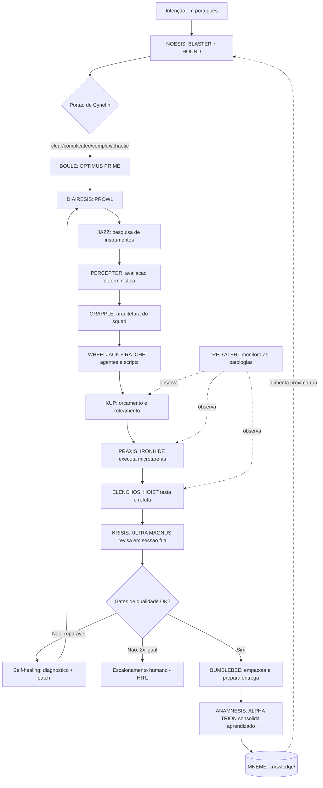

# PRD — Forge of Solus Prime

**Produto:** Forge of Solus Prime — o martelo dos Primes que forja novos squads
**Subtítulo:** Meta-squad soberano que projeta, executa, valida e faz evoluir squads autônomos sob a Disciplina FORJA
**Framework:** Disciplina FORJA (metodologia autoral)
**Versão:** 2.0 — reescrita autoral consolidada para construção
**Autor:** Marcio Bisognin
**Data:** 27/06/2026
**Idioma:** pt-BR
**Status:** Consolidado e pronto para a fase de construção do MVP
**Repositório alvo:** `Squads-Genius/squads/forge-of-solus-prime/`

> Nota de continuidade. Este documento substitui o rascunho "Maeve Kratos Keraunos Forge v1.1". Toda metodologia emprestada de produtos de terceiros foi removida e reescrita como framework autoral. As únicas ferramentas nomeadas são as que efetivamente rodam dentro do sistema (substrato técnico e scripts próprios).

---

## 0. Como ler este PRD

O documento tem três camadas de leitura:

1. **Conceitual** (seções 1–6) — o que é Forge of Solus Prime, a tese autoral e a Disciplina FORJA.
2. **Arquitetural** (seções 7–16) — o substrato técnico, os agentes, os contratos, os schemas e os scripts.
3. **Operacional** (seções 17–26) — requisitos, gates, métricas, roadmap, MVP e artefatos de referência executáveis.

Convenção de nomes: agentes em VERSAL greco-latina (ex.: `OPTIMUS PRIME`); atos do ciclo em itálico (ex.: *diaíresis*); estratos da Disciplina em VERSAL (ex.: `TÉLOS`); patologias em VERSAL com prefixo descritivo.

---

## 1. Síntese executiva

**Forge of Solus Prime** — codinome tomado do martelo ancestral de Solus Prime, a Prime ferreira que forjou as armas dos demais Primes na sua Forja — é um squad cuja entrega é **outros squads**. Recebe uma intenção em português, classifica-a, pesquisa instrumentos aplicáveis, projeta o time de agentes, decompõe o trabalho em microtarefas contratuais, executa em ciclo auditável, refuta o resultado, julga-o de forma independente, empacota e — a cada execução — consolida aprendizado reutilizável.

A diferença em relação a um gerador de arquivos é a **reflexividade**: Forge of Solus Prime não é só uma fábrica que produz squads; é o **primeiro squad forjado pela Disciplina FORJA**, e forja os demais sob exatamente as mesmas leis que aplica a si próprio. Ele come a própria ração. Se uma lei da Forja não se sustenta quando aplicada ao próprio Forge of Solus Prime, ela não entra no framework.

Capacidades-núcleo:

1. transformar intenção ampla em **briefing normalizado** com critérios de sucesso explícitos;
2. classificar a intenção por **Cynefin** e rotear esforço, autonomia e topologia de agentes de acordo;
3. **descobrir e avaliar** instrumentos open source com um motor de pontuação determinístico e auditável;
4. **projetar** o squad: agentes, tarefas, workflows, scripts, testes, documentação;
5. **executar** sob o Anel da Forja — planejar, decompor, agir, refutar, julgar, consolidar — com estado externo persistente;
6. acionar **múltiplos agentes apenas quando há paralelismo real, especialização ou revisão independente**;
7. **refutar e julgar** o resultado em sessão fria, separada de quem o produziu, antes de declarar pronto;
8. **economizar tokens** por fronteira determinística, cache, roteamento de modelos e contratos curtos;
9. **aprender**: cada ciclo deixa um padrão, um anti-padrão, um template, um conector ou uma economia para o próximo;
10. **empacotar** um squad portável, com manifesto neutro instalável em qualquer runtime de agente compatível.

A tese: cada squad produzido por Forge of Solus Prime é também um dado operacional que torna o próximo squad mais barato, mais correto e mais rápido de construir.

---

## 2. Tese autoral, posicionamento e nome

### 2.1 A tese autoral

Construir um agente não é construir um sistema autônomo. Escrever um prompt não é desenhar um processo. A maior parte das "fábricas de agentes" para na geração de arquivos porque confunde **o instrumento** (o agente, o prompt) com **o sistema que governa o instrumento** (o ciclo externo que agenda, decompõe, verifica, lembra e decide o próximo passo).

A Disciplina FORJA existe para impor essa distinção como arquitetura, não como conselho. Ela define cinco estratos, um ciclo canônico de sete atos, sete leis invariantes e seis patologias que todo squad sério precisa controlar. Forge of Solus Prime é a sua primeira aplicação.

### 2.2 Posicionamento

> **Uma ordem em português entra. Um squad validado, auditável e portável sai — e o sistema fica mais inteligente a cada ordem.**

Posicionamento operacional, não estético: o valor não é "gerar uma pasta bonita", é entregar um squad que **já foi exercitado** (testado, refutado, julgado) e que carrega o seu próprio ciclo de operação. Nenhuma entrega é considerada um squad de próxima geração se trouxer apenas agentes e prompts sem um ciclo operacional auditável anexado.

### 2.3 Nome recomendado e alternativas

Recomendação: **Forge of Solus Prime**. Razões: na mitologia Transformers, Solus Prime foi a Prime artesã que **forjou as armas dos outros Primes** com a sua Forja — então um sistema que forja outros squads é, literalmente, a Forja dela. Casa com a metodologia (a Disciplina **FORJA**) e com o elenco de agentes (Autobots). Pronúncia tranquila em pt-BR ("Fórdge ou Forja de Sólus Praim") e relíquia de lore profundo, pouco mencionada fora dos fãs.

| Nome | Origem | Leitura | Observação |
|---|---|---|---|
| **Forge of Solus Prime** | Transformers Prime — martelo de Solus Prime | A forja que cria os artefatos dos Primes | **Recomendado**; unifica produto + metodologia FORJA |
| APEX | Transformers Prime — Apex Armor | Palavra única; "ápex" = supremo | Mais curto; relíquia obscura e quase indestrutível |
| VECTOR SIGMA | G1 — artefato que dá vida | A matriz que gera novos seres | Forte tema de criação; segundo termo simples |
| OMEGA LOCK | Transformers Prime — chave que reconstrói mundos | O dispositivo que reforja Cybertron | Poderoso e obscuro; segunda palavra em inglês |
| REQUIEM BLASTER | Armada — arma lendária Mini-Con | O canhão de poder devastador | Poderosíssimo, porém conotação destrutiva/fúnebre |

Os **agentes** seguem o universo Transformers — um elenco Autobot, cada personagem escolhido pela função canônica que combina com o papel (ver §9). A **metodologia** (estratos, atos, leis, patologias) permanece a Disciplina FORJA autoral, por ser vocabulário conceitual que carrega significado próprio; se você quiser também tematizar esses termos, é um ajuste rápido. Se preferir preservar "Maeve" como persona orquestradora, a forma híbrida **Maeve / Forge of Solus Prime** mantém a persona na interface e o codinome na camada de squad.

---

## 3. A Disciplina FORJA — framework autoral

Esta é a contribuição central e original do documento. A Disciplina FORJA é a metodologia que governa **como** um squad autônomo é forjado e operado. Tem quatro componentes: os cinco **estratos**, o **Anel** de sete atos, as sete **leis invariantes** e as seis **patologias** com seus controles.

### 3.1 Os cinco estratos da Forja

Todo squad sério vive em cinco níveis de abstração. Confundi-los é a origem da maioria das falhas. A Forja exige que cada nível tenha artefatos próprios.

| Estrato | Étimo | O que é | Artefatos gerados |
|---|---|---|---|
| **TÉLOS** | τέλος, fim/propósito | A intenção bruta normalizada em critérios de sucesso verificáveis | `briefing.normalizado.yaml`, critérios de aceite, classificação Cynefin |
| **LÓGOS** | λόγος, razão/contrato | A estrutura racional: requisitos, grafo de tarefas, contratos de handoff | `grafo_requisitos.json`, schemas, contratos SACP |
| **ÓRGANON** | ὄργανον, instrumento | O aparato de execução: agentes, ferramentas permitidas, permissões, motores determinísticos | `agents/*.yaml`, allowlist de ferramentas, motores Python |
| **KÝKLOS** | κύκλος, ciclo | O sistema externo que agenda, executa, refuta, julga e decide o próximo passo | `LOOP.md`, `run_state.json`, `quality_report.json`, traços de observabilidade |
| **MNÉMĒ** | μνήμη, memória | A memória evolutiva que faz cada ciclo melhorar o próximo | `knowledge/` (padrões, anti-padrões, templates, conectores, skills) |

**Regra de arquitetura (Lei dos Cinco Estratos).** Nenhum squad gerado por Forge of Solus Prime é considerado completo se entregar apenas `TÉLOS`, `LÓGOS` e `ÓRGANON`. Para ser um squad de próxima geração, deve conter pelo menos um `KÝKLOS` auditável — ainda que em modo L1 *report-only* — e um gancho de `MNÉMĒ`. Agente sem ciclo é ferramenta, não squad.

**Implicação para o MVP.** A primeira travessia que o MVP precisa entregar é exatamente esta sequência de estratos:

```text
TÉLOS (briefing normalizado)
  → LÓGOS (grafo + contratos)
    → ÓRGANON (agentes + ferramentas avaliadas)
      → KÝKLOS L1 auditável (execução + refutação + julgamento)
        → MNÉMĒ (≥1 aprendizado consolidado)
```

Só depois disso o sistema avança para L2/L3.

### 3.2 O Anel da Forja — sete atos canônicos

O `KÝKLOS` não é um laço genérico; é um ciclo nomeado de sete atos. Cada ato tem entrada, saída e um critério de passagem (gate). O Anel é o coração operacional da Disciplina.

| Ato | Étimo | Função | Critério de passagem |
|---|---|---|---|
| 1. *NÓESIS* | νόησις, intelecção | Compreender a intenção e o estado atual | Briefing normalizado + Cynefin classificado |
| 2. *BOULḖ* | βουλή, deliberação | Decidir estratégia, autonomia e topologia | Plano de execução + nível L1/L2/L3 definido |
| 3. *DIAÍRESIS* | διαίρεσις, divisão | Decompor em 3–7 tarefas e microtarefas contratuais | Cada tarefa com entrada/saída/validação/custo/falha |
| 4. *PRÂXIS* | πρᾶξις, ação | Executar a microtarefa permitida | Artefato produzido + log + custo registrado |
| 5. *ÉLENCHOS* | ἔλεγχος, refutação | Refutar a alegação de "pronto" com testes e evidência | Validação determinística verde + evidência anexada |
| 6. *KRÍSIS* | κρίσις, juízo | Julgar friamente, em sessão separada, escopo/risco/autoengano | Veredito do revisor independente |
| 7. *ANÁMNĒSIS* | ἀνάμνησις, rememoração | Consolidar acertos e erros em memória reutilizável | ≥1 aprendizado registrado ou descarte explícito |

Fluxo do Anel:

```text
NÓESIS → BOULḖ → DIAÍRESIS → PRÂXIS → ÉLENCHOS → KRÍSIS → ANÁMNĒSIS
                                  ↑__________________|
                         (self-healing: reparo guiado por diagnóstico,
                          com retries limitados e escalonamento humano)
```

A volta de *KRÍSIS* para *DIAÍRESIS* não é repetição cega: é **reparo guiado por diagnóstico** (self-healing loop), descrito na §7.6. Falha idêntica duas vezes consecutivas interrompe o Anel e escala para humano.

### 3.3 As sete leis invariantes da Forja

As leis são invariantes de produto: todo squad forjado as obedece, e o `validate_squad.py` as verifica como gates. Elas codificam a sua arquitetura canônica.

1. **Lei da Fronteira Determinística.** O LLM **só emite JSON estruturado** (propostas, classificações, rascunhos). Todo cálculo, pontuação, contagem, orçamento, validação de schema e empacotamento é **Python puro e auditável** (`Decimal` para qualquer aritmética com consequência). Nenhum número que importa nasce de um modelo de linguagem.

2. **Lei do Contrato.** Todo handoff entre atos/agentes é um **contrato SACP** tipado (Pydantic v2), com emissor, receptor, estrato, ato, payload JSON validável por schema, evidências, veredito e custo. Não há passagem de bastão informal.

3. **Lei do Portão de Cynefin.** Nenhuma intenção é executada antes de ser classificada em *Clear / Complicated / Complex / Chaotic*. A classificação determina autonomia, profundidade de pesquisa e topologia de agentes. Caos nunca roda em modo autônomo.

4. **Lei do Mínimo Suficiente.** Contexto mínimo, agentes mínimos, complexidade mínima. Um agente novo só nasce por **responsabilidade exclusiva**; subagentes só existem com paralelismo real. Tarefa simples permanece simples.

5. **Lei do Élenchos.** Nenhum ato declara "pronto" sem refutação. "Funciona" exige evidência verificável (teste verde, schema válido, arquivo aberto e conferido). Ausência de evidência é tratada como falha, não como sucesso silencioso.

6. **Lei da Crise Independente.** A revisão é fria e adversarial, conduzida por um agente que **não participou da implementação** e em sessão sem o contexto de justificativa do executor. Autoavaliação não conta como julgamento.

7. **Lei da Anámnēsis.** Todo ciclo termina com aprendizado consolidado em `knowledge/` **ou** com descarte explícito e justificado. Aprendizado não pode ficar preso no chat; vira padrão, anti-padrão, template, conector ou regra de economia.

### 3.4 As patologias da Forja e seus controles

Loops autônomos adoecem de formas previsíveis. A Forja nomeia seis patologias e exige um controle obrigatório para cada uma. O agente `RED ALERT` (o supervisor, §8) monitora todas.

| Patologia | Étimo/sentido | Definição | Controle invariante |
|---|---|---|---|
| **PSEUDO-TÉLOS** | "falso fim" | Declarar concluído sem evidência de verificação | Lei do Élenchos: gate de evidência obrigatório antes de "pronto" |
| **OPACIDADE PROGRESSIVA** | opacidade crescente | Artefatos passam a funcionar sem que o operador os compreenda | Resumo humano + registro de decisão (ADR) + comentário de diff a cada ciclo |
| **DISPÊNDIO DESGOVERNADO** | gasto sem governo | Tokens, tempo e chamadas escalam sem orçamento | Orçamento por run + parada após 2 falhas iguais + roteamento de modelos |
| **ABDICAÇÃO** | abdicação do engenheiro | O humano confia no loop e abandona o papel de responsável | Gates HITL obrigatórios + explicabilidade + L3 só em rotinas allowlisted |
| **METÁSTASE DE AGENTES** | proliferação descontrolada | Criação de agentes redundantes "por garantia" | Lei do Mínimo Suficiente: agente só por responsabilidade exclusiva |
| **DERIVA DE CONTRATO** | deriva silenciosa | Contratos de handoff degradam ao longo do Anel (campos perdidos/coagidos) | Validação de schema em todo handoff + payload `extra="forbid"` + histórico append-only |

As três últimas são adições autorais que o rascunho anterior não nomeava como patologias de primeira classe — e são exatamente as que mais corroem fábricas de agentes na prática.

### 3.5 A escada de autonomia

A autonomia é graduada e derivada da classificação Cynefin, não escolhida à mão.

| Nível | Nome | Permissões | Cynefin típico |
|---|---|---|---|
| **L1** | *Report-only* | Analisa, recomenda, gera rascunhos; não altera fonte de verdade | Complex / Chaotic |
| **L2** | *Assisted fixes* | Altera localmente, testa, propõe commit; humano aprova publicação | Complicated |
| **L3** | *Unattended bounded* | Executa automaticamente tarefas allowlisted, com rollback e orçamento | Clear, escopo fechado |

Padrão do produto: **L1**. Subir de nível exige aprovação humana explícita registrada no `run_state.json`. Intenção classificada como *Chaotic* nunca sobe além de L1 — primeiro estabiliza-se o domínio, depois se decide.

---
## 4. Problema a resolver

Um gerador de squads produz estrutura e documentação, mas seis lacunas o separam de um sistema de execução real. Cada lacuna é endereçada por uma lei ou patologia da Forja.

1. **Pesquisa de instrumentos ausente.** Não descobre bibliotecas, CLIs, MCPs e padrões aplicáveis de forma sistemática. → `JAZZ` + `PERCEPTOR` (§11).
2. **Execução linear.** Geração em sequência, sem ciclo de refutação/correção com estado externo. → Anel da Forja (§3.2) sobre LangGraph StateGraph (§7).
3. **Memória procedural fraca.** O que se aprende num squad não vira melhoria do construtor. → Lei da Anámnēsis + `MNÉMĒ` (§12).
4. **Economia de tokens não sistematizada.** Falta regra automática de quando usar script, cache, resumo, subagente, modelo barato ou forte. → Lei da Fronteira Determinística + `KUP` (§13).
5. **Qualidade variável.** Sem refutação e juízo independente, um squad parece completo sem ter sido exercitado. → Leis do Élenchos e da Crise Independente (§3.3).
6. **Integração frágil e handoffs informais.** Ferramentas são citadas, não conectadas; e o estado se perde entre etapas. → Lei do Contrato + contratos SACP (§7.2) + conectores reais (§11).

E quatro lacunas de *governo* do loop, que viram patologias controladas: declarar pronto sem prova (PSEUDO-TÉLOS), perder compreensão dos artefatos (OPACIDADE PROGRESSIVA), estourar custo (DISPÊNDIO DESGOVERNADO) e abdicar do juízo humano (ABDICAÇÃO).

---

## 5. Objetivos do produto

### 5.1 Objetivo principal

Forjar squads funcionais — que se geram, se executam, se validam e melhoram — sob a Disciplina FORJA, usando pesquisa de instrumentos, ciclo auditável, multiagente sob demanda, memória evolutiva e fronteira determinística.

### 5.2 Objetivos específicos

- Converter intenção em **squad executável** com agentes, tarefas, workflows, scripts, testes, docs, exemplos e relatório de qualidade.
- Descobrir e **avaliar instrumentos** com motor determinístico auditável; criar adaptadores apenas para os aprovados.
- Operar o **Anel da Forja** com estado externo persistente, self-healing limitado e gates HITL.
- Usar **multiagente apenas quando agrega** paralelismo, especialização ou revisão independente.
- Consolidar aprendizado em **memória procedural**: padrões, anti-padrões, templates, conectores e skills.
- Reduzir custo por **fronteira determinística**, cache, roteamento de modelos e contratos curtos.
- Produzir squads **portáveis** via manifesto neutro instalável em runtimes de agente compatíveis.

---

## 6. Não objetivos

- Não copiar nem reembalar sistemas de terceiros; a metodologia é autoral.
- Não publicar, enviar ou fazer push sem autorização humana explícita.
- Não rodar loops *unattended* em repositórios reais sem allowlist, orçamento, rollback e nível aprovado.
- Não prometer perfeição; o sistema evidencia riscos, testes e limitações.
- Não depender de um único provedor de modelo.
- Não transformar todo problema em multiagente; o simples permanece simples (Lei do Mínimo Suficiente).

---

## 7. Público-alvo

**Usuário primário.** Marcio Bisognin, como criador e operador de squads para automação institucional, licitações e contratos, educação, pesquisa, conteúdo, software agent-ready, incubadora tecnológica e produtividade pessoal.

**Usuários secundários futuros.** Servidores públicos automatizando fluxos; educadores e pesquisadores; desenvolvedores que queiram squads portáveis; equipes que queiram catálogos internos de agentes/skills.

---

## 8. Arquitetura de referência

Forge of Solus Prime é construído sobre o substrato técnico que você já usa nos demais squads. Aqui as ferramentas nomeadas são **operacionais** — rodam dentro do sistema.

### 8.1 Substrato de orquestração — LangGraph StateGraph

O Anel da Forja é implementado como um `StateGraph`: cada **ato** é um nó, cada **handoff** é uma aresta que transporta um contrato SACP, e o self-healing é uma **aresta condicional** que decide entre avançar, reparar ou escalar. O estado global é append-only nos campos de histórico (contratos, aprendizados, falhas), preservando rastreabilidade total.

```python
# scripts/forge_graph.py — esqueleto do estado e do grafo
from __future__ import annotations
from typing import Annotated, Any, TypedDict
import operator

class ForjaState(TypedDict):
    # TÉLOS
    briefing_bruto: str
    briefing_normalizado: dict[str, Any]
    classificacao_cynefin: str          # clear|complicated|complex|chaotic
    nivel_autonomia: str                # L1|L2|L3
    # LÓGOS
    grafo_requisitos: dict[str, Any]
    contratos: Annotated[list[dict], operator.add]   # histórico SACP append-only
    # ÓRGANON
    ferramentas_avaliadas: list[dict[str, Any]]
    arquitetura: dict[str, Any]
    artefatos: dict[str, Any]
    # KÝKLOS
    run_state: dict[str, Any]
    relatorio_qualidade: dict[str, Any]
    orcamento: dict[str, Any]
    iteracao: int
    falhas: Annotated[list[dict], operator.add]
    # MNÉMĒ
    aprendizados: Annotated[list[dict], operator.add]
```

A topologia de nós (atos) e arestas condicionais (gates e self-healing) é descrita na §8.6.

### 8.2 Contrato de handoff — SACP (Structured Agent Communication Protocol)

Todo bastão passado entre atos é este contrato. `extra="forbid"` impede DERIVA DE CONTRATO (campos espúrios ou perdidos falham na validação).

```python
# scripts/sacp.py — contrato canônico de handoff
from __future__ import annotations
import datetime as dt
from decimal import Decimal
from enum import Enum
from typing import Any
from pydantic import BaseModel, ConfigDict, Field

class Estrato(str, Enum):
    TELOS = "telos"; LOGOS = "logos"; ORGANON = "organon"
    KYKLOS = "kyklos"; MNEME = "mneme"

class Veredito(str, Enum):
    APROVADO = "aprovado"; REPROVADO = "reprovado"
    REVISAR = "revisar"; ESCALAR = "escalar"

class CustoSACP(BaseModel):
    model_config = ConfigDict(extra="forbid")
    tokens_estimados: int = 0
    tokens_reais: int = 0
    chamadas_ferramenta: int = 0
    custo_monetario: Decimal = Field(default=Decimal("0"))

class ContratoSACP(BaseModel):
    """Handoff tipado entre dois atos/agentes do Anel da Forja."""
    model_config = ConfigDict(extra="forbid")
    contrato_id: str
    emissor: str                 # ex.: "JAZZ"
    receptor: str                # ex.: "PERCEPTOR"
    estrato: Estrato
    ato: str                     # ex.: "diairesis"
    timestamp: dt.datetime
    payload: dict[str, Any]      # SEMPRE JSON validável por schema
    schema_ref: str              # referência ao JSON Schema do payload
    evidencias: list[str] = Field(default_factory=list)
    veredito: Veredito = Veredito.REVISAR
    custo: CustoSACP = Field(default_factory=CustoSACP)
    requer_humano: bool = False
```

### 8.3 A fronteira determinística

A Lei da Fronteira Determinística traça uma linha clara entre o que o LLM faz e o que o Python faz.

| Lado do LLM (emite só JSON) | Lado do Python (determinístico, auditável) |
|---|---|
| Normalizar briefing em campos estruturados | Validar o briefing contra o schema |
| Classificar Cynefin (proposta) | Aplicar regras de roteamento de autonomia/topologia |
| Propor candidatas de ferramentas | **Pontuar** ferramentas (motor `Decimal`, §11) |
| Propor decomposição em tarefas | Verificar contrato de cada tarefa (entrada/saída/custo) |
| Rascunhar conteúdo de agentes/docs | Renderizar templates, contar tokens, montar ZIP |
| Sugerir correção numa falha | Aplicar patch, rodar testes, recolher evidência |

Regra prática: **se um número, um veredito de gate ou um corte de orçamento depende do resultado, o cálculo é Python**. O LLM nunca é a autoridade final sobre fatos verificáveis.

### 8.4 Observabilidade

Cada ato do Anel abre um *span* de tracing (Langfuse), com entrada, saída, custo e veredito. Isso dá: linha do tempo por run, custo por ato, taxa de retry por tarefa e detecção precoce de DISPÊNDIO DESGOVERNADO. A observabilidade é a base factual que alimenta o `KUP` e o `RED ALERT`.

### 8.5 Self-healing loop, gates HITL e o ciclo de reparo

- **Self-healing.** Em *ÉLENCHOS*/*KRÍSIS*, ao detectar falha: (1) diagnostica a causa a partir de logs/evidência; (2) propõe reparo (JSON); (3) aplica o patch (Python); (4) re-executa o gate. Retries limitados (padrão: 2). **Falha idêntica duas vezes consecutivas → escala para humano** e marca a tarefa como `escalar`.
- **Gates HITL obrigatórios.** Antes de: subir de nível de autonomia; incorporar ferramenta externa de risco médio/alto; qualquer ação destrutiva ou de publicação. O gate registra quem aprovou e quando no `run_state.json`.

### 8.6 Fluxo funcional (Anel + estratos)



---

## 9. Roster de agentes (autoral)

Cada agente tem **responsabilidade exclusiva** (Lei do Mínimo Suficiente) e se comunica apenas por contratos SACP (Lei do Contrato). O elenco é Autobot: cada personagem foi escolhido pela função canônica que combina com o papel.

| Agente | Personagem (origem) | Função no squad | Entrada (SACP) | Saída (SACP) |
|---|---|---|---|---|
| `OPTIMUS PRIME` | Líder Autobot, porta a Matrix | Orquestra o Anel, decide rota e autonomia | Briefing, estado, metas | Plano de execução + roteamento |
| `BLASTER` | Oficial de comunicações, decodifica transmissões | Normaliza intenção em briefing estruturado | Texto livre/YAML/JSON | `briefing.normalizado.yaml` + critérios |
| `HOUND` | Batedor de reconhecimento, levanta intel de campo | Monta contexto mínimo suficiente sem inflar tokens | Briefing, fontes, histórico | `evidence.md` + mapa de fontes |
| `GRAPPLE` | Arquiteto e engenheiro de construção | Define harness e arquitetura: ferramentas, permissões, schemas, critérios de pronto | Contexto + requisitos | Arquitetura + contrato de harness por agente |
| `PROWL` | Estrategista e tático, decompõe objetivos em planos | Converte objetivo em grafo de 3–7 tarefas + microtarefas | Briefing normalizado | DAG com dependências, paralelismo e gates |
| `JAZZ` | Operações especiais, explora e aprende sistemas externos | Pesquisa ferramentas, repositórios, CLIs, MCPs e padrões | Necessidades técnicas | `tool_candidates.json` |
| `PERCEPTOR` | Cientista, examina, mede e analisa | Avalia fit, licença, maturidade, risco e custo — determinístico | Candidatas | `tool_evaluation.json` + decisão |
| `WHEELJACK` | Inventor, cria novos mecanismos | Gera agentes com contratos completos | Arquitetura | `agents/*.yaml` |
| `RATCHET` | Engenheiro, fabrica e mantém a maquinaria | Gera scripts determinísticos, CLIs, adaptadores e conectores | Tarefas automatizáveis | `scripts/`, adaptadores, testes |
| `KUP` | Veterano, conhece o jeito mais eficiente de fazer | Decide script vs. modelo barato/forte vs. cache vs. subagente | Plano + orçamento | `token_budget.json` + roteamento |
| `RED ALERT` | Diretor de segurança, detecta anomalias | Monitora as seis patologias da Forja | Run state + logs + métricas | Alertas, bloqueios, escalonamentos |
| `IRONHIDE` | O brutamontes confiável, faz o trabalho pesado | Executa as microtarefas permitidas | Microtarefa | Artefato + logs |
| `HOIST` | Roda diagnósticos e checagens nos Autobots | Roda testes, valida schema, abre arquivos, confere outputs | Artefatos | Relatório de validação + evidência |
| `ULTRA MAGNUS` | Disciplinador, cobra o cumprimento das regras | Revisão fria e adversarial: escopo, risco, incoerência, autoengano | Diff/artefatos | Veredito + correções exigidas |
| `ALPHA TRION` | Arquivista ancestral, guarda os registros de Cybertron | Transforma erros/acertos em padrões, templates, skills | Logs, reviews, resultados | Patches de `knowledge/` |
| `BUMBLEBEE` | Mensageiro e courier, leva e entrega | Empacota ZIP, README, PRD, manifesto, índices | Squad validado | Pacote final + relatório |

A liderança fica com `OPTIMUS PRIME` — coerente com a Forge of Solus Prime, o artefato dos Primes. O arquiteto `GRAPPLE` projeta, o inventor `WHEELJACK` cria os agentes, o cientista `PERCEPTOR` avalia os instrumentos, o vigia `RED ALERT` caça as patologias e o arquivista `ALPHA TRION` é a memória do sistema.

---

## 10. O Portão de Cynefin (intake)

Toda intenção passa pelo Portão antes de qualquer ação (Lei do Portão de Cynefin). A classificação é proposta pelo LLM (JSON) e **decidida por regra determinística** de roteamento.

| Domínio | Sinais | Roteamento determinístico |
|---|---|---|
| **Clear** | Objetivo fechado, solução conhecida, baixo risco | Modo determinístico; L3 permitido em rotina allowlisted; pesquisa mínima |
| **Complicated** | Requer análise/expertise, mas há resposta certa | Pesquisa de instrumentos + arquitetura; L2; multiagente sob demanda |
| **Complex** | Resposta só emerge por experimentação | Spikes isolados + ciclos curtos; L1; refutação reforçada |
| **Chaotic** | Instável, sem padrão claro | Estabilizar primeiro (rascunho/diagnóstico); L1 estrito; sem automação |

O Portão grava no `run_state.json` a classe, a justificativa e o nível de autonomia derivado — material para auditoria e para o `RED ALERT`.

---

## 11. Modos de operação

Os modos são **resultados** da classificação Cynefin, não escolhas avulsas.

- **Modo 0 — Blueprint.** Só pesquisa e PRD/arquitetura; não implementa. Útil para decisão estratégica.
- **Modo 1 — Forja determinística (`--no-llm`).** Gera estrutura com templates e regras locais; custo baixo, reprodutibilidade alta.
- **Modo 2 — Forja assistida por pesquisa.** Descobre e inspeciona instrumentos; sugere conectores; aprovação humana para integrações sensíveis.
- **Modo 3 — Anel assistido (L2).** Executa com `IRONHIDE`/`HOIST`/`ULTRA MAGNUS`; corrige até o limite; pode criar commit local, nunca push sem autorização.
- **Modo 4 — Multiagente controlado.** Agentes paralelos em tarefas independentes, com integração e juízo final adversarial. Para squads complexos (pesquisa + código + design + docs + testes).
- **Modo 5 — *Unattended* limitado (L3).** Só para baixo risco e escopo fechado, com allowlist, orçamento, timeout, rollback e logs.

---
## 12. Pesquisa e avaliação de instrumentos

`JAZZ` descobre; `PERCEPTOR` ensaia. A pontuação é determinística (Lei da Fronteira Determinística): o LLM propõe candidatas e estima métricas qualitativas, mas o **score final é Python com `Decimal`** — auditável e reproduzível.

### 12.1 Pipeline

1. **Descoberta.** Buscar índices públicos de pacotes e repositórios (índices Python, índices Node, hospedagem de repositórios, catálogos MCP) pelos termos do briefing. *Estes são serviços que o sistema consome via conectores próprios (§14), não recomendações de produto.*
2. **Triagem.** Licença, atividade (releases/commits/issues), linguagem, instalação, maturidade, sinais de segurança.
3. **Fit técnico.** A ferramenta resolve uma parte real do squad?
4. **Spike isolado.** Testar instalação/comando em ambiente temporário, quando seguro.
5. **Decisão.** Incorporar, criar adaptador, citar como referência, ou rejeitar.
6. **Registro.** Evidência em `tool_evaluation.json`.
7. **Aprendizado.** Se útil, vira template de conector ou skill em `knowledge/connectors/`.

### 12.2 Motor de pontuação determinístico (script de referência)

```python
# scripts/evaluate_tool.py — motor de pontuação auditável (sem LLM)
from __future__ import annotations
from decimal import Decimal, getcontext

getcontext().prec = 12

# Pesos canônicos (somam 1.00) — versionados e auditáveis
PESOS: dict[str, Decimal] = {
    "fit":            Decimal("0.25"),  # resolve necessidade real do squad
    "licenca":        Decimal("0.20"),  # MIT/Apache/BSD pontuam alto
    "manutencao":     Decimal("0.15"),  # releases/commits/issues recentes
    "seguranca":      Decimal("0.15"),  # ausência de execução remota opaca
    "instalacao":     Decimal("0.10"),  # CLI/API/MCP simples
    "testabilidade":  Decimal("0.10"),  # tem comando verificável
    "interop_agente": Decimal("0.05"),  # CLI/API/MCP/hooks p/ agentes
}

LIMIAR_INCORPORAR = Decimal("0.70")
LIMIAR_ADAPTAR    = Decimal("0.50")

def pontuar(metricas: dict[str, Decimal]) -> Decimal:
    """Cada métrica em [0,1]. Retorna score determinístico em [0,1]."""
    faltando = set(PESOS) - set(metricas)
    if faltando:
        raise ValueError(f"métricas ausentes: {sorted(faltando)}")
    fora = {k: v for k, v in metricas.items() if not (Decimal(0) <= v <= Decimal(1))}
    if fora:
        raise ValueError(f"métricas fora de [0,1]: {fora}")
    score = sum(PESOS[k] * metricas[k] for k in PESOS)
    return score.quantize(Decimal("0.0001"))

def decidir(score: Decimal, risco: str) -> str:
    if risco == "high":
        return "reject"            # risco alto nunca incorpora automaticamente
    if score >= LIMIAR_INCORPORAR:
        return "incorporate"
    if score >= LIMIAR_ADAPTAR:
        return "adapt"
    return "watch"
```

### 12.3 Saída esperada

```json
{
  "tool": "nome",
  "url": "https://...",
  "license": "MIT",
  "use_case": "o que resolve",
  "metrics": {"fit": 0.9, "licenca": 1.0, "manutencao": 0.8, "seguranca": 0.7,
              "instalacao": 0.9, "testabilidade": 0.8, "interop_agente": 1.0},
  "fit_score": 0.0,
  "risk_level": "low|medium|high",
  "integration_mode": "cli|api|mcp|library|reference_only",
  "decision": "incorporate|adapt|reject|watch",
  "evidence": []
}
```

---

## 13. Memória evolutiva (estrato MNÉMĒ)

Três níveis, com fronteiras rígidas (controle de "memória poluída").

### 13.1 Memória de execução (temporária, por run)

Briefing, plano, tarefas, ferramentas avaliadas, logs, validações, falhas, correções, custos, decisões.

```text
runs/<timestamp>/run_state.json
runs/<timestamp>/evidence.md
runs/<timestamp>/tool_evaluation.json
runs/<timestamp>/quality_report.json
runs/<timestamp>/token_budget.json
```

### 13.2 Memória procedural (reutilizável)

Novo padrão de PRD, template de agente, checklist de gate, conector testado, erro comum, regra de economia de tokens, padrão de decomposição de microtarefas.

```text
knowledge/patterns/
knowledge/anti_patterns/
knowledge/templates/
knowledge/connectors/
knowledge/skills/
```

### 13.3 Memória institucional (estável)

Preferências do operador, convenções de squads, caminhos de repositórios, padrões de publicação, estilo de README/PRD. **Não vive no squad gerado**; vive na memória durável do orquestrador. Logs temporários nunca contaminam este nível.

A Lei da Anámnēsis fecha o ciclo: ao final de cada run, `ALPHA TRION` registra ≥1 aprendizado nestes diretórios ou justifica o descarte.

---

## 14. Economia de tokens (KUP)

### 14.1 Estratégias obrigatórias

1. **Script antes de LLM** para parsing, validação, empacotamento, contagem, schema e checks repetitivos.
2. **Resumo incremental** de fontes grandes em `evidence.md`.
3. **Subagente com contexto mínimo** apenas quando há paralelismo real.
4. **Roteamento de modelos** por complexidade: barato para classificação, forte para arquitetura/juízo.
5. **Cache de pesquisa** por URL/repo/hash.
6. **Deduplicação de fontes** antes de síntese.
7. **Validação determinística** antes de revisão semântica.
8. **Contratos de prompt curtos** para agentes repetitivos.
9. **Parada após 2 falhas iguais.**
10. **Orçamento por run** em tokens, tempo e chamadas externas.

### 14.2 Artefato de custo

```json
{
  "estimated_token_budget": 0,
  "actual_or_estimated_usage": 0,
  "model_routing": [],
  "scripted_steps": [],
  "llm_steps": [],
  "savings_opportunities": []
}
```

O `token_budget.json` é gerado por `token_budget.py` a partir dos *spans* de observabilidade — números reais, não estimativa de modelo.

---

## 15. Estrutura de arquivos do construtor

```text
forge-of-solus-prime/
├── README.md
├── PRD.md
├── squad.yaml
├── AGENTS.md
├── LOOP.md
├── CONVENTIONS.md
├── requirements.txt
├── pyproject.toml
├── agents/
│   ├── optimus.yaml
│   ├── blaster.yaml
│   ├── hound.yaml
│   ├── grapple.yaml
│   ├── prowl.yaml
│   ├── jazz.yaml
│   ├── perceptor.yaml
│   ├── wheeljack.yaml
│   ├── ratchet.yaml
│   ├── kup.yaml
│   ├── red-alert.yaml
│   ├── ironhide.yaml
│   ├── hoist.yaml
│   ├── ultra-magnus.yaml
│   ├── alpha-trion.yaml
│   └── bumblebee.yaml
├── tasks/
│   ├── 01_noesis_intake.yaml
│   ├── 02_boule_estrategia.yaml
│   ├── 03_diairesis_decomposicao.yaml
│   ├── 04_jazz_pesquisa.yaml
│   ├── 05_perceptor_avaliacao.yaml
│   ├── 06_grapple_arquitetura.yaml
│   ├── 07_praxis_geracao.yaml
│   ├── 08_elenchos_verificacao.yaml
│   ├── 09_krisis_revisao.yaml
│   └── 10_anamnesis_consolidacao.yaml
├── workflows/
│   ├── anel_completo.yaml
│   ├── apenas_pesquisa.yaml
│   ├── forja_deterministica.yaml
│   ├── execucao_assistida.yaml
│   └── consolidacao_aprendizado.yaml
├── scripts/
│   ├── forge.py                 # CLI principal
│   ├── forge_graph.py           # StateGraph + nós dos atos
│   ├── sacp.py                  # contratos SACP (Pydantic v2)
│   ├── cynefin_gate.py          # roteamento determinístico
│   ├── discover_tools.py        # JAZZ
│   ├── evaluate_tool.py         # PERCEPTOR (motor Decimal)
│   ├── token_budget.py          # KUP
│   ├── validate_squad.py        # gates de qualidade
│   ├── build_pack.py            # BUMBLEBEE (manifesto neutro + ZIP)
│   └── consolidate_learning.py  # ALPHA TRION (report-only no MVP)
├── connectors/
│   ├── github.py
│   ├── pypi_registry.py
│   ├── npm_registry.py
│   ├── mcp_catalog.py
│   └── local_cli.py
├── schemas/
│   ├── briefing.schema.json
│   ├── sacp_contract.schema.json
│   ├── agent.schema.json
│   ├── task.schema.json
│   ├── workflow.schema.json
│   ├── tool_evaluation.schema.json
│   └── quality_report.schema.json
├── knowledge/
│   ├── patterns/
│   ├── anti_patterns/
│   ├── templates/
│   ├── connectors/
│   └── skills/
├── runs/
├── tests/
├── examples/
│   └── briefing_exemplo.yaml
└── docs/
```

---

## 16. Schemas e contratos principais

### 16.1 Briefing (TÉLOS)

```yaml
project_name: string
objective: string
problem: string
target_audience: string
expected_outputs: []
constraints: []
integrations: []
security_level: low|medium|high
human_approval_requirements: []
success_metrics: []
budget_limit:
  tokens: integer
  money: number
  time_minutes: integer
preferred_models: []
autonomy_level: L1|L2|L3        # proposto; pode ser sobrescrito pelo Portão de Cynefin
cynefin_hint: clear|complicated|complex|chaotic   # opcional
```

### 16.2 Contrato de tarefa (LÓGOS)

```yaml
id: string
description: string
assigned_agent: string
act: noesis|boule|diairesis|praxis|elenchos|krisis|anamnesis
dependencies: []
input_schema: object
output_schema: object
validation_rules: []
timeout_minutes: integer
retry_policy:
  max_attempts: integer
  stop_on_same_failure: 2
human_approval: boolean
failure_behavior: escalate|retry|rollback|skip_with_report
cost_ceiling:
  tokens: integer
  tool_calls: integer
```

### 16.3 Relatório de qualidade (KÝKLOS)

```json
{
  "status": "pass|warn|fail",
  "score": 0,
  "cynefin": "clear|complicated|complex|chaotic",
  "autonomy_level": "L1|L2|L3",
  "files_generated": [],
  "validations": [],
  "tests": [],
  "pathologies_checked": ["pseudo_telos","opacidade","dispendio","abdicacao","metastase","deriva"],
  "risks": [],
  "human_review_items": [],
  "tool_evaluations": [],
  "token_economy": {},
  "learnings": [],
  "recommendation": "ship|revise|block"
}
```

O campo `pathologies_checked` materializa a §3.4 como gate: o relatório só fecha se as seis patologias tiverem sido verificadas.

---

## 17. Workflows principais

### 17.1 Anel completo

`NÓESIS` → `BOULḖ` → `DIAÍRESIS` → pesquisa (`JAZZ`) → avaliação (`PERCEPTOR`) → arquitetura (`GRAPPLE`) → geração (`WHEELJACK`/`RATCHET`) → orçamento (`KUP`) → `PRÂXIS` (`IRONHIDE`) → `ÉLENCHOS` → `KRÍSIS` → gates → empacotar (`BUMBLEBEE`) → `ANÁMNĒSIS` (`ALPHA TRION`) → relatório.

### 17.2 Apenas pesquisa

Saídas: matriz de fontes, `tool_evaluation.json`, proposta de arquitetura, roadmap, riscos, decisão de implementação. Sem geração de código.

### 17.3 Execução assistida

Pré-requisito: autorização para construir. Saídas: squad gerado, testes, exemplo executado, `quality_report.json`, ZIP, commit local ou PR pronto (sem push automático).

### 17.4 Consolidação de aprendizado

Executado ao fim de toda run. Perguntas obrigatórias de `ALPHA TRION`: o que falhou? o que foi resolvido de forma reutilizável? que checklist/template/script deve nascer? que skill criar/atualizar? que padrão evitar? que economia de tokens foi identificada?

---
## 18. Requisitos funcionais

| ID | Requisito | Lei/estrato associado |
|---|---|---|
| RF-01 | Aceitar pedido em linguagem natural e convertê-lo em briefing estruturado | TÉLOS |
| RF-02 | Aceitar também briefing formal YAML/JSON com schema e aliases | TÉLOS |
| RF-03 | Classificar a intenção por Cynefin e derivar autonomia/topologia | Lei do Portão de Cynefin |
| RF-04 | Pesquisar instrumentos candidatos em índices públicos quando aplicável | ÓRGANON |
| RF-05 | Pontuar instrumentos por motor determinístico (fit/licença/maturidade/risco/instalação/interop) | Lei da Fronteira Determinística |
| RF-06 | Gerar squad completo: agentes, tarefas, workflows, scripts, testes, exemplos, docs, relatório | ÓRGANON + KÝKLOS |
| RF-07 | Decompor cada objetivo em 3–7 tarefas + microtarefas contratuais | Anel (*diaíresis*) |
| RF-08 | Operar o Anel com estado externo, self-healing limitado e gates | KÝKLOS |
| RF-09 | Usar multiagente só com paralelismo/especialização/revisão independente | Lei do Mínimo Suficiente |
| RF-10 | Revisar de forma fria e adversarial, separada do executor | Lei da Crise Independente |
| RF-11 | Consolidar aprendizado em padrões/anti-padrões/templates/conectores/skills | Lei da Anámnēsis |
| RF-12 | Estimar custo, rotear modelos e preferir scripts determinísticos | Economia de tokens |
| RF-13 | Empacotar ZIP, manifesto neutro, relatório e instruções de ativação | BUMBLEBEE |
| RF-14 | Exportar manifesto portável instalável em runtimes de agente compatíveis | Portabilidade |
| RF-15 | Impedir ação externa/destrutiva ou publicação sem aprovação, com registro | Gates HITL |

> Nota sobre RF-14: o pacote exporta `AGENTS.md` + contratos SACP + `LOOP.md` num formato neutro. Não há acoplamento a um runtime específico nem enumeração de produtos; qualquer runtime que leia o manifesto neutro instala o squad.

---

## 19. Requisitos não funcionais

| Categoria | Requisito |
|---|---|
| Portabilidade | Rodar em Termux e em notebook Linux/Windows/WSL quando possível |
| Reprodutibilidade | Modo `--no-llm` para geração determinística básica |
| Auditabilidade | Logs, `run_state`, `evidence`, `quality_report`, *spans* de observabilidade |
| Baixo custo | Cache, scripts, roteamento de modelos, orçamento por run |
| Segurança | Denylist, aprovação humana, sandbox, sem segredos em logs |
| Manutenibilidade | Módulos pequenos e testáveis; fronteira determinística clara |
| Interoperabilidade | YAML/JSON/Markdown, CLI, manifesto neutro |
| Escalabilidade | Suportar squads simples e complexos sem inflar agentes |

---

## 20. Quality gates

Cada gate mapeia a uma lei ou patologia e é verificado por `validate_squad.py`.

1. **Gate de briefing** — objetivo, público, outputs e critérios claros (TÉLOS).
2. **Gate de Cynefin** — classe registrada com justificativa e autonomia derivada.
3. **Gate de pesquisa** — instrumentos avaliados com evidência e score determinístico.
4. **Gate de arquitetura** — agentes sem sobreposição (anti-METÁSTASE).
5. **Gate de tarefa** — microtarefas com contrato completo.
6. **Gate de contrato** — todo handoff valida o schema SACP (anti-DERIVA).
7. **Gate de workflow** — dependências, retries, timeouts, falhas e gates HITL definidos.
8. **Gate de script** — scripts compilam, têm dry-run quando aplicável e tratam erro.
9. **Gate de teste** — testes gerados passam (anti-PSEUDO-TÉLOS / Lei do Élenchos).
10. **Gate de segurança** — sem segredos, sem ação externa não aprovada.
11. **Gate de custo** — orçamento estimado e estratégia de economia registrados (anti-DISPÊNDIO).
12. **Gate de compreensão** — resumo humano + ADR + comentário de diff (anti-OPACIDADE).
13. **Gate de aprendizado** — aprendizados consolidados ou descartados explicitamente (Lei da Anámnēsis).

---

## 21. Métricas de sucesso

| Métrica | Meta MVP | Meta v1 |
|---|---:|---:|
| Squads gerados com os cinco estratos | 100% | 100% |
| Squads com testes executáveis | 80% | 95% |
| Instrumentos avaliados por run complexo | 3–10 | 5–20 |
| Redução de retrabalho manual | 30% | 60% |
| Runs com relatório de qualidade real | 100% | 100% |
| Aprendizados consolidados por run | 1–3 | 3–7 |
| Falhas repetidas sem escalonamento | 0 | 0 |
| Cobertura de verificação das 6 patologias | 100% | 100% |
| Economia por scripts/cache | medida | otimizada por benchmark |

---

## 22. Riscos e mitigação

A maioria dos riscos é exatamente uma patologia da Forja (§3.4); aqui ficam também os riscos de engenharia que não são patologias de loop.

| Risco | Impacto | Mitigação |
|---|---|---|
| PSEUDO-TÉLOS (declarar pronto sem prova) | Alto | Lei do Élenchos: gate de evidência obrigatório |
| DISPÊNDIO DESGOVERNADO (estouro de custo) | Alto | Orçamento por run, cache, scripts, parada após 2 falhas iguais |
| ABDICAÇÃO (humano abandona o juízo) | Alto | Gates HITL, explicabilidade, L3 só allowlisted |
| OPACIDADE PROGRESSIVA | Médio/Alto | Resumo humano + ADR + diff commentary por ciclo |
| METÁSTASE DE AGENTES | Médio | Lei do Mínimo Suficiente: agente só por responsabilidade exclusiva |
| DERIVA DE CONTRATO | Médio | Schema SACP em todo handoff, `extra="forbid"`, histórico append-only |
| Loop infinito | Alto | Timeout, max iterations, parada por falha repetida |
| Autoengano do agente | Alto | Lei da Crise Independente: revisão fria separada |
| Instrumento inseguro | Alto | Sandbox, licença, inspeção; risco alto nunca incorpora automaticamente |
| Segredos em logs | Alto | Denylist, secret scan, redaction |
| Dependência de modelo forte | Médio | Modo determinístico + scripts |
| Publicação indevida | Alto | Aprovação explícita para push/envio/publicação |
| Memória poluída | Médio | Separação rígida: execução / procedural / institucional |

---

## 23. MVP: escopo, prontidão e aceite

### 23.1 Definition of Ready (entrar em construção)

| Decisão | Recomendação |
|---|---|
| Nome do produto | `Forge of Solus Prime` (confirmar; alternativas na §2.3) |
| Estratégia | Squad experimental novo; não sobrescrever forge atual no 1º ciclo |
| Escopo do MVP | Gerador determinístico + Anel L1 auditável + pesquisa básica + memória procedural local |
| Autonomia padrão | L1 *report-only* |
| Repositório alvo | `Squads-Genius/squads/forge-of-solus-prime/` |
| Publicação | Só após validação local e autorização explícita |

### 23.2 Escopo fechado do MVP

`README.md` premium; `PRD.md`; `squad.yaml`; `AGENTS.md`; `LOOP.md` com L1/L2/L3; `CONVENTIONS.md`; `schemas/briefing.schema.json`, `sacp_contract.schema.json`, `tool_evaluation.schema.json`, `quality_report.schema.json`; `scripts/forge.py`, `sacp.py`, `cynefin_gate.py`, `discover_tools.py`, `evaluate_tool.py`, `token_budget.py`, `validate_squad.py`; `agents/` mínimos; `tasks/` contratuais; `workflows/anel_completo.yaml`; `examples/briefing_exemplo.yaml`; `tests/` (existência, schema, CLI, geração); `quality_report.example.json`.

### 23.3 Fora do MVP

Execução L3 *unattended* real; publicação automática; integração credenciada com instrumentos externos; MCPs customizados complexos; marketplace público de packs; UI web.

### 23.4 Definition of Done

```bash
python scripts/forge.py plan     --briefing examples/briefing_exemplo.yaml
python scripts/forge.py init     --briefing examples/briefing_exemplo.yaml --out runs/demo --mode L1
python scripts/cynefin_gate.py   --briefing examples/briefing_exemplo.yaml --out runs/demo/cynefin.json
python scripts/discover_tools.py --briefing examples/briefing_exemplo.yaml --out runs/demo/tool_candidates.json
python scripts/evaluate_tool.py  --candidates runs/demo/tool_candidates.json --out runs/demo/tool_evaluation.json
python scripts/token_budget.py   --run runs/demo/run_state.json --out runs/demo/token_budget.json
python scripts/validate_squad.py --root runs/demo
python -m pytest -q
```

Artefatos não vazios exigidos em `runs/demo/`: `squad.yaml`, `AGENTS.md`, `LOOP.md`, `CONVENTIONS.md`, `run_state.json`, `evidence.md`, `cynefin.json`, `tool_evaluation.json`, `token_budget.json`, `quality_report.json`.

### 23.5 Critérios de aceite

O MVP é aceito quando conseguir, sem credenciais externas, em modo L1: receber briefing em português e normalizá-lo; classificar Cynefin; pesquisar ≥3 instrumentos e avaliá-los com score determinístico; gerar o squad com os cinco estratos; decompor em 3–7 tarefas; rodar validação local real; produzir relatório de economia de tokens; registrar ≥1 aprendizado; empacotar ZIP validado; verificar as 6 patologias; e produzir `Definition of Done` por tarefa e por Anel — sem publicar nem executar ação externa destrutiva.

---

## 24. Backlog técnico (épicos)

- **Épico 1 — Estrutura e contratos.** Pasta do squad; `README/PRD/squad.yaml/AGENTS/LOOP/CONVENTIONS`; schemas JSON; `sacp.py`; manifesto de agentes/tarefas/workflows.
- **Épico 2 — Forge CLI.** `forge.py` com `plan`, `init`, `validate`; `forge_graph.py` com os nós dos atos.
- **Épico 3 — Pesquisa.** `discover_tools.py` + conectores (`github/pypi/npm/mcp`); `tool_candidates.json`.
- **Épico 4 — Avaliação.** `evaluate_tool.py` (motor `Decimal`); `tool_evaluation.json`.
- **Épico 5 — Anel L1 auditável.** `run_state.json`, `evidence.md`, `token_budget.json`, `quality_report.json`; sem alterar repositórios externos nem publicar.
- **Épico 6 — Testes.** Schemas, CLI, geração de estrutura, validação do squad gerado, ZIP final.
- **Épico 7 — Memória.** `knowledge/{patterns,anti_patterns,templates,connectors,skills}`; `consolidate_learning.py` (report-only).
- **Épico 8 — Empacotamento.** `build_pack.py` (manifesto neutro + ZIP); README premium; `git diff --check` antes de qualquer commit futuro.

---

## 25. Artefatos de referência — scripts do sistema

Esqueletos prontos para a construção. São **ferramentas do próprio sistema**, não dependências citadas.

### 25.1 `forge.py` — contrato de CLI

```python
# scripts/forge.py — orquestrador de linha de comando (esqueleto)
from __future__ import annotations
import argparse, json, pathlib, sys

def cmd_plan(args: argparse.Namespace) -> int:
    # NÓESIS + BOULḖ + DIAÍRESIS (até o grafo de tarefas), sem executar PRÂXIS
    briefing = pathlib.Path(args.briefing).read_text(encoding="utf-8")
    plano = {"mode": "plan", "tasks_3_7": [], "cynefin": None, "autonomy": args.mode}
    print(json.dumps(plano, ensure_ascii=False, indent=2))
    return 0

def cmd_init(args: argparse.Namespace) -> int:
    # Travessia completa dos cinco estratos em modo L1 report-only
    out = pathlib.Path(args.out); out.mkdir(parents=True, exist_ok=True)
    # ... gerar TÉLOS → LÓGOS → ÓRGANON → KÝKLOS(L1) → MNÉMĒ ...
    return 0

def cmd_validate(args: argparse.Namespace) -> int:
    from validate_squad import validar
    rel = validar(pathlib.Path(args.root))
    print(json.dumps(rel, ensure_ascii=False, indent=2))
    return 0 if rel["status"] != "fail" else 1

def main(argv: list[str] | None = None) -> int:
    p = argparse.ArgumentParser(prog="forge")
    sub = p.add_subparsers(required=True)
    a = sub.add_parser("plan");     a.add_argument("--briefing", required=True); a.add_argument("--mode", default="L1"); a.set_defaults(fn=cmd_plan)
    b = sub.add_parser("init");     b.add_argument("--briefing", required=True); b.add_argument("--out", required=True); b.add_argument("--mode", default="L1"); b.set_defaults(fn=cmd_init)
    c = sub.add_parser("validate"); c.add_argument("--root", required=True);     c.set_defaults(fn=cmd_validate)
    args = p.parse_args(argv)
    return args.fn(args)

if __name__ == "__main__":
    sys.exit(main())
```

### 25.2 `validate_squad.py` — gates como código

```python
# scripts/validate_squad.py — verifica os cinco estratos e as patologias (esqueleto)
from __future__ import annotations
import json, pathlib

ESTRATOS_OBRIGATORIOS = {
    "telos":   ["briefing.normalizado.yaml"],
    "logos":   ["grafo_requisitos.json"],
    "organon": ["squad.yaml", "AGENTS.md"],
    "kyklos":  ["LOOP.md", "run_state.json", "quality_report.json"],
    "mneme":   ["evidence.md"],
}
PATOLOGIAS = ["pseudo_telos","opacidade","dispendio","abdicacao","metastase","deriva"]

def _existe_nao_vazio(raiz: pathlib.Path, nome: str) -> bool:
    f = raiz / nome
    return f.exists() and f.stat().st_size > 0

def validar(raiz: pathlib.Path) -> dict:
    faltando, validacoes = [], []
    for estrato, arquivos in ESTRATOS_OBRIGATORIOS.items():
        for nome in arquivos:
            ok = _existe_nao_vazio(raiz, nome)
            validacoes.append({"estrato": estrato, "arquivo": nome, "ok": ok})
            if not ok:
                faltando.append(f"{estrato}:{nome}")
    qr_path = raiz / "quality_report.json"
    patologias_ok = False
    if qr_path.exists():
        qr = json.loads(qr_path.read_text(encoding="utf-8"))
        patologias_ok = set(PATOLOGIAS) <= set(qr.get("pathologies_checked", []))
    status = "fail" if faltando else ("warn" if not patologias_ok else "pass")
    return {
        "status": status,
        "missing_strata": faltando,
        "pathologies_verified": patologias_ok,
        "validations": validacoes,
    }
```

Estes dois esqueletos, mais `sacp.py` (§8.2), `evaluate_tool.py` (§12.2) e `forge_graph.py` (§8.1), formam o núcleo executável do MVP.

---

## 26. Prompt de ativação

```text
Forge of Solus Prime, assuma o papel de OPTIMUS PRIME sob a Disciplina FORJA.

Receba o briefing abaixo e percorra o Anel: NÓESIS → BOULḖ → DIAÍRESIS → PRÂXIS
→ ÉLENCHOS → KRÍSIS → ANÁMNĒSIS. Classifique a intenção pelo Portão de Cynefin
antes de agir; derive o nível de autonomia; pesquise instrumentos e avalie-os de
forma determinística; gere os cinco estratos; refute o resultado com evidência;
julgue em sessão fria; e consolide ao menos um aprendizado.

Obedeça às sete leis: Fronteira Determinística, Contrato (SACP), Portão de Cynefin,
Mínimo Suficiente, Élenchos, Crise Independente e Anámnēsis.
Monitore as seis patologias e bloqueie se necessário.

Modo: L1 report-only. Não publique, não envie, não faça push e não execute
ferramenta externa destrutiva sem aprovação humana registrada.

Briefing: <descrição do objetivo>
```

---

## 27. Conclusão

Forge of Solus Prime não é "um gerador de squads melhor". É a primeira aplicação de uma disciplina autoral — a Disciplina FORJA — que separa o instrumento do sistema que o governa, e que trata memória, refutação e juízo independente como engenharia, não como adereço.

A reflexividade é o ponto: o mesmo conjunto de leis que Forge of Solus Prime impõe aos squads que forja é o que governa Forge of Solus Prime. Cinco estratos, sete atos, sete leis, seis patologias controladas, contratos tipados, fronteira determinística e memória evolutiva. Se bem construído, cada squad que ele produz devolve ao sistema um padrão, um anti-padrão, um conector testado ou uma economia de tokens — e o próximo squad nasce mais barato, mais correto e mais rápido. A forja que melhora a si mesma a cada peça que forja.


---

> Licença: MIT. Criado por Marcio Bisognin. Instagram: @marciobisognin.
