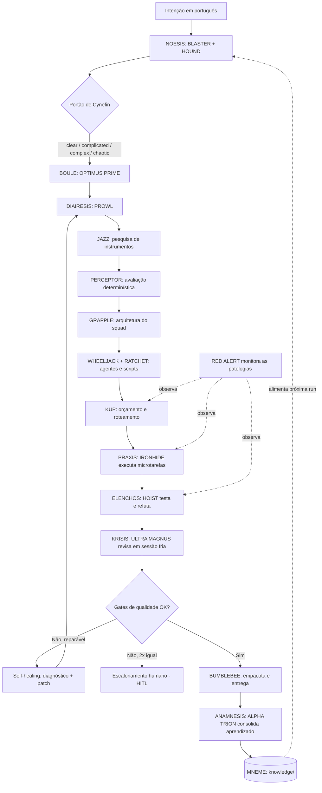

<div align="center">

# 🔨 Forge of Solus Prime

### O martelo dos Primes que forja novos squads

**Uma ordem em português entra. Um squad validado, auditável e portável sai — e o sistema fica mais inteligente a cada ordem.**

<br>


</div>

---

## 🧭 Navegação

| Seção | O que você encontra |
|---|---|
| [⚒️ A metáfora do nome](#️-a-metáfora-do-nome) | Por que "Forge of Solus Prime" |
| [💡 O que é](#-o-que-é) | A tese da reflexividade |
| [🏛️ Os cinco estratos](#️-os-cinco-estratos-da-forja) | A arquitetura canônica |
| [🔁 O Anel da Forja](#-o-anel-da-forja-sete-atos) | O ciclo de sete atos |
| [⚖️ As sete leis](#️-as-sete-leis-invariantes) | Os invariantes de produto |
| [🦠 As seis patologias](#-as-seis-patologias-controladas) | O que mata fábricas de agentes |
| [🤖 Roster de agentes](#-roster-de-agentes) | Os 16 Autobots |
| [🗺️ Diagrama do pipeline](#️-diagrama-do-pipeline-mermaid) | O fluxo visual |
| [🎨 Design system](#-design-system) | Paleta e tokens |
| [🚀 Início rápido](#-início-rápido) | Rodar em 1 minuto |
| [🤝 Como usar nos principais LLMs](#-como-usar-nos-principais-llms-de-codificação) | Claude, Cursor, Copilot… |
| [📐 Contratos SACP](#-contratos-sacp) | O protocolo de handoff |

---

## ⚒️ A metáfora do nome

Na mitologia Transformers, **Solus Prime** foi a Prime artesã que **forjou as
armas dos outros Primes** com a sua Forja. Um sistema cuja entrega são *outros
squads* é, literalmente, a Forja dela.

> [!NOTE]
> O nome casa com a metodologia (a Disciplina **FORJA**) e com o elenco de
> agentes (Autobots, cada um escolhido pela função canônica que combina com o
> papel). A liderança é de **Optimus Prime** — coerente com o artefato dos Primes.

---

## 💡 O que é

**Forge of Solus Prime** é um **meta-squad soberano**: um squad cuja entrega são
**outros squads**. Ele recebe uma intenção em português, classifica-a, pesquisa
instrumentos, projeta o time de agentes, decompõe o trabalho em microtarefas
contratuais, executa em ciclo auditável, **refuta** o resultado, **julga-o** de
forma independente, empacota e — a cada execução — **consolida aprendizado**.

> [!IMPORTANT]
> A diferença para um gerador de arquivos é a **reflexividade**: Forge of Solus
> Prime é o **primeiro squad forjado pela Disciplina FORJA**, e forja os demais
> sob exatamente as mesmas leis que aplica a si próprio. **Ele come a própria
> ração.** Se uma lei não se sustenta quando aplicada ao próprio Forge, ela não
> entra no framework.

**Invariante-mestre:** o LLM **só emite JSON estruturado**; todo número, veredito
de gate e corte de orçamento é **Python puro e auditável** (`Decimal`). Nenhum
fato verificável nasce de um modelo de linguagem.

---

## 🏛️ Os cinco estratos da Forja

Todo squad sério vive em cinco níveis de abstração. Confundi-los é a origem da
maioria das falhas.

| Estrato | Étimo | O que é | Artefatos |
|---|---|---|---|
| **TÉLOS** | τέλος · fim | Intenção normalizada em critérios verificáveis | `briefing.normalizado.yaml`, `cynefin.json` |
| **LÓGOS** | λόγος · razão | Requisitos, grafo de tarefas, contratos de handoff | `grafo_requisitos.json`, contratos SACP |
| **ÓRGANON** | ὄργανον · instrumento | Agentes, ferramentas permitidas, motores determinísticos | `agents/*`, allowlist, `tool_evaluation.json` |
| **KÝKLOS** | κύκλος · ciclo | O sistema externo que agenda, executa, refuta e julga | `LOOP.md`, `run_state.json`, `quality_report.json` |
| **MNÉMĒ** | μνήμη · memória | A memória evolutiva que faz cada ciclo melhorar o próximo | `knowledge/` (padrões, anti-padrões, templates) |

> [!TIP]
> **Lei dos Cinco Estratos:** agente sem ciclo é *ferramenta*, não squad. Todo
> squad de próxima geração entrega pelo menos um `KÝKLOS` auditável (mesmo em L1
> *report-only*) e um gancho de `MNÉMĒ`.

---

## 🔁 O Anel da Forja (sete atos)

```text
NÓESIS → BOULḖ → DIAÍRESIS → PRÂXIS → ÉLENCHOS → KRÍSIS → ANÁMNĒSIS
                                ↑__________________|
                       (self-healing: reparo guiado por diagnóstico,
                        retries limitados e escalonamento humano)
```

| Ato | Étimo | Função | Gate de passagem |
|---|---|---|---|
| 1. *NÓESIS* | νόησις | Compreender intenção e estado | Briefing normalizado + Cynefin |
| 2. *BOULḖ* | βουλή | Decidir estratégia, autonomia, topologia | Plano + nível L1/L2/L3 |
| 3. *DIAÍRESIS* | διαίρεσις | Decompor em 3–7 tarefas contratuais | Cada tarefa com contrato completo |
| 4. *PRÂXIS* | πρᾶξις | Executar a microtarefa permitida | Artefato + log + custo |
| 5. *ÉLENCHOS* | ἔλεγχος | Refutar "pronto" com evidência | Validação verde + evidência |
| 6. *KRÍSIS* | κρίσις | Julgar friamente, em sessão separada | Veredito do revisor independente |
| 7. *ANÁMNĒSIS* | ἀνάμνησις | Consolidar acertos e erros | ≥1 aprendizado ou descarte explícito |

---

## ⚖️ As sete leis invariantes

O `validate_squad.py` as verifica como gates.

1. **Fronteira Determinística** — o LLM só emite JSON; todo cálculo é Python (`Decimal`).
2. **Contrato** — todo handoff é um contrato **SACP** tipado (`extra="forbid"`).
3. **Portão de Cynefin** — classificar antes de agir; **caos nunca roda autônomo**.
4. **Mínimo Suficiente** — agente novo só por **responsabilidade exclusiva**.
5. **Élenchos** — nada é "pronto" sem **evidência verificável**.
6. **Crise Independente** — revisão fria, **separada do executor**.
7. **Anámnēsis** — todo ciclo deixa **≥1 aprendizado** ou descarte explícito.

---

## 🦠 As seis patologias controladas

Loops autônomos adoecem de formas previsíveis. A Forja nomeia seis patologias e
exige um controle obrigatório para cada uma — monitoradas por `RED ALERT`.

| Patologia | Definição | Controle invariante |
|---|---|---|
| **PSEUDO-TÉLOS** | Declarar pronto sem evidência | Gate de evidência obrigatório |
| **OPACIDADE PROGRESSIVA** | Artefatos funcionam sem que se entenda | Resumo humano + ADR + diff |
| **DISPÊNDIO DESGOVERNADO** | Custo escala sem governo | Orçamento + parada após 2 falhas iguais |
| **ABDICAÇÃO** | O humano abandona o juízo | Gates HITL + L3 só allowlisted |
| **METÁSTASE DE AGENTES** | Proliferação redundante "por garantia" | Responsabilidade exclusiva |
| **DERIVA DE CONTRATO** | Handoffs degradam ao longo do Anel | Schema SACP + `extra=forbid` + append-only |

> [!CAUTION]
> O `quality_report.json` **só fecha** se as seis patologias tiverem sido
> verificadas (campo `pathologies_checked` com os 6 itens). É um gate, não um
> adereço.

---

## 🤖 Roster de agentes

Elenco Autobot — cada agente tem **responsabilidade exclusiva** e fala apenas por
contratos SACP.

| Agente | Personagem | Ato | Função |
|---|---|---|---|
| `OPTIMUS PRIME` | Líder Autobot | `boule` | Orquestra o Anel, decide rota e autonomia |
| `BLASTER` | Oficial de comunicações | `noesis` | Normaliza intenção em briefing estruturado |
| `HOUND` | Batedor de reconhecimento | `noesis` | Contexto mínimo suficiente (`evidence.md`) |
| `GRAPPLE` | Arquiteto de construção | `diairesis` | Harness, ferramentas, schemas, critérios de pronto |
| `PROWL` | Estrategista/tático | `diairesis` | Decompõe em 3–7 tarefas contratuais |
| `JAZZ` | Operações especiais | `praxis` | Pesquisa instrumentos (offline no MVP) |
| `PERCEPTOR` | Cientista | `praxis` | Avalia instrumentos (motor `Decimal`) |
| `WHEELJACK` | Inventor | `praxis` | Gera agentes com contratos completos |
| `RATCHET` | Engenheiro | `praxis` | Gera scripts determinísticos e conectores |
| `KUP` | Veterano | `boule` | Economia de tokens e orçamento por run |
| `RED ALERT` | Diretor de segurança | transversal | Monitora as 6 patologias da Forja |
| `IRONHIDE` | O brutamontes confiável | `praxis` | Executa as microtarefas permitidas |
| `HOIST` | Diagnóstico | `elenchos` | Testa, valida schema, confere outputs |
| `ULTRA MAGNUS` | Disciplinador | `krisis` | Revisão fria e adversarial independente |
| `ALPHA TRION` | Arquivista ancestral | `anamnesis` | Consolida aprendizado em `knowledge/` |
| `BUMBLEBEE` | Mensageiro/courier | `praxis` | Empacota o squad portável (manifesto neutro) |

---

## 🗺️ Diagrama do pipeline (Mermaid)



---

## 🎨 Design system

A marca é **código, não prompt**. Paleta forjada: brasa, aço e a fagulha do martelo.

| Token | Hex | Uso |
|---|---|---|
| `forja-brasa` | `#f0529c` | Cor de marca (a fagulha do martelo) |
| `prime-azul` | `#1f6feb` | Orquestração e links |
| `aco-validado` | `#2ea043` | Gates verdes, evidência, aprovação |
| `matriz-roxo` | `#8957e5` | Leis e contratos SACP |
| `alerta-ambar` | `#d29922` | Patologias e gates HITL |
| `tipografia` | `JetBrains Mono / Inter` | Mono para código; sans para texto |

> O `card_icon` no site é `factory` — a Forja que produz squads.

---

## 🚀 Início rápido

> [!NOTE]
> Em modo **L1 *report-only*** o squad roda **só com a stdlib** do Python 3.11+ —
> sem instalar nada. As dependências de `requirements.txt` são opcionais.

```bash
cd squads/forge-of-solus-prime

# 1) Planejar (NÓESIS + BOULḖ + DIAÍRESIS, sem executar PRÂXIS)
python3 scripts/forge.py plan --briefing examples/briefing_exemplo.yaml

# 2) Forjar a run completa (cinco estratos, L1 auditável)
python3 scripts/forge.py init --briefing examples/briefing_exemplo.yaml --out runs/demo --mode L1

# 3) Validar os gates (5 estratos + 6 patologias)
python3 scripts/validate_squad.py --root runs/demo

# 4) Empacotar (manifesto neutro + ZIP portável)
python3 scripts/build_pack.py --root runs/demo --output runs/demo/pack.zip

# 5) Refutar (Lei do Élenchos) — testes como evidência
python3 -m pytest -q
```

---

## 🤝 Como usar nos principais LLMs de codificação

> [!NOTE]
> **O padrão de ativação é sempre o mesmo, em qualquer ferramenta:**
> 1. **Dê contexto** dos arquivos do squad (especialmente `squad.yaml`, `LOOP.md` e `AGENTS.md`).
> 2. **Peça que o assistente assuma a persona de `agents/optimus.md`** (o orquestrador).
> 3. **Conduza o Anel** (7 atos), respeitando o Portão de Cynefin e os gates HITL.
>
> Use sempre este **prompt de ativação** (copie e cole):
> ```text
> Forge of Solus Prime, assuma o papel de OPTIMUS PRIME sob a Disciplina FORJA
> (squads/forge-of-solus-prime/agents/optimus.md + squad.yaml + LOOP.md).
> Percorra o Anel: NÓESIS → BOULḖ → DIAÍRESIS → PRÂXIS → ÉLENCHOS → KRÍSIS → ANÁMNĒSIS.
> Classifique a intenção pelo Portão de Cynefin antes de agir e derive o nível de
> autonomia. Pesquise instrumentos e avalie-os de forma determinística. Gere os
> cinco estratos, refute com evidência, julgue em sessão fria e consolide ≥1 aprendizado.
> Obedeça às sete leis e monitore as seis patologias. Modo: L1 report-only — não
> publique, não faça push e não execute ferramenta externa sem aprovação registrada.
> Briefing: <descreva seu objetivo>.
> ```

<br>

<details open>
<summary><b>🟣 Claude Code (CLI / Web / IDE) — recomendado</b></summary>

<br>

Este repositório **já é nativo do Claude Code**: há um `CLAUDE.md` e o slash command **`/criar-squad`**.

```bash
# No terminal, dentro do repositório
claude

# Opção A — usar o squad diretamente (recomendado)
> Leia @squads/forge-of-solus-prime/squad.yaml e assuma a persona de
  @squads/forge-of-solus-prime/agents/optimus.md. Conduza o Anel da Forja
  (@squads/forge-of-solus-prime/LOOP.md) para o briefing: <...>

# Opção B — rodar os núcleos determinísticos
> Rode python3 scripts/forge.py init --briefing examples/briefing_exemplo.yaml --out runs/demo
```

- Use **`@caminho/arquivo`** para dar contexto preciso (autocompleta no prompt).
- Disponível em **CLI, app desktop/web (claude.ai/code) e extensões VS Code / JetBrains**.

</details>

<details>
<summary><b>🟦 Cursor</b></summary>

<br>

1. Abra a pasta `Squads-Genius` no Cursor.
2. No **Chat / Composer (⌘/Ctrl + I)**, referencie os arquivos com `@`:
   ```text
   @squad.yaml @LOOP.md @agents/optimus.md
   Assuma a persona de OPTIMUS PRIME e conduza o Anel da Forja para o briefing: <...>
   ```
3. **Persistente:** crie um arquivo `.cursorrules` na raiz com:
   ```text
   Ao construir squads, ative squads/forge-of-solus-prime/: assuma agents/optimus.md,
   siga LOOP.md (Anel de 7 atos), classifique por Cynefin antes de agir, e jamais
   declare 'pronto' sem evidência verificável (Lei do Élenchos).
   ```

</details>

<details>
<summary><b>⬛ GitHub Copilot (VS Code Chat)</b></summary>

<br>

1. Abra o **Copilot Chat** no VS Code.
2. Use `#file` para anexar contexto e `@workspace` para o projeto inteiro:
   ```text
   @workspace #file:squad.yaml #file:LOOP.md
   Assuma a persona descrita em #file:agents/optimus.md e conduza o Anel da Forja
   para o briefing: <...>. Classifique por Cynefin e não pule os gates HITL.
   ```
3. Para regras persistentes, crie **`.github/copilot-instructions.md`** com o prompt de ativação acima.

</details>

<details>
<summary><b>🟩 Windsurf (Cascade)</b></summary>

<br>

1. Abra o repositório no Windsurf.
2. No **Cascade**, mencione os arquivos com `@`:
   ```text
   @squad.yaml @agents/optimus.md @LOOP.md
   Atue como OPTIMUS PRIME e execute o Anel da Forja para: <briefing>.
   ```
3. Fixe as regras em **`.windsurfrules`** (raiz do projeto) com o prompt de ativação.

</details>

<details>
<summary><b>🟧 Cline / Roo Code (VS Code)</b></summary>

<br>

1. Inicie uma nova tarefa no Cline/Roo.
2. Cole o **prompt de ativação** e mencione os caminhos:
   ```text
   Leia squads/forge-of-solus-prime/squad.yaml e agents/optimus.md.
   Assuma OPTIMUS PRIME, conduza o Anel (LOOP.md) e rode os scripts determinísticos
   em scripts/ quando o ato pedir verificação. Briefing: <...>
   ```
3. O Cline pode **executar os scripts** (`forge.py`, `cynefin_gate.py`, `evaluate_tool.py`, `validate_squad.py`) e ler a saída — aprove a execução quando solicitado.

</details>

<details>
<summary><b>🟨 Continue.dev / Aider / Zed AI / outros</b></summary>

<br>

- **Continue.dev:** use `@file` para `squad.yaml` e `agents/optimus.md`; cole o prompt de ativação.
- **Aider:** `aider squads/forge-of-solus-prime/squad.yaml squads/forge-of-solus-prime/agents/optimus.md` e então instrua o OPTIMUS PRIME.
- **Zed AI / genéricos:** adicione os arquivos ao contexto e use o prompt de ativação.

</details>

<details>
<summary><b>💬 ChatGPT / Gemini / web (sem acesso a arquivos)</b></summary>

<br>

1. Copie o conteúdo de **`squad.yaml`** + **`LOOP.md`** + **`agents/optimus.md`** para o chat.
2. Cole o **prompt de ativação**.
3. Como esses ambientes não executam os scripts, peça ao modelo para **simular** os atos e **você roda os scripts localmente** (`python3 scripts/...`), colando a saída de volta no chat para a refutação (ÉLENCHOS).

</details>

<br>

> [!CAUTION]
> Em **qualquer** ferramenta, os gates HITL e a Lei do Élenchos são
> **inegociáveis**. Se o assistente declarar "pronto" sem evidência, interrompa:
> o comportamento correto é tratar ausência de evidência como **falha**, nunca
> como sucesso silencioso.

---

## 📐 Contratos SACP

Todo handoff entre atos/agentes é um **contrato SACP** (Structured Agent
Communication Protocol) — tipado em Pydantic v2 com `extra="forbid"` (anti-DERIVA).

| Campo | Papel |
|---|---|
| `contrato_id` / `emissor` / `receptor` | Identidade e direção do handoff |
| `estrato` / `ato` | Onde no Anel o bastão está sendo passado |
| `payload` + `schema_ref` | Conteúdo JSON **validável por schema** |
| `evidencias` | Provas anexadas (Lei do Élenchos) |
| `veredito` | `aprovado` / `reprovado` / `revisar` / `escalar` |
| `custo` | Tokens, chamadas e custo monetário (`Decimal`) |
| `requer_humano` | Marca o gate HITL |

---

## 📊 Métricas de sucesso (MVP)

| Métrica | Meta |
|---|---:|
| Squads gerados com os cinco estratos | 100% |
| Squads com testes executáveis | 80% |
| Instrumentos avaliados por run complexo | 3–10 |
| Runs com relatório de qualidade real | 100% |
| Aprendizados consolidados por run | 1–3 |
| Falhas repetidas sem escalonamento | 0 |
| Cobertura de verificação das 6 patologias | 100% |

---

## 🧱 Stack

`LangGraph (StateGraph)` · `Python 3.11+` · `Pydantic v2 (fallback dataclasses)` ·
`Decimal (pontuação auditável)` · `Langfuse (observabilidade)` · `pytest` ·
**stdlib-first** (roda sem dependências externas em modo report-only).

---

> [!IMPORTANT]
> **Nota de IP.** A **Disciplina FORJA** é metodologia autoral de Marcio Bisognin.
> Os codinomes (Transformers) são vocabulário temático; não há cópia de marca,
> arte ou ativo de terceiros. Instrumentos citados são software de terceiros sob
> suas licenças, **consumidos** — não redistribuídos. Detalhes em [`NOTICE.md`](NOTICE.md).

<div align="center">

---

**A forja que melhora a si mesma a cada peça que forja.**

Licença: MIT. Criado por Marcio Bisognin. Instagram: [@marciobisognin](https://instagram.com/marciobisognin).

</div>
