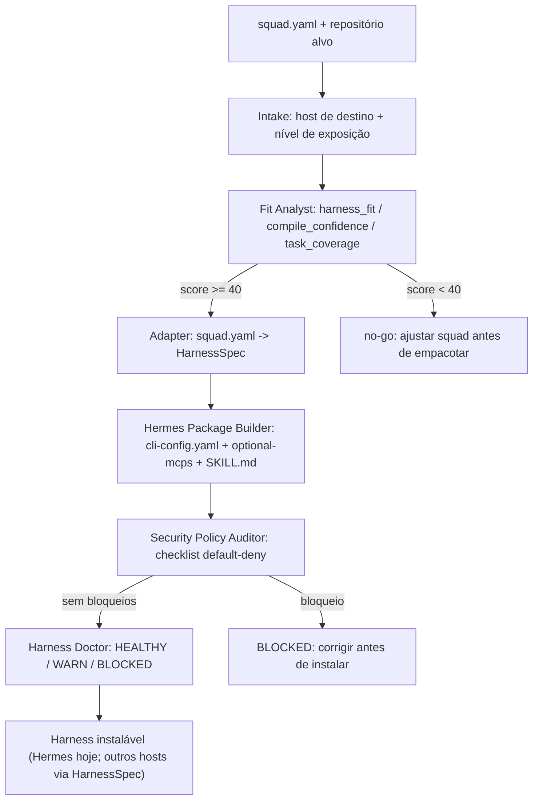

<div align="center">

# ⚒️ Harness Foundry Squad

### Funde qualquer squad do Squads-Genius em um harness de agente executável — CLI, MCP, integração Hermes, skills e policy default-deny — sem vendorizar motores externos.

<p>
  
  
  
  
  
  
  
</p>

</div>

---

## ✨ Ideia central

Hoje um squad do Squads-Genius é uma pasta com `squad.yaml`, agentes, tasks e workflows — ótimo para um LLM ler e executar, mas não é algo que alguém instala com um comando. O **Harness Foundry Squad** preenche essa lacuna: ele avalia se um squad está pronto para virar harness, converte `squad.yaml` em um `HarnessSpec` neutro de host, gera o pacote de instalação no Hermes (`cli-config.yaml` + `optional-mcps/*.json` + `SKILL.md`), audita a segurança e roda um diagnóstico final (`HEALTHY` / `WARN` / `BLOCKED`) — tudo com **scripts determinísticos próprios**, sem copiar ou depender do código do projeto externo [`agent-harness-generator`](https://github.com/ruvnet/agent-harness-generator) (apenas se inspira no formato `score/analyze/doctor`).

## 🎯 Para que serve

<table>
<tr>
<td><b>Avaliar antes de empacotar</b><br/>Calcula <code>harness_fit</code>, confiança de compilação, cobertura de tasks e custo estimado — bloqueia squads que não estão prontos.</td>
<td><b>Converter sem vendorizar</b><br/>Gera um <code>HarnessSpec</code> portável a partir de <code>squad.yaml</code>, sem importar código de motores externos.</td>
<td><b>Empacotar para Hermes</b><br/>Produz <code>cli-config.yaml</code>, <code>optional-mcps/*.json</code> e <code>SKILL.md</code> prontos para <code>~/.hermes/skills</code>.</td>
</tr>
<tr>
<td><b>Auditar segurança</b><br/>Garante policy <b>default-deny</b>: sem credenciais, sem wildcard de shell/filesystem, exceções só com aprovação humana.</td>
<td><b>Diagnosticar o resultado</b><br/>Roda um <code>doctor</code> final com status explícito e avisos, mesmo quando tudo está saudável.</td>
<td><b>Atender squads institucionais</b><br/>Template <code>vertical:iffar</code> com agentes de normas, contratos, evidências, redação institucional e LGPD.</td>
</tr>
</table>

## 🧭 Como o squad trabalha



## 🧩 Estrutura dos agentes

<table>
<tr><td><b>harness-intake-orchestrator</b></td><td>Recebe squad/host de destino, bloqueia sem <code>squad.yaml</code> válido.</td><td>Resumo de intake + lacunas.</td></tr>
<tr><td><b>harness-fit-analyst</b></td><td>Calcula fit score, confiança de compilação, cobertura de tasks e custo estimado.</td><td><code>fit_report.json</code> + <code>go_no_go</code>.</td></tr>
<tr><td><b>squad-to-harnessspec-adapter</b></td><td>Converte agentes/tasks/workflows em capabilities/commands/pipelines.</td><td><code>harnessspec.json</code>.</td></tr>
<tr><td><b>hermes-package-builder</b></td><td>Gera o pacote de instalação Hermes a partir do HarnessSpec.</td><td><code>cli-config.yaml</code>, <code>optional-mcps/*.json</code>, <code>SKILL.md</code>.</td></tr>
<tr><td><b>security-policy-auditor</b></td><td>Verifica credenciais, wildcards e isolamento de artefatos temporários.</td><td><code>security_audit.json</code>.</td></tr>
<tr><td><b>harness-doctor-curator</b></td><td>Diagnóstico final + mantém o template <code>vertical:iffar</code>.</td><td><code>doctor_report.json</code> com status <code>HEALTHY/WARN/BLOCKED</code>.</td></tr>
</table>

## ⚙️ Motor externo (não vendorizado)

Este squad **não copia** o [`agent-harness-generator`](https://github.com/ruvnet/agent-harness-generator) (`metaharness`). Os scripts aqui produzem artefatos próprios (`fit_report.json`, `harnessspec.json`, pacote Hermes). Se você tiver o `metaharness` instalado, pode usá-lo em paralelo:

```bash
npx -y @metaharness/create-agent-harness <squad-slug> --template vertical:coding --host hermes
```

mas isso é opcional — o pipeline deste squad funciona de forma independente.

## 📦 O que o squad entrega no final

```text
output/<squad>/
├── fit_report.json              # harness_fit, breakdown, go_no_go
├── harnessspec.json              # capabilities, commands, pipelines, policy
├── hermes/
│   ├── cli-config.yaml
│   ├── optional-mcps/<squad>.json
│   └── SKILL.md
├── security_audit.json
└── doctor_report.json            # HEALTHY | WARN | BLOCKED
```

## 🚀 Como usar

### Instalação

```bash
cd squads/harness-foundry-squad
pip install -r requirements.txt
```

### Passo a passo (pipeline completo)

```bash
SQUAD=squads/maeve-knowledge-graph-forge-squad   # qualquer squad do Squads-Genius
OUT=output/maeve-knowledge-graph-forge-squad

# 1) avaliar se o squad está pronto para virar harness
python3 scripts/score_squad_fit.py --root "$SQUAD" --out "$OUT/fit_report.json"

# 2) gerar o HarnessSpec (squad.yaml -> capabilities/commands/pipelines)
python3 scripts/squad_to_harnessspec.py --squad "$SQUAD" --out "$OUT/harnessspec.json"

# 3) gerar o pacote de instalação Hermes
python3 scripts/generate_hermes_package.py \
  --harnessspec "$OUT/harnessspec.json" \
  --out "$OUT/hermes" \
  --exposure-level local

# 4) diagnóstico final (HEALTHY / WARN / BLOCKED)
python3 scripts/harness_doctor.py --hermes-dir "$OUT/hermes" --out "$OUT/doctor_report.json"
```

### Exemplo real (o squad aplicado a si mesmo)

Os artefatos em [`examples/`](examples/) foram gerados rodando o próprio pipeline contra este squad (`fit_report_self.json`, `harnessspec_self.json`, `hermes_self/`, `doctor_report_self.json`) — não são mocks.

### Instalar o pacote gerado no Hermes

```bash
cp -r output/<squad>/hermes ~/.hermes/skills/<squad>
```

## ✅ Qualidade e testes

```bash
python3 -m unittest tests.test_scripts -v
```

Os testes rodam o pipeline completo (`score → adapter → pacote Hermes → doctor`) contra o próprio squad, sem mocks e sem dependências além de `PyYAML`.

## 🛡️ Policy default-deny

Detalhes em [`docs/policy_default_deny.md`](docs/policy_default_deny.md). Resumo: sem credenciais, sem wildcard de shell/filesystem, sem rede irrestrita — qualquer exceção exige aprovação humana registrada.

## 🏛️ Template institucional `vertical:iffar`

Para squads jurídicos/educacionais brasileiros, use [`templates/vertical-iffar/`](templates/vertical-iffar/README.md) como complemento: `analista-normativo`, `gestor-contratual`, `auditor-evidencias`, `redator-institucional`, `revisor-lgpd`.

## 🤖 Como usar nos principais LLMs de codificação

A lógica é a mesma em todos: abrir este diretório (`squads/harness-foundry-squad/`), apontar o squad alvo e pedir para o agente rodar o pipeline de 4 passos e reportar o `doctor_report.json` final.

### Claude Code

```text
Atue como operador do Harness Foundry Squad em squads/harness-foundry-squad/.
Primeiro leia squad.yaml e os agentes em agents/ para entender o pipeline.
Rode, na ordem: scripts/score_squad_fit.py, scripts/squad_to_harnessspec.py,
scripts/generate_hermes_package.py e scripts/harness_doctor.py contra o squad
em <caminho-do-squad-alvo>, salvando tudo em output/<squad>/.
Se o fit_report indicar go_no_go = "no-go", pare e explique as constraints
antes de gerar o pacote Hermes. No final, reporte o status HEALTHY/WARN/BLOCKED.
```

### OpenAI Codex CLI

```text
Você está no repositório Squads-Genius, dentro de squads/harness-foundry-squad.
Instale requirements.txt e execute o pipeline de empacotamento Hermes
(score_squad_fit -> squad_to_harnessspec -> generate_hermes_package -> harness_doctor)
para o squad em <caminho-do-squad-alvo>.
Não avance para o pacote Hermes se o fit score indicar no-go.
Valide que cli-config.yaml, optional-mcps/*.json e SKILL.md foram gerados.
```

### GitHub Copilot (Chat/CLI)

```text
@workspace Use o squad em squads/harness-foundry-squad para transformar
<caminho-do-squad-alvo> em um harness Hermes. Rode os 4 scripts em scripts/
nessa ordem, explique cada saída JSON e finalize confirmando o status do
harness_doctor.py.
```

### Cursor

```text
Abra squads/harness-foundry-squad como contexto principal.
Execute o pipeline completo (score, adapter, pacote Hermes, doctor) contra
o squad indicado pelo usuário e mostre o diff dos arquivos gerados em
output/<squad>/ antes de qualquer commit.
```

### Windsurf

```text
Trate squads/harness-foundry-squad como uma ferramenta de empacotamento.
Rode score_squad_fit.py para avaliar o squad alvo; se o resultado for
go ou go-with-human-review, continue para harnessspec e pacote Hermes;
se for no-go, pare e liste as constraints para o usuário resolver primeiro.
```

### Gemini CLI

```text
Usando o diretório squads/harness-foundry-squad como ferramenta, gere um
harness Hermes para o squad <caminho-do-squad-alvo>: rode os 4 scripts em
sequência, verifique a policy default-deny em docs/policy_default_deny.md
e reporte o resultado final do harness_doctor.py em português.
```

### Regras para qualquer agente

- Nunca pular a etapa de `score_squad_fit.py` — squads com `go_no_go: no-go` não devem ser empacotados.
- Nunca gerar credenciais ou comandos de shell/filesystem com wildcard nos arquivos do harness.
- Salvar sempre em `output/<squad>/...`, nunca sobrescrever o squad de origem.
- Reportar o status final (`HEALTHY`/`WARN`/`BLOCKED`) e os avisos, mesmo quando tudo estiver saudável.
- Para squads institucionais/IFFar, oferecer o template `vertical:iffar` como complemento opcional.

## ✅ Em uma frase

> O squad funciona como uma fundição: recebe squads documentais e devolve harnesses instaláveis — com avaliação, conversão, empacotamento e auditoria de segurança em cada peça forjada.

<div align="center">

**Licença:** MIT<br>
**Criado por:** Marcio Bisognin<br>
**Instagram:** [@marciobisognin](https://instagram.com/marciobisognin)

</div>
