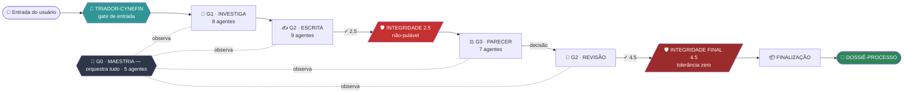
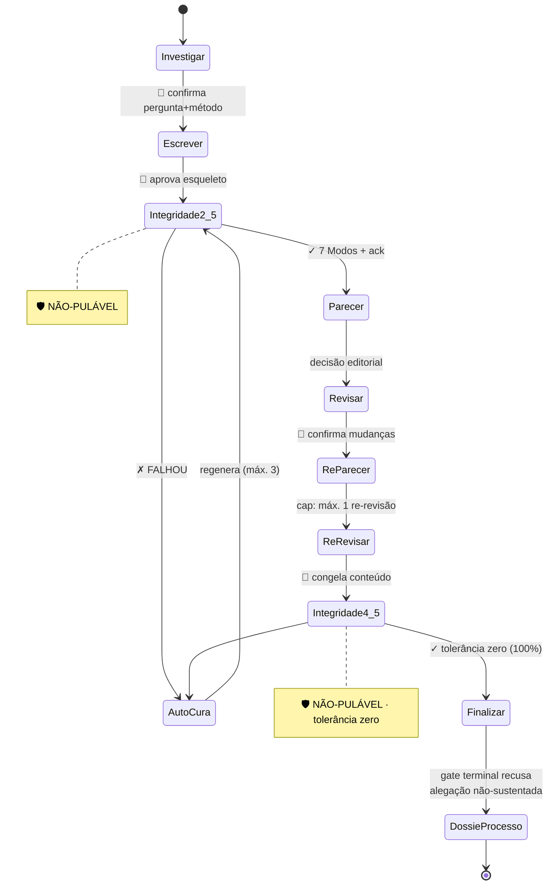

<div align="center">

# 📜 SCRIPTORIUM

### Produção acadêmica fim-a-fim com **integridade verificável**

*A IA é o seu copiloto — nunca o piloto.*

<br>


</div>

<br>

> [!IMPORTANT]
> **SCRIPTORIUM** conduz um manuscrito acadêmico **da pergunta de pesquisa ao artefato publicável** (Markdown / DOCX / PDF tipografado), passando por revisão por pares simulada multi‑perspectiva e **dois gates de integridade não‑puláveis**.
>
> O princípio fundador é **não‑autônomo**: o pesquisador humano permanece como piloto; o squad executa o trabalho braçal verificável e **se recusa a preencher lacunas com memória paramétrica**. Toda alegação não‑fundamentada vira a etiqueta `[LACUNA DE MATERIAL]` — **nunca prosa inventada**.

<br>

## 🧭 Navegação

| | | |
|---|---|---|
| 🎯 [Por que existe](#-por-que-existe) | 🏛️ [Topologia & guildas](#️-topologia--guildas) | ⚙️ [Máquina de estados](#️-máquina-de-estados-10-estágios) |
| 🔒 [Primitivas de honestidade](#-primitivas-de-honestidade) | 🚀 [Início rápido](#-início-rápido) | 🤝 [**Como usar nos LLMs de codificação**](#-como-usar-nos-principais-llms-de-codificação) |
| 📑 [Contratos](#-contratos-estilo-sacp) | 📊 [Métricas & aceite](#-métricas--critérios-de-aceite) | 🧰 [Stack open‑source](#-stack-open-source) |

<br>

---

## 🎯 Por que existe

<table>
<tr>
<td width="50%" valign="top">

### ❌ O custo da automação total
Pipelines de pesquisa **totalmente autônomos** herdam modos de falha documentados na literatura:

- 🐛 bugs que passam pela auto‑revisão
- 🌀 resultados alucinados
- 🔗 dependência de atalhos
- 🎭 bug reenquadrado como "insight"
- 📚 **alucinação de citações**
- 🔒 **trava de enquadramento**

</td>
<td width="50%" valign="top">

### ✅ A tese do SCRIPTORIUM
*Um pesquisador humano **aumentado por IA** evita esses modos de falha melhor do que humano ou IA isolados.*

O squad torna os limites estruturais da IA **visíveis e gerenciáveis** por meio de *checkpoints* explícitos, em vez de fingir que não existem:

- 🔎 verificação **determinística** de citação
- 🎯 auditoria de **fidelidade** alegação↔fonte
- 🛡️ **anti‑bajulação** no contraditório
- 🧾 **Dossiê de Proveniência** retomável

</td>
</tr>
</table>

> [!WARNING]
> **O problema das citações vai além do DOI.** Verificar que o DOI existe **não basta**: é preciso verificar que a fonte *diz o que a frase afirma*. O caso mais perigoso são **referências reais usadas para sustentar afirmações que a fonte não faz**.

<br>

---

## 🏛️ Topologia & guildas



<div align="center"><sub>O <code>observador-de-colaboração</code> (G0) é <b>silenciado deliberadamente nos gates 2.5 e 4.5</b> para não diluir a checagem de integridade.</sub></div>

<br>

<details open>
<summary><b>👥 Roster completo — 31 agentes (clique para recolher)</b></summary>

<br>

#### 🎼 G0 — Guilda de Maestria · *transversal*
| Agente | Responsabilidade |
|---|---|
| `maestro` | Orquestrador LangGraph; resolve *conditional edges* e aplica caps de loop |
| `rastreador-de-estado` | Mantém o Dossiê de Proveniência; serializa estado entre sessões |
| `guarda-de-auto-cura` | Loop Turing: diagnostica falha de gate e regenera artefato (máx. 3 tentativas) |
| `observador-de-colaboracao` | Pontua a profundidade da colaboração humano‑IA — *consultivo, nunca bloqueia* |
| `sentinela-de-conformidade` | Checklists (PRISMA, divulgação de uso de IA por *venue*) |

#### 🧭 Gate de entrada
| Agente | Responsabilidade |
|---|---|
| `triador-cynefin` | Classifica a demanda (Clear/Complicated/Complex/Chaotic) e roteia o modo |

#### 🔬 G1 — Guilda de Investigação · `acesso: bruto`
| Agente | Responsabilidade |
|---|---|
| `arquiteto-da-questao` | Refina a pergunta por diálogo maiêutico → Briefing de Questão |
| `cartografo-metodologico` | Blueprint metodológico + hierarquia de evidência |
| `curador-bibliografico` | Busca/triagem; *corpus‑primeiro, busca preenche lacuna* |
| `verificador-de-fontes` | **Verificação determinística (4 índices)** |
| `sintetizador` | Síntese anti‑vazamento; etiqueta `[LACUNA DE MATERIAL]` |
| `meta-analista` | Agregação quantitativa/qualitativa |
| `critico-adversarial` | Contraditório com **limiar de concessão** (anti‑bajulação) |
| `auditor-de-vieses` | Risco de viés e lacunas éticas |

#### ✍️ G2 — Guilda de Escrita · `acesso: redigido`
| Agente | Responsabilidade |
|---|---|
| `triador-de-entrada` | Classifica a demanda e configura o registro do artigo |
| `arquiteto-de-estrutura` | Esqueleto (IMRaD, revisão temática, estudo de caso, *policy brief*) |
| `construtor-de-argumentos` | Mapa de argumentos; encadeamento lógico |
| `redator` | Escreve o draft com calibração na voz do autor |
| `conformador-de-citacoes` | Conversão APA 7 / IEEE / Chicago / MLA / Vancouver (CSL) |
| `resumista-bilingue` | Abstract bilíngue (PT‑BR + EN) |
| `ilustrador-de-dados` | Figuras + verificação **VLM** caption↔dados |
| `calibrador-de-estilo` | Aprende a voz do autor; *Writing Quality Check* |
| `treinador-de-revisao` | Coaching maiêutico para incorporar pareceres |

#### ⚖️ G3 — Guilda de Parecer · `acesso: somente-verificado`
| Agente | Responsabilidade |
|---|---|
| `analista-de-dominio` | Autodetecta a área e configura 3 pareceristas adaptativos |
| `editor-chefe` | Conduz a decisão editorial e o coaching de revisão |
| `parecerista-metodologico` | Rigor de método, validade, estatística |
| `parecerista-de-dominio` | Contribuição e estado da arte |
| `parecerista-interdisciplinar` | Perspectiva transversal e generalização |
| `contraditor-editorial` | Ataque adversarial com **intensidade preservada entre rodadas** |
| `sintetizador-editorial` | Protocolo mecânico de 3 passos → decisão |

#### 🛡️ Guilda de Integridade · *compartilhada G0/G3*
| Agente | Responsabilidade |
|---|---|
| `auditor-de-integridade` | Checklist de 7 Modos de Falha + auditoria de fidelidade — **gates 2.5 e 4.5** |

</details>

<br>

---

## ⚙️ Máquina de estados (10 estágios)



| # | Estágio | Guilda | 🧑 Checkpoint humano | 🤖 Gate robótico |
|:--:|---|:--:|---|---|
| 1 | **Investigar** | G1 | confirma pergunta + método | verificação 4‑índices · anti‑bajulação |
| 2 | **Escrever** | G2 | aprova esqueleto | anti‑vazamento · VLM · estilo |
| 2.5 | 🛡️ **Integridade** | Auditoria | *ack* de integridade | Checklist 7 Modos · FALHA → auto‑cura |
| 3 | **Parecer** | G3 | revê decisão | limiar de concessão · *sprint contract* cego |
| 3→4 | Coaching | Editor | pode "só conserte" e pular | — |
| 4 | **Revisar** | G2 | confirma mudanças | trajetória de pontuação |
| 3' | Re‑parecer | G3 | revê | matriz de rastreabilidade · cap de loop |
| 4' | Re‑revisar | G2 | congela conteúdo | — |
| 4.5 | 🛡️ **Integridade final** | Auditoria | *ack* final | 7 Modos + alegações **100%** · tolerância zero |
| 5 | **Finalizar** | G2 | escolhe formato | *gate* terminal de recusa |
| 6 | **Dossiê‑Processo** | G0 | confirma idioma + colaboração | auto‑reflexão · métricas de honestidade |

<br>

---

## 🔒 Primitivas de honestidade

<table>
<tr>
<td width="33%" valign="top" align="center">

### 🔎
**Verificação determinística**

Cada referência é cruzada contra **Semantic Scholar + OpenAlex + Crossref + arXiv** *antes* de qualquer LLM. Cache SQLite (TTL 90d).
<br><br>
`verificada` · `não‑resolvida` · `inexistente`

</td>
<td width="33%" valign="top" align="center">

### 🎯
**Fidelidade alegação↔fonte**

Âncora de **3 camadas** (`quote`/`page`/`section`) + LLM‑como‑juiz. *A fonte realmente sustenta a frase?*
<br><br>
Severidade alta → **recusa a saída**

</td>
<td width="33%" valign="top" align="center">

### 🛡️
**Anti‑bajulação**

Cada réplica do autor é pontuada **1–5 antes** de responder. Concessão só com nota **≥4**.
<br><br>
Sem concessões consecutivas

</td>
</tr>
<tr>
<td width="33%" valign="top" align="center">

### 🚫
**Anti‑vazamento**

Materiais da sessão têm **prioridade absoluta** sobre a memória paramétrica.
<br><br>
Ausente → `[LACUNA DE MATERIAL]`

</td>
<td width="33%" valign="top" align="center">

### 📋
**Checklist 7 Modos**

`M1`..`M7` nos gates 2.5/4.5. Qualquer modo **SUSPEITO** falha o gate.
<br><br>
Derivado de Lu et al. (2026)

</td>
<td width="33%" valign="top" align="center">

### 🔀
**Cross‑model grátis**

`SCR_CROSS_MODEL=1` → modelo local (**Ollama**) re‑audita o principal.
<br><br>
Divergência >2 é **reportada**

</td>
</tr>
</table>

<br>

---

## 🚀 Início rápido

> **Pré‑requisito:** Python 3.11+ (os scripts não exigem dependências externas).

```bash
# 1) Clone o repositório e entre na pasta do squad
git clone https://github.com/marciobisognin/Squads-Genius.git
cd Squads-Genius/squads/scriptorium-squad

# 2) Valide os contratos (6 schemas × fixtures)
python3 scripts/validate_contracts.py
#   → OK: 6 contratos validados com sucesso.

# 3) Verificação determinística de citação (offline, via cache local)
python3 scripts/verify_citations.py \
    --citations examples/fixtures/citations_input.json \
    --cache examples/fixtures/index_cache.json
#   → 2 verificada · 1 nao-resolvida (regional, não bloqueia) · 1 inexistente (DOI fabricado, bloqueia)

# 4) Auditoria anti-bajulação do contraditório
python3 scripts/concession_audit.py --log examples/fixtures/contraditorio_log.json
#   → anti_bajulacao_ok: true
```

> [!TIP]
> Os scripts rodam **100% offline**: o `verify_citations.py` consulta um *cache* local que, em produção, é alimentado pelos 4 índices reais com TTL de 90 dias. Ideal para CI.

<br>

---

## 🤝 Como usar nos principais LLMs de codificação

> [!NOTE]
> **O padrão de ativação é sempre o mesmo, em qualquer ferramenta:**
> 1. **Dê ao assistente o contexto** dos arquivos do squad (especialmente `squad.yaml` e `workflows/scriptorium-pipeline.yaml`).
> 2. **Peça que ele assuma a persona do `agents/maestro.md`** (o orquestrador).
> 3. **Conduza os 10 estágios** respeitando os checkpoints humanos e os gates 2.5/4.5 não‑puláveis.
>
> Use sempre este **prompt de ativação** (copie e cole):
> ```text
> Assuma a persona do orquestrador definido em squads/scriptorium-squad/agents/maestro.md
> e conduza o pipeline de squads/scriptorium-squad/workflows/scriptorium-pipeline.yaml.
> Valide cada handoff entre guildas contra os contratos em squads/scriptorium-squad/templates/.
> NUNCA pule os gates de integridade 2.5 e 4.5. Toda alegação sem fonte vira [LACUNA DE MATERIAL].
> Meu briefing de pesquisa é: <descreva sua pergunta, corpus e venue>.
> ```

<br>

<details open>
<summary><b>🟣 Claude Code (CLI / Web / IDE) — recomendado</b></summary>

<br>

Este repositório **já é nativo do Claude Code**: há um `CLAUDE.md` e o slash command **`/criar-squad`**.

```bash
# No terminal, dentro do repositório
claude

# Opção A — usar o squad diretamente (recomendado)
> Leia @squads/scriptorium-squad/squad.yaml e assuma a persona de
  @squads/scriptorium-squad/agents/maestro.md. Conduza o pipeline
  @squads/scriptorium-squad/workflows/scriptorium-pipeline.yaml para o briefing: <...>

# Opção B — rodar os núcleos determinísticos
> Rode python3 scripts/verify_citations.py nas minhas referências em refs.json
```

- Use **`@caminho/arquivo`** para dar contexto preciso (autocompleta no prompt).
- Disponível em **CLI, app desktop/web (claude.ai/code) e extensões VS Code / JetBrains**.

</details>

<details>
<summary><b>🟦 Cursor</b></summary>

<br>

1. Abra a pasta `Squads-Genius` no Cursor.
2. No **Chat / Composer (⌘/Ctrl + I)**, referencie os arquivos com `@`:
   ```text
   @squad.yaml @workflows/scriptorium-pipeline.yaml @agents/maestro.md
   Assuma a persona do MAESTRO e conduza o pipeline para o briefing: <...>
   ```
3. **Persistente:** crie um arquivo `.cursorrules` na raiz com:
   ```text
   Ao trabalhar com produção acadêmica, ative o squad em squads/scriptorium-squad/:
   assuma agents/maestro.md, siga workflows/scriptorium-pipeline.yaml, valide contratos
   em templates/, e jamais pule os gates de integridade 2.5 e 4.5.
   ```

</details>

<details>
<summary><b>⬛ GitHub Copilot (VS Code Chat)</b></summary>

<br>

1. Abra o **Copilot Chat** no VS Code.
2. Use `#file` para anexar contexto e `@workspace` para o projeto inteiro:
   ```text
   @workspace #file:squad.yaml #file:workflows/scriptorium-pipeline.yaml
   Assuma a persona descrita em #file:agents/maestro.md e conduza o pipeline
   SCRIPTORIUM para o briefing: <...>. Não pule os gates 2.5 e 4.5.
   ```
3. Para regras persistentes, crie **`.github/copilot-instructions.md`** com o prompt de ativação acima.

</details>

<details>
<summary><b>🟩 Windsurf (Cascade)</b></summary>

<br>

1. Abra o repositório no Windsurf.
2. No **Cascade**, mencione os arquivos com `@`:
   ```text
   @squad.yaml @agents/maestro.md @workflows/scriptorium-pipeline.yaml
   Atue como o orquestrador MAESTRO e execute o pipeline para: <briefing>.
   ```
3. Fixe as regras em **`.windsurfrules`** (raiz do projeto) com o prompt de ativação.

</details>

<details>
<summary><b>🟧 Cline / Roo Code (VS Code)</b></summary>

<br>

1. Inicie uma nova tarefa no Cline/Roo.
2. Cole o **prompt de ativação** e mencione os caminhos:
   ```text
   Leia squads/scriptorium-squad/squad.yaml e agents/maestro.md.
   Assuma o MAESTRO, conduza workflows/scriptorium-pipeline.yaml e rode os
   scripts determinísticos em scripts/ quando o estágio pedir verificação.
   Briefing: <...>
   ```
3. O Cline pode **executar os scripts** (`validate_contracts.py`, `verify_citations.py`, `concession_audit.py`) e ler a saída — aprove a execução quando solicitado.

</details>

<details>
<summary><b>🟨 Continue.dev / Aider / Zed AI / outros</b></summary>

<br>

- **Continue.dev:** use `@file` para `squad.yaml` e `agents/maestro.md`; cole o prompt de ativação.
- **Aider:** `aider squads/scriptorium-squad/squad.yaml squads/scriptorium-squad/agents/maestro.md` e então instrua o MAESTRO.
- **Zed AI / genéricos:** adicione os arquivos ao contexto e use o prompt de ativação.

</details>

<details>
<summary><b>💬 ChatGPT / Gemini / web (sem acesso a arquivos)</b></summary>

<br>

1. Copie o conteúdo de **`squad.yaml`** + **`workflows/scriptorium-pipeline.yaml`** + **`agents/maestro.md`** para o chat.
2. Cole o **prompt de ativação**.
3. Como esses ambientes não executam os scripts, peça ao modelo para **simular** os gates e **você roda os scripts localmente** (`python3 scripts/...`) colando a saída de volta no chat.

</details>

<br>

> [!CAUTION]
> Em **qualquer** ferramenta, os checkpoints humanos e os gates 2.5/4.5 são **inegociáveis**. Se o assistente tentar pular um gate ou preencher uma lacuna sem fonte, interrompa: o comportamento correto é emitir `[LACUNA DE MATERIAL]`.

<br>

---

## 📑 Contratos (estilo SACP)

Todo handoff entre guildas é um **JSON validado em runtime** contra os schemas em [`templates/`](templates/):

| Contrato | Papel |
|---|---|
| `PassaporteDossie` | Estado global versionado · retomável entre sessões |
| `BriefingDeQuestao` | Pergunta, escopo e método fixados antes da escrita |
| `VerificacaoCitacao` | Status 4‑índices por referência + âncora de fidelidade |
| `RelatorioIntegridade` | Saída dos gates 2.5/4.5 (7 Modos + fidelidade) |
| `ContratoDeParecer` | *Sprint contract* cego (antes de ver o manuscrito) |
| `MatrizDeRastreabilidade` | Verifica cada alegação do autor no re‑parecer |

<br>

---

## 📊 Métricas & critérios de aceite

| Métrica | Meta v1 |
|---|---|
| 🔎 Verificação de citação | **100%** passam pela checagem 4‑índices; nenhuma `inexistente` na saída sem *override* humano |
| 🎯 Auditoria de fidelidade *(quando ligada)* | **FNR < 0,15** e **FPR < 0,10** contra *gold set* de 20 tuplas |
| 🛡️ Anti‑bajulação | **0** concessões com pontuação < 4 |
| 🔒 Integridade | gates 2.5/4.5 não‑puláveis; **tolerância zero** em 4.5 |
| 🔁 Reprodutibilidade de processo | execução retomável a partir do *ledger* do Dossiê |
| 💰 Custo‑alvo | **~US$ 4–6** por artigo de ~15k palavras (calibrar com Langfuse) |

<br>

---

## 🧰 Stack open‑source

<div align="center">

`Semantic Scholar` · `OpenAlex` · `Crossref` · `arXiv` · `Pandoc` · `Tectonic` · `Typst` · `CSL/citeproc`
`GROBID` · `Unpaywall` · `Zotero translation-server` · `PyMuPDF` · `Marker` · `Nougat`
`sentence-transformers` · `RapidFuzz` · `Chroma` · `Qdrant` · `FAISS`
`LangGraph` · `Langfuse` · `Ollama` · `Ragas` · `DeepEval` · `LanguageTool` · `Manim` · `gitleaks` · `OpenReview API`

</div>

<br>

---

## 📚 Saiba mais

- 📖 [`docs/guia-de-uso.md`](docs/guia-de-uso.md) — guia operacional detalhado
- 🧪 [`examples/exemplo-execucao.md`](examples/exemplo-execucao.md) — execução ponta‑a‑ponta comentada
- 📄 [`references/PRD_Squad_SCRIPTORIUM_v1.0.md`](references/PRD_Squad_SCRIPTORIUM_v1.0.md) — PRD completo

<br>

> [!NOTE]
> **Nota de propriedade intelectual.** Re‑arquitetura independente sob o padrão OMNISCIENT v7.0. Não reutiliza nomenclatura, prompts, esquemas de contrato ou ativos proprietários de terceiros. Ferramentas open‑source são usadas sob suas próprias licenças permissivas; referências acadêmicas citadas são fontes públicas.

<br>

<div align="center">

### 💡 Princípio orientador

> *A IA é seu copiloto, não o piloto. O SCRIPTORIUM não escreve o artigo **por você** e não esconde que a IA foi usada — ele faz o trabalho braçal verificável para você focar no que exige cérebro humano: definir a pergunta, escolher o método, interpretar o que os dados significam e escrever a frase depois de "eu defendo que…".*

<br>

**Licença: MIT. Criado por Marcio Bisognin. Instagram: [@marciobisognin](https://instagram.com/marciobisognin).**

</div>
