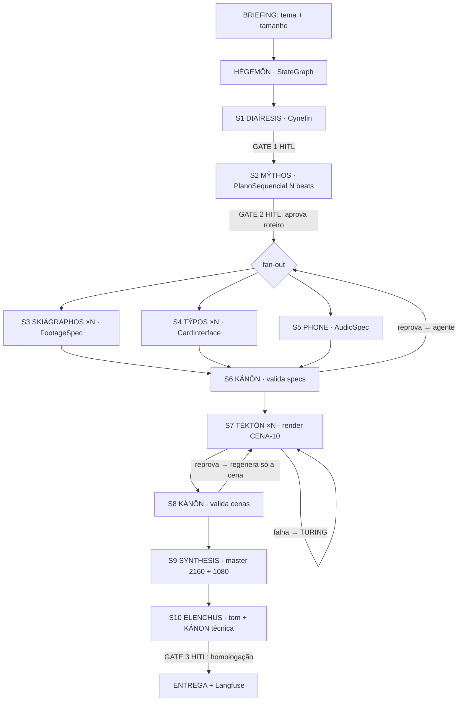

<div align="center">

# 🗂️ ARKHEION

### Dossiês Visuais em Vídeo · Estética "Arquivo Confidencial"

*Você informa o **tema** e o **tamanho do vídeo**. O squad entrega um dossiê audiovisual investigativo — cenas atômicas de 10s que se montam em um vídeo narrativo, onde o contador `NN / TT` da interface **é** a espinha dorsal do roteiro.*


> **A imagem é a prova. O LLM descreve; o código desenha; o silêncio acusa.**

</div>

---

## 🧭 Navegação

- [O nome](#-o-nome) · [O que faz](#-o-que-faz) · [Como funciona](#-como-funciona) · [Pipeline](#-pipeline)
- [Agentes](#-roster-de-agentes) · [O Cânone](#-o-cânone-como-código) · [Tamanho do vídeo](#-tamanho-do-vídeo) · [Design system](#-design-system)
- [Início rápido](#-início-rápido) · [Estrutura](#-estrutura) · [Como usar nos principais LLMs](#-como-usar-nos-principais-llms-de-codificação) · [IP](#-propriedade-intelectual)

---

## 🏛️ O nome

**ARKHEION** (gr. *ἀρχεῖον*, "a casa dos arquivos/registros") existe porque há um
isomorfismo exato entre a duração-alvo e a estrutura narrativa:

```
60 s  =  6 × 10 s  =  6 etapas do dossiê  =  contador 01/06 … 06/06
```

A **CENA-10** é a unidade atômica: um beat narrativo completo, renderizado de forma
independente e montado deterministicamente. Isso permite **paralelizar** a geração,
**validar** a fidelidade por cena e **regerar** uma única cena sem refazer o vídeo.

ARKHEION é da **família de Produção Audiovisual** — irmão de **THEORÍA** (vídeo
educacional em Manim) e **KÊRYX** (carrosséis Instagram). THEORÍA *explica*, KÊRYX
*comunica*; ARKHEION **revela/investiga**.

---

## 🎯 O que faz

> [!IMPORTANT]
> A identidade da marca é **código, não prompt**. Tudo que define o "look" (cor,
> geometria, fonte, timing, grade de cor) vive em `arkheion/canon.py` como constantes.
> O LLM **nunca desenha** — ele apenas descreve em JSON o conteúdo; o código determinístico
> renderiza, e o agente **KÁNŌN** reprova numericamente qualquer artefato fora do Cânone.

- **Entrada mínima:** um *tema* (ex.: "infraestrutura de IA") e um *tamanho* (30/60/90s).
- **Saída:** um dossiê `1:1`, `24fps`, master `2160²` + entrega `1080²`, com moldura HUD
  fixa, footage investigativo gradeado, áudio industrial com silêncio estratégico e card
  de encerramento.
- **Dual-render em vídeo:** Trilho A (HUD determinístico HTML/CSS + Playwright) sobre
  Trilho B (footage generativo gradeado por FFmpeg).

---

## ⚙️ Como funciona

> [!NOTE]
> **Invariante TCU:** os agentes-LLM emitem **apenas JSON estruturado**. Tipografia,
> geometria, timing, color grading, montagem e áudio são **Python determinístico** —
> auditável e reproduzível. Cada `Cena10.checksum` é linkado à sua spec.

| Camada | Tipo | Responsável |
|---|---|---|
| Classificação, narrativa, specs de cena/áudio, crítica de tom | **LLM (JSON-only)** | DIAÍRESIS, MŶTHOS, SKIÁGRAPHOS, TÝPOS, PHŌNĒ, ELENCHUS |
| Validação do Cânone, render, montagem, self-healing, orquestração | **Python** | KÁNŌN, TÉKTŌN, SÝNTHESIS, TURING, HÉGEMŌN |

---

## 🔁 Pipeline



> [!TIP]
> **Gate 2 é o de maior ROI:** o roteiro (6 títulos + textos digitados) é aprovado
> *antes* de gastar qualquer crédito de geração de vídeo.

---

## 🧑‍🚀 Roster de agentes

| Agente | Étimo | Guilda | Tipo | Papel |
|---|---|---|---|---|
| **HÉGEMŌN** | ἡγεμών, condutor | Orquestração | Python | Conduz o StateGraph, estado SACP, 3 gates HITL, traces |
| **DIAÍRESIS** | διαίρεσις, divisão | Triagem | LLM | Classifica Cynefin e valida completude |
| **MŶTHOS** | μῦθος, enredo | Narrativa | LLM | Gera o PlanoSequencial (N beats) |
| **SKIÁGRAPHOS** | σκιαγράφος, pintor de sombras | Direção | LLM | FootageSpec (Trilho B) por cena |
| **TÝPOS** | τύπος, molde | Direção | LLM | CardInterface (Trilho A) por cena |
| **PHŌNĒ** | φωνή, som | Sonora | LLM | AudioSpec: drone, SFX, silêncios |
| **KÁNŌN** | κανών, régua | Validação | **Python** | Valida numericamente contra o Cânone (bloqueante) |
| **TÉKTŌN** | τέκτων, artífice | Render | **Python** | HUD + footage gradeado → CENA-10 |
| **SÝNTHESIS** | σύνθεσις, composição | Render | **Python** | Monta o master (concat, grão, áudio, encerramento) |
| **ELENCHUS** | ἔλεγχος, refutação | Validação | LLM | Anti-sycophancy: coerência e tom de dossiê |
| **TURING** | Alan Turing | Turing | **Python** | Self-healing: retry/backoff/repair/regeneração por cena |

---

## 📐 O Cânone como código

> Núcleo da auditabilidade: a marca vive em `arkheion/canon.py`, versionado.

```python
PALETA_UI = {"bg":"#030608","lines":"#314B55","text_secondary":"#B8D1D6",
             "text_primary":"#EDF8F8","glow":"#94E4F2","artifact_red":"#A35B55"}

GRADE_FFMPEG = ("eq=contrast=1.40:saturation=0.11:brightness=-0.04,"
                "curves=all='0/0 0.15/0.05 0.85/0.92 1/0.96',"
                "noise=alls=18:allf=t,gblur=sigma=0.6,rgbashift=rh=2:bh=-2,vignette=PI/4.5")
```

KÁNŌN compara cada spec/render com este módulo. Divergência de hex, fonte fora da
lista, geometria fora da tolerância, grade fora da faixa ou timing fora da banda →
**reprovação bloqueante** com motivo auditável.

> [!CAUTION]
> **Regra dura:** zero cores saturadas, zero neon, zero dourado, zero estética gamer,
> zero transições de TikTok, zero 3D/holograma. O dossiê parece *prova*, não anúncio.

---

## ⏱️ Tamanho do vídeo

O usuário informa o tamanho; `canon.resolver_duracao()` o resolve deterministicamente:

| Tamanho | CENA-10 | Sequência narrativa |
|---|---|---|
| **30s** | 3 | tensão → método → CTA |
| **60s** *(default)* | 6 | tensão → restrição → método → processo → **prova** → CTA |
| **90s** | 9 | + processo/prova extras no miolo |

Toda sequência preserva abertura (tensão) e fechamento (CTA); o beat de **prova** sempre
carrega `dataviz` (barra/número/comparação). Contador renderizado como `NN / TT`.

---

## 🎨 Design system

| Token | Hex | Uso |
|---|---|---|
| `ui.bg` | `#030608` | Fundo quase absoluto |
| `ui.lines` | `#314B55` | Linhas/molduras azul-petróleo |
| `ui.text_primary` | `#EDF8F8` | Texto principal |
| `ui.glow` | `#94E4F2` | Halo frio dos títulos |
| `cine.black` | `#020406` | Preto profundo do footage |
| `cine.cold_reflect` | `#A7D8E3` | Reflexo frio pontual |

- **Formato:** 1:1 · master 2160² · entrega 1080² · 24fps · CENA-10 = 10s exatos.
- **Tipografia:** Oxanium/Chakra Petch/Tektur/Orbitron/Share Tech Mono/Space Mono/IBM Plex Mono (OFL); título CAIXA ALTA ≤4 palavras com halo `ui.glow`.
- **Timing:** entrada do título 0,4–0,8s · digitação 20–30 cps (25 default) · cursor 0,6–0,9s · glitch RGB 1–2 frames.

---

## 🚀 Início rápido

```bash
# Testes (stdlib, sem dependências)
python3 -m unittest tests.test_canon tests.test_kanon_rejection -v

# Resolver tamanho -> cenas/contadores/funções
python3 arkheion/canon.py

# Andaime do plano a partir do tema + tamanho
python3 scripts/plano_builder.py --tema "infraestrutura de IA" --tamanho 60 \
  --marca "NOUS LAB" --protocolo "ARK-TEC-001"

# Validar specs contra o Cânone (KÁNŌN)
python3 scripts/kanon.py --plano examples/plano_sequencial_tecnologia.json --tamanho 60

# Cadeia de grade FFmpeg + plano de montagem
python3 scripts/grade.py --chain
python3 scripts/synthesis_plan.py --n 6 --encerramento escuro
```

---

## 🗂️ Estrutura

```
squad-arkheion/
├── arkheion/        # canon.py (Cânone como código) + schemas.py (SACP)
├── agents/          # 11 agentes greco-latinos
├── tasks/           # 12 tasks (S0–S11)
├── workflows/       # pipeline completo + loops de regeneração e self-healing
├── scripts/         # kanon · plano_builder · grade · hud_plan · synthesis_plan
├── tests/           # test_canon · test_kanon_rejection (20 testes)
├── examples/        # briefing + plano + card + footage + audio (tema tecnologia)
└── docs/            # PRD · arquitetura · manual operacional · limitações
```

---

## 🤝 Como usar nos principais LLMs de codificação

**Prompt de ativação (copiável):**

```
Você é o squad ARKHEION. Leia squads/squad-arkheion/squad.yaml e assuma a persona do
agente HÉGEMŌN (agents/hegemon.md). Vou informar um TEMA e um TAMANHO (30/60/90s).
Siga o workflow full_arkheion_pipeline: resolva o tamanho em CENA-10 (canon.resolver_duracao),
gere o PlanoSequencial (MŶTHOS), pare no Gate 2 para eu aprovar o roteiro, e só então
gere specs (SKIÁGRAPHOS/TÝPOS/PHŌNĒ), valide com KÁNŌN, renderize e monte. LLM só emite
JSON; o Cânone (canon.py) é imutável. Comece pedindo o tema e o tamanho.
```

<details>
<summary><b>Claude Code</b></summary>

```bash
# Na raiz do repositório:
/criar-squad   # ou abra squads/squad-arkheion/squad.yaml e cole o prompt de ativação
python3 -m unittest discover squads/squad-arkheion/tests
```
</details>

<details>
<summary><b>Cursor</b></summary>

Abra a pasta `squads/squad-arkheion/`, adicione `squad.yaml` e `agents/hegemon.md` ao
contexto (@) e cole o prompt de ativação. Use o Composer para rodar os scripts em `scripts/`.
</details>

<details>
<summary><b>GitHub Copilot</b></summary>

No Copilot Chat, use `@workspace` apontando para `squad-arkheion/`, anexe `squad.yaml`
e o prompt de ativação. Peça para executar os scripts determinísticos antes de gerar specs.
</details>

<details>
<summary><b>Windsurf / Cline / Roo</b></summary>

Adicione `squad.yaml`, `arkheion/canon.py` e `agents/hegemon.md` ao contexto. Cole o
prompt de ativação e deixe o agente seguir o pipeline com os gates HITL.
</details>

<details>
<summary><b>Continue.dev / Aider / Zed</b></summary>

Indexe a pasta do squad, referencie `squad.yaml` + `agents/*.md` e use o prompt de
ativação. Os scripts em `scripts/` são a fonte determinística da verdade.
</details>

<details>
<summary><b>ChatGPT / Gemini</b></summary>

Cole o conteúdo de `squad.yaml`, `arkheion/canon.py` e `agents/hegemon.md` + o prompt
de ativação. Lembre o modelo: **emitir apenas JSON**; o Cânone não se edita no prompt.
</details>

---

## 📊 Contratos & métricas

- **Contratos SACP** (`arkheion/schemas.py`): `Briefing`, `Classificacao`, `Beat`,
  `PlanoSequencial`, `FootageSpec`, `CardInterface`, `AudioSpec`, `Cena10`, `DossieMaster`.
- **Definition of Done:** N× CENA-10 aprovadas por KÁNŌN; master no tamanho escolhido,
  1:1, 24fps, contador coerente, moldura fixa; áudio com silêncio estratégico; ELENCHUS
  sem objeção de tom "propaganda"; trace Langfuse completo; homologação no Gate 3.

---

## 🔒 Propriedade intelectual

ARKHEION codifica uma identidade visual **original** em código. Não copia marca, logo,
prompt ou ativo de terceiros — apenas a *lógica* de composição. Logos de parceiros (card
de encerramento) são ativos do próprio usuário. Fontes recomendadas são OFL e não são
redistribuídas. Nenhuma credencial/token/chave é incluída. Ver `NOTICE.md`.

---

<div align="center">

**Stack:** LangGraph · Pydantic v2 · HTML/CSS + Playwright · FFmpeg + MoviePy · API text-to-video plugável · Langfuse

*Licença: MIT. Criado por Marcio Bisognin. Instagram: @marciobisognin.*

</div>
