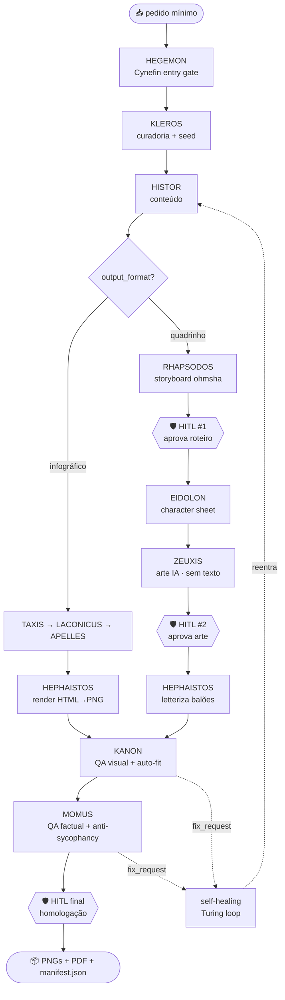

<div align="center">

# 📣 KÊRYX — O Arauto

### Gerador autônomo de **carrosséis educativos** para Instagram

*Você dá uma linha. O arauto entrega o carrossel pronto-para-publicar.*

<br>


-1a202c?style=flat-square)


</div>

<br>

> [!IMPORTANT]
> **KÊRYX** transforma um pedido mínimo — _"quero um carrossel com N posts"_ — em um carrossel
> **pronto-para-publicar**, visualmente fiel ao padrão de referência, factualmente checado e homologável.
>
> **Princípio-mestre:** o LLM gera **conteúdo estruturado (JSON)**; **design, layout e texto final são
> determinísticos** — auditáveis e reprodutíveis. A única etapa não-determinística (a ilustração do
> Trilho B) é **isolada, com seed e validada por gate humano**. O **texto educativo nunca** é renderizado
> pela IA de imagem — vai em camada vetorial nítida por cima.

<br>

## 🧭 Navegação

| | | |
|---|---|---|
| 🎯 [Por que existe](#-por-que-existe) | 📣 [A metáfora do Arauto](#-a-metáfora-do-arauto) | 🤖 [Elenco de agentes](#-elenco-de-agentes) |
| 🛤️ [Os dois trilhos](#️-os-dois-trilhos) | 🗺️ [Pipeline (StateGraph)](#️-pipeline-stategraph) | 🎨 [Design system](#-design-system) |
| 🚀 [Início rápido](#-início-rápido) | 🤝 [**Como usar nos LLMs de codificação**](#-como-usar-nos-principais-llms-de-codificação) | 📑 [Contratos SACP](#-contratos-sacp) |
| 📊 [Métricas & aceite](#-métricas--critérios-de-aceite) | 🧰 [Stack](#-stack-técnica) | 📚 [Saiba mais](#-saiba-mais) |

<br>

---

## 🎯 Por que existe

Produzir carrosséis educativos consistentes é trabalhoso e **não escala**: exige curadoria de tema,
redação enxuta, design fiel a um padrão visual e exportação no formato certo — hoje, tudo manual.
E os modelos de imagem ainda erram texto (_garbled_) e não garantem reprodutibilidade.

### ❌ O problema da automação ingênua
- Um único prompt "faça um carrossel" produz resultado **inconsistente** e **não auditável**.
- IA de imagem renderiza **texto borrado/errado** dentro da arte.
- Nada é **reprodutível**: a mesma ideia sai diferente a cada execução.

### ✅ A tese do KÊRYX
- **Decompõe** em agentes com handoffs SACP → observabilidade, _self-healing_ e auditoria por etapa.
- **Separa conteúdo de forma:** o LLM escreve o JSON; o **render é determinístico** (HTML+CSS → PNG).
- **Isola o não-determinismo:** só a ilustração do quadrinho é generativa — com seed e **gate humano**.
- **Texto sempre vetorial:** nítido, correto e auditável — nunca "alucina".

<div align="center">

| Sem KÊRYX | Com KÊRYX |
|---|---|
| Resultado varia a cada run | Mesma `seed` + `spec` ⇒ mesmo `render_hash` |
| Texto da IA borrado | Texto **vetorial** nítido por cima da arte |
| Sem rastro de decisões | Trace por nó (Langfuse) + manifesto auditável |
| Overflow quebra o layout | Loop KANON ↔ auto-fit → **zero overflow** |

</div>

<br>

---

## 📣 A metáfora do Arauto

Na Grécia antiga, o **κῆρυξ** (_kêryx_) era o **arauto** — o mensageiro oficial que levava a palavra
do poder ao povo com **clareza, fidelidade e autoridade**. Ele não inventava a mensagem: **transmitia-a
com precisão**, em voz alta, para que todos entendessem.

Este squad adota a metáfora com rigor:

- **A mensagem fiel = o conteúdo factual.** MOMUS audita; nada de clichê vazio ou erro factual.
- **A voz clara para todos = o design didático.** Bullets curtos no imperativo, 1 gancho de cotidiano por slide.
- **A autoridade do arauto = o determinismo.** O que sai é **reprodutível e auditável** — não improviso.

O nome é um compromisso: **anunciar conhecimento com clareza, fidelidade e forma impecável.**

<br>

---

## 🤖 Elenco de agentes

12 agentes especializados, orquestrados por um **StateGraph** (LangGraph). ⬡ = ativos **só no Trilho B**.

<div align="center">

| # | Agente | Étimo | Papel | Cynefin | Modelo |
|---|--------|-------|-------|---------|--------|
| 1 | **HEGEMON** | ἡγεμών, líder | Orquestrador + Cynefin gate + HITL final | Gate | Opus |
| 2 | **KLEROS** | κλῆρος, sorteio | Curadoria aleatória (tema/formato/estilo) | Clear/Complic. | Python+Haiku |
| 3 | **HISTOR** | ἵστωρ, investiga | Pesquisa/ideação ancorada no cotidiano | Complicated | Sonnet |
| 4 | **TAXIS** | τάξις, ordem | Estruturação em cards (colunas/seções) | Clear | Sonnet |
| 5 | **LACONICUS** | Lacônia, concisão | Copy em imperativo curto + emoji do título | Clear | Sonnet |
| 6 | **APELLES** | pintor grego | Direção de arte + seleção de estilo baoyu | Clear | Sonnet |
| 7 | **HEPHAISTOS** | Hefesto, forjador | Render determinístico + letterização | Determinístico | — (sem LLM) |
| 8 | **KANON** | κανών, régua | QA visual (overflow, contraste, grid) | Determinístico | — (Playwright) |
| 9 | **MOMUS** | Μῶμος, crítica | QA factual + anti-sycophancy | Complicated | Opus |
| 10 ⬡ | **RHAPSODOS** | ῥαψῳδός | Roteirista/storyboard (princípio _ohmsha_) | Complicated | Opus |
| 11 ⬡ | **EIDOLON** | εἴδωλον, forma | Character sheet + style bible (consistência) | Complicated | Sonnet |
| 12 ⬡ | **ZEUXIS** | rival de Apelles | Ilustrador (IA, sem texto embutido) | Não-det. (isolado) | Backend de imagem |

</div>

<br>

---

## 🛤️ Os dois trilhos

O **mesmo conteúdo** pode sair em dois formatos visuais, herdando o vocabulário dos sistemas **baoyu**.

<table>
<tr>
<th>🅰️ Trilho A — Cards / Infográfico</th>
<th>🅱️ Trilho B — Quadrinho de conhecimento</th>
</tr>
<tr>
<td valign="top">

`baoyu-infographic` · **`layout × estilo`**

- Alta densidade de informação (cards de referência).
- **100% determinístico:** HTML+CSS → Playwright → PNG.
- Saída: `slide_01..NN.png` + `carrossel.pdf`.
- Auto-fit anti-overflow (KANON ↔ HEPHAISTOS).
- Default: `dense-modules × minimalist`.

</td>
<td valign="top">

`baoyu-comic` · **`arte × tom × layout × preset`**

- Mini-HQ educativa estilo _Logicomix_.
- Estrutura determinística + **arte generativa gated**.
- **Texto 100% vetorial** sobreposto (sem _garbled_).
- 2 gates HITL: roteiro **e** arte.
- Saída: `page_01..NN.png` + `comic.pdf`.

</td>
</tr>
</table>

> [!TIP]
> Quando `output_format=auto`, **KLEROS sorteia o formato** (default 70/30 infográfico/quadrinho) e
> propõe o par de estilo baoyu por heurística de domínio — APELLES referenda.

### Domínios cobertos
`Tecnologia` · `Produtividade` · `Gestão da vida` · `Livros & Clássicos` (literatura, ficção científica,
filosofia, matemática, física) — isolados, combinados ou em _mix_ aleatório.

<br>

---

## 🗺️ Pipeline (StateGraph)



> [!NOTE]
> **Roteamento Cynefin (HEGEMON):** `Clear` → 1 domínio linear · `Complicated` → `combined` (arco coeso) ·
> `Complex` → `random_mix` (mais peso ao MOMUS) · `Confuso` → defaults seguros, sem travar o usuário.

<br>

---

## 🎨 Design system

Fonte única da verdade: [`render/tokens.py`](render/tokens.py). O estilo baoyu modula a **estética**;
os tokens governam a **identidade**.

<div align="center">

| Token | Valor | | Papel | Fonte | Tamanho |
|---|---|---|---|---|---|
| `canvas` | 1080 × 1350 (4:5) | | Título | Poppins 800 | 40–46 px · UPPERCASE |
| `margin` | 72 px | | Header | Poppins 700 | 24–28 px · UPPERCASE |
| `columns` | 2 · gutter 64 px | | Bullet | Inter 400 | 21–23 px · sentence |
| `accent` | por tema | | Marcador | ● | 8 px · `#BDBDBD` |

</div>

**Regras editoriais (o "molho"):** bullet = imperativo curto (3–7 palavras, máx. 2 linhas) · header em
UPPERCASE · 1 gancho de cotidiano por slide · **1 emoji no título, 0 nos bullets** · PT-BR sem jargão.
Fontes **embutidas** no build (sem rede em runtime → determinismo).

<br>

---

## 🚀 Início rápido

```bash
# Clone e entre na pasta do squad
git clone https://github.com/marciobisognin/Squads-Genius.git
cd Squads-Genius/squads/squad-keryx

# 1) Curadoria reprodutível (KLEROS) — stdlib, sem dependências
python3 scripts/kleros_curation.py --n-slides 5 --seed 42 --mode single_theme

# 2) Tokens do design system (verdade visual)
python3 render/tokens.py

# 3) Validar um CarouselSpec contra as regras editoriais
python3 scripts/validate_carousel_spec.py --spec examples/exemplo_carousel_spec.json

# 4) Testes de determinismo (curadoria + render_hash + regras)
python3 tests/test_kleros_determinism.py && python3 tests/test_spec_validation.py
```

> [!NOTE]
> O render real de PNG/PDF (Trilho A) usa **jinja2 + playwright + pillow**; sem essas dependências, o
> motor **degrada** para gerar o manifesto + `render_hash` determinísticos (auditáveis). O backend de
> imagem do Trilho B é **plugável** e não acompanha o squad.

<br>

---

## 🤝 Como usar nos principais LLMs de codificação

> [!NOTE]
> **O padrão de ativação é sempre o mesmo, em qualquer ferramenta:**
> 1. **Dê o contexto** dos arquivos do squad (especialmente `squad.yaml` e `workflows/full_keryx_pipeline.yaml`).
> 2. **Peça que o assistente assuma a persona do `agents/hegemon.md`** (o orquestrador).
> 3. **Conduza o pipeline** respeitando os gates HITL (roteiro/arte no Trilho B e homologação final).
>
> Use sempre este **prompt de ativação** (copie e cole):
> ```text
> Leia squads/squad-keryx/squad.yaml e assuma a persona do orquestrador
> squads/squad-keryx/agents/hegemon.md. Conduza o pipeline
> squads/squad-keryx/workflows/full_keryx_pipeline.yaml, validando cada handoff
> contra os contratos em squads/squad-keryx/schemas/sacp_schemas.py.
> NUNCA pule os gates HITL (roteiro/arte no Trilho B e homologação final).
> O texto educativo NUNCA é renderizado pela IA de imagem — sempre vetorial por cima.
> Meu pedido é: gerar carrossel, <N> slides [, formato infográfico|comic, domínio, seed].
> ```

<br>

<details open>
<summary><b>🟣 Claude Code (CLI / Web / IDE) — recomendado</b></summary>

<br>

Este repositório **já é nativo do Claude Code**: há um `CLAUDE.md` e o slash command **`/criar-squad`**.

```bash
# No terminal, dentro do repositório
claude

# Opção A — usar o squad diretamente (recomendado)
> Leia @squads/squad-keryx/squad.yaml e assuma a persona de
  @squads/squad-keryx/agents/hegemon.md. Conduza o pipeline
  @squads/squad-keryx/workflows/full_keryx_pipeline.yaml para: gerar carrossel, 5 slides

# Opção B — rodar os núcleos determinísticos
> Rode python3 scripts/kleros_curation.py --n-slides 5 --seed 42
```

- Use **`@caminho/arquivo`** para dar contexto preciso (autocompleta no prompt).
- Disponível em **CLI, app desktop/web (claude.ai/code) e extensões VS Code / JetBrains**.

</details>

<details>
<summary><b>🟦 Cursor</b></summary>

<br>

1. Abra a pasta `Squads-Genius` no Cursor.
2. No **Chat / Composer (⌘/Ctrl + I)**, referencie os arquivos com `@`:
   ```text
   @squad.yaml @workflows/full_keryx_pipeline.yaml @agents/hegemon.md
   Assuma a persona do HEGEMON e conduza o pipeline para: gerar carrossel, 5 slides, seed 42
   ```
3. **Persistente:** crie um `.cursorrules` na raiz com:
   ```text
   Ao gerar carrosséis educativos, ative o squad em squads/squad-keryx/:
   assuma agents/hegemon.md, siga workflows/full_keryx_pipeline.yaml, valide contratos em
   schemas/sacp_schemas.py e jamais pule os gates HITL. Texto sempre vetorial (nunca na arte).
   ```

</details>

<details>
<summary><b>⬛ GitHub Copilot (VS Code Chat)</b></summary>

<br>

1. Abra o **Copilot Chat** no VS Code.
2. Use `#file` para anexar contexto e `@workspace` para o projeto inteiro:
   ```text
   @workspace #file:squad.yaml #file:workflows/full_keryx_pipeline.yaml
   Assuma a persona descrita em #file:agents/hegemon.md e conduza o pipeline KÊRYX para:
   gerar carrossel, 5 slides. Não pule os gates HITL.
   ```
3. Para regras persistentes, crie **`.github/copilot-instructions.md`** com o prompt de ativação acima.

</details>

<details>
<summary><b>🟩 Windsurf (Cascade)</b></summary>

<br>

1. Abra o repositório no Windsurf.
2. No **Cascade**, mencione os arquivos com `@`:
   ```text
   @squad.yaml @agents/hegemon.md @workflows/full_keryx_pipeline.yaml
   Atue como o orquestrador HEGEMON e execute o pipeline para: gerar carrossel, 4 slides, comic.
   ```
3. Fixe as regras em **`.windsurfrules`** (raiz do projeto) com o prompt de ativação.

</details>

<details>
<summary><b>🟧 Cline / Roo Code (VS Code)</b></summary>

<br>

1. Inicie uma nova tarefa no Cline/Roo.
2. Cole o **prompt de ativação** e mencione os caminhos:
   ```text
   Leia squads/squad-keryx/squad.yaml e agents/hegemon.md. Assuma o HEGEMON, conduza
   workflows/full_keryx_pipeline.yaml e rode os scripts determinísticos em scripts/ e render/
   quando o estágio pedir curadoria, validação ou render. Pedido: gerar carrossel, 5 slides.
   ```
3. O Cline pode **executar os scripts** (`kleros_curation.py`, `validate_carousel_spec.py`, `render/engine.py`)
   e ler a saída — aprove a execução quando solicitado.

</details>

<details>
<summary><b>🟨 Continue.dev / Aider / Zed AI / outros</b></summary>

<br>

- **Continue.dev:** use `@file` para `squad.yaml` e `agents/hegemon.md`; cole o prompt de ativação.
- **Aider:** `aider squads/squad-keryx/squad.yaml squads/squad-keryx/agents/hegemon.md` e instrua o HEGEMON.
- **Zed AI / genéricos:** adicione os arquivos ao contexto e use o prompt de ativação.

</details>

<details>
<summary><b>💬 ChatGPT / Gemini / web (sem acesso a arquivos)</b></summary>

<br>

1. Copie o conteúdo de **`squad.yaml`** + **`workflows/full_keryx_pipeline.yaml`** + **`agents/hegemon.md`** para o chat.
2. Cole o **prompt de ativação**.
3. Como esses ambientes não executam scripts, peça ao modelo para **simular** os gates e **você roda os
   scripts localmente** (`python3 scripts/...`), colando a saída de volta no chat.

</details>

<br>

> [!CAUTION]
> Em **qualquer** ferramenta, os gates **HITL são inegociáveis** e o **texto educativo nunca** é
> desenhado pela IA de imagem. Se o assistente tentar pular um gate ou renderizar texto dentro da arte,
> interrompa: o comportamento correto é parar e pedir homologação / usar a **camada vetorial**.

<br>

---

## 📑 Contratos SACP

Todos os handoffs são **JSON validado por Pydantic** ([`schemas/sacp_schemas.py`](schemas/sacp_schemas.py),
com fallback para dataclasses). Detalhes em [`docs/schemas_sacp.md`](docs/schemas_sacp.md).

<div align="center">

| Artefato | Produtor → Consumidor |
|---|---|
| `CarouselBrief` | HEGEMON → KLEROS |
| `ThemePlan` | KLEROS → HISTOR |
| `ContentDraft` | HISTOR → TAXIS |
| `CarouselSpec` | TAXIS → LACONICUS → APELLES → HEPHAISTOS |
| `RenderManifest` | HEPHAISTOS → KANON |
| `QAVisual` / `QAContent` | KANON / MOMUS → HEGEMON |
| `ComicScript` ⬡ | RHAPSODOS → EIDOLON/ZEUXIS |
| `CharacterSheet` ⬡ | EIDOLON → ZEUXIS |
| `ComicAssets` ⬡ | ZEUXIS → HEPHAISTOS |

</div>

<br>

---

## 📊 Métricas & critérios de aceite

<div align="center">

| Objetivo | Meta MVP |
|---|---|
| 🎯 Geração com input mínimo | ≥ 90% sem rodada extra |
| 🎨 Fidelidade ao design system (KANON) | ≥ 95% |
| 🧠 Conteúdo correto (flags MOMUS) | ≤ 1 por carrossel |
| ♻️ Render determinístico | mesma `seed`+`spec` ⇒ mesmo `render_hash` |
| 📐 Zero overflow | 0 slides cortados |
| ⏱️ Velocidade (5 slides) | ≤ 90 s |

</div>

✅ Validado com `validate_squad.py` → **go** (completeness 100, 0 issues) · 10 testes verdes.

<br>

---

## 🧰 Stack técnica

<div align="center">

`Python 3.11+` · `LangGraph (StateGraph)` · `Pydantic` · `Jinja2` · `Playwright (Chromium)`
`Pillow / img2pdf` · `SQLite (anti-repetição)` · `Langfuse` · `Claude API` · `backend de imagem plugável`

</div>

<br>

---

## 📚 Saiba mais

- 📖 [`docs/manual_operacional.md`](docs/manual_operacional.md) — guia operacional detalhado
- 🧩 [`docs/schemas_sacp.md`](docs/schemas_sacp.md) — contratos de dados entre agentes
- 🎨 [`docs/design_system.md`](docs/design_system.md) — tokens e regras visuais
- ⚠️ [`docs/limitacoes.md`](docs/limitacoes.md) — riscos, mitigações e fora de escopo
- 🧪 [`examples/`](examples/) — briefs e specs de exemplo (infográfico e comic)

<br>

> [!NOTE]
> **Nota de propriedade intelectual.** Os sistemas de estilo **baoyu** (@JimLiu/baoyu-skills, MIT) são
> usados como **vocabulário de design** e **reimplementados** sob arquitetura própria — sem copiar código,
> marca ou identidade visual. O ícone de marca é um **slot do próprio usuário**; ZEUXIS cria **arte
> original**, sem imitar artistas vivos nomeados.

<br>

<div align="center">

### 💡 Princípio orientador

> *O LLM escreve o conteúdo; o design é determinístico. O arauto anuncia com clareza, fidelidade e forma
> impecável — e nunca deixa a IA de imagem inventar o texto que vai ensinar.*

<br>

**Licença: MIT. Criado por Marcio Bisognin. Instagram: [@marciobisognin](https://instagram.com/marciobisognin).**

</div>
