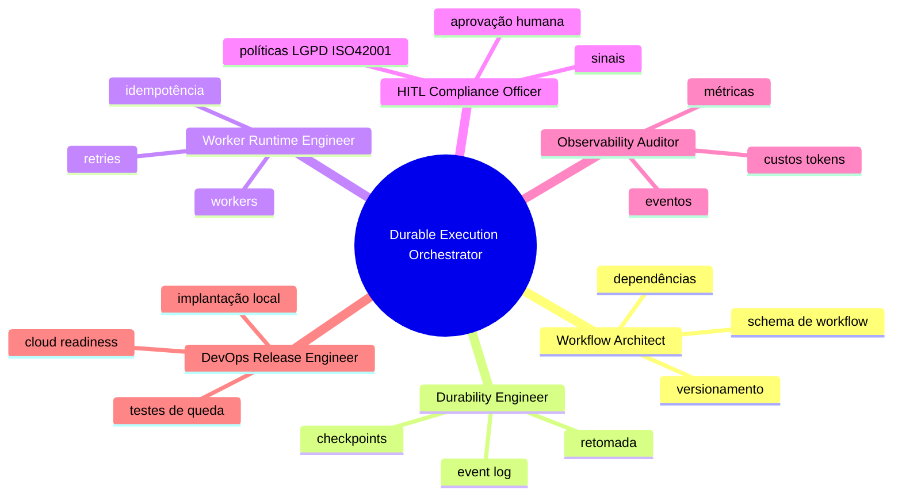
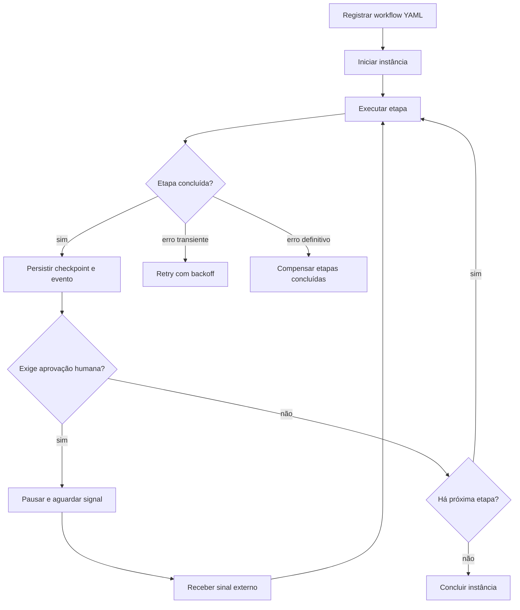

# Orquestrador de Execução Durável para Squads

<div align="center">
  <h3>Runtime durável para workflows multiagentes do ecossistema Squads-Genius</h3>


</div>

## O que é

O **Orquestrador de Execução Durável para Squads** é um squad técnico que transforma workflows descritos em YAML em execuções rastreáveis, retomáveis e auditáveis. Ele materializa o PRD recebido em uma arquitetura de agentes, tasks, workflows e um protótipo funcional local com SQLite.

A função central é resolver um gargalo do repositório Squads-Genius: squads já descrevem agentes, tarefas e workflows, mas precisam de um runtime capaz de preservar estado, retomar após falhas, aguardar aprovações humanas, controlar retries e registrar evidências.

## Para que serve

- Registrar workflows versionados de squads.
- Iniciar e retomar execuções duráveis.
- Persistir checkpoints por etapa concluída.
- Pausar indefinidamente em gates de aprovação humana.
- Retomar apenas após sinal externo explícito.
- Registrar eventos de execução, sinais, erros e compensações.
- Executar compensações em ordem inversa no padrão Saga.
- Produzir base local para futuro runtime cloud/Temporal/Restate.

## Arquitetura do Squad



## Fluxo de Trabalho



## Agentes

| Agente | Responsabilidade exclusiva | Entrega |
| --- | --- | --- |
| Workflow Architect | Converter manifestos de squads em contratos versionados | Schema, dependências, compatibilidade |
| Durability Engineer | Garantir persistência e retomada | Checkpoints, event log, replay |
| Worker Runtime Engineer | Executar atividades de forma idempotente | Workers, retries, backoff |
| HITL Compliance Officer | Controlar aprovação humana e políticas | Gates, sinais, trilha de decisão |
| Observability Auditor | Auditar eventos e métricas | Logs, tokens, custo, latência |
| DevOps Release Engineer | Preparar implantação local/cloud | Runbook, testes, rollout |

## Como executar o protótipo local

```bash
cd squads/durable-execution-orchestrator-squad
python scripts/durable_orchestrator.py run-example --workdir output/demo
```

O comando registra o workflow de exemplo, inicia a instância, executa até o gate de aprovação, envia o sinal de aprovação e retoma até concluir.

## Critérios de aceite implementados no protótipo

- Workflow de cinco etapas com aprovação humana.
- Persistência em SQLite.
- Event log estruturado.
- Pausa durável em gate de aprovação.
- Retomada após sinal de aprovação.
- Compensação registrada em cancelamento/falha.
- Testes automatizados com pytest.

## Limitações atuais

- O protótipo local usa SQLite e execução sequencial; filas distribuídas, sharding e alta disponibilidade são próximos passos.
- OpenTelemetry está modelado como contrato e documentação, ainda sem exportador real.
- O painel visual foi excluído do escopo inicial, conforme PRD.
- A integração com Temporal, Restate, Cloudflare, AWS ou Vercel é uma decisão de arquitetura futura.

Licença: MIT. Criado por Marcio Bisognin. Instagram: @marciobisognin.
