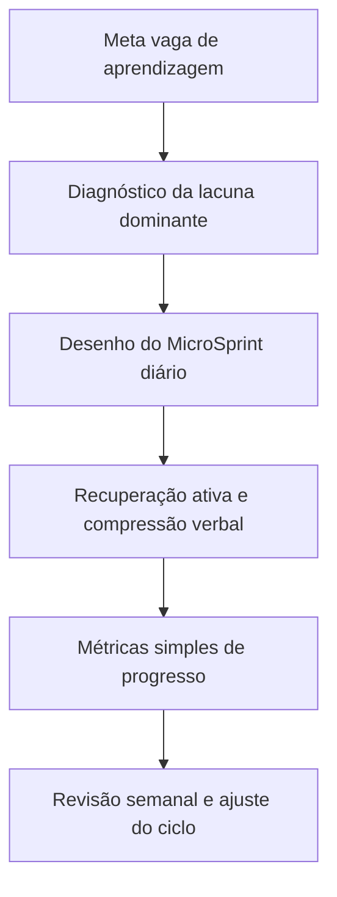
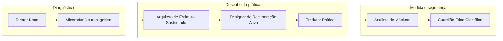
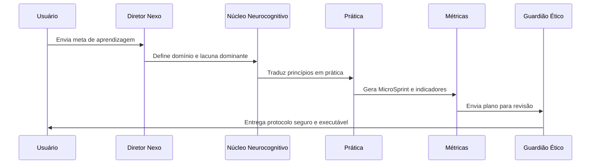
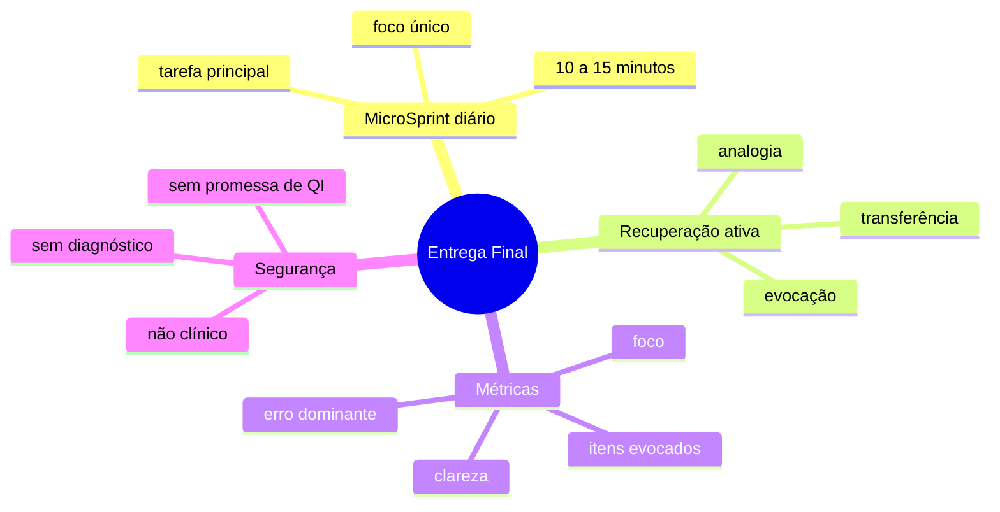

<div align="center">

# 🧠✨ Nexum Cognitivo

### Um squad premium para transformar metas de aprendizagem em prática diária curta, intensa, mensurável e segura.

<p>
  
  
  
  
</p>

</div>

---

## ✦ O que é este Squad?

O **Nexum Cognitivo** é um squad de aprendizagem aplicada. Ele foi criado para converter uma intenção ampla — como “quero aprender melhor”, “preciso estudar para concurso” ou “quero dominar um tema técnico” — em um ciclo prático de execução diária.

A lógica central do squad é simples: aprendizagem não é apenas exposição ao conteúdo. Ela exige **atenção sustentada**, **estímulo adequado**, **recuperação ativa**, **compressão verbal**, **repetição inteligente** e **métrica mínima**.

<div align="center">
<table>
<tr>
<td align="center"><b>🎯 Meta</b><br/>O usuário informa o que quer aprender.</td>
<td align="center"><b>🧩 Lacuna</b><br/>O squad identifica o gargalo dominante.</td>
<td align="center"><b>⚡ Prática</b><br/>O objetivo vira MicroSprint diário.</td>
<td align="center"><b>📊 Evidência</b><br/>O progresso passa a ser acompanhado.</td>
</tr>
</table>
</div>

---

## ✦ Para que serve?

O squad serve para transformar estudo passivo em prática orientada. Ele pode ser usado em situações como:

- preparação para concursos;
- aprendizagem de idiomas;
- estudo de textos técnicos ou acadêmicos;
- melhoria da escrita e da clareza argumentativa;
- desenvolvimento de habilidades profissionais;
- criação de rotina curta e sustentável de aprendizagem.



---

## ✦ Estrutura dos agentes

O Nexum Cognitivo trabalha como uma cadeia de especialistas. Cada agente reduz um tipo de incerteza até que a meta inicial se torne um protocolo executável.



---

## ✦ O que cada agente faz?

<div align="center">
<table>
<tr>
<td><b>🧭 Diretor Nexo</b><br/>Recebe a meta, organiza o briefing e define a lacuna dominante da aprendizagem.</td>
<td><b>🔬 Minerador Neurocognitivo</b><br/>Converte princípios de atenção, prática e consolidação em decisões operacionais.</td>
</tr>
<tr>
<td><b>⚡ Arquiteto de Estímulo Sustentado</b><br/>Define a dose de prática: curta, intensa, repetível e sem dispersão.</td>
<td><b>🧠 Designer de Recuperação Ativa</b><br/>Cria perguntas, evocação sem consulta, analogias e exercícios de transferência.</td>
</tr>
<tr>
<td><b>🛠️ Tradutor Prático</b><br/>Adapta o protocolo ao domínio real: concurso, idioma, escrita, técnica ou rotina.</td>
<td><b>📊 Analista de Métricas</b><br/>Define indicadores simples: foco, clareza, itens evocados, erro dominante e próxima repetição.</td>
</tr>
<tr>
<td colspan="2" align="center"><b>🛡️ Guardião Ético-Científico</b><br/>Revisa a linguagem para evitar promessa clínica, diagnóstico, pseudociência ou garantia indevida de desempenho.</td>
</tr>
</table>
</div>



---

## ✦ O que o Squad entrega no final?

Ao final do fluxo, o Nexum Cognitivo entrega um pacote de aprendizagem pronto para uso:

<div align="center">
<table>
<tr>
<td align="center"><b>📄 Protocolo diário</b><br/>Um MicroSprint de 10 a 15 minutos com etapas claras.</td>
<td align="center"><b>🧩 Lacuna dominante</b><br/>A principal dificuldade que deve ser trabalhada primeiro.</td>
</tr>
<tr>
<td align="center"><b>🔁 Recuperação ativa</b><br/>Perguntas e exercícios para lembrar sem consultar.</td>
<td align="center"><b>🗣️ Compressão verbal</b><br/>Explicação em três frases ou uma analogia.</td>
</tr>
<tr>
<td align="center"><b>📊 Plano de métricas</b><br/>Indicadores simples para acompanhar progresso.</td>
<td align="center"><b>🛡️ Parecer de segurança</b><br/>Limites educacionais e linguagem não clínica.</td>
</tr>
</table>
</div>



---

<div align="center">

**Nexum Cognitivo** transforma conteúdo em prática, prática em evidência e evidência em ajuste inteligente.

<br/>

**Licença:** MIT · **Criado por:** Marcio Bisognin · **Instagram:** @marciobisognin

</div>

---

## 🤝 Como usar nos principais LLMs de codificação

> [!NOTE]
> **O padrão de ativação é o mesmo em qualquer ferramenta:**
> 1. **Dê contexto** ao assistente apontando os arquivos do squad (especialmente `squads/nexum-cognitivo/squad.yaml` e `squads/nexum-cognitivo/workflows/nexum-cognitivo-main.yaml`).
> 2. **Peça que ele assuma a persona do orquestrador** definido em `squads/nexum-cognitivo/agents/diretor-nexo.md`.
> 3. **Conduza o fluxo** respeitando os checkpoints humanos e validando cada handoff/contrato.
>
> **Prompt de ativação** (copie, cole e ajuste o briefing):
> ```text
> Assuma a persona do orquestrador do squad definido em `squads/nexum-cognitivo/agents/diretor-nexo.md`
> e conduza o fluxo definido em `squads/nexum-cognitivo/`. Siga `squads/nexum-cognitivo/workflows/nexum-cognitivo-main.yaml`.
> Valide cada handoff/contrato e respeite os checkpoints humanos.
> Meu briefing é: <descreva seu objetivo, materiais e formato de saída>.
> ```

<details open>
<summary><b>🟣 Claude Code (CLI / Web / IDE) — recomendado</b></summary>

<br>

```bash
# No terminal, dentro do repositório
claude

> Leia @squads/nexum-cognitivo/squad.yaml e assuma a persona do orquestrador do squad.
  Siga @squads/nexum-cognitivo/workflows/nexum-cognitivo-main.yaml. Conduza o fluxo para o briefing: <...>
```
- Use **`@caminho/arquivo`** para dar contexto preciso (autocompleta no prompt).
- Disponível em **CLI, app desktop/web (claude.ai/code) e extensões VS Code / JetBrains**.

</details>

<details>
<summary><b>🟦 Cursor</b></summary>

<br>

1. Abra a pasta do repositório no Cursor.
2. No **Chat / Composer (⌘/Ctrl + I)**, referencie os arquivos com `@`:
   ```text
   @squads/nexum-cognitivo/squad.yaml @squads/nexum-cognitivo/workflows/nexum-cognitivo-main.yaml
   Assuma a persona do orquestrador e conduza o fluxo para o briefing: <...>
   ```
3. **Persistente:** crie um `.cursorrules` na raiz apontando para `squads/nexum-cognitivo/` como squad ativo.

</details>

<details>
<summary><b>⬛ GitHub Copilot (VS Code Chat)</b></summary>

<br>

```text
@workspace #file:squads/nexum-cognitivo/squad.yaml #file:squads/nexum-cognitivo/workflows/nexum-cognitivo-main.yaml
Assuma a persona do orquestrador deste squad e conduza o fluxo para: <...>
```
Para regras persistentes, crie **`.github/copilot-instructions.md`** com o prompt de ativação.

</details>

<details>
<summary><b>🟩 Windsurf (Cascade)</b></summary>

<br>

```text
@squads/nexum-cognitivo/squad.yaml @squads/nexum-cognitivo/workflows/nexum-cognitivo-main.yaml
Atue como o orquestrador deste squad e execute o fluxo para: <briefing>.
```
Fixe as regras em **`.windsurfrules`** (raiz do projeto).

</details>

<details>
<summary><b>🟧 Cline / Roo Code (VS Code)</b></summary>

<br>

```text
Leia squads/nexum-cognitivo/squad.yaml e assuma a persona do orquestrador.
Conduza o fluxo do squad e execute os scripts em squads/nexum-cognitivo/scripts/ quando o passo pedir.
Briefing: <...>
```
O Cline/Roo pode **executar os scripts** do squad e ler a saída — aprove a execução quando solicitado.

</details>

<details>
<summary><b>🟨 Continue.dev / Aider / Zed AI / chats web</b></summary>

<br>

- **Continue.dev:** use `@file` para `squads/nexum-cognitivo/squad.yaml`; cole o prompt de ativação.
- **Aider:** `aider squads/nexum-cognitivo/squad.yaml` e instrua o orquestrador.
- **ChatGPT / Gemini (sem acesso a arquivos):** copie o conteúdo de `squads/nexum-cognitivo/squad.yaml` e `squads/nexum-cognitivo/workflows/nexum-cognitivo-main.yaml` para o chat, cole o prompt de ativação e rode eventuais scripts localmente, colando a saída de volta.

</details>


---

Licença: MIT. Criado por Marcio Bisognin. Instagram: @marciobisognin.
