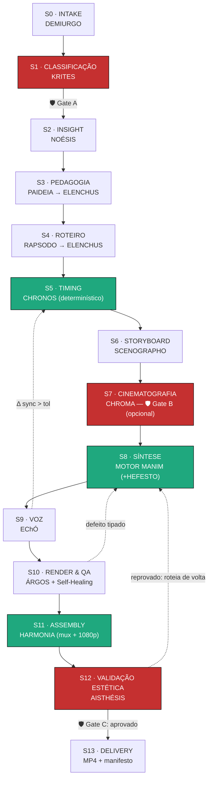

<div align="center">

# 🎬 THEORÍA

### Estúdio cinematográfico de **vídeos educacionais em Manim** (padrão 3Blue1Brown)

*Você dá uma ideia. THEORÍA entrega um vídeo que **ensina** — com intuição visual, narração pt-BR e revelação cronometrada.*

<br>


-1a202c?style=flat-square)


</div>

<br>

> [!IMPORTANT]
> **THEORÍA** (do grego *θεωρία* — "contemplar um espetáculo", raiz de *teoria* e de *espectador*)
> transforma uma ideia mínima — _"explique por que e^{iπ} = −1"_ — em um **MP4 1080p** de nível
> cinematográfico, na gramática visual do **3Blue1Brown**: intuição construída visualmente, cor com
> semântica e narração sincronizada ao milissegundo.
>
> **Invariante central:** os **LLMs geram apenas conteúdo estruturado (JSON)**. Todo cálculo de tempo,
> toda compilação de código e toda renderização são **Python determinístico** — auditável, reproduzível
> e versionado. **O mesmo scene-graph JSON sempre produz o mesmo vídeo.**

<br>

## 🧭 Navegação

| | | |
|---|---|---|
| 🎯 [Por que existe](#-por-que-existe) | 🏛️ [A metáfora de THEORÍA](#️-a-metáfora-de-theoría) | 🤖 [Elenco de agentes](#-elenco-de-agentes) |
| 🗺️ [Pipeline (StateGraph)](#️-pipeline-stategraph) | 🎨 [DSL & design system](#-dsl--design-system) | 🔁 [Os dois loops](#-os-dois-loops-determinísticos) |
| 🚀 [Início rápido](#-início-rápido) | 🤝 [**Como usar nos LLMs de codificação**](#-como-usar-nos-principais-llms-de-codificação) | 📑 [Contratos de handoff](#-contratos-de-handoff) |
| 📊 [Métricas & aceite](#-métricas--critérios-de-aceite) | 🧰 [Stack](#-stack-técnica) | 📚 [Saiba mais](#-saiba-mais) |

<br>

---

## 🎯 Por que existe

Produzir um vídeo estilo 3b1b manualmente exige domínio **simultâneo** de pedagogia, roteiro, design de
movimento, cor, *timing* e programação Manim. O gargalo não é a renderização (Manim já é determinístico)
— é a **composição da cena** e a **sincronia narração↔animação**.

### ❌ O problema da geração ingênua
- Um LLM pedindo "faça um vídeo Manim" gera código que **não renderiza**, **sobrepõe objetos** e **estoura a tela**.
- Áudio e vídeo **dessincronizam**: a narração termina antes (ou depois) da animação.
- Nada é **reprodutível**: a mesma ideia sai diferente a cada execução.

### ✅ A tese de THEORÍA
- **DSL-first:** os agentes emitem um **scene-graph JSON** que referencia **primitivas vetadas** — nunca código no escuro.
- **Separa conteúdo de forma:** o LLM escreve o JSON; **timing, compilação e render são determinísticos**.
- **Isola o não-determinismo:** codegen livre só via **HEFESTO**, sob *sandbox* + render-validate-heal, e a primitiva aprovada é **promovida** ao catálogo.
- **Tempo derivado do conteúdo:** a duração é o tempo necessário para explicar tudo, limitado pela banda do brief.

<div align="center">

| Sem THEORÍA | Com THEORÍA |
|---|---|
| Código Manim que não renderiza | Compilador determinístico sobre primitivas testadas |
| Narração fora de sync | Loop S5↔S9: erro < 150 ms/segmento |
| Resultado varia a cada run | Mesmo scene-graph + seed ⇒ mesmo vídeo |
| Overflow/sobreposição quebram a cena | ÁRGOS QA por frame + self-healing tipado |
| Sem rastro de decisões | Manifesto hasheado + trace por nó (Langfuse) |

</div>

<br>

---

## 🏛️ A metáfora de THEORÍA

No grego antigo, **θεωρία** (*theōría*) era o ato de **contemplar um espetáculo sagrado** — a mesma raiz
de *teoria* e de *espectador*. THEORÍA assume a metáfora com rigor: o vídeo não é decoração da ideia, é o
**espetáculo que faz a ideia ser contemplada** — onde a intuição "acontece" diante dos olhos.

Cada agente carrega um **nome greco-latino por função epistêmica**: do **DEMIURGO** que ordena o cosmos
da cena ao **AISTHÉSIS** que julga a percepção estética. A nomeação não é enfeite — é o mapa funcional
do squad.

<br>

---

## 🤖 Elenco de agentes

| Agente | Étimo | Guilda | Função | Natureza |
|---|---|---|---|---|
| **DEMIURGO** | δημιουργός, artífice | Orquestração | Liga o StateGraph, mantém estado, dispara gates e loops | StateGraph |
| **KRITES** | κριτής, juiz | Gate de entrada | Classifica domínio/complexidade; profundidade e banda (**Gate A**) | LLM→JSON |
| **NOÉSIS** | νόησις, insight | Concepção | Ideia-núcleo + momento aha | LLM→JSON |
| **PAIDEIA** | παιδεία, formação | Concepção | Arco didático + misconceptions | LLM→JSON |
| **ELENCHUS** | ἔλεγχος, refutação | Concepção | Verificação factual/matemática (anti-alucinação) | LLM→JSON |
| **RAPSODO** | ῥαψῳδός, recitador | Roteiro | Narração pt-BR por beat (voz 3b1b) | LLM→JSON |
| **CHRONOS** | χρόνος, tempo | Roteiro | Pacing **determinístico**: timeline mestra + reconciliação | Python + LLM |
| **SCENOGRAPHO** | σκηνογράφος, cenógrafo | Visual | Scene-graph JSON sobre primitivas vetadas | LLM→JSON |
| **CHROMA** | χρῶμα, cor | Visual | Paleta semântica, câmera intencional, hierarquia | LLM→JSON |
| **MOTOR MANIM** | — | Forja | Compila scene-graph → código (núcleo auditável) | **sem LLM** |
| **HEFESTO** | Ἥφαιστος, ferreiro | Forja | Escape hatch: codegen sob sandbox + heal | LLM |
| **EChÓ** | Ἠχώ, eco | Forja | Orquestra TTS pt-BR; devolve durações reais | **sem LLM** |
| **ÁRGOS** | Ἄργος, o que tudo vê | Render & QA | QA por frame + self-healing tipado | Python + LLM |
| **HARMONIA** | ἁρμονία, junção | Render & QA | Mux vídeo+áudio, 1080p, manifesto | **sem LLM** |
| **AISTHÉSIS** | αἴσθησις, percepção | Validação | Rubrica 3b1b anti-sycophancy (**Gate C**) | LLM-juiz |

<br>

---

## 🗺️ Pipeline (StateGraph)



**Loops de reconciliação chave**
- **S5 ↔ S9:** o tempo planejado por CHRONOS é confrontado com a duração real do TTS (EChÓ). Se
  |Δ| > tolerância (default 200 ms/beat), CHRONOS reajusta `run_time` e pausas.
- **S10 (self-healing):** falha de render → diagnóstico → correção no estágio de origem (SYNTHESIS,
  STORYBOARD, CINEMATOGRAPHY ou TIMING) → re-render.

<br>

---

## 🎨 DSL & design system

### Biblioteca de primitivas vetadas (`scripts/primitive_library.py`)
A "voz visual" do 3b1b é um **vocabulário finito**. SCENOGRAPHO **só** referencia primitivas
existentes; algo novo passa por **HEFESTO** (sandbox) e é **promovido** ao catálogo.

`TitleReveal` · `NumberLineReveal` · `NumberPlaneReveal` · `FunctionGraphReveal` · `TransformEquation`
· `VectorTransform` · `MatrixMultiplication` · `GeometricProof` · `HighlightFocus` · `CameraMove` ·
`ComplexPlaneReveal` · `ComplexPlaneSpiral`

### Paleta semântica (a cor **significa**)
| Cor | Token | Semântica |
|---|---|---|
| 🔵 Azul | `#3B82F6` | Neutro, estrutura, plano de fundo conceitual |
| 🟡 Amarelo | `#FACC15` | Foco — o objeto em questão, o "olhe aqui" |
| 🔴 Vermelho | `#EF4444` | Alerta, contraexemplo, erro a evitar |
| 🟢 Verde | `#22C55E` | Confirmação, resultado correto, recompensa |
| ⚪ Off-white | `#ECECEC` | Texto/eixos sobre fundo `#0E1116` |

### Formato & 1080p (`scripts/render_config.py`)
| Formato | Resolução | FPS |
|---|---|---|
| 16:9 (YouTube) | 1920 × 1080 | 60 |
| 9:16 (Reels/Shorts) | 1080 × 1920 | 60 |
| 1:1 (feed) | 1080 × 1080 | 60 |

<br>

---

## 🔁 Os dois loops determinísticos

> [!NOTE]
> Os loops são **Python puro** — sem LLM no caminho crítico. Isso é o que torna a sincronia e a
> auto-cura **reproduzíveis e auditáveis**.

- **Reconciliação (`reconciliation_loop`)** — CHRONOS planeja o tempo; EChÓ devolve a duração real do
  TTS; o confronto reajusta beats até `convergiu: true` (erro < 150 ms/segmento).
- **Self-healing (`self_healing_loop`)** — ÁRGOS emite defeitos tipados (`off_canvas`, `sobreposicao`,
  `contraste`, `jitter`, `sync`), DEMIURGO reabre o estágio responsável com `max_retries` + circuit
  breaker, e re-renderiza (preview barato → full 1080p).

<br>

---

## 🚀 Início rápido

O **núcleo determinístico roda só com Python 3.11+ (stdlib)** — sem Manim/FFmpeg instalados.

```bash
cd squads/theoria-squad

# Catálogo de primitivas + versão da DSL
python3 scripts/primitive_library.py

# Timing determinístico (linha do tempo mestra) a partir dos beats
python3 scripts/chronos_timing.py --beats examples/beats_euler.json

# Validar o scene-graph contra a DSL vetada
python3 scripts/validate_scene_graph.py --scene examples/scene_graph_euler.json

# Compilar scene-graph -> código Manim (Motor MANIM, determinístico)
python3 scripts/manim_compiler.py --scenes examples/scene_graph_euler.json \
    --class-name EulerIdentity --out outputs/euler_scene.py

# QA por frame (ÁRGOS) + roteamento de self-healing
python3 scripts/qa_frame_checks.py --frames examples/qa_frames_euler.json

# Testes de determinismo (standalone)
python3 tests/test_determinism.py
```

Para **render real**, instale Manim Community (pinned) + FFmpeg e rode os comandos emitidos por
`render_config.py` e `assemble_av.py` (ver [`docs/operational_manual.md`](docs/operational_manual.md)).

<br>

---

## 🤝 Como usar nos principais LLMs de codificação

> **Prompt de ativação** (copie e cole — funciona em qualquer assistente de código):

```text
Você agora opera como o squad THEORÍA (squads/theoria-squad/).
Leia squad.yaml e assuma o orquestrador DEMIURGO, seguindo o workflow
full_theoria_pipeline.yaml (estágios S0→S13).

Invariante: LLM gera APENAS JSON estruturado conforme schemas/theoria_schemas.py.
Tempo (chronos_timing.py), compilação (manim_compiler.py), QA (qa_frame_checks.py)
e mux (assemble_av.py) são Python determinístico — não escreva Manim no escuro.
SCENOGRAPHO só referencia primitivas de scripts/primitive_library.py; algo novo
vai para HEFESTO (sandbox). Respeite os gates A (classificação) e C (homologação).

Meu brief: "<ideia>; formato <16:9|9:16|1:1>; audiência <nível>".
```

<details>
<summary><b>Claude Code</b></summary>

```bash
cd squads/theoria-squad
# Cole o prompt de ativação. O Claude lê squad.yaml e os agentes em agents/,
# e roda os scripts determinísticos diretamente no terminal.
python3 scripts/chronos_timing.py --beats examples/beats_euler.json
```
</details>

<details>
<summary><b>Cursor</b></summary>

Abra a pasta `squads/theoria-squad/` no Cursor. No chat (⌘K/Ctrl+K), cole o prompt de ativação e
referencie `@squad.yaml` e `@agents/demiurgo.md`. Use `@scripts/` para que o Cursor rode os módulos
determinísticos.
</details>

<details>
<summary><b>GitHub Copilot</b></summary>

No Copilot Chat, adicione o workspace e cole o prompt de ativação. Peça: *"siga
`workflows/full_theoria_pipeline.yaml` e gere o scene-graph para o beat X usando apenas
`scripts/primitive_library.py`"*.
</details>

<details>
<summary><b>Windsurf / Cline / Roo</b></summary>

Aponte o agente para `squads/theoria-squad/` como raiz de contexto. Cole o prompt de ativação; deixe o
agente executar `validate_scene_graph.py` e `manim_compiler.py` no terminal integrado.
</details>

<details>
<summary><b>Continue.dev / Aider / Zed</b></summary>

Adicione `squad.yaml`, `agents/` e `scripts/` ao contexto. Em Aider:
`aider squads/theoria-squad/scripts/*.py` e cole o prompt de ativação para iterar sobre as primitivas.
</details>

<details>
<summary><b>ChatGPT / Gemini (sem acesso ao repo)</b></summary>

Cole o conteúdo de `squad.yaml`, do agente relevante (`agents/*.md`) e do `primitive_library.py`. Peça a
saída **estritamente como JSON** conforme `schemas/theoria_schemas.py` — e rode os scripts
determinísticos você mesmo localmente.
</details>

<br>

---

## 📑 Contratos de handoff

Todo handoff é um **envelope JSON validado** (`schemas/theoria_schemas.py`):

```json
{
  "versao": "1.0",
  "origem": "SCENOGRAPHO",
  "destino": "Motor MANIM",
  "schema": "SceneGraph",
  "payload": { "...": "scene-graph validado" },
  "proveniencia": { "trace_id": "lf-...", "stage": "S6" },
  "checagem": { "pydantic_ok": true, "primitivas_existentes": true }
}
```

Schemas principais: `VideoBrief` · `Classificacao` · `CoreInsight` · `Beat` · `PrimitiveCall` ·
`SceneGraph` · `RenderJob` · `QAReport` · `Envelope`. Pydantic v2 quando disponível; **fallback para
dataclasses** da stdlib (zero dependências).

<br>

---

## 📊 Métricas & critérios de aceite

| KPI | Alvo v1.0 |
|---|---|
| Renders que passam QA na 1ª tentativa | ≥ 70% |
| Taxa de sucesso do self-healing | ≥ 85% |
| Edições humanas por vídeo (Gate C) | ≤ 2 |
| Erro de sincronia narração↔animação | < 150 ms/segmento |
| Reprodutibilidade (output idêntico, sem TTS) | 100% |
| Score na rubrica AISTHÉSIS | ≥ 8/10 |
| Tempo médio ideia→entrega (sem HITL, ~3 min de vídeo) | < 25 min |

<br>

---

## 🧰 Stack técnica

- **Orquestração:** Python 3.12, LangGraph (StateGraph), Pydantic v2.
- **LLM dos agentes:** Anthropic Claude (saída JSON estruturada).
- **Render:** Manim Community (*pinned*), FFmpeg (H.264, `yuv420p`, CRF configurável).
- **TTS pt-BR:** provedor plugável (ElevenLabs / Azure Neural / Coqui) via interface abstrata (EChÓ).
- **Observabilidade:** Langfuse (trace `job → estágio → agente`; span dedicado ao render).
- **Isolamento:** Docker (sandbox de render e de codegen).
- **Scripts determinísticos:** **stdlib apenas** — rodam em qualquer ambiente, inclusive Termux/Android.

<br>

---

## 📚 Saiba mais

| Documento | Conteúdo |
|---|---|
| [`docs/architecture.md`](docs/architecture.md) | Guildas, fronteira LLM↔determinístico, loops |
| [`docs/dsl_primitives.md`](docs/dsl_primitives.md) | Catálogo de primitivas e ciclo de promoção |
| [`docs/operational_manual.md`](docs/operational_manual.md) | Passo a passo determinístico e render real |
| [`docs/limitations.md`](docs/limitations.md) | Não-objetivos e limitações da v1.0 |
| [`docs/PRD.md`](docs/PRD.md) | PRD-fonte (v1.0) |

<br>

> [!TIP]
> **Nota de IP:** THEORÍA implementa uma **gramática visual** (vocabulário de movimentos) inspirada no
> estilo educacional consagrado por 3Blue1Brown — **sem copiar** marca, código proprietário, áudio ou
> ativos de terceiros. As primitivas são reimplementações originais sobre Manim Community (MIT).

<div align="center">

<br>

**THEORÍA** — *da ideia ao espetáculo que ensina.*

Licença: MIT. Criado por Marcio Bisognin. Instagram: @marciobisognin.

</div>
