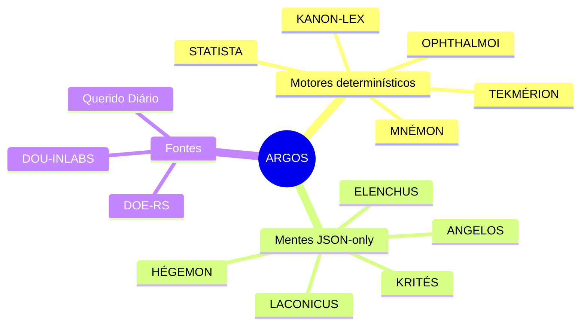
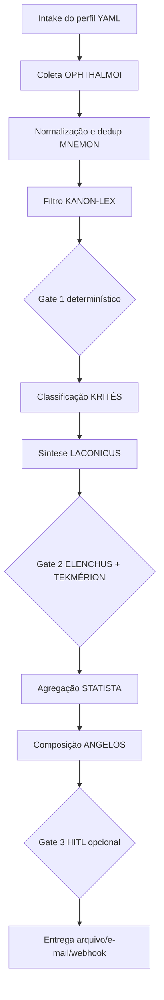

<div align="center">
  <h1>Squad ARGOS</h1>
  <p><strong>Cem olhos, um contrato:</strong> vigilância determinística de Diários Oficiais com relatórios auditáveis por interesse.</p>


</div>

## O que é

ARGOS é um squad CLI-first para monitorar DOU, diários estaduais e diários municipais por perfis declarativos em YAML. A coleta, deduplicação, filtro lexical e estatísticas são determinísticos; a camada LLM, quando plugada, só recebe corpus já fixado por hash e precisa devolver JSON validado.

## Para que serve

- Monitorar contratos, licitações, repactuações e atos normativos relevantes para o IFFar.
- Produzir relatórios Markdown, HTML e JSON com proveniência obrigatória.
- Criar adapters incrementais para fontes oficiais heterogêneas sem contornar bloqueios.
- Separar evidência real de síntese textual, reduzindo risco de alucinação.

## Estilo visual do README

Preset aplicado: `dark-neon-layered-architecture`, adequado a squads de operação, tecnologia e arquitetura de agentes.

## Arquitetura do Squad



## Fluxo de trabalho



## Os agentes

| Agente | Função | Natureza |
|---|---|---|
| OPHTHALMOI | Adapters de coleta por fonte oficial | Determinístico |
| MNÉMON | SQLite, cursores, idempotência e retificações | Determinístico |
| KANON-LEX | Filtro lexical por termos, órgãos, tipos e seções | Determinístico |
| TEKMÉRION | Evidência literal e URL verificável | Determinístico |
| STATISTA | Contagens e estatísticas | Determinístico |
| HÉGEMON | Roteamento do perfil e HITL | JSON-only |
| KRITÉS | Relevância, categoria e justificativa | JSON-only |
| LACONICUS | Resumo curto sem fatos externos | JSON-only |
| ELENCHUS | Auditoria adversarial | JSON-only |
| ANGELOS | Composição final | Template determinístico |

## Como executar

### Pipeline determinístico do PRD

```bash
cd squads/instituto-federal-farroupilha-iffar/argos-squad
PYTHONPATH=src python -m argos.cli fontes listar --fixture
PYTHONPATH=src python -m argos.cli perfil validar contratos-iffar-f0
PYTHONPATH=src python -m argos.cli buscar --perfil contratos-iffar-f0 --data 2026-07-02 --fixture
PYTHONPATH=src python -m argos.cli relatorio abrir
```

### Modo Maeve pesquisadora nacional

Quando Marcio informar um assunto, Maeve executa:

```bash
PYTHONPATH=src python -m argos.cli pesquisar \
  --assunto "repactuação" \
  --municipio 4305207 \
  --size 10
```

Esse modo cria uma pasta em `pesquisas/<run_id>/` com:

- `perfil.yaml` — perfil criado a partir do assunto;
- `fontes_consultadas.json` — status federal, municipal e 27 UFs;
- `relatorio_pesquisa.md` — relatório operacional;
- `links_estaduais.md` — links oficiais/assistidos por UF.


## 🧠 Modo Maeve operacional

Este squad está preparado para ser executado pela Maeve/Hermes: Marcio informa um assunto em linguagem natural e a assistente cria o perfil YAML, executa `argos pesquisar`, consulta a API do Querido Diário, checa os 27 portais estaduais catalogados, registra lacunas e entrega `perfil.yaml`, `fontes_consultadas.json`, `relatorio_pesquisa.md` e `links_estaduais.md`.

```bash
PYTHONPATH=src python -m argos.cli pesquisar --assunto "repactuação" --municipio 4305207 --size 10
```

**Regra de evidência:** links estaduais assistidos são trilhas oficiais de pesquisa, não achados confirmados; publicação só entra como achado quando há texto/URL oficial verificável.

## Estado do MVP expandido

- Implementado e testado: contratos Pydantic, parser DOU-INLABS por XML fixture, KANON-LEX, TEKMÉRION, STATISTA, relatório MD/HTML/JSON, CLI e validação estrutural.
- Implementado em v0.2.0: modo `argos pesquisar` para execução pela Maeve, consulta real à API Querido Diário e catálogo nacional dos 27 portais estaduais com healthcheck e links de pesquisa assistida.
- Pronto para ativação F0 com credenciais reais INLABS e fixtures oficiais congeladas.
- Portais estaduais ficam catalogados nacionalmente; extração granular por matéria segue exigindo homologação HITL por UF, sem simular achados.

## Licença

MIT. Criado por Marcio Bisognin. Instagram: @marciobisognin.

Licença: MIT. Criado por Marcio Bisognin. Instagram: @marciobisognin.
