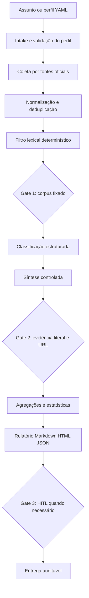

<div align="center">

# 👁️ Squad ARGOS — Vigilância de Diários Oficiais

### Monitoramento determinístico de DOU, diários municipais e portais estaduais para contratos, licitações, atos normativos e compliance institucional.

<p>
  
  
  
  
  
  
  
</p>

</div>

---

## ✨ Ideia central

O **Squad ARGOS** transforma a vigilância de Diários Oficiais em um processo auditável: um assunto entra, um perfil declarativo em YAML orienta a busca, as fontes oficiais são consultadas, e o resultado sai como pacote de pesquisa com trilhas verificáveis, lacunas explícitas e relatórios estruturados.

A regra central é simples: **o sistema não inventa publicação**. Coleta, deduplicação, filtro lexical, agregação e estatísticas são determinísticos. A camada LLM, quando plugada, só pode classificar e sintetizar um corpus já coletado, hasheado e validado por schema.

---

## 🎯 Para que serve

<table>
<tr>
<td><b>Monitorar atos oficiais</b><br/>Acompanha termos de interesse em DOU, diários municipais cobertos pelo Querido Diário e portais estaduais catalogados.</td>
<td><b>Contratos e licitações</b><br/>Localiza publicações sobre editais, extratos, portarias, repactuações, contratos, atas e atos normativos relacionados.</td>
<td><b>Pesquisa institucional</b><br/>Cria relatórios por assunto, órgão, fonte, UF, seção e janela temporal, preservando proveniência.</td>
</tr>
<tr>
<td><b>Compliance e auditoria</b><br/>Separa achados confirmados de lacunas e trilhas assistidas, reduzindo risco de alucinação.</td>
<td><b>Operação recorrente</b><br/>Permite rodar buscas diárias, semanais ou mensais por perfis YAML versionáveis.</td>
<td><b>Expansão por adapters</b><br/>Cada nova fonte estadual entra por contrato único, fixture real e homologação humana.</td>
</tr>
</table>

---

## 🛡️ Princípios de confiança

> [!IMPORTANT]
> **Publicação só vira achado quando há texto ou URL oficial verificável.** Links estaduais assistidos são trilhas oficiais de pesquisa, não evidência final. Fontes sem adapter homologado aparecem como lacuna declarada, nunca como sucesso simulado.

| Princípio | Como o ARGOS aplica |
|---|---|
| Coleta determinística | Adapters, filtros, hashes e agregações em Python |
| Evidência obrigatória | `fonte`, `edição`, `data_publicacao`, `url_original` e excerto literal |
| LLM limitado | JSON validado por Pydantic; sem decidir o que existe |
| Sem scraping abusivo | DOU via INLABS; estados por vias legítimas e homologáveis |
| Lacuna explícita | Fonte indisponível, sem credencial ou sem parser aparece no relatório |

---

## 🧭 Como o squad trabalha



---

## 🌐 Fontes cobertas

| Camada | Fonte | Status operacional | Observação |
|---|---|---|---|
| Federal | DOU / INLABS | Estruturado | Produção exige credenciais `INLABS_USER` e `INLABS_PASSWORD` |
| Municipal | Querido Diário | Consulta real via API pública | Cobertura depende dos municípios indexados pela OKBR |
| Estadual | 27 portais estaduais/DF | Catálogo nacional + healthcheck | Extração granular por matéria exige homologação por UF |
| Estadual piloto | DOE-RS | Esqueleto e ficha HITL | Mantido como fonte em observação/backlog até parser validado |

---

## 🧩 Estrutura dos agentes

<table>
<tr><td><b>OPHTHALMOI</b></td><td>Família de adapters de coleta sobre fontes oficiais.</td><td>Publicações normalizadas ou lacunas explícitas.</td></tr>
<tr><td><b>MNÉMON</b></td><td>Memória SQLite para cursores, hashes, cache e idempotência.</td><td>Deduplicação e histórico de processamento.</td></tr>
<tr><td><b>KANON-LEX</b></td><td>Filtro lexical por termos, ignorados, órgãos, tipos de ato e seções.</td><td>Subconjunto candidato antes de qualquer LLM.</td></tr>
<tr><td><b>TEKMÉRION</b></td><td>Validação de evidência literal e URL verificável.</td><td>Itens aprovados, reprovados ou enviados à DLQ.</td></tr>
<tr><td><b>STATISTA</b></td><td>Agregações em Python: fonte, órgão, categoria, volumes e lacunas.</td><td>Estatísticas do relatório sem aritmética em LLM.</td></tr>
<tr><td><b>HÉGEMON</b></td><td>Roteamento do intake e decisão de HITL quando o perfil é ambíguo.</td><td>Rota estruturada do run.</td></tr>
<tr><td><b>KRITÉS</b></td><td>Classificação de relevância com justificativa curta.</td><td>JSON validado por Pydantic.</td></tr>
<tr><td><b>LACONICUS</b></td><td>Síntese curta e restrita ao excerto coletado.</td><td>Resumo sem fatos externos.</td></tr>
<tr><td><b>ELENCHUS</b></td><td>Auditoria adversarial contra alucinação e excerto fabricado.</td><td>Veredito de aprovação ou veto.</td></tr>
<tr><td><b>ANGELOS</b></td><td>Composição determinística de Markdown, HTML e JSON.</td><td>Pacote final de entrega.</td></tr>
</table>

---

## 🔎 Modo nacional de pesquisa por assunto

O modo `argos pesquisar` permite executar uma busca operacional a partir de um assunto livre. O comando cria uma pasta de pesquisa, gera um perfil YAML, consulta o Querido Diário, checa portais estaduais catalogados e registra resultados/lacunas.

```bash
cd squads/instituto-federal-farroupilha-iffar/argos-squad
PYTHONPATH=src python -m argos.cli pesquisar \
  --assunto "repactuação" \
  --municipio 4305207 \
  --size 10
```

Saídas em `pesquisas/<run_id>/`:

| Arquivo | Função |
|---|---|
| `perfil.yaml` | Perfil declarativo gerado a partir do assunto |
| `fontes_consultadas.json` | Status federal, municipal e estadual em formato técnico |
| `relatorio_pesquisa.md` | Relatório operacional de pesquisa |
| `links_estaduais.md` | Portais e links oficiais de busca assistida por UF |

---

## 📦 Entregas finais

- **Relatório Markdown canônico** com cabeçalho de auditoria, corpus hash, fontes consultadas, lacunas e achados.
- **HTML estático** para leitura e compartilhamento institucional.
- **JSON estruturado** para integração com outros sistemas.
- **Perfil YAML** reexecutável e versionável.
- **DLQ** para falhas de parsing, schema ou evidência.
- **Ficha HITL** para homologação de novas fontes estaduais.

---

## 🚀 Como usar

### 1. Validar fontes em fixture

```bash
PYTHONPATH=src python -m argos.cli fontes listar --fixture
```

### 2. Validar perfil

```bash
PYTHONPATH=src python -m argos.cli perfil validar contratos-iffar-f0
```

### 3. Rodar pipeline determinístico de demonstração

```bash
PYTHONPATH=src python -m argos.cli buscar \
  --perfil contratos-iffar-f0 \
  --data 2026-07-02 \
  --fixture
```

### 4. Abrir último relatório

```bash
PYTHONPATH=src python -m argos.cli relatorio abrir
```

### 5. Rodar pesquisa nacional por assunto

```bash
PYTHONPATH=src python -m argos.cli pesquisar --assunto "Instituto Federal Farroupilha" --municipio 4305207 --size 10
```

---

## 🧪 Qualidade e validação

Evidências registradas na versão 0.2.0:

```text
py_compile: ok
pytest: 7 passed
validate_squad: go
argos pesquisar smoke: ok
secret scan: no obvious secrets found
```

O smoke nacional validou consulta real ao **Querido Diário** e healthcheck dos portais estaduais catalogados. A ausência de resultado em uma fonte é registrada como ausência ou lacuna, não como achado.

---

## 🗂️ Estrutura do repositório

```text
argos-squad/
├── PRD.md
├── README.md
├── SKILL.md
├── squad.yaml
├── src/argos/
│   ├── cli.py
│   ├── contracts.py
│   ├── assistant_research.py
│   ├── official_sources.py
│   ├── engines/
│   ├── minds/
│   ├── ophthalmoi/
│   └── report/
├── perfis/
├── agents/
├── tasks/
├── workflows/
├── tests/
└── docs/homologacao/
```

---

## ⚙️ Stack técnico

| Camada | Tecnologia |
|---|---|
| CLI | Python 3.11+ |
| Contratos | Pydantic v2 |
| Perfis | YAML |
| Estado local | SQLite |
| HTTP | httpx |
| Relatórios | Markdown, HTML, JSON |
| Testes | pytest |
| Governança | HITL, fixtures, hashes e DLQ |

---

## 🚧 Limites honestos

- **DOU em produção** exige credenciais INLABS válidas.
- **Diários municipais** dependem da cobertura do Querido Diário.
- **Portais estaduais** estão catalogados nacionalmente; extração granular por matéria requer adapter homologado por UF.
- **PDF escaneado/OCR** fica fora do escopo operacional desta versão.
- **Sem evasão antirobô:** fontes sem via legítima ficam em backlog ou modo assistido.

---

## Autoria e licença

Licença: MIT. Criado por Marcio Bisognin. Instagram: @marciobisognin.
