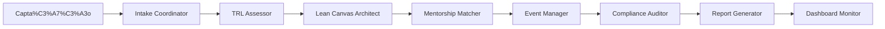
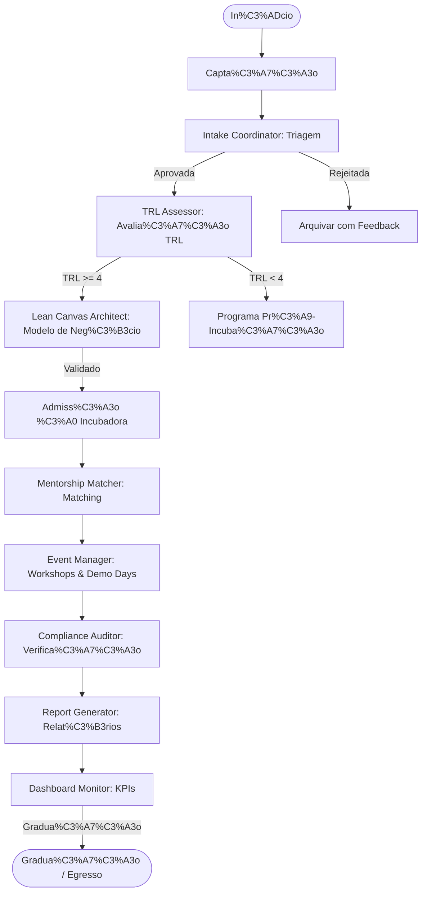
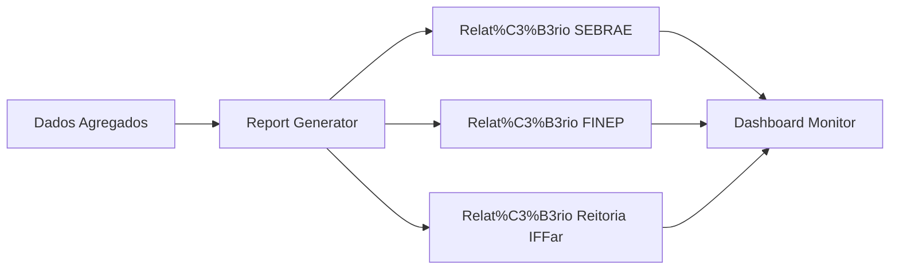

# PRD — Integra Incubadora Operations Squad v1.0
## Squad Multi-Agente para Gestão Operacional de Incubadoras de Empresas

**Autor:** Marcio Bisognin / Maeve  
**Data:** Junho/2026  
**Status:** Aprovado para Desenvolvimento  
**Versão:** 1.0  
**Licença:** MIT  

---

## 1. Visão Geral

O **Integra Incubadora Operations Squad** é um sistema multi-agente de IA desenvolvido para operacionalizar o ciclo completo de uma incubadora de empresas, com foco especial no contexto dos Institutos Federais de Educação (IFFar — Campus Frederico Westphalen).

Ele transforma processos manuais e fragmentados da gestão de incubadoras em um fluxo **orquestrado, rastreável e automatizado**, garantindo conformidade com as exigências do SEBRAE, FINEP e normativos institucionais.

### 1.1 Problema Central

A gestão de incubadoras envolve múltiplas etapas interdependentes que, quando feitas manualmente, geram ineficiência:

- **Captação e triagem:** Recebimento desorganizado de propostas, critérios subjetivos.
- **Avaliação de maturidade:** Ausência de padronização na aplicação de TRL (Technology Readiness Level).
- **Modelagem de negócio:** Construção de Lean Canvas sem validação sistemática.
- **Gestão de mentoria:** Matching ad-hoc, sem acompanhamento de progresso.
- **Eventos:** Planejamento reativo, sem rastreabilidade de resultados.
- **Relatórios:** Geração manual e tardia de dados para órgãos de fomento.
- **Conformidade:** Dificuldade em acompanhar normativos SEBRAE, FINEP e institucionais.

### 1.2 A Solução

Um **squad de 8 agentes de IA** que operam o ciclo de vida completo da incubadora:



Cada agente é responsável por uma etapa específica, com Human-in-the-Loop (HITL) nos pontos de decisão estratégica.

---

## 2. Arquitetura do Squad (8 Agentes)

| Agente | Nome | Função Principal | Stack Técnico |
| :--- | :--- | :--- | :--- |
| **A1** | **Intake Coordinator** | Triagem e classificação inicial | Python + Pydantic + Streamlit |
| **A2** | **TRL Assessor** | Avaliação de maturidade tecnológica | Python + RAG + Checklists |
| **A3** | **Lean Canvas Architect** | Modelagem e validação de negócio | Python + Templates + Validação |
| **A4** | **Mentorship Matcher** | Matching inteligente e gestão | Python + Algoritmos de matching |
| **A5** | **Event Manager** | Planejamento e execução de eventos | Python + Calendário + Checklists |
| **A6** | **Compliance Auditor** | Verificação de conformidade | Python + Rules Engine + RAG |
| **A7** | **Report Generator** | Geração de relatórios institucionais | Python + Jinja2 + DOCX/PDF |
| **A8** | **Dashboard Monitor** | Monitoramento e KPIs | React + Recharts + Tremor |

### 2.1 A1 — Intake Coordinator

**Entrada:** Formulário de inscrição, pitch deck, CV dos fundadores, dados da proposta.
**Função:** Avalia a elegibilidade inicial, aplica critérios de triagem e classifica a startup.
**Validações:**
- Formatura mínima exigida (se graduando/pós-graduando)
- Viabilidade técnica preliminar
- Compatibilidade com áreas de atuação da incubadora
- Equipe mínima e comprometimento
**Saída:** `StartupProfile` (JSON) com score de admissão e recomendação (aprovar / pré-incubação / rejeitar).

### 2.2 A2 — TRL Assessor

**Entrada:** Documentação técnica, protótipos, evidências de testes, publicações.
**Função:** Aplica a metodologia TRL (Technology Readiness Level) para avaliar maturidade.
**Escalas:** TRL 1-9, com critérios adaptados para o contexto acadêmico/institucional.
**Saída:** `TRLReport` (JSON) com nível TRL, evidências, lacunas e recomendações.

### 2.3 A3 — Lean Canvas Architect

**Entrada:** Dados da startup, entrevistas, pesquisa de mercado.
**Função:** Constrói e valida o Lean Canvas, identificando hipóteses críticas e experimentos de validação.
**Saída:** `LeanCanvas` (Markdown/JSON) validado, com rastreabilidade de fontes.

### 2.4 A4 — Mentorship Matcher

**Entrada:** Perfil da startup, necessidades identificadas, base de mentores.
**Função:** Realiza matching inteligente entre startups e mentores, considerando área de expertise, disponibilidade e histórico.
**Saída:** `MentorshipPlan` (JSON) com matches, cronograma e métricas de sucesso.

### 2.5 A5 — Event Manager

**Entrada:** Tipo de evento, objetivos, público-alvo, orçamento.
**Função:** Planeja, organiza e avalia eventos (workshops, demo days, mentorias coletivas).
**Saída:** `EventPlan` (JSON) + checklists operacionais + relatório pós-evento.

### 2.6 A6 — Compliance Auditor

**Entrada:** Documentação da startup, regulamentações SEBRAE/FINEP/IFFar.
**Função:** Verifica conformidade com normativos, identifica gaps e propõe ações corretivas.
**Saída:** `ComplianceReport` (JSON) com achados, severidade e plano de ação.

### 2.7 A7 — Report Generator

**Entrada:** Dados agregados da incubadora, métricas individuais de startups.
**Função:** Gera relatórios trimestrais e anuais para SEBRAE, FINEP e Reitoria do IFFar.
**Saída:** Relatórios em DOCX/PDF com dados, análises e indicadores.

### 2.8 A8 — Dashboard Monitor

**Entrada:** Dados em tempo real da incubadora.
**Função:** Visualiza KPIs, status de startups, pipeline, mentorias e eventos.
**Saída:** Dashboard interativo (HTML/React) com filtros e drill-down.

---

## 3. Fluxos de Trabalho

### 3.1 Fluxo Principal (Ciclo de Vida da Startup)



### 3.2 Fluxo de Relatórios



---

## 4. Modelos de Dados (Schemas Principais)

```python
from pydantic import BaseModel, Field
from typing import Literal, List, Optional
from datetime import datetime

class StartupProfile(BaseModel):
    nome: str
    cnpj: Optional[str]
    area_atuacao: str
    fase: Literal["captacao", "triagem", "avaliacao", "incubacao", "graduacao", "egresso"]
    score_admissao: float = Field(..., ge=0, le=100)
    status: Literal["aprovada", "pre-incubacao", "rejeitada", "em_avaliacao"]
    data_submissao: datetime
    responsavel: str

class TRLReport(BaseModel):
    startup_id: str
    nivel_trl: int = Field(..., ge=1, le=9)
    evidencias: List[str]
    lacunas: List[str]
    recomendacoes: str
    data_avaliacao: datetime
    avaliador: str

class LeanCanvas(BaseModel):
    startup_id: str
    problema: str
    solucao: str
    proposta_valor: str
    vantagem_competitiva: str
    segmentos: List[str]
    canais: List[str]
    receitas: List[str]
    custos: List[str]
    metricas_chave: List[str]
    validado: bool = False

class MentorshipPlan(BaseModel):
    startup_id: str
    mentor_id: str
    area_mentoria: str
    frequencia: Literal["semanal", "quinzenal", "mensal"]
    proxima_sessao: datetime
    metricas_sucesso: List[str]
    status: Literal["ativo", "pausado", "concluido"]

class ComplianceReport(BaseModel):
    startup_id: str
    normativos: List[str]
    achados: List[dict]
    status: Literal["conforme", "nao_conforme", "pendente"]
    plano_acao: Optional[str]
    data_auditoria: datetime

class EventPlan(BaseModel):
    nome: str
    tipo: Literal["workshop", "demo_day", "mentoria_coletiva", "networking", "outro"]
    data: datetime
    local: str
    publico_alvo: List[str]
    objetivos: List[str]
    orcamento: Optional[float]
    status: Literal["planejado", "em_andamento", "concluido", "cancelado"]

class DashboardKPIs(BaseModel):
    total_startups: int
    startups_ativas: int
    startups_graduadas: int
    mentorias_realizadas: int
    eventos_realizados: int
    taxa_conformidade: float
    media_trl: float
```

---

## 5. Stack Técnico

| Camada | Tecnologia | Justificativa |
| :--- | :--- | :--- |
| **Orquestração** | LangGraph | HITL nativo, retomada de estado, controle de fluxo complexo. |
| **LLM** | Claude (Anthropic) | Raciocínio jurídico e estratégico de alta complexidade. |
| **Engine de Regras** | Python Puro + Pydantic | Determinismo e auditabilidade. |
| **Banco de Dados** | PostgreSQL + pgvector | Dados estruturados e semânticos. |
| **Frontend** | Next.js + React + Tailwind CSS | UI moderna e responsiva. |
| **Relatórios** | python-docx, openpyxl, Jinja2 | Templates paramétricos. |
| **Dashboard** | React + Recharts + Tremor | Visualizações interativas. |

---

## 6. Roadmap

| Fase | Escopo | Duração |
| :--- | :--- | :--- |
| **F0 — Fundação** | Estrutura base, schemas, setup de infraestrutura. | 2 semanas |
| **F1 — MVP Intake** | Intake Coordinator + TRL Assessor + Lean Canvas Architect. | 4 semanas |
| **F2 — Mentoria** | Mentorship Matcher + Event Manager. | 3 semanas |
| **F3 — Compliance** | Compliance Auditor + Report Generator. | 3 semanas |
| **F4 — Dashboard** | Dashboard Monitor + integrações. | 2 semanas |
| **F5 — Integração** | Integração com sistemas IFFar, Notion, APIs externas. | 2 semanas |

---

## 7. Riscos e Mitigações

| Risco | Impacto | Mitigação |
| :--- | :--- | :--- |
| Dados sensíveis de startups | **Crítico** | Criptografia em repouso e em trânsito, controle de acesso RBAC, LGPD. |
| Normativos SEBRAE/FINEP em mudança | **Alto** | Sistema de versionamento de regras, atualização periódica. |
| Resistência à mudança da equipe | **Médio** | Interface intuitiva, treinamento, HITL em pontos críticos. |
| Dependência de APIs externas | **Médio** | Fallbacks, cache, monitoramento de saúde. |

---

## 8. Instruções de Execução em AI Code Assistants

### OpenAI Codex
1. Carregue o `PRD.md` e os schemas na janela de contexto.
2. Solicite a geração de módulos específicos (ex: `TRL Assessor`).
3. Use para iterar em boilerplate, testes e refatoração.

### Claude Code (Anthropic)
1. Use "Projects" para manter PRD, schemas e documentação em memória.
2. Solicite a implementação de agentes com LangGraph.
3. Simule os Gates HITL usando `interrupts`.

### Antigravity (ou outro agente genérico)
1. Forneça o repositório completo como contexto.
2. Use para revisão arquitetural e geração de testes.

---

**Criado por:** Marcio Bisognin / Maeve  
**Repositório:** [marciobisognin/Squads-Genius](https://github.com/marciobisognin/Squads-Genius)  
**Licença:** MIT
