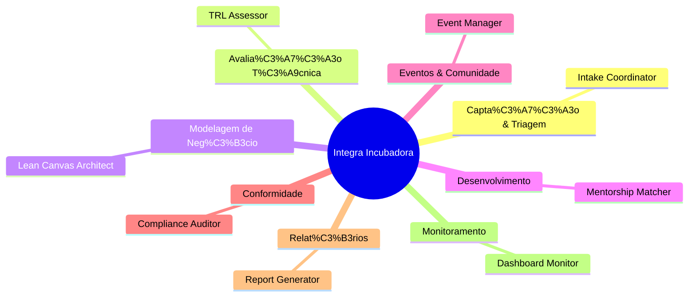
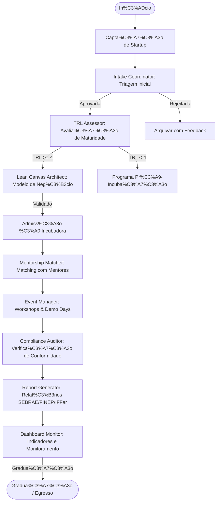

<div align="center">

# Integra Incubadora Operations Squad

**Squad Multi-Agente para Gestão Operacional de Incubadoras de Empresas**


</div>

---

## O que é

O **Integra Incubadora Operations Squad** é um sistema multi-agente de inteligência artificial desenvolvido para operacionalizar o ciclo completo de uma incubadora de empresas, com foco especial no contexto dos Institutos Federais de Educação (IFFar — Campus Frederico Westphalen).

Ele transforma processos manuais e fragmentados da gestão de incubadoras em um fluxo **orquestrado, rastreável e automatizado**, garantindo conformidade com as exigências do SEBRAE, FINEP e normativos institucionais do IFFar.

## Para que serve

- **Gestão de Pipeline de Startups:** Captação, triagem, admissão e graduação de startups residentes.
- **Avaliação TRL:** Aplicação do Technology Readiness Level (TRL) para avaliar maturidade tecnológica das startups.
- **Lean Canvas Automatizado:** Geração de modelos de negócio Lean Canvas validados e rastreáveis.
- **Gestão de Mentoria:** Matching inteligente entre startups e mentores, acompanhamento de sessões e evolução.
- **Gestão de Eventos:** Planejamento, execução e avaliação de eventos, workshops e demo days.
- **Relatórios Institucionais:** Geração automática de relatórios para SEBRAE, FINEP e Reitoria do IFFar.
- **Monitoramento e Dashboard:** Visualização em tempo real do status da incubadora, startups e indicadores chave.

---

## Arquitetura do Squad

O sistema é composto por 8 agentes especializados, orquestrados para cobrir o ciclo de vida completo da incubadora.



---

## Fluxo de Trabalho

O fluxo principal cobre o ciclo completo de uma startup na incubadora, desde a captura até a graduação.



---

## Os 8 Agentes

| Agente | Função | Entrada | Sa%C3%ADda |
| :--- | :--- | :--- | :--- |
| **Intake Coordinator** | Triagem e classifica%C3%A7%C3%A3o inicial de startups | Formul%C3%A1rio de inscri%C3%A7%C3%A3o, pitch deck, CV dos fundadores | `StartupProfile` (JSON) com score de admiss%C3%A3o |
| **TRL Assessor** | Avalia%C3%A7%C3%A3o de maturidade tecnol%C3%B3gica (TRL 1-9) | Documenta%C3%A7%C3%A3o t%C3%A9cnica, prot%C3%B3tipos, evid%C3%AAncias | `TRLReport` (JSON) com n%C3%ADvel TRL e recomenda%C3%A7%C3%B5es |
| **Lean Canvas Architect** | Constru%C3%A7%C3%A3o e valida%C3%A7%C3%A3o de modelo de neg%C3%B3cio | Entrevistas, pesquisa de mercado, dados da startup | `LeanCanvas` (JSON/Markdown) validado |
| **Mentorship Matcher** | Matching inteligente e gest%C3%A3o de mentorias | Perfil da startup, n%C3%ADvel TRL, necessidades, base de mentores | `MentorshipPlan` (JSON) com matches e cronograma |
| **Event Manager** | Planejamento e execu%C3%A7%C3%A3o de eventos | Tipo de evento, objetivos, p%C3%BAblico-alvo, or%C3%A7amento | `EventPlan` (JSON) + checklists operacionais |
| **Compliance Auditor** | Verifica%C3%A7%C3%A3o de conformidade institucional | Documenta%C3%A7%C3%A3o da startup, regulamenta%C3%A7%C3%B5es SEBRAE/FINEP/IFFar | `ComplianceReport` (JSON) com achados e recomenda%C3%A7%C3%B5es |
| **Report Generator** | Gera%C3%A7%C3%A3o de relat%C3%B3rios institucionais | Dados agregados da incubadora, m%C3%A9tricas individuais | Relat%C3%B3rios SEBRAE, FINEP, Reitoria (DOCX/PDF) |
| **Dashboard Monitor** | Monitoramento e visualiza%C3%A7%C3%A3o de KPIs | Dados em tempo real da incubadora | Dashboard interativo (HTML/React) |

---

## Entregas Finais

O squad gera, ao final de cada ciclo:

- **Startup Profile:** Ficha t%C3%A9cnica da startup com avalia%C3%A7%C3%A3o de admiss%C3%A3o.
- **TRL Report:** Documento de maturidade tecnol%C3%B3gica com evid%C3%AAncias e recomenda%C3%A7%C3%B5es.
- **Lean Canvas:** Modelo de neg%C3%B3cio validado em formato visual e textual.
- **Mentorship Plan:** Plano de mentorias com matches, cronograma e m%C3%A9tricas de sucesso.
- **Event Plan:** Checklists, cronogramas e relat%C3%B3rios de eventos (workshops, demo days).
- **Compliance Report:** Parecer de conformidade com achados e plano de a%C3%A7%C3%A3o.
- **Institutional Reports:** Relat%C3%B3rios trimestrais/ anuais para SEBRAE, FINEP e Reitoria do IFFar.
- **Dashboard:** Painel de controle com KPIs em tempo real da incubadora.

---

## Como Executar

### Pr%C3%A9-requisitos

- Python 3.10+
- Node.js 18+
- Docker & Docker Compose
- Poetry (gerenciamento de depend%C3%AAncias Python)

### Instala%C3%A7%C3%A3o

```bash
# Clone o reposit%C3%B3rio
git clone https://github.com/marciobisognin/Squads-Genius.git
cd Squads-Genius/squads/integra-incubadora-ops-squad

# Instale as depend%C3%AAncias
poetry install

# Configure as vari%C3%A1veis de ambiente
cp .env.example .env
# Edite .env com suas credenciais (APIs, DB, Notion)

# Inicie os servi%C3%A7os
poetry run python scripts/setup.py
```

### Execu%C3%A7%C3%A3o do Pipeline Principal

```bash
# Ative o ambiente virtual
poetry shell

# Execute o pipeline de admiss%C3%A3o de uma nova startup
python scripts/run_pipeline.py --startup-id <ID_DA_STARTUP> --stage intake

# Execute a avalia%C3%A7%C3%A3o TRL
python scripts/assess_trl.py --startup-id <ID_DA_STARTUP>

# Gere o Lean Canvas
python scripts/generate_canvas.py --startup-id <ID_DA_STARTUP>

# Execute o matching de mentores
python scripts/match_mentors.py --startup-id <ID_DA_STARTUP>

# Gere relat%C3%B3rios institucionais
python scripts/generate_reports.py --quarter Q1 --year 2026
```

---

## Como Executar em AI Code Assistants

O projeto %C3%A9 otimizado para ser desenvolvido e orquestrado com assistentes de IA.

### OpenAI Codex
- Carregue o `PRD.md` e os schemas na janela de contexto.
- Solicite a gera%C3%A7%C3%A3o de m%C3%B3dulos espec%C3%ADficos (ex: `TRL Assessor`).
- Use para iterar em boilerplate, testes e refatora%C3%A7%C3%A3o.

### Claude Code (Anthropic)
- Use "Projects" para manter PRD, schemas e documenta%C3%A7%C3%A3o em mem%C3%B3ria.
- Solicite a implementa%C3%A7%C3%A3o de agentes com LangGraph.

### Antigravity (ou outro agente gen%C3%A9rico)
- Forne%C3%A7a o reposit%C3%B3rio completo como contexto.
- Use para revis%C3%A3o arquitetural e gera%C3%A7%C3%A3o de testes.

---

## Stack T%C3%A9cnico

| Camada | Tecnologia |
| :--- | :--- |
| **Orquestra%C3%A7%C3%A3o** | LangGraph |
| **LLM** | Claude (Anthropic) |
| **Engine de Regras** | Python Puro + Pydantic |
| **Banco de Dados** | PostgreSQL + pgvector |
| **Frontend** | Next.js + React + Tailwind CSS |
| **Relat%C3%B3rios** | python-docx, openpyxl |
| **Dashboard** | React + Recharts + Tremor |

---

## Estrutura do Reposit%C3%B3rio

```
integra-incubadora-ops-squad/
%E2%94%9C%E2%94%80%E2%94%80 agents/                     # Defini%C3%A7%C3%A3o dos 8 agentes
%E2%94%9C%E2%94%80%E2%94%80 tasks/                       # Tarefas individuais (intake, TRL, canvas, etc.)
%E2%94%9C%E2%94%80%E2%94%80 workflows/                   # Fluxos de trabalho orquestrados
%E2%94%9C%E2%94%80%E2%94%80 scripts/                    # Scripts utilit%C3%A1rios (CLI, CI/CD)
%E2%94%9C%E2%94%80%E2%94%80 templates/                  # Templates Lean Canvas, TRL, relat%C3%B3rios
%E2%94%9C%E2%94%80%E2%94%80 schemas/                   # Schemas Pydantic (StartupProfile, TRLReport, etc.)
%E2%94%9C%E2%94%80%E2%94%80 tests/                     # Testes unit%C3%A1rios e de integra%C3%A7%C3%A3o
%E2%94%9C%E2%94%80%E2%94%80 frontend/                  # Aplica%C3%A7%C3%A3o web (Next.js)
%E2%94%9C%E2%94%80%E2%94%80 PRD.md                     # Product Requirements Document
%E2%94%9C%E2%94%80%E2%94%80 README.md                  # Este arquivo
%E2%94%9C%E2%94%80%E2%94%80 squad.yaml                # Manifesto do squad
%E2%94%9C%E2%94%80%E2%94%80 AUTHORS.md               # Autoria
%E2%94%9C%E2%94%80%E2%94%80 LICENSE                  # Licen%C3%A7a MIT
%E2%94%94%E2%94%80%E2%94%80 CHANGELOG.md             # Registro de altera%C3%A7%C3%B5es
```

---

## Licen%C3%A7a

Este projeto est%C3%A1 sob a licen%C3%A7a **MIT**.

**Criado por:** Marcio Bisognin / Maeve  
**Reposit%C3%B3rio:** [marciobisognin/Squads-Genius](https://github.com/marciobisognin/Squads-Genius)
