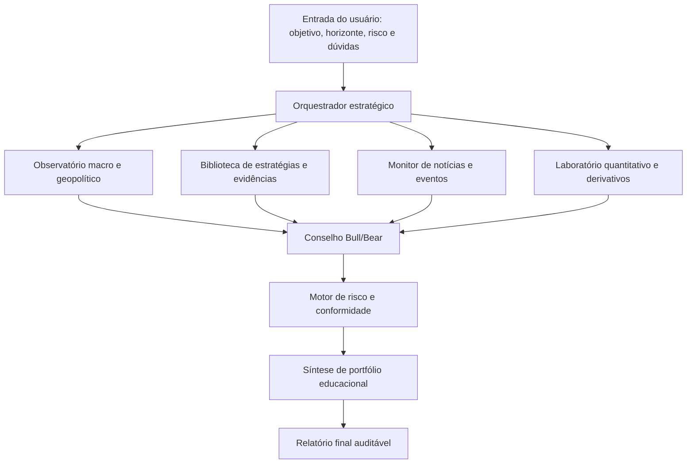
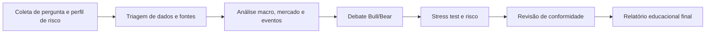

<div align="center">

# 🜂 SQU Oráculo de Aion

### Super Squad de Inteligência Financeira Global para pesquisa, cenários, risco e decisão educacional auditável.

<p>
  
  
  
  
</p>

</div>

---

## ✨ Ideia central

O **SQU Oráculo de Aion** é um super squad de agentes especializados para organizar inteligência financeira global de forma estruturada, auditável e educacional.

Ele transforma objetivos de análise, hipóteses de investimento, notícias, cenários macroeconômicos, dados de mercado, cartas de gestores, derivativos, riscos e debates Bull/Bear em uma síntese clara: **oportunidades possíveis, riscos explícitos, cenários alternativos e próximos passos de estudo**.

> **Nota essencial:** este squad é um sistema de pesquisa e suporte educacional. Ele não executa operações, não promete retorno financeiro e não substitui consultoria profissional, suitability ou revisão humana qualificada.

---

## 🎯 Para que serve

<table>
<tr>
<td width="33%" valign="top">

### 🌍 Leitura global
Mapear geopolítica, bancos centrais, ciclos econômicos, câmbio, commodities, bolsas e fluxos financeiros.

</td>
<td width="33%" valign="top">

### ⚖️ Risco e assimetria
Separar tese, hipótese, evidência, cenário, risco, drawdown, volatilidade e limites de exposição.

</td>
<td width="33%" valign="top">

### 📊 Entrega auditável
Gerar relatórios com fontes, premissas, alertas, debate adversarial e próximos passos educacionais.

</td>
</tr>
</table>

---

## 🧭 Como o squad trabalha



---

## 🧩 Estrutura dos agentes

<table>
<tr><th>Camada</th><th>Agentes</th><th>O que fazem</th></tr>
<tr>
<td><b>Macro e contexto</b></td>
<td>Geopolítica, ciclos históricos, eventos catalíticos, câmbio e bancos centrais</td>
<td>Interpretam o ambiente global, choques, regimes monetários e impactos em moedas, juros, setores e países.</td>
</tr>
<tr>
<td><b>Mercado e evidências</b></td>
<td>Bolsas, cartas de fundos, biblioteca quantitativa, notícias e sentimento</td>
<td>Organizam dados, narrativas, estratégias clássicas, sinais de gestores e mudanças de consenso.</td>
</tr>
<tr>
<td><b>Modelagem e estrutura</b></td>
<td>Sistemas institucionais, derivativos, volatilidade e payoff</td>
<td>Simulam estruturas, assimetrias, cenários de payoff, sensibilidade a volatilidade e riscos técnicos.</td>
</tr>
<tr>
<td><b>Debate e decisão</b></td>
<td>Conselho Bull/Bear, estratégia, portfólio e compliance</td>
<td>Confrontam teses, reduzem viés, checam risco, reforçam limites legais e consolidam a entrega final.</td>
</tr>
</table>

---

## 🗺️ Fluxo operacional dos agentes



---

## 🛡️ Guardrails do squad

- Diferencia **fato verificado**, **inferência**, **hipótese** e **cenário**.
- Exige fontes ou APIs verificáveis para dados de preço, fundamentos e notícias.
- Não executa compra ou venda automaticamente.
- Não emite promessa de lucro.
- Inclui revisão de risco, compliance, LGPD, CVM/suitability e decisão humana.

---

## 📦 O que o squad entrega no final

<table>
<tr><th>Entrega</th><th>Finalidade</th></tr>
<tr><td><b>Relatório de inteligência financeira</b></td><td>Síntese clara de contexto, tese, evidências, riscos e cenários.</td></tr>
<tr><td><b>Matriz Bull/Bear</b></td><td>Argumentos pró e contra para reduzir viés e excesso de confiança.</td></tr>
<tr><td><b>Mapa de risco</b></td><td>Drawdown, volatilidade, eventos extremos, concentração e limites educacionais.</td></tr>
<tr><td><b>Radar de eventos</b></td><td>Alertas sobre catalisadores macro, políticos, regulatórios e setoriais.</td></tr>
<tr><td><b>Plano de próximos passos</b></td><td>Perguntas, dados a confirmar, hipóteses a testar e pontos para revisão humana.</td></tr>
</table>

---

## ✅ Em uma frase

> O SQU Oráculo de Aion transforma ruído financeiro global em análise educacional estruturada, com debate adversarial, risco explícito e entrega auditável.

<div align="center">

**Licença:** MIT<br>
**Criado por:** Marcio Bisognin<br>
**Instagram:** [@marciobisognin](https://instagram.com/marciobisognin)

</div>

---

## 🤝 Como usar nos principais LLMs de codificação

> [!NOTE]
> **O padrão de ativação é o mesmo em qualquer ferramenta:**
> 1. **Dê contexto** ao assistente apontando os arquivos do squad (especialmente `squads/squ-oraculo-aion-finance-super-squad/squad.yaml` e `squads/squ-oraculo-aion-finance-super-squad/workflows/aion-global-finance-dag.yaml`).
> 2. **Peça que ele assuma a persona do orquestrador** (veja os agentes em `squads/squ-oraculo-aion-finance-super-squad/agents/`).
> 3. **Conduza o fluxo** respeitando os checkpoints humanos e validando cada handoff/contrato.
>
> **Prompt de ativação** (copie, cole e ajuste o briefing):
> ```text
> Assuma a persona do orquestrador do squad (veja os agentes em `squads/squ-oraculo-aion-finance-super-squad/agents/`)
> e conduza o fluxo definido em `squads/squ-oraculo-aion-finance-super-squad/`. Siga `squads/squ-oraculo-aion-finance-super-squad/workflows/aion-global-finance-dag.yaml`.
> Valide cada handoff/contrato e respeite os checkpoints humanos.
> Meu briefing é: <descreva seu objetivo, materiais e formato de saída>.
> ```

<details open>
<summary><b>🟣 Claude Code (CLI / Web / IDE) — recomendado</b></summary>

<br>

```bash
# No terminal, dentro do repositório
claude

> Leia @squads/squ-oraculo-aion-finance-super-squad/squad.yaml e assuma a persona do orquestrador do squad.
  Siga @squads/squ-oraculo-aion-finance-super-squad/workflows/aion-global-finance-dag.yaml. Conduza o fluxo para o briefing: <...>
```
- Use **`@caminho/arquivo`** para dar contexto preciso (autocompleta no prompt).
- Disponível em **CLI, app desktop/web (claude.ai/code) e extensões VS Code / JetBrains**.

</details>

<details>
<summary><b>🟦 Cursor</b></summary>

<br>

1. Abra a pasta do repositório no Cursor.
2. No **Chat / Composer (⌘/Ctrl + I)**, referencie os arquivos com `@`:
   ```text
   @squads/squ-oraculo-aion-finance-super-squad/squad.yaml @squads/squ-oraculo-aion-finance-super-squad/workflows/aion-global-finance-dag.yaml
   Assuma a persona do orquestrador e conduza o fluxo para o briefing: <...>
   ```
3. **Persistente:** crie um `.cursorrules` na raiz apontando para `squads/squ-oraculo-aion-finance-super-squad/` como squad ativo.

</details>

<details>
<summary><b>⬛ GitHub Copilot (VS Code Chat)</b></summary>

<br>

```text
@workspace #file:squads/squ-oraculo-aion-finance-super-squad/squad.yaml #file:squads/squ-oraculo-aion-finance-super-squad/workflows/aion-global-finance-dag.yaml
Assuma a persona do orquestrador deste squad e conduza o fluxo para: <...>
```
Para regras persistentes, crie **`.github/copilot-instructions.md`** com o prompt de ativação.

</details>

<details>
<summary><b>🟩 Windsurf (Cascade)</b></summary>

<br>

```text
@squads/squ-oraculo-aion-finance-super-squad/squad.yaml @squads/squ-oraculo-aion-finance-super-squad/workflows/aion-global-finance-dag.yaml
Atue como o orquestrador deste squad e execute o fluxo para: <briefing>.
```
Fixe as regras em **`.windsurfrules`** (raiz do projeto).

</details>

<details>
<summary><b>🟧 Cline / Roo Code (VS Code)</b></summary>

<br>

```text
Leia squads/squ-oraculo-aion-finance-super-squad/squad.yaml e assuma a persona do orquestrador.
Conduza o fluxo do squad e execute os scripts em squads/squ-oraculo-aion-finance-super-squad/scripts/ quando o passo pedir.
Briefing: <...>
```
O Cline/Roo pode **executar os scripts** do squad e ler a saída — aprove a execução quando solicitado.

</details>

<details>
<summary><b>🟨 Continue.dev / Aider / Zed AI / chats web</b></summary>

<br>

- **Continue.dev:** use `@file` para `squads/squ-oraculo-aion-finance-super-squad/squad.yaml`; cole o prompt de ativação.
- **Aider:** `aider squads/squ-oraculo-aion-finance-super-squad/squad.yaml` e instrua o orquestrador.
- **ChatGPT / Gemini (sem acesso a arquivos):** copie o conteúdo de `squads/squ-oraculo-aion-finance-super-squad/squad.yaml` e `squads/squ-oraculo-aion-finance-super-squad/workflows/aion-global-finance-dag.yaml` para o chat, cole o prompt de ativação e rode eventuais scripts localmente, colando a saída de volta.

</details>


---

Licença: MIT. Criado por Marcio Bisognin. Instagram: @marciobisognin.
