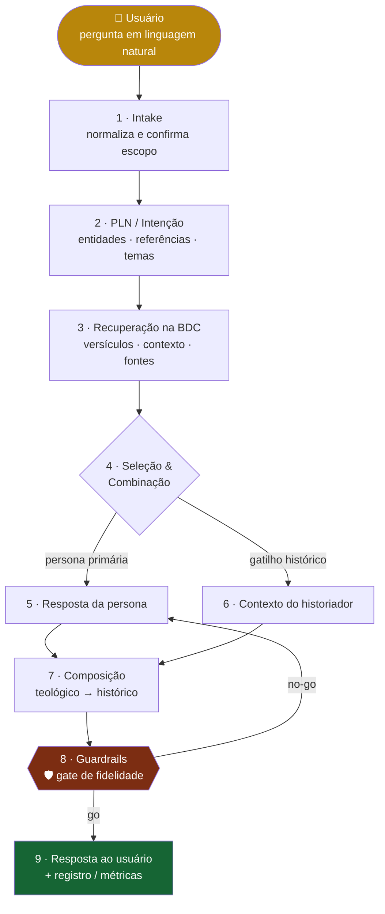

<div align="center">

# 📖 Lumen Verbi — Squad Bíblico de IA

*“A tua palavra é lâmpada para os meus pés e luz para o meu caminho.” — Salmo 119:105*


**Personas bíblicas + historiadores especializados que explicam a Palavra de Deus<br>com perspectiva teológica e contexto histórico — sob guardrails de fidelidade.**

</div>

---

> [!WARNING]
> **As personas são representações *didáticas* de IA — nunca a voz real das figuras sagradas nem revelação.** Toda citação traz referência (`livro capítulo:versículo`). A ferramenta é **educativa** e não substitui aconselhamento pastoral, doutrinário ou acadêmico.

---

## ✨ Visão geral

O **Lumen Verbi** é um sistema multiagente que transforma uma pergunta em linguagem natural sobre a Bíblia em uma resposta **rica, contextualizada e auditável**. Um orquestrador — o **MSCA** (Mecanismo de Seleção e Combinação de Agentes) — analisa a consulta, escolhe e combina os agentes mais adequados a partir de uma **Base de Dados de Conhecimento (BDC)** e compõe a resposta final, que só chega ao usuário após passar pelo **guardião teológico**.

| | |
|---|---|
| 🎭 **13 agentes** | 1 orquestrador (MSCA) · 1 curador da BDC · 1 guardião teológico · 7 personas bíblicas · 3 historiadores |
| 🔁 **10 tasks · 3 workflows** | Cobrindo todo o fluxo de interação do PRD |
| ⚙️ **4 scripts determinísticos** | Seleção de agentes, parsing de referências, montagem de prompt e validação de fidelidade |
| 🗄️ **BDC versionada** | Perfis, mapa semântico e índice de livros em `scripts/data/` |
| 🛡️ **Guardrails** | Representação didática · sem citações inventadas · neutralidade denominacional |

<sub>Origem: PRDs `prd_squad_biblico.md` e `prd_squad_biblico_arquitetura.md`.</sub>

---

## 🧭 Como funciona — o fluxo do MSCA



> 💡 **Princípio de eficiência:** a **seleção** e a **validação** são determinísticas (scripts reproduzíveis, baratos, auditáveis). O **LLM** entra apenas onde há geração de texto — a redação no estilo de cada persona e a composição narrativa.

| Etapa | Determinístico (script) | LLM |
|------|:---:|:---:|
| Parsing de referências | ✅ `parse_referencia_biblica.py` | — |
| Seleção / ranqueamento de agentes | ✅ `selecionar_agentes.py` | — |
| Montagem do prompt da persona | ✅ `montar_prompt_persona.py` | — |
| Validação de guardrails | ✅ `validar_fidelidade.py` | revisão final |
| Redação no estilo da persona | — | ✅ |
| Composição da narrativa | — | ✅ |

---

## 🎭 Os agentes

### 🧠 Núcleo

| Agente | Papel | O que faz |
|--------|-------|-----------|
| 🎼 `mestre-escriba-orquestrador` | **Orquestrador (MSCA)** | PLN da consulta, seleção/combinação de agentes e composição da resposta. |
| 📚 `curador-bdc` | **Curador da BDC** | Recupera versículos, contexto histórico e definições — sempre citando a fonte. |
| 🛡️ `guardiao-teologico` | **Guardião de Fidelidade** | Quality gate: disclaimer, referências, neutralidade denominacional e footer. |

### ✝️ Personas bíblicas

| Persona | Testamento | Estilo | Foco |
|---------|:----------:|--------|------|
| 🕊️ `persona-jesus` | Novo | Didático e pastoral | Evangelhos · Reino de Deus · amor · perdão · graça |
| 📜 `persona-moises` | Antigo | Formal e autoritário | Êxodo · Lei Mosaica · aliança do Sinai |
| ✉️ `persona-paulo` | Novo | Argumentativo e epistolar | Epístolas · graça · fé · justificação · missões |
| 🎵 `persona-davi` | Antigo | Poético e emocional | Salmos · adoração · arrependimento · liderança |
| 🌿 `persona-maria` | Novo | Íntimo e reflexivo | Anunciação · Magnificat · encarnação · humildade |
| 🔥 `persona-pedro` | Novo | Direto e exortativo | Atos · negação e restauração · esperança |
| 🦉 `persona-salomao` | Antigo | Aforístico e contemplativo | Provérbios · Eclesiastes · sabedoria |

### 🏛️ Historiadores

| Agente | Especialização |
|--------|----------------|
| 🏺 `historiador-antigo-testamento` | Antigo Oriente Próximo · arqueologia bíblica · Israel antigo |
| 🏛️ `historiador-novo-testamento` | Segundo Templo · mundo greco-romano · século I d.C. |
| 📝 `critico-textual` | Manuscritos · variantes · línguas originais · autoria · cânon |

---

## 🛡️ Guardrails teológicos

> [!IMPORTANT]
> Todo o conteúdo passa pelo `guardiao-teologico` (apoiado por `validar_fidelidade.py`) **antes** de chegar ao usuário.

- ✅ **Representação didática** — disclaimer explícito em toda resposta.
- ✅ **Sem citações inventadas** — toda citação tem referência verificável.
- ✅ **Separação de camadas** — texto bíblico ≠ consenso histórico ≠ interpretação teológica.
- ✅ **Neutralidade denominacional** — apresenta divergências; não impõe uma única tradição.
- ✅ **Tom respeitoso** — em temas sensíveis (luto, fé em crise), orienta apoio humano qualificado.

Detalhes em [`docs/guardrails_teologicos.md`](docs/guardrails_teologicos.md).

---

## ⚙️ Scripts determinísticos

> Python 3.11+, **sem dependências externas** para execução (o `PyYAML` só é usado pelo validador do construtor).

```bash
# 🎯 Selecionar e combinar agentes a partir de uma consulta
python3 scripts/selecionar_agentes.py --consulta "Qual o significado do Sermão da Montanha?"

# 📖 Extrair referências bíblicas estruturadas de um texto livre
python3 scripts/parse_referencia_biblica.py --texto "Explique Mateus 5:1-12 e João 3:16"

# 🧩 Montar o prompt de sistema de uma persona (já com guardrails)
python3 scripts/montar_prompt_persona.py --agente persona-paulo --consulta "Fale sobre a graça"

# 🛡️ Validar os guardrails de uma resposta (quality gate)
python3 scripts/validar_fidelidade.py --arquivo examples/exemplo_resposta_combinada.md
```

<details>
<summary><b>📦 Exemplo de saída — seleção de agentes</b></summary>

<br>

```json
{
  "personas_primarias": [{ "id": "persona-jesus", "score": 5 }],
  "historiadores_complementares": [{ "id": "historiador-novo-testamento", "score": 2 }],
  "sugere_multiplas_perspectivas": false,
  "fallback": false
}
```
O orquestrador usa esse JSON para decidir quem responde — de forma totalmente reproduzível.

</details>

### 🧪 Testes

```bash
python3 -m pytest -q        # a partir da raiz do squad → 8 passed
```

---

## 🗄️ Base de Dados de Conhecimento (BDC)

A BDC é a espinha dorsal do conhecimento. Este repositório versiona a **camada de metadados**; os textos bíblicos integrais **não** são versionados (licença/direitos) — a BDC os referencia em fontes de domínio público / APIs externas, sempre citando a versão.

| Arquivo | Conteúdo |
|---------|----------|
| `scripts/data/perfis_agentes.json` | Perfis das personas e historiadores (estilo, perspectiva, foco, passagens-chave) |
| `scripts/data/mapa_semantico.json` | Temas, doutrinas e eventos → agentes relevantes; gatilhos de historiador |
| `scripts/data/livros_biblia.json` | Livros canônicos, abreviações e testamento (para o parser de referências) |

> 🔧 **Extensível:** adicionar uma persona = um objeto em `perfis_agentes.json` + um `agents/<id>.md` + registro no `squad.yaml`. Detalhes em [`docs/base_de_conhecimento_bdc.md`](docs/base_de_conhecimento_bdc.md).

---

## 🤝 Como usar nos principais LLMs de codificação

> [!NOTE]
> **O padrão de ativação é o mesmo em qualquer ferramenta:**
> 1. **Dê contexto** apontando os arquivos do squad (especialmente `squads/lumen-verbi-squad-biblico/squad.yaml` e `squads/lumen-verbi-squad-biblico/workflows/full_biblical_consultation_pipeline.yaml`).
> 2. **Peça que ele assuma a persona do orquestrador** definido em `squads/lumen-verbi-squad-biblico/agents/mestre-escriba-orquestrador.md`.
> 3. **Conduza o fluxo** respeitando o gate do `guardiao-teologico` antes de exibir qualquer resposta.
>
> **Prompt de ativação** (copie, cole e ajuste a pergunta):
> ```text
> Assuma a persona do orquestrador (MSCA) definido em
> `squads/lumen-verbi-squad-biblico/agents/mestre-escriba-orquestrador.md`
> e conduza o fluxo `squads/lumen-verbi-squad-biblico/workflows/full_biblical_consultation_pipeline.yaml`.
> Use os scripts em `squads/lumen-verbi-squad-biblico/scripts/` para selecionar agentes,
> extrair referências e validar a resposta. Antes de me responder, passe pelo gate do
> guardião teológico (disclaimer + referências + neutralidade).
> Minha pergunta é: <sua pergunta sobre a Bíblia>.
> ```

<details open>
<summary><b>🟣 Claude Code (CLI / Web / IDE) — recomendado</b></summary>

<br>

```bash
# No terminal, dentro do repositório
claude

> Leia @squads/lumen-verbi-squad-biblico/squad.yaml e assuma a persona do
  mestre-escriba-orquestrador. Siga
  @squads/lumen-verbi-squad-biblico/workflows/full_biblical_consultation_pipeline.yaml
  e responda, passando pelo gate do guardião teológico: "<sua pergunta>"
```
- Use **`@caminho/arquivo`** para dar contexto preciso (autocompleta no prompt).
- O Claude Code **executa os scripts** (`selecionar_agentes.py`, `validar_fidelidade.py`) e lê a saída.
- Disponível em **CLI, app desktop/web (claude.ai/code) e extensões VS Code / JetBrains**.

</details>

<details>
<summary><b>🟦 Cursor</b></summary>

<br>

1. Abra a pasta do repositório no Cursor.
2. No **Chat / Composer (⌘/Ctrl + I)**, referencie os arquivos com `@`:
   ```text
   @squads/lumen-verbi-squad-biblico/squad.yaml @squads/lumen-verbi-squad-biblico/workflows/full_biblical_consultation_pipeline.yaml
   Assuma a persona do orquestrador (MSCA) e responda à pergunta, passando pelo gate do guardião: <...>
   ```
3. **Persistente:** crie um `.cursorrules` na raiz apontando `squads/lumen-verbi-squad-biblico/` como squad ativo.

</details>

<details>
<summary><b>⬛ GitHub Copilot (VS Code Chat)</b></summary>

<br>

```text
@workspace #file:squads/lumen-verbi-squad-biblico/squad.yaml #file:squads/lumen-verbi-squad-biblico/workflows/full_biblical_consultation_pipeline.yaml
Assuma a persona do orquestrador deste squad e responda à pergunta abaixo, respeitando os guardrails: <...>
```
Para regras persistentes, crie **`.github/copilot-instructions.md`** com o prompt de ativação.

</details>

<details>
<summary><b>🟩 Windsurf (Cascade)</b></summary>

<br>

```text
@squads/lumen-verbi-squad-biblico/squad.yaml @squads/lumen-verbi-squad-biblico/workflows/full_biblical_consultation_pipeline.yaml
Atue como o orquestrador (MSCA) e responda, validando com o guardião teológico: <pergunta>.
```
Fixe as regras em **`.windsurfrules`** (raiz do projeto).

</details>

<details>
<summary><b>🟧 Cline / Roo Code (VS Code)</b></summary>

<br>

```text
Leia squads/lumen-verbi-squad-biblico/squad.yaml e assuma a persona do mestre-escriba-orquestrador.
Execute squads/lumen-verbi-squad-biblico/scripts/selecionar_agentes.py para escolher os agentes
e validar_fidelidade.py antes de responder. Pergunta: <...>
```
O Cline/Roo pode **executar os scripts** do squad e ler a saída — aprove a execução quando solicitado.

</details>

<details>
<summary><b>🟨 Continue.dev / Aider / Zed AI / chats web (ChatGPT · Gemini)</b></summary>

<br>

- **Continue.dev:** use `@file` para `squads/lumen-verbi-squad-biblico/squad.yaml`; cole o prompt de ativação.
- **Aider:** `aider squads/lumen-verbi-squad-biblico/squad.yaml` e instrua o orquestrador.
- **ChatGPT / Gemini (sem acesso a arquivos):** copie o conteúdo de `squad.yaml` e de `workflows/full_biblical_consultation_pipeline.yaml` para o chat, cole o prompt de ativação e rode os scripts localmente, colando a saída de volta. Como esses chats não validam sozinhos, **exija o disclaimer e as referências** explicitamente.

</details>

---

## 📂 Estrutura

```
lumen-verbi-squad-biblico/
├── squad.yaml                 # manifesto (13 agentes · 10 tasks · 3 workflows · 4 scripts)
├── agents/                    # 13 personas e agentes de núcleo
├── tasks/                     # 10 tasks atômicas
├── workflows/                 # full_biblical_consultation_pipeline · quick_single_persona · historical_context_deep_dive
├── scripts/                   # 4 scripts determinísticos
│   └── data/                  # BDC: perfis · mapa semântico · índice de livros
├── docs/                      # arquitetura MSCA · BDC · guardrails
├── examples/                  # consultas, seleção e resposta de exemplo
└── tests/                     # testes dos scripts (pytest)
```

---

## 🔭 Roadmap

- [ ] Banco vetorial + RAG sobre os textos bíblicos completos.
- [ ] UI com exibição por agente, histórico e opções de refinamento (“perguntar mais a…”, “outra perspectiva”, “ver contexto histórico”).
- [ ] Métricas: taxa de resposta relevante, tempo médio, engajamento e satisfação.
- [ ] Novas personas e historiadores (Isaías, Jeremias, João, Lucas-historiador…).

---

<div align="center">

**Licença: MIT. Criado por Marcio Bisognin. Instagram: [@marciobisognin](https://instagram.com/marciobisognin).**

</div>
