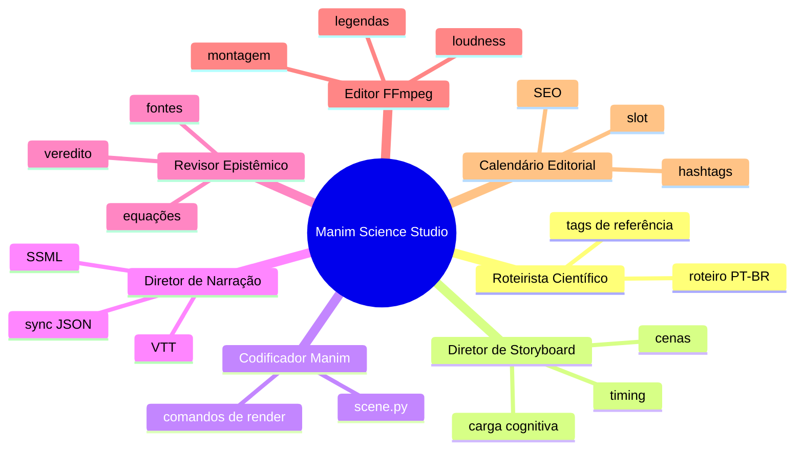
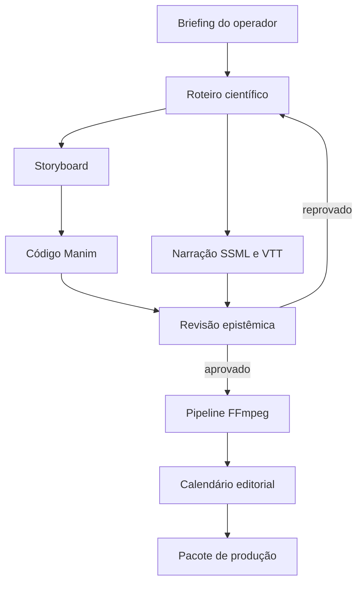

# Manim Science Studio Squad

<div align="center">
  <h3>Estúdio multiagente para Reels científicos em PT-BR com Manim, TTS, revisão epistêmica e FFmpeg</h3>


</div>

## O que é

O **Manim Science Studio Squad** é um sistema multiagente para produzir pacotes completos de vídeos científicos curtos: roteiro narrado, storyboard, código Manim, ativos de narração TTS, revisão epistêmica, comandos FFmpeg e slot editorial.

A versão entregue é um protótipo operacional determinístico: recebe um briefing JSON, gera um pacote estruturado de produção e valida seus artefatos sem depender de APIs externas.

## Para que serve

- Criar Reels educativos de 30 a 90 segundos em português brasileiro.
- Transformar tópicos de física, matemática e filosofia da ciência em roteiros visualmente animáveis.
- Gerar código Manim CE inicial e comandos de renderização.
- Produzir SSML, WebVTT e sincronização para narração TTS.
- Aplicar revisão epistêmica com veredito e checklist.
- Montar pipeline FFmpeg de finalização para formato 9:16.
- Planejar o slot editorial com título, legenda, hashtags e próximo tópico.

## Arquitetura do Squad



## Fluxo de Trabalho



## Agentes

| Agente | Função | Entrega |
| --- | --- | --- |
| scientific-scriptwriter | Roteiro narrativo científico | `script.json` e versão legível |
| storyboard-director | Direção visual cena-a-cena | `storyboard.md` |
| manim-coder | Código Manim CE | `scene.py` e comandos de render |
| narration-director | Prosódia e TTS | `narration.ssml`, `.vtt`, `sync.json` |
| epistemic-reviewer | Revisão factual e conceitual | `epistemic_review.md` |
| ffmpeg-editor | Montagem final | `ffmpeg_pipeline.sh` |
| editorial-calendar-strategist | Estratégia de publicação | `calendar_entry.json` |

## Como executar

```bash
cd squads/manim-science-studio-squad
python scripts/manim_studio_pipeline.py --briefing examples/briefing_heisenberg.json --output output/heisenberg --package
```

Validação:

```bash
python -m pytest -q
python scripts/validate_squad.py --root .
```

## Estrutura

```text
manim-science-studio-squad/
├── README.md
├── PRD.md
├── squad.yaml
├── agents/
├── tasks/
├── workflows/
├── scripts/
├── tests/
├── examples/
├── schemas/
├── docs/
├── templates/
└── quality_report.json
```

## Limitações atuais

- O protótipo gera código Manim e comandos FFmpeg, mas não renderiza vídeo real sem Manim CE e FFmpeg instalados.
- A revisão epistêmica é estrutural e baseada em checklist; validação científica final exige operador humano.
- Não publica automaticamente em redes sociais, conforme escopo v1.0.

Licença: MIT. Criado por Marcio Bisognin. Instagram: @marciobisognin.
