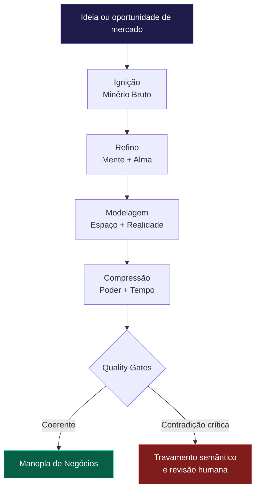
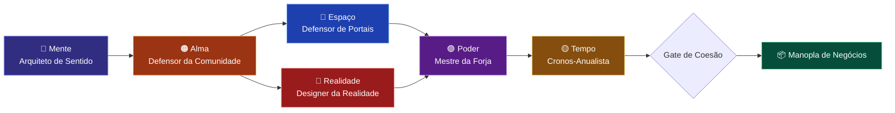

<div align="center">

# 🟣 Manopla da Forja — Venture Squad

### Um squad de Venture Design AI Native para transformar uma ideia bruta em um negócio estruturado, validável e executável.

<p>
  
  
  
</p>

</div>

---

## ✨ O que é este squad

A **Manopla da Forja** é um sistema multiagente para transformar uma oportunidade de mercado, tese de produto ou ideia inicial em uma **Manopla de Negócios**: um pacote executivo com estratégia, público, identidade, infraestrutura, viabilidade econômica e cronograma de lançamento.

A metáfora da **Manopla** organiza o trabalho em seis dimensões complementares. Cada agente representa uma “joia” operacional: mente, alma, espaço, realidade, poder e tempo. Juntas, elas ajudam a impedir que uma ideia seja avaliada apenas pelo entusiasmo inicial; o squad cruza sentido estratégico, dor real do público, integração técnica, narrativa, economia e timing.

---

## 🎯 Para que serve

<table>
<tr>
<td width="33%" valign="top">
<h3>💡 Tirar ideias do abstrato</h3>
<p>Converte uma oportunidade vaga em problema, proposta de valor, público, hipóteses e próximos passos testáveis.</p>
</td>
<td width="33%" valign="top">
<h3>🧩 Desenhar negócios AI Native</h3>
<p>Combina produto, serviço, automação, agentes, integrações e modelo econômico em uma arquitetura coerente.</p>
</td>
<td width="33%" valign="top">
<h3>🚀 Planejar execução</h3>
<p>Define roadmap Alfa/Beta/Geral, GANTT preditivo, tendências, sazonalidade, break-even e ritmo de go-to-market.</p>
</td>
</tr>
</table>

---

## 🧭 Fluxo geral de trabalho



---

## 🧩 Estrutura dos agentes

<table>
<tr>
<td width="50%" valign="top">
<h3>🧠 Arquiteto de Sentido</h3>
<p><b>Joia da Mente</b></p>
<p>Define a tese central, o problema real, a proposta de valor e a lógica estratégica do negócio.</p>
<p><b>Produz:</b> Blueprint Estratégico, matriz problema-solução e hipóteses de validação.</p>
</td>
<td width="50%" valign="top">
<h3>🟠 Defensor da Comunidade</h3>
<p><b>Joia da Alma</b></p>
<p>Verifica se a ideia resolve uma dor concreta para pessoas reais, com linguagem e contexto social adequados.</p>
<p><b>Produz:</b> ICP, mapa de dores/desejos/objeções e critérios de coesão com o público.</p>
</td>
</tr>
<tr>
<td width="50%" valign="top">
<h3>🔵 Defensor de Portais</h3>
<p><b>Joia do Espaço</b></p>
<p>Projeta conexões, canais, APIs, permissões, dados, integrações e infraestrutura agent-ready.</p>
<p><b>Produz:</b> arquitetura de portais, mapa de integrações e riscos técnicos.</p>
</td>
<td width="50%" valign="top">
<h3>🔴 Designer da Realidade</h3>
<p><b>Joia da Realidade</b></p>
<p>Transforma estratégia e público em identidade, narrativa, experiência percebida, oferta e linguagem de mercado.</p>
<p><b>Produz:</b> kit de identidade, narrativa de produto e estrutura de landing page.</p>
</td>
</tr>
<tr>
<td width="50%" valign="top">
<h3>🟣 Mestre da Forja</h3>
<p><b>Joia do Poder</b></p>
<p>Avalia custos, margem, automações, esforço operacional, scripts de processamento e alavancas de escala.</p>
<p><b>Produz:</b> modelo econômico, mapa de automações e score de viabilidade.</p>
</td>
<td width="50%" valign="top">
<h3>🟡 Cronos-Anualista</h3>
<p><b>Joia do Tempo</b></p>
<p>Analisa tendências, sazonalidade, ciclo de vida, break-even e ritmo de lançamento.</p>
<p><b>Produz:</b> GANTT Preditivo IA, Roadmap Alfa/Beta/Geral e análise de tendências.</p>
</td>
</tr>
</table>

---

## 🗺️ Como os agentes se conectam



---

## 📦 O que o squad entrega no final

<table>
<tr>
<td><b>📘 Manopla de Negócios</b></td>
<td>Documento executivo consolidado com estratégia, público, oferta, infraestrutura, viabilidade e próximos passos.</td>
</tr>
<tr>
<td><b>🧠 Blueprint Estratégico</b></td>
<td>Tese central, problema real, solução, proposta de valor e hipóteses de validação.</td>
</tr>
<tr>
<td><b>👥 Mapa de Comunidade</b></td>
<td>ICP, dores, desejos, objeções, linguagem e critérios de aderência ao público.</td>
</tr>
<tr>
<td><b>🌐 Arquitetura de Portais</b></td>
<td>Canais, integrações, APIs, dados, permissões, riscos técnicos e infraestrutura agent-ready.</td>
</tr>
<tr>
<td><b>🎨 Kit de Realidade</b></td>
<td>Narrativa, identidade, posicionamento, promessa, experiência percebida e outline de landing page.</td>
</tr>
<tr>
<td><b>⚙️ Plano de Poder</b></td>
<td>Viabilidade econômica, custos, margem, automações, métricas e alavancas de escala.</td>
</tr>
<tr>
<td><b>⏳ GANTT Preditivo IA</b></td>
<td>Roadmap Alfa/Beta/Geral, tendências, sazonalidade, break-even e ritmo de go-to-market.</td>
</tr>
</table>

---

## ✅ Síntese

> A **Manopla da Forja** transforma uma ideia bruta em um negócio desenhado para ser compreendido, validado, integrado, vendido e executado no tempo certo.

<div align="center">

**Licença:** MIT<br/>
**Criado por:** Marcio Bisognin<br/>
**Instagram:** <a href="https://instagram.com/marciobisognin">@marciobisognin</a>

</div>

---

## 🤝 Como usar nos principais LLMs de codificação

> [!NOTE]
> **O padrão de ativação é o mesmo em qualquer ferramenta:**
> 1. **Dê contexto** ao assistente apontando os arquivos do squad (especialmente `squads/manopla-da-forja-venture-squad/squad.yaml` e `squads/manopla-da-forja-venture-squad/workflows/forja-negocios.yaml`).
> 2. **Peça que ele assuma a persona do orquestrador** (veja os agentes em `squads/manopla-da-forja-venture-squad/agents/`).
> 3. **Conduza o fluxo** respeitando os checkpoints humanos e validando cada handoff/contrato.
>
> **Prompt de ativação** (copie, cole e ajuste o briefing):
> ```text
> Assuma a persona do orquestrador do squad (veja os agentes em `squads/manopla-da-forja-venture-squad/agents/`)
> e conduza o fluxo definido em `squads/manopla-da-forja-venture-squad/`. Siga `squads/manopla-da-forja-venture-squad/workflows/forja-negocios.yaml`.
> Valide cada handoff/contrato e respeite os checkpoints humanos.
> Meu briefing é: <descreva seu objetivo, materiais e formato de saída>.
> ```

<details open>
<summary><b>🟣 Claude Code (CLI / Web / IDE) — recomendado</b></summary>

<br>

```bash
# No terminal, dentro do repositório
claude

> Leia @squads/manopla-da-forja-venture-squad/squad.yaml e assuma a persona do orquestrador do squad.
  Siga @squads/manopla-da-forja-venture-squad/workflows/forja-negocios.yaml. Conduza o fluxo para o briefing: <...>
```
- Use **`@caminho/arquivo`** para dar contexto preciso (autocompleta no prompt).
- Disponível em **CLI, app desktop/web (claude.ai/code) e extensões VS Code / JetBrains**.

</details>

<details>
<summary><b>🟦 Cursor</b></summary>

<br>

1. Abra a pasta do repositório no Cursor.
2. No **Chat / Composer (⌘/Ctrl + I)**, referencie os arquivos com `@`:
   ```text
   @squads/manopla-da-forja-venture-squad/squad.yaml @squads/manopla-da-forja-venture-squad/workflows/forja-negocios.yaml
   Assuma a persona do orquestrador e conduza o fluxo para o briefing: <...>
   ```
3. **Persistente:** crie um `.cursorrules` na raiz apontando para `squads/manopla-da-forja-venture-squad/` como squad ativo.

</details>

<details>
<summary><b>⬛ GitHub Copilot (VS Code Chat)</b></summary>

<br>

```text
@workspace #file:squads/manopla-da-forja-venture-squad/squad.yaml #file:squads/manopla-da-forja-venture-squad/workflows/forja-negocios.yaml
Assuma a persona do orquestrador deste squad e conduza o fluxo para: <...>
```
Para regras persistentes, crie **`.github/copilot-instructions.md`** com o prompt de ativação.

</details>

<details>
<summary><b>🟩 Windsurf (Cascade)</b></summary>

<br>

```text
@squads/manopla-da-forja-venture-squad/squad.yaml @squads/manopla-da-forja-venture-squad/workflows/forja-negocios.yaml
Atue como o orquestrador deste squad e execute o fluxo para: <briefing>.
```
Fixe as regras em **`.windsurfrules`** (raiz do projeto).

</details>

<details>
<summary><b>🟧 Cline / Roo Code (VS Code)</b></summary>

<br>

```text
Leia squads/manopla-da-forja-venture-squad/squad.yaml e assuma a persona do orquestrador.
Conduza o fluxo do squad e execute os scripts em squads/manopla-da-forja-venture-squad/scripts/ quando o passo pedir.
Briefing: <...>
```
O Cline/Roo pode **executar os scripts** do squad e ler a saída — aprove a execução quando solicitado.

</details>

<details>
<summary><b>🟨 Continue.dev / Aider / Zed AI / chats web</b></summary>

<br>

- **Continue.dev:** use `@file` para `squads/manopla-da-forja-venture-squad/squad.yaml`; cole o prompt de ativação.
- **Aider:** `aider squads/manopla-da-forja-venture-squad/squad.yaml` e instrua o orquestrador.
- **ChatGPT / Gemini (sem acesso a arquivos):** copie o conteúdo de `squads/manopla-da-forja-venture-squad/squad.yaml` e `squads/manopla-da-forja-venture-squad/workflows/forja-negocios.yaml` para o chat, cole o prompt de ativação e rode eventuais scripts localmente, colando a saída de volta.

</details>


---

Licença: MIT. Criado por Marcio Bisognin. Instagram: @marciobisognin.
