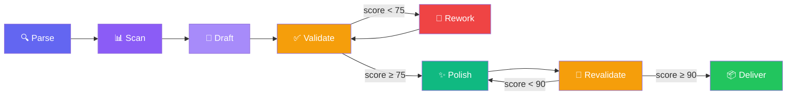

# 📜 Nirvana README Architect (NRA)

> AIOS Squad that generates the perfect README.md for any project — combining deep codebase analysis, intelligent template selection, all GitHub Flavored Markdown features, 25+ point checklist validation, and final polishing.

## Table of Contents

- [Overview](#overview)
- [Agents](#agents)
- [Pipeline](#pipeline)
- [Getting Started](#getting-started)
- [Commands](#commands)
- [Architecture](#architecture)
- [Supported GitHub Features](#supported-github-features)
- [Quality Checklist](#quality-checklist)
- [Troubleshooting](#troubleshooting)
- [Contributing](#contributing)
- [License](#license)

---

## Overview

**Nirvana README Architect** is a squad of 5 specialized agents that work in a pipeline to transform any codebase into a professional-grade README.

Unlike simple generators that produce generic templates, NRA:

- **Analyzes** the actual codebase (tech stack, scripts, env vars, directory structure)
- **Selects** the ideal template by project type (Library, CLI, Web App, API, Monorepo, Mobile, Squad)
- **Generates** content using **all** GitHub Flavored Markdown features
- **Validates** with a 25+ point checklist and automatic scoring
- **Polishes** with badges, TOC, collapsed sections, and perfect spacing

> [!TIP]
> Minimum delivery score: **90/100**. NRA automatically reworks until reaching this level.

## Agents

| Agent | Persona | Archetype | Role |
|:------|:--------|:----------|:-----|
| `nra-orchestrator` | **Quill** | FlowMaster | Orchestrates the full pipeline, request parsing, final delivery |
| `nra-codebase-analyzer` | **Prism** | Seeker | Deep codebase analysis: tech stack, entry points, env vars, scripts |
| `nra-content-architect` | **Serif** | Architect | Template selection and section content generation |
| `nra-quality-validator` | **Lens** | Guardian | 25+ point checklist validation and scoring |
| `nra-polisher` | **Gloss** | Alchemist | Final polishing: badges, TOC, collapsed sections, spacing |

## Pipeline



| Phase | Agent | Description |
|:------|:------|:------------|
| **Parse** | Quill | Identifies target project, type, and scope |
| **Scan** | Prism | Deep codebase analysis |
| **Draft** | Serif | Selects template and generates content |
| **Validate** | Lens | 25+ point checklist, scoring |
| **Rework** | Serif | Rework if score < 75 (max 2x) |
| **Polish** | Gloss | TOC, badges, spacing |
| **Revalidate** | Lens | Confirms score ≥ 90 |
| **Deliver** | Quill | Delivery with metrics |

## Getting Started

> [!NOTE]
> This squad works within the **Synkra AIOS** ecosystem and requires Claude Code with the framework configured.

### 1. Clone the repository

```bash
git clone https://github.com/gutomec/nirvana-readme-architect.git
```

### 2. Install as AIOS squad

Copy the directory to your AIOS project's `squads/` or use the marketplace installer:

```bash
squads install gutomec/nirvana-readme-architect
```

### 3. Use the squad

```bash
# Activate the orchestrator
@nra-orchestrator

# Generate full README
*readme {project-path}

# Or quick mode (6 essential sections)
*readme-quick
```

## Commands

| Command | Description | Agent |
|:--------|:-----------|:------|
| `*readme {project} [type]` | Full generation pipeline | Quill |
| `*readme-full` | All 12+ sections | Quill |
| `*readme-quick` | 6 essential sections | Quill |
| `*scan` | Deep codebase analysis | Prism |
| `*select-template` | Template selection by type | Serif |
| `*validate` | Checklist validation | Lens |
| `*polish` | Visual polishing | Gloss |
| `*deliver` | Final delivery | Quill |

## Architecture

<details>
<summary>Expand directory tree</summary>

```text
nirvana-readme-architect/
├── agents/                          # 5 specialized agents
├── tasks/                           # 7 executable tasks
├── workflows/
│   └── readme-generation-pipeline.yaml
├── checklists/
│   └── readme-quality.md            # 25+ validation points
├── templates/
│   └── nirvana-readme.md            # Master template with GFM features
├── config/                          # Standards and tech stack
├── squad.yaml                       # Squad manifest
└── README.md
```

</details>

## Supported GitHub Features

| Feature | Status |
|:--------|:------:|
| Alerts (TIP, WARNING, CAUTION, NOTE, IMPORTANT) | ✅ |
| Mermaid Diagrams | ✅ |
| Tables with alignment | ✅ |
| Collapsed Sections | ✅ |
| Task Lists | ✅ |
| Footnotes | ✅ |
| Badges (shields.io) | ✅ |
| Emojis | ✅ |
| kbd Tags | ✅ |
| Code Blocks with language | ✅ |
| Diff Blocks | ✅ |
| Reference Links | ✅ |

## Quality Checklist

| Category | Weight | Type |
|:---------|:------:|:-----|
| **Structure** | 2x | Blocking |
| **GitHub Features** | 1x | Advisory |
| **Content** | 2x | Blocking |
| **Completeness** | 1x | Advisory |

| Score | Level | Action |
|:------|:------|:-------|
| 90-100 | 🏆 Nirvana | Deliver |
| 75-89 | ⭐ Good | Send to polishing |
| 60-74 | ⚠️ Acceptable | Rework sections |
| < 60 | ❌ Insufficient | Rework with detailed feedback |

## Troubleshooting

| Problem | Likely Cause | Solution |
|:--------|:-------------|:---------|
| Low score after 2 iterations | Codebase with little info | Provide data manually via `*readme-full` |
| Wrong template | Project type not detected | Specify type: `*readme {project} api` |
| Mermaid not rendering | Invalid syntax | Lens detects and fixes automatically |

## Contributing

Contributions are welcome! Follow [Conventional Commits](https://www.conventionalcommits.org/) for commit messages.

## License

This project is licensed under the **MIT** License — see the [LICENSE](./LICENSE) file for details.

---

<div align="center">

Made with ❤️ by [Synkra AIOS](https://github.com/gutomec)

⭐ If this squad helped you, consider giving it a star!

**[Português](./README.md)** · **[Español](./README.es.md)** · **[العربية](./README.ar.md)** · **[हिन्दी](./README.hi.md)** · **[简体中文](./README.zh-CN.md)**

</div>
